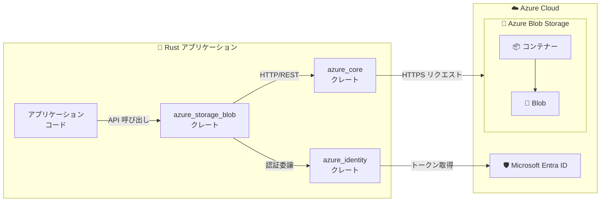

# Azure Blob Storage: SDK for Rust (GA)

**リリース日**: 2026-05-15

**サービス**: Azure Blob Storage

**機能**: Azure Blob Storage SDK for Rust

**ステータス**: Launched (GA)

[このアップデートのインフォグラフィックを見る](https://takech9203.github.io/azure-news-summary/20260515-blob-storage-sdk-rust.html)

## 概要

Azure Blob Storage SDK for Rust が一般提供 (GA) となった。この SDK により、Rust アプリケーションから Azure Blob Storage アカウントに接続し、コンテナーおよび Blob に対する各種操作 (アップロード、ダウンロード、一覧取得、管理) をネイティブに実行できるようになる。

Azure SDK for Rust は、Rust の型安全性、メモリ安全性、ゼロコスト抽象化といった言語特性を活かし、高パフォーマンスかつセキュアなクラウドアプリケーション構築を支援する SDK セットである。今回の Blob Storage SDK の GA により、Rust エコシステムにおける Azure ストレージサービスとの統合が公式にサポートされ、プロダクション環境での利用が推奨される段階に到達した。

crates.io で `azure_storage_blob` クレートとして公開されており、Cargo を通じて容易にプロジェクトへ追加できる。認証には `azure_identity` クレートを使用し、Azure CLI 認証、マネージド ID、サービスプリンシパルなど複数の認証方式に対応している。

**アップデート前の課題**

- Rust から Azure Blob Storage にアクセスする場合、REST API を直接呼び出すか、非公式のサードパーティクレートに依存する必要があった
- 認証、リトライ、ページネーションなどのボイラープレートコードを開発者が自前で実装する必要があった
- Azure SDK の他言語 (.NET, Java, Python, JavaScript) に比べ、Rust は公式 SDK のサポートがベータ段階に留まっていた
- プロダクション利用において、API の安定性や長期サポートの保証がなかった

**アップデート後の改善**

- 公式サポートされた GA 品質の SDK により、プロダクション環境で安心して利用できるようになった
- 型安全な API により、コンパイル時にエラーを検出でき、ランタイムエラーのリスクが低減した
- 認証、リトライ、ログ記録が SDK に統合され、ボイラープレートコードが大幅に削減された
- 非同期 (async/await) をネイティブサポートし、高スループットなアプリケーション構築が容易になった
- `Pager<T>` によるページネーション、`Poller<T>` による長時間実行操作のサポートなど、一貫した API パターンが提供された

## アーキテクチャ図



Rust アプリケーションから azure_storage_blob クレートを通じて Azure Blob Storage に接続する構成を示す。認証は azure_identity クレートが Microsoft Entra ID からトークンを取得し、azure_core が HTTP 通信を管理する。

## サービスアップデートの詳細

### 主要機能

1. **Blob 操作**
   - Blob のアップロード (Put Blob)、ダウンロード (Get Blob)、削除 (Delete Blob)
   - Blob の一覧取得 (List Blobs)
   - Blob のプロパティおよびメタデータの取得・設定

2. **コンテナー操作**
   - コンテナーの作成、削除、一覧取得
   - コンテナーのアクセスポリシー管理

3. **非同期処理のネイティブサポート**
   - tokio ランタイムをデフォルトとした完全非同期 API
   - `Pager<T>` による非同期ストリームベースのページネーション

4. **型安全な認証統合**
   - `azure_identity` クレートとのシームレスな統合
   - Azure CLI 認証、マネージド ID、サービスプリンシパル対応
   - `TokenCredential` トレイトによる統一された認証抽象化

5. **一貫したエラーハンドリング**
   - `azure_core::Error` による統一的なエラー型
   - Rust の `Result` パターンとの自然な統合

## 技術仕様

| 項目 | 詳細 |
|------|------|
| クレート名 | `azure_storage_blob` |
| リポジトリ | [Azure/azure-sdk-for-rust](https://github.com/Azure/azure-sdk-for-rust) |
| 必須 Rust バージョン | 1.85.0 以上 |
| 非同期ランタイム | tokio (デフォルト) |
| HTTP クライアント | reqwest (デフォルト) |
| 認証クレート | `azure_identity` |
| コアクレート | `azure_core` |
| スレッド安全性 | 全クライアントインスタンスメソッドはスレッドセーフ |
| API スタイル | 完全非同期、型安全 |

## 設定方法

### 前提条件

1. Rust 1.85.0 以上がインストールされていること
2. Azure サブスクリプションを保有していること
3. Azure Storage アカウントが作成済みであること
4. 認証用に Azure CLI (`az login`) または適切な資格情報が設定されていること

### Cargo.toml

```toml
[dependencies]
azure_storage_blob = "0.20"
azure_identity = "0.20"
tokio = { version = "1", features = ["full"] }
```

または CLI でインストール:

```console
cargo add azure_storage_blob azure_identity
cargo add tokio --features full
```

### 基本的な使用例

```rust
use azure_identity::AzureCliCredential;
use azure_storage_blob::BlobServiceClient;

#[tokio::main]
async fn main() -> Result<(), Box<dyn std::error::Error>> {
    // Azure CLI 認証を使用
    let credential = AzureCliCredential::new(None)?;

    // Blob サービスクライアントの作成
    let account_url = "https://<storage-account>.blob.core.windows.net";
    let client = BlobServiceClient::new(account_url, credential.clone(), None)?;

    // コンテナー内の Blob を一覧取得
    // (実装は Pager<T> を使用した非同期イテレーション)

    Ok(())
}
```

## メリット

### ビジネス面

- Rust エコシステムへの公式 SDK 提供により、システムプログラミング領域でのAzure 採用障壁が低下
- メモリ安全性保証により、バッファオーバーフローなどの脆弱性リスクを言語レベルで排除
- GC (ガベージコレクション) 不要なランタイムにより、予測可能なレイテンシーを実現

### 技術面

- ゼロコスト抽象化により、REST API 直接呼び出しと同等のパフォーマンスを型安全に実現
- コンパイル時の型チェックにより、API の誤用をデプロイ前に検出可能
- async/await による非同期処理が言語レベルでサポートされ、高並列な Blob 操作が容易
- モジュラー設計により、必要なクレートのみを依存関係に追加でき、バイナリサイズを最適化可能
- `ClientOptions` による統一的な設定 (リトライポリシー、ログ記録、タイムアウト) が可能

## デメリット・制約事項

- Azure SDK for Rust は他言語 SDK (.NET, Java, Python) に比べて成熟度が低く、サポートされるサービス数が限定的
- エコシステムが発展途上であり、コミュニティリソース (サンプルコード、Stack Overflow 回答等) が他言語に比べて少ない
- 一部の高度な Blob Storage 機能 (例: クライアントサイド暗号化、Blob インデックスタグによるクエリ等) のサポート状況は個別に確認が必要
- Rust の学習曲線が高いため、チーム全体での導入には教育コストが発生する可能性がある

## ユースケース

### ユースケース 1: 高パフォーマンスなデータパイプライン

**シナリオ**: IoT デバイスから大量のテレメトリデータを Azure Blob Storage にリアルタイムで書き込む際に、低レイテンシーと高スループットが要求される場合

**効果**: Rust のゼロコスト抽象化と非同期処理により、GC ポーズなしで安定したスループットを実現し、インフラコストの削減にも寄与

### ユースケース 2: エッジコンピューティングでのデータ同期

**シナリオ**: リソースが制約されたエッジデバイス上で動作するアプリケーションが、定期的にローカルデータを Azure Blob Storage にアップロードする場合

**効果**: Rust の小さなバイナリサイズと低メモリフットプリントにより、リソース制約環境でも効率的に動作

### ユースケース 3: CLI ツール・DevOps ツールの開発

**シナリオ**: Blob Storage を操作するカスタム CLI ツールや自動化スクリプトを Rust で開発し、シングルバイナリとして配布する場合

**効果**: 依存関係のないシングルバイナリとして配布可能で、環境構築不要なポータブルなツールを実現

## 料金

Azure Blob Storage SDK for Rust 自体は無料のオープンソースクレートである。料金は Azure Blob Storage サービスの利用量に基づいて発生する。

主要な料金要素:
- **ストレージ容量**: アクセス層 (Hot / Cool / Cold / Archive) に応じた GB 単位の月額料金
- **操作回数**: 読み取り、書き込み、一覧取得などの操作ごとの課金
- **データ転送**: Azure リージョン外へのデータ送信 (Egress) に対する課金

詳細な料金は [Azure Blob Storage 料金ページ](https://azure.microsoft.com/en-us/pricing/details/storage/blobs/) を参照。

## 利用可能リージョン

Azure Blob Storage SDK for Rust はクライアントサイドの SDK であり、Azure Blob Storage が利用可能な全てのリージョンで使用可能である。Azure Blob Storage 自体は全ての Azure リージョンで提供されている。

## 関連サービス・機能

- **Azure Identity (azure_identity クレート)**: Rust SDK の認証基盤。マネージド ID、Azure CLI、サービスプリンシパルなどの認証方式を提供
- **Azure Core (azure_core クレート)**: HTTP クライアント、リトライポリシー、ログ記録など SDK 共通の基盤機能
- **Azure Data Lake Storage Gen2**: Blob Storage 上に構築された階層型名前空間。同 SDK からのアクセスが可能
- **Azure Event Grid**: Blob Storage イベント (作成、削除) のサブスクリプション。イベントドリブンアーキテクチャとの連携
- **Azure Key Vault (azure_security_keyvault_secrets クレート)**: ストレージアクセスに使用する秘密情報の安全な管理

## 参考リンク

- [インフォグラフィック](https://takech9203.github.io/azure-news-summary/20260515-blob-storage-sdk-rust.html)
- [公式アップデート情報](https://azure.microsoft.com/updates?id=562516)
- [Microsoft Learn - Azure for Rust developers](https://learn.microsoft.com/en-us/azure/developer/rust/)
- [Microsoft Learn - Azure SDK for Rust 概要](https://learn.microsoft.com/en-us/azure/developer/rust/sdk/overview)
- [Microsoft Learn - SDK インストールガイド](https://learn.microsoft.com/en-us/azure/developer/rust/sdk/installation)
- [Microsoft Learn - 認証ガイド](https://learn.microsoft.com/en-us/azure/developer/rust/sdk/authentication/overview)
- [crates.io - azure_storage_blob](https://crates.io/crates/azure_storage_blob)
- [GitHub リポジトリ](https://github.com/Azure/azure-sdk-for-rust)
- [料金ページ](https://azure.microsoft.com/en-us/pricing/details/storage/blobs/)

## まとめ

Azure Blob Storage SDK for Rust の GA は、Rust 開発者にとって Azure エコシステムへの公式な入口が確立されたことを意味する重要なマイルストーンである。メモリ安全性、型安全性、高パフォーマンスを兼ね備えた Rust の特性と、Azure のスケーラブルなストレージサービスが組み合わさることで、IoT、エッジコンピューティング、高頻度データ処理といった分野での新たなユースケースが開拓される。

Solutions Architect としては、パフォーマンスクリティカルなワークロードやリソース制約のある環境での Blob Storage 連携において、Rust SDK を選択肢として評価することを推奨する。ただし、チームの Rust 習熟度や他の Azure サービスとの連携要件も含めて総合的に判断する必要がある。

---

**タグ**: #Azure #BlobStorage #Rust #SDK #GA
