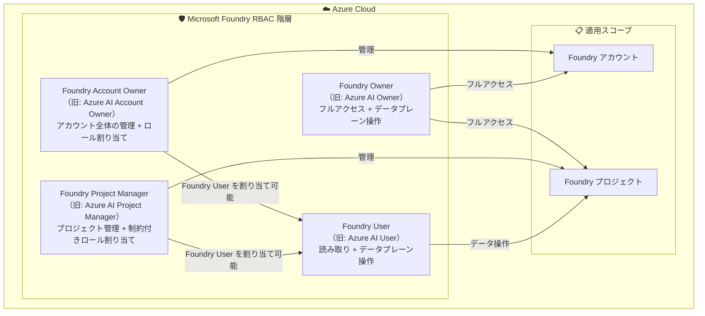

# Microsoft Foundry: 組み込み RBAC ロールの名称変更と機能強化

**リリース日**: 2026-05-15

**サービス**: Microsoft Foundry

**機能**: 組み込み RBAC ロールの名称変更と機能強化

**ステータス**: Launched (GA)

[このアップデートのインフォグラフィックを見る](https://takech9203.github.io/azure-news-summary/20260515-foundry-rbac-role-naming.html)

## 概要

Microsoft Foundry の組み込み RBAC (ロールベースアクセス制御) ロールの名称が、製品ブランドに合わせて更新された。従来「Azure AI」を冠していたロール名が「Foundry」ブランドに統一され、Microsoft Foundry のブランドアイデンティティとの一貫性が確保された。

この変更は、Azure AI Studio から Microsoft Foundry へのリブランディングの一環として実施されたものである。ロール名の変更に加え、ロールの権限や機能面での強化も含まれている。既存のロール割り当ては自動的に新しい名称に移行され、ロール ID やアクセス許可の基本構造は維持される。

**アップデート前の課題**

- ロール名に「Azure AI」が使用されており、製品名が「Microsoft Foundry」にリブランディングされた後も旧ブランド名が残存していた
- ドキュメントやポータルでの表示が新旧ブランド名の混在により混乱を招く可能性があった
- プロジェクト管理に特化したロールの権限が十分に明確化されていなかった

**アップデート後の改善**

- 全ての組み込みロールが「Foundry」ブランドに統一され、製品名との一貫性が確保された
- ロール名から権限の範囲が直感的に理解しやすくなった
- Foundry Project Manager ロールにより、プロジェクトスコープでの管理と制約付きロール割り当てが明確に定義された

## アーキテクチャ図



Microsoft Foundry の RBAC ロール階層を示す。Foundry Account Owner と Foundry Project Manager は ABAC 条件付きで Foundry User ロールの割り当てが可能であり、各ロールはアカウントまたはプロジェクトスコープで適用される。

## サービスアップデートの詳細

### 主要機能

1. **ロール名称の変更**
   - 全ての組み込みロールが「Azure AI」から「Foundry」ブランドに統一された
   - ロール ID は変更されず、既存のロール割り当ては自動的に新しい名称に反映される

2. **Foundry Account Owner (旧: Azure AI Account Owner)**
   - ロール ID: `e47c6f54-e4a2-4754-9501-8e0985b135e1`
   - AI プロジェクトとアカウントの管理に対するフルアクセスを付与
   - ABAC 条件により、Foundry User ロールのみを他のユーザーに割り当て可能

3. **Foundry Owner (旧: Azure AI Owner)**
   - ロール ID: `c883944f-8b7b-4483-af10-35834be79c4a`
   - AI プロジェクトとアカウントの管理に対するフルアクセスを付与
   - データプレーン操作 (`Microsoft.CognitiveServices/*`) へのアクセスを含む
   - アラート管理権限を含む

4. **Foundry Project Manager (旧: Azure AI Project Manager)**
   - ロール ID: `eadc314b-1a2d-4efa-be10-5d325db5065e`
   - プロジェクトスコープでの開発者アクションと管理アクションを実行可能
   - ABAC 条件付きで Foundry User ロールの割り当てが可能
   - データプレーン操作へのアクセスを含む

5. **Foundry User (旧: Azure AI User)**
   - ロール ID: `53ca6127-db72-4b80-b1b0-d745d6d5456d`
   - AI プロジェクトおよびアカウントへの読み取りアクセスを付与
   - データプレーン操作へのフルアクセスを含む

## 技術仕様

| 項目 | 詳細 |
|------|------|
| 旧ロール名: Azure AI Account Owner | 新ロール名: Foundry Account Owner |
| 旧ロール名: Azure AI Owner | 新ロール名: Foundry Owner |
| 旧ロール名: Azure AI Project Manager | 新ロール名: Foundry Project Manager |
| 旧ロール名: Azure AI User | 新ロール名: Foundry User |
| ロール ID | 変更なし (既存の割り当てはそのまま有効) |
| 適用対象 | 新しい Foundry リソース |
| ABAC 条件 | Account Owner と Project Manager に適用 |
| データプレーンアクセス | Owner, Project Manager, User が保有 |

## 設定方法

### 前提条件

1. Azure サブスクリプションを保有していること
2. Microsoft Foundry リソース (アカウントまたはプロジェクト) が作成済みであること
3. ロール割り当てを行うための適切な権限 (所有者または User Access Administrator) を持っていること

### Azure CLI

```bash
# Foundry Account Owner ロールの割り当て
az role assignment create \
  --assignee <user-principal-name-or-object-id> \
  --role "Foundry Account Owner" \
  --scope /subscriptions/<subscription-id>/resourceGroups/<resource-group>/providers/Microsoft.CognitiveServices/accounts/<foundry-account>

# Foundry User ロールの割り当て
az role assignment create \
  --assignee <user-principal-name-or-object-id> \
  --role "Foundry User" \
  --scope /subscriptions/<subscription-id>/resourceGroups/<resource-group>/providers/Microsoft.CognitiveServices/accounts/<foundry-account>
```

### Azure Portal

1. Azure Portal で対象の Microsoft Foundry リソースに移動する
2. 左メニューから「アクセス制御 (IAM)」を選択する
3. 「ロールの割り当ての追加」をクリックする
4. ロール一覧から「Foundry Account Owner」「Foundry Owner」「Foundry Project Manager」「Foundry User」のいずれかを選択する
5. 対象のユーザー、グループ、またはサービスプリンシパルを選択する
6. 「レビューと割り当て」をクリックして完了する

## メリット

### ビジネス面

- 製品ブランドとロール名の一貫性により、組織内での権限管理に関するコミュニケーションが明確になる
- ドキュメントやトレーニング資材における表記の統一により、学習コストが低減する
- 監査ログにおけるロール名の可読性が向上し、コンプライアンス管理が容易になる

### 技術面

- ロール ID が維持されるため、既存の IaC (Infrastructure as Code) テンプレートやスクリプトへの影響が最小限に抑えられる
- ABAC (Attribute-Based Access Control) 条件により、最小権限の原則に基づくロール割り当ての委任が可能
- プロジェクトスコープとアカウントスコープの明確な分離により、きめ細かなアクセス制御が実現される

## デメリット・制約事項

- ロール名で参照している既存のスクリプトや IaC テンプレート (ARM テンプレート、Bicep、Terraform) は、新しいロール名への更新が必要になる可能性がある
- Foundry Account Owner と Foundry Project Manager が割り当て可能なロールは Foundry User に限定されており、他のロールの委任はできない
- Azure AI Administrator および Azure AI Developer ロールは引き続き「Azure AI」名称を維持しており、これらは Azure Machine Learning と Foundry ハブの両方に適用される別カテゴリのロールである

## ユースケース

### ユースケース 1: エンタープライズ AI プラットフォームの権限管理

**シナリオ**: 大規模組織で複数の AI プロジェクトを運用しており、チームごとに適切なアクセス権限を付与する必要がある場合

**効果**: Foundry Account Owner がアカウントレベルで全体管理を行い、各プロジェクトには Foundry Project Manager を配置して、チームメンバーに Foundry User ロールを委任割り当てする階層的な権限管理が実現できる

### ユースケース 2: 開発者セルフサービス環境の構築

**シナリオ**: AI 開発者に必要最小限の権限を付与し、データプレーン操作 (モデルの呼び出し、推論の実行) を自律的に行わせたい場合

**効果**: Foundry User ロールにより、コントロールプレーンは読み取り専用としつつ、データプレーン (Cognitive Services) へのフルアクセスを付与でき、安全なセルフサービス環境が構築できる

## 料金

RBAC ロールの名称変更および機能強化自体に追加料金は発生しない。Microsoft Foundry サービスの利用料金は、デプロイするモデル、利用する API、消費するトークン数に基づいて従来通り課金される。

## 利用可能リージョン

RBAC ロールの変更は Azure 全リージョンで利用可能である。Microsoft Foundry リソースが作成可能な全てのリージョンにおいて、新しいロール名が適用される。

## 関連サービス・機能

- **Microsoft Entra ID**: RBAC ロールの割り当て対象となるユーザー、グループ、サービスプリンシパルの ID 基盤
- **Azure RBAC**: Microsoft Foundry のロールが動作する基盤となるアクセス制御システム
- **Microsoft Foundry Control Plane**: エンタープライズ全体のエージェント、モデル、ツールの統合管理インターフェース
- **Azure AI Administrator ロール**: Machine Learning ワークスペースを含む広範なコントロールプレーン権限を持つ管理者ロール (引き続き「Azure AI」名称)
- **Azure AI Developer ロール**: ML ワークスペース内の操作と特定の Cognitive Services データプレーンアクセスを持つ開発者ロール (引き続き「Azure AI」名称)

## 参考リンク

- [インフォグラフィック](https://takech9203.github.io/azure-news-summary/20260515-foundry-rbac-role-naming.html)
- [公式アップデート情報](https://azure.microsoft.com/updates?id=562533)
- [Microsoft Learn - Azure 組み込みロール (AI + Machine Learning)](https://learn.microsoft.com/en-us/azure/role-based-access-control/built-in-roles/ai-machine-learning)
- [Microsoft Learn - Microsoft Foundry ドキュメント](https://learn.microsoft.com/en-us/azure/foundry/)
- [Microsoft Learn - Microsoft Foundry Control Plane](https://learn.microsoft.com/en-us/azure/foundry/control-plane/overview)

## まとめ

Microsoft Foundry の組み込み RBAC ロール名称変更は、Azure AI から Microsoft Foundry へのリブランディングを完結させる重要なアップデートである。Azure AI Account Owner、Azure AI Owner、Azure AI Project Manager、Azure AI User の 4 つのロールがそれぞれ Foundry ブランドに統一され、製品名とロール名の一貫性が確保された。

Solutions Architect としては、既存の IaC テンプレートやスクリプトでロール名を文字列で参照している箇所の確認と更新を推奨する。ロール ID は変更されていないため、ID ベースで参照している場合は影響がない。また、Azure AI Administrator や Azure AI Developer など「Azure AI」名称を維持するロールは、Machine Learning ワークスペースを含む広範なスコープを持つ別カテゴリのロールであることに留意する必要がある。

---

**タグ**: #Azure #MicrosoftFoundry #RBAC #IAM #セキュリティ #ロール管理 #GA
