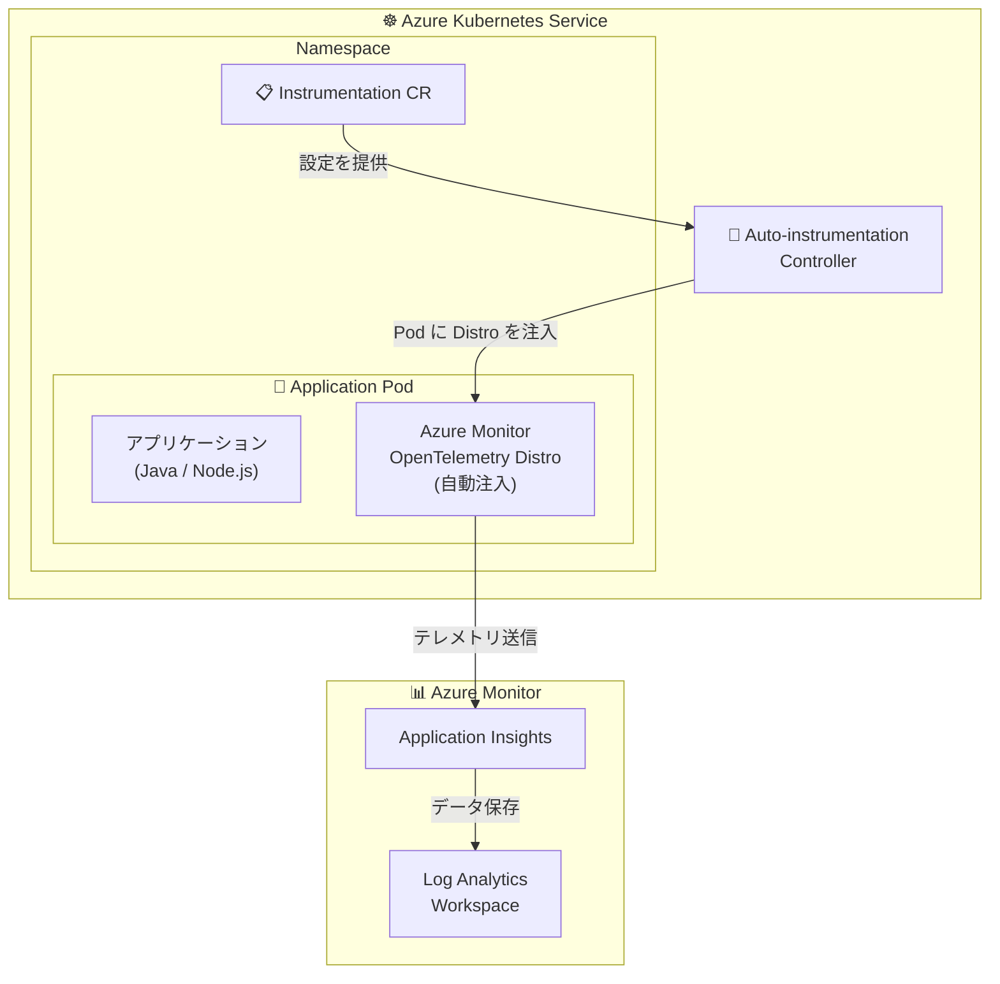

# Azure Monitor Application Insights: AKS 自動インストルメンテーションの一般提供開始

**リリース日**: 2026-05-18

**サービス**: Azure Monitor Application Insights

**機能**: Azure Kubernetes Service (AKS) アプリケーション向け自動インストルメンテーション

**ステータス**: Launched (GA)

[このアップデートのインフォグラフィックを見る](https://takech9203.github.io/azure-news-summary/20260518-app-insights-aks-auto-instrumentation.html)

## 概要

Azure Monitor Application Insights の自動インストルメンテーション (Auto-instrumentation) が Azure Kubernetes Service (AKS) 上のアプリケーションに対して一般提供 (GA) となった。これにより、ソースコードを変更することなく、数ステップの設定だけでアプリケーションの監視を開始できるようになる。

この機能は、Azure Monitor OpenTelemetry Distro をアプリケーション Pod に自動注入することで実現される。従来はアプリケーション側に SDK を組み込むか、手動で OpenTelemetry のエージェントを設定する必要があったが、AKS クラスターの設定と Kubernetes カスタムリソースの適用だけでテレメトリ収集が可能になる。

現時点で Java と Node.js のワークロードがサポートされており、Application Insights のダッシュボード、アプリケーションマップ、分散トレースなどの監視エクスペリエンスを活用できる。

**アップデート前の課題**

- AKS 上のアプリケーション監視には、アプリケーションコードに SDK を組み込む手動インストルメンテーションが必要だった
- 複数のマイクロサービスに対して個別に監視設定を行う運用負荷が高かった
- 既存アプリケーションへの監視追加にはコード変更とデプロイが必要だった
- OpenTelemetry エージェントの手動設定・管理が複雑だった

**アップデート後の改善**

- ソースコード変更なしでアプリケーション監視を有効化できる
- AKS クラスターレベルまたはネームスペースレベルで一括有効化が可能
- Kubernetes カスタムリソース (Instrumentation CR) による宣言的な設定管理
- Azure Monitor OpenTelemetry Distro の自動注入により最新バージョンが自動適用される
- Azure Portal または Azure CLI から簡単に設定可能

## アーキテクチャ図



AKS クラスター上で Auto-instrumentation Controller が Instrumentation カスタムリソースの設定に基づき、アプリケーション Pod に Azure Monitor OpenTelemetry Distro を自動注入する。注入されたエージェントがテレメトリを収集し、Application Insights に送信する。

## サービスアップデートの詳細

### 主要機能

1. **コードレス監視 (Codeless Monitoring)**
   - アプリケーションのソースコードを変更せずに、分散トレース、メトリクス、ログの収集を自動化
   - Azure Monitor OpenTelemetry Distro をアプリケーション Pod に自動注入

2. **柔軟なオンボーディング方式**
   - ネームスペース全体の一括オンボーディング: `default` という名前の Instrumentation CR を作成
   - デプロイメント単位のオンボーディング: アノテーションで個別設定
   - 混合モード: デフォルト設定と個別オーバーライドの組み合わせ

3. **Application Insights ログ収集**
   - アノテーション `monitor.azure.com/enable-application-logs: "true"` でアプリケーションログを Application Insights に送信
   - Container Insights のログと併用または代替が可能

4. **既存インストルメンテーションとの共存**
   - 手動インストルメンテーション (Application Insights SDK、Azure Monitor OpenTelemetry Distro) との共存が可能
   - 重複データを自動的に防止
   - Java: 自動インストルメンテーションが優先、Node.js: 手動インストルメンテーションが優先

5. **カスタムメトリクスのサポート**
   - Java: 自動インストルメンテーションでカスタムメトリクスを収集可能
   - Node.js: カスタムメトリクスには手動インストルメンテーション (Azure Monitor OpenTelemetry Distro) が必要

## 技術仕様

| 項目 | 詳細 |
|------|------|
| サポート言語 | Java、Node.js |
| サポート OS | Linux ノードプールのみ (Windows は非対応) |
| Kubernetes リソース | Instrumentation カスタムリソース (apiVersion: monitor.azure.com/v1) |
| テレメトリ送信方式 | Azure Monitor OpenTelemetry Distro |
| 必要な Azure CLI バージョン | 2.60.0 以上 |
| 設定方法 | Azure Portal / Azure CLI / YAML |
| Application Insights エクスペリエンス | ダッシュボード、アプリケーションマップ、分散トレース等 (Live Metrics と Code Analysis を除く) |

## 設定方法

### 前提条件

1. AKS クラスターが稼働中であること (Kubernetes Deployment を使用)
2. Java または Node.js のワークロードであること
3. ワークスペースベースの Application Insights リソースが作成済みであること
4. Azure CLI 2.60.0 以上がインストールされていること

### Azure CLI

```bash
# クラスターで Auto-instrumentation を有効化
az aks update --resource-group={resource_group} --name={cluster_name} --enable-azure-monitor-app-monitoring

# クラスター作成時に有効化する場合
az aks create --resource-group={resource_group} --name={cluster_name} --enable-azure-monitor-app-monitoring --generate-ssh-keys
```

### YAML (ネームスペース全体のオンボーディング)

```yaml
apiVersion: monitor.azure.com/v1
kind: Instrumentation
metadata:
  name: default
  namespace: mynamespace1
spec:
  settings:
    autoInstrumentationPlatforms: []
  destination:
    applicationInsightsConnectionString: "InstrumentationKey=<your-key>;IngestionEndpoint=https://<region>.in.applicationinsights.azure.com/"
```

### デプロイメント単位のオンボーディング (アノテーション)

```yaml
apiVersion: apps/v1
kind: Deployment
spec:
  template:
    metadata:
      annotations:
        # Java の場合
        instrumentation.opentelemetry.io/inject-java: "cr1"
        # Node.js の場合
        instrumentation.opentelemetry.io/inject-nodejs: "cr1"
```

### デプロイメントの再起動

```bash
# 設定を反映するためにデプロイメントを再起動
kubectl rollout restart deployment <deployment-name> -n <namespace>
```

### Azure Portal

1. AKS クラスターの **Monitor** ペインを選択
2. **Enable support for auto-instrumentation** にチェック
3. **Review + enable** を選択
4. **Namespaces** ペインでインストルメントするネームスペースを選択
5. **Application Monitoring** を選択し、言語を指定して **Configure** を実行
6. デプロイメントを手動で再起動

## メリット

### ビジネス面

- アプリケーション監視の導入コスト大幅削減 (コード変更不要)
- 既存の大規模マイクロサービス環境への迅速な監視展開
- 開発者の監視設定に関する作業時間の削減
- アプリケーションの可観測性向上による障害対応時間の短縮

### 技術面

- OpenTelemetry 標準に基づくテレメトリ収集
- Azure Monitor OpenTelemetry Distro の自動バージョン更新 (デプロイメント再起動時)
- ネームスペースレベルとデプロイメントレベルの柔軟な設定粒度
- 手動インストルメンテーションとの共存による段階的移行が可能
- Kubernetes ネイティブなカスタムリソースによる宣言的管理

## デメリット・制約事項

- Windows ノードプールは非サポート (Linux のみ)
- サポート言語は Java と Node.js のみ (.NET、Python は非対応)
- Live Metrics と Code Analysis は利用不可
- Node.js でのカスタムメトリクスには手動インストルメンテーションが必要
- 設定変更の反映にはデプロイメントの再起動が必要
- OSS OpenTelemetry SDK でサードパーティに送信しているテレメトリが影響を受ける可能性がある
- 長期間再起動していないデプロイメントでは、OpenTelemetry Distro のバージョンが古くなる可能性がある (週次の再起動を推奨)

## ユースケース

### ユースケース 1: 既存マイクロサービス環境への一括監視導入

**シナリオ**: 多数のマイクロサービスが稼働する AKS クラスターに対して、コードを変更せずに分散トレースを有効化したい。

**実装例**:

```bash
# クラスターで自動インストルメンテーションを有効化
az aks update --resource-group=myRG --name=myAKS --enable-azure-monitor-app-monitoring

# ネームスペース全体に Instrumentation CR を適用
kubectl apply -f instrumentation-default.yaml

# 全デプロイメントを再起動
kubectl rollout restart deployment -n production
```

**効果**: すべての Java/Node.js デプロイメントが自動的にインストルメントされ、Application Insights で分散トレースやアプリケーションマップが即座に利用可能になる。

### ユースケース 2: チームごとに異なる Application Insights リソースへのテレメトリ送信

**シナリオ**: 複数の開発チームが同一クラスターを共有しており、チームごとに別々の Application Insights リソースでモニタリングしたい。

**実装例**:

```yaml
# チーム A 用の Instrumentation CR
apiVersion: monitor.azure.com/v1
kind: Instrumentation
metadata:
  name: team-a
  namespace: team-a-ns
spec:
  settings:
    autoInstrumentationPlatforms: []
  destination:
    applicationInsightsConnectionString: "<Team A の接続文字列>"
```

**効果**: チームごとに独立した監視環境を構築でき、アクセス制御とデータ分離を実現できる。

## 料金

Application Insights の自動インストルメンテーション自体に追加料金は発生しない。ただし、収集されたテレメトリデータに対して Azure Monitor の標準料金が適用される。

詳細な料金情報は [Azure Monitor の料金ページ](https://azure.microsoft.com/pricing/details/monitor/) を参照のこと。

## 利用可能リージョン

Azure パブリッククラウドで利用可能。詳細なリージョン情報は [Azure Monitor のドキュメント](https://learn.microsoft.com/azure/azure-monitor/) を参照のこと。

## 関連サービス・機能

- **Azure Monitor**: テレメトリデータの収集・分析基盤
- **Application Insights**: アプリケーションパフォーマンス管理 (APM) ソリューション
- **Log Analytics Workspace**: テレメトリデータの保存・クエリ基盤
- **Container Insights**: AKS クラスターおよびコンテナレベルの監視 (インフラ監視)
- **Azure Monitor OpenTelemetry Distro**: 手動インストルメンテーション用 SDK (より詳細なカスタマイズが必要な場合)
- **OpenTelemetry**: テレメトリ収集の業界標準フレームワーク

## 参考リンク

- [インフォグラフィック](https://takech9203.github.io/azure-news-summary/20260518-app-insights-aks-auto-instrumentation.html)
- [公式アップデート情報](https://azure.microsoft.com/updates?id=562049)
- [Microsoft Learn - AKS の自動インストルメンテーション設定ガイド](https://learn.microsoft.com/azure/azure-monitor/containers/kubernetes-codeless)
- [Microsoft Learn - Application Insights 自動インストルメンテーション概要](https://learn.microsoft.com/azure/azure-monitor/app/codeless-overview)
- [料金ページ - Azure Monitor](https://azure.microsoft.com/pricing/details/monitor/)

## まとめ

Azure Monitor Application Insights の AKS 自動インストルメンテーションが GA となり、コード変更なしで AKS 上の Java/Node.js アプリケーションの監視を実現できるようになった。ネームスペース全体またはデプロイメント単位での柔軟な設定、既存の手動インストルメンテーションとの共存、Kubernetes ネイティブなカスタムリソースによる管理が特徴である。

Solutions Architect への推奨アクションとして、既存の AKS 環境で監視が未導入のワークロードに対して本機能の適用を検討すること、および Windows ノードプールや .NET/Python ワークロードについては引き続き手動インストルメンテーションを計画することが挙げられる。

---

**タグ**: #Azure #AKS #ApplicationInsights #AzureMonitor #Observability #AutoInstrumentation #OpenTelemetry #Kubernetes
