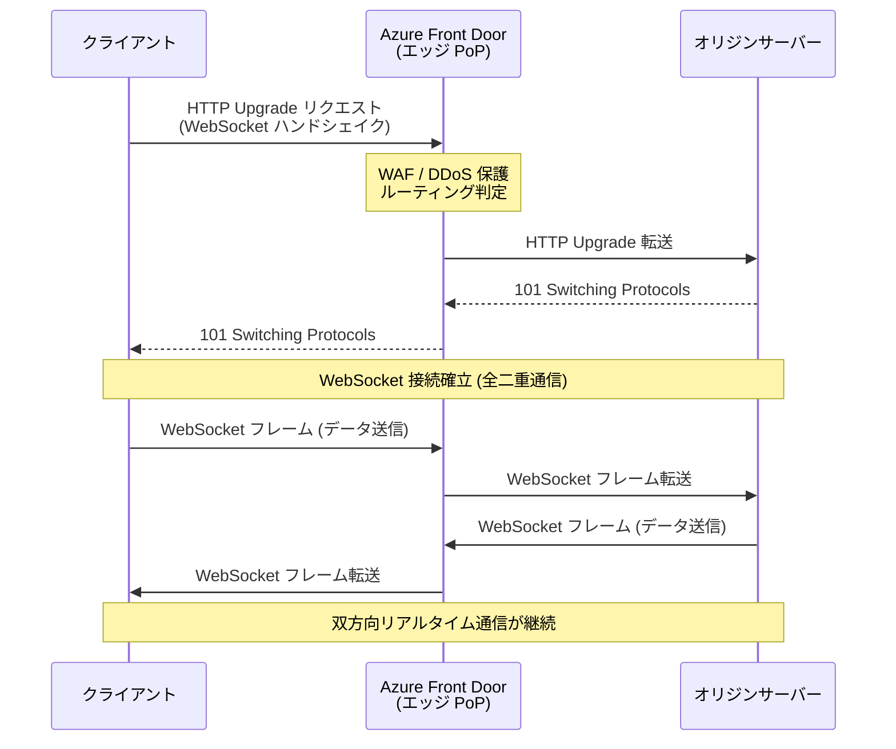

# Azure Front Door: WebSocket サポート一般提供開始

**リリース日**: 2026-05-18

**サービス**: Azure Front Door

**機能**: WebSocket サポート (Standard / Premium)

**ステータス**: Launched (GA)

[このアップデートのインフォグラフィックを見る](https://takech9203.github.io/azure-news-summary/20260518-front-door-websocket.html)

## 概要

Azure Front Door Standard および Premium において、WebSocket のサポートが一般提供 (GA) として発表された。WebSocket はデフォルトで有効化されており、追加の構成は不要である。

WebSocket は単一の長寿命 TCP 接続上で全二重 (full-duplex) 通信を提供するプロトコルである。従来の HTTP リクエスト/レスポンスモデルとは異なり、クライアントとサーバーの双方がいつでもデータを送受信できるため、リアルタイム性が求められるアプリケーションに最適である。Azure Front Door のグローバルエッジネットワークを介して WebSocket 接続を確立することで、低遅延かつ高可用性のリアルタイム通信が実現される。

本機能はこれまでプレビューとして提供されていたが、今回の GA により SLA の対象となり、本番環境での利用が正式にサポートされる。

**アップデート前の課題**

- Azure Front Door 経由での WebSocket 接続はプレビュー段階であり、SLA が提供されなかった
- リアルタイム通信が必要なアプリケーションでは、Front Door を経由せずに直接オリジンに接続するか、別のロードバランサーを使用する必要があった
- WebSocket を利用するアプリケーションでは、Front Door の WAF やDDoS 保護などのセキュリティ機能を活用できなかった

**アップデート後の改善**

- WebSocket がデフォルトで有効であり、追加設定なしで利用可能
- Front Door の WAF、DDoS 保護、グローバルロードバランシングなどのセキュリティ・パフォーマンス機能を WebSocket 接続に対しても適用可能
- SLA の対象となり、本番環境での利用が正式にサポートされる
- 118 以上のグローバルエッジロケーションを活用した低遅延の WebSocket 接続が可能

## アーキテクチャ図

この図は、クライアントから Azure Front Door エッジロケーションを経由してオリジンサーバーへの WebSocket 接続確立フローを示している。初期ハンドシェイク後、全二重通信が確立され、双方向のリアルタイムデータ転送が可能になる。

## サービスアップデートの詳細

### 主要機能

1. **デフォルト有効の WebSocket サポート**
   - 追加の構成や設定変更なしに WebSocket が利用可能
   - 既存の Azure Front Door Standard / Premium プロファイルでそのまま利用可能

2. **全二重通信 (Full-Duplex)**
   - 単一の長寿命 TCP 接続上でクライアントとサーバーが同時にデータを送受信
   - HTTP ポーリングと比較してネットワークオーバーヘッドを大幅に削減

3. **セキュリティ機能の適用**
   - Front Door の WAF (Web Application Firewall) による保護
   - レイヤー 3-4 の DDoS 保護
   - TLS 1.2 / 1.3 による暗号化通信

4. **グローバルロードバランシング**
   - 118 以上のエッジロケーションによる低遅延接続
   - オリジンの正常性プローブに基づく自動フェイルオーバー

## 技術仕様

| 項目 | 詳細 |
|------|------|
| 対応 SKU | Azure Front Door Standard / Premium |
| プロトコル | WebSocket (RFC 6455) |
| 有効化方法 | デフォルトで有効 (追加設定不要) |
| TLS サポート | TLS 1.2, TLS 1.3 |
| 接続方式 | HTTP Upgrade メカニズムによるハンドシェイク |
| 通信方式 | 全二重 (Full-Duplex) |
| HTTP keep-alive タイムアウト | 90 秒 (Front Door 全体の設定) |
| Classic SKU | 非対応 |

## 設定方法

### 前提条件

1. Azure Front Door Standard または Premium プロファイルが作成済みであること
2. オリジンサーバーが WebSocket をサポートしていること
3. オリジンのルーティングルールが構成済みであること

### Azure Portal

WebSocket はデフォルトで有効であり、Azure Portal での特別な設定は不要である。既存の Front Door プロファイルで追加の構成変更なしに WebSocket 接続を利用できる。

オリジンサーバー側で WebSocket をサポートするように構成されていれば、クライアントからの WebSocket Upgrade リクエストは自動的に Front Door 経由でオリジンに転送される。

## メリット

### ビジネス面

- **リアルタイムアプリケーションの構築が容易**: チャット、通知、ライブフィードなどのリアルタイム機能を Azure Front Door の背後で展開可能
- **運用コストの削減**: WebSocket のためだけに別のロードバランサーやプロキシを用意する必要がなくなる
- **グローバル展開の加速**: Front Door のグローバルネットワークを活用し、世界中のユーザーに低遅延のリアルタイム体験を提供

### 技術面

- **ゼロコンフィグレーション**: デフォルト有効のため、追加設定や機能フラグの操作が不要
- **セキュリティの統合**: WAF と DDoS 保護が WebSocket 接続にも適用され、リアルタイム通信のセキュリティが向上
- **ネットワーク効率の改善**: HTTP ポーリングと比較して、持続的な接続により不要なハンドシェイクやヘッダーのオーバーヘッドを削減
- **既存アーキテクチャとの互換性**: 既存の Front Door 構成を変更せずに WebSocket を利用可能

## デメリット・制約事項

- Azure Front Door Classic SKU では WebSocket はサポートされない。Standard または Premium への移行が必要
- Front Door の HTTP keep-alive タイムアウトは 90 秒であり、アイドル状態の WebSocket 接続はこのタイムアウトの影響を受ける可能性がある。アプリケーション側で定期的な ping/pong フレームの実装が推奨される
- WebSocket 接続はキャッシュの対象外であり、すべてのフレームがオリジンに転送される

## ユースケース

### ユースケース 1: リアルタイムチャットアプリケーション

**シナリオ**: グローバルに展開するチャットアプリケーションで、ユーザー間のメッセージをリアルタイムに配信する。Azure Front Door を経由して WebSocket 接続を確立し、最寄りのエッジロケーションからオリジンへの接続を最適化する。

**効果**: 世界中のユーザーに対して低遅延のメッセージ配信を実現しつつ、WAF によるセキュリティ保護と DDoS 対策も同時に提供される。

### ユースケース 2: ライブダッシュボード・モニタリング

**シナリオ**: IoT デバイスや業務システムのメトリクスをリアルタイムで表示するダッシュボード。WebSocket を使用してサーバーからクライアントへデータをプッシュし、ポーリングによるオーバーヘッドを排除する。

**効果**: Front Door のグローバルロードバランシングにより、複数リージョンのオリジンに対して自動フェイルオーバーが機能し、ダッシュボードの高可用性を確保できる。

### ユースケース 3: オンラインゲームのマルチプレイヤー通信

**シナリオ**: オンラインゲームでプレイヤー間のリアルタイムな状態同期を行う。低遅延の双方向通信が必要であり、Front Door のエッジネットワークを活用してプレイヤーに最も近いポイントから接続を提供する。

**効果**: anycast ルーティングにより最適なエッジロケーションが選択され、ゲームプレイに影響する遅延を最小化。DDoS 保護により、ゲームサーバーへの攻撃からも防御される。

## 料金

WebSocket サポート自体に追加料金は発生しない。Azure Front Door Standard / Premium の既存の料金体系が適用される。

WebSocket 接続によるデータ転送は、Front Door の通常のデータ転送料金とリクエスト料金の対象となる。詳細は [Azure Front Door の料金ページ](https://azure.microsoft.com/pricing/details/frontdoor/) を参照されたい。

## 利用可能リージョン

Azure Front Door はグローバルサービスであり、118 以上のエッジロケーションで利用可能である。WebSocket サポートはすべてのエッジロケーションで利用可能。

## 関連サービス・機能

- **Azure Application Gateway**: リージョナルなレイヤー 7 ロードバランサー。WebSocket をサポートしており、Front Door と組み合わせたマルチレイヤーのアーキテクチャで利用可能
- **Azure Web Application Firewall (WAF)**: Front Door に統合された WAF により、WebSocket エンドポイントへの悪意のあるリクエストを防御
- **Azure SignalR Service**: リアルタイム通信のためのマネージドサービス。Front Door と組み合わせることで、グローバルなリアルタイム通信基盤を構築可能
- **Azure Web PubSub**: WebSocket ベースのメッセージングサービス。Front Door の背後に配置することでセキュリティとスケーラビリティを強化

## 参考リンク

- [インフォグラフィック](https://takech9203.github.io/azure-news-summary/20260518-front-door-websocket.html)
- [公式アップデート情報](https://azure.microsoft.com/updates?id=562548)
- [Azure Front Door の概要 - Microsoft Learn](https://learn.microsoft.com/azure/frontdoor/front-door-overview)
- [Azure Front Door のティア比較 - Microsoft Learn](https://learn.microsoft.com/azure/frontdoor/front-door-cdn-comparison)
- [Azure Front Door の料金](https://azure.microsoft.com/pricing/details/frontdoor/)

## まとめ

Azure Front Door Standard および Premium において WebSocket サポートが一般提供 (GA) となった。デフォルトで有効であり追加設定は不要なため、既存の Front Door プロファイルを利用しているユーザーは即座に WebSocket 接続を活用できる。リアルタイムチャット、ライブダッシュボード、オンラインゲームなど、双方向通信が必要なアプリケーションにおいて、Front Door の WAF、DDoS 保護、グローバルロードバランシングといったエンタープライズ機能と組み合わせてリアルタイム通信を構築できる点が大きなメリットである。Classic SKU を使用している場合は、WebSocket サポートを利用するために Standard または Premium への移行を検討されたい。

---

**タグ**: `Azure Front Door` `WebSocket` `Networking` `Real-Time` `GA` `Full-Duplex` `CDN`
