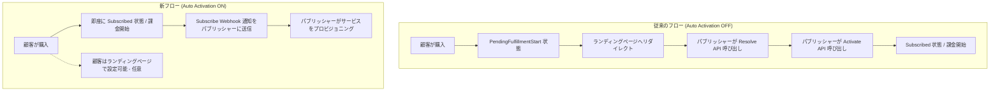

# Microsoft Marketplace: SaaS サブスクリプションの自動アクティベーション

**リリース日**: 2026-05-18

**サービス**: Microsoft Marketplace

**機能**: SaaS サブスクリプションの自動アクティベーション (Auto Activation)

**ステータス**: Launched (GA)

[このアップデートのインフォグラフィックを見る](https://takech9203.github.io/azure-news-summary/20260518-marketplace-saas-auto-activation.html)

## 概要

Microsoft Marketplace における SaaS ソリューションの自動アクティベーション機能が一般提供 (GA) となった。この機能により、顧客が SaaS 製品を購入した瞬間にサブスクリプションと課金サイクルが自動的に開始され、より迅速かつ簡単に SaaS 製品の価値を享受できるようになる。

従来の SaaS サブスクリプションフローでは、顧客が購入後にパブリッシャーのランディングページにリダイレクトされ、パブリッシャーが Resolve API と Activate API を呼び出してサブスクリプションをアクティベートするまで課金が開始されなかった。この手動プロセスにより、購入完了から実際のサービス利用開始までに遅延が発生していた。

自動アクティベーションを有効にすると、サブスクリプションは購入時に *PendingFulfillmentStart* 状態をスキップし、直接 *Subscribed* 状態に遷移する。パブリッシャーは Resolve API や Activate API を呼び出す必要がなくなり、代わりに `Subscribe` Webhook 通知でサブスクリプション詳細を受信する。

**アップデート前の課題**

- 顧客が購入後、パブリッシャーがランディングページで Resolve API と Activate API を呼び出すまでサブスクリプションがアクティベートされなかった
- 購入から利用開始までの待ち時間が発生し、顧客体験が損なわれていた
- パブリッシャーは SaaS Fulfillment API (Resolve + Activate) の実装が必須であり、技術的負担が大きかった
- サブスクリプションが *PendingFulfillmentStart* 状態で停滞するリスクがあった

**アップデート後の改善**

- 購入完了と同時にサブスクリプションと課金が自動的に開始される
- Resolve API および Activate API の呼び出しが不要になり、パブリッシャーの実装負担が軽減
- `Subscribe` Webhook 通知で購入情報がパブリッシャーに即時送信される
- 顧客はランディングページでのアカウント構成を行わなくてもすぐにサービスを利用開始できる

## アーキテクチャ図

上図は、自動アクティベーション有効化前後のサブスクリプションフローの比較を示している。従来は複数のAPI呼び出しを経て初めて課金が開始されていたが、新フローでは購入と同時にサブスクリプションがアクティブになる。

## サービスアップデートの詳細

### 主要機能

1. **購入即時アクティベーション**
   - 顧客が購入を完了した瞬間にサブスクリプションが自動的にアクティベートされ、課金サイクルが開始される
   - *PendingFulfillmentStart* 状態をスキップし、直接 *Subscribed* 状態に遷移

2. **Subscribe Webhook 通知**
   - パブリッシャーに対して、新規購入のサブスクリプション詳細が `Subscribe` Webhook イベントとして送信される
   - パブリッシャーはこの通知を受信してサービスのプロビジョニングを行う

3. **プラン単位の設定**
   - 自動アクティベーションはオファー内の各プランごとに個別に設定可能
   - Partner Center の「Pricing and availability」タブで設定する

4. **API 呼び出しの簡素化**
   - 自動アクティベーションが有効なプランでは Resolve API と Activate API の呼び出しが不要
   - パブリッシャーの技術的実装コストが大幅に削減される

## 技術仕様

| 項目 | 詳細 |
|------|------|
| 機能名 | Auto Activation for SaaS Subscriptions |
| 設定単位 | プラン (Plan) 単位 |
| 設定場所 | Partner Center > Pricing and availability タブ |
| 必須実装 | `Subscribe` Webhook イベントの受信処理 |
| 不要になる API | Resolve API、Activate API |
| サブスクリプション状態遷移 | 購入 → Subscribed (PendingFulfillmentStart をスキップ) |
| 課金開始タイミング | 購入完了時点 |
| ランディングページ | 任意 (アカウント構成用に利用可能だが、課金開始には不要) |

## 設定方法

### 前提条件

1. Microsoft Partner Center アカウントを保有していること
2. SaaS オファーが「Sell through Microsoft」(トランザクション可能) として構成されていること
3. `Subscribe` Webhook イベントを処理する Webhook エンドポイントが実装されていること

### Partner Center での設定

1. Partner Center にサインインし、対象の SaaS オファーを開く
2. 「Plan overview」タブで設定対象のプランを選択する
3. 「Pricing and availability」タブに移動する
4. 「Auto activation」セクションで設定を **On** にする
   - **On**: 購入時にサブスクリプションが自動アクティベートされ、課金が即時開始される
   - **Off**: パブリッシャーが Resolve/Activate API を呼び出すまでアクティベートされない
5. 変更を保存し、オファーを再公開する

## メリット

### ビジネス面

- 顧客が購入後すぐにサービスを利用開始できるため、Time-to-Value が短縮される
- 購入からアクティベーションまでの離脱リスクが低減する
- サブスクリプションが PendingFulfillmentStart 状態で放置されるケースを防止できる

### 技術面

- Resolve API および Activate API の実装が不要になり、パブリッシャーの開発負担が軽減される
- Webhook ベースの非同期アーキテクチャにより、シンプルなインテグレーションが実現できる
- ランディングページでのトークン処理の複雑さが解消される

## デメリット・制約事項

- `Subscribe` Webhook イベントの受信処理を必ず実装する必要がある
- 課金が即座に開始されるため、顧客がランディングページでアカウント構成を完了する前に課金される可能性がある
- 既存の Resolve/Activate フローに依存したパブリッシャーのシステム設計変更が必要になる場合がある
- 自動アクティベーションの有効/無効はプラン単位の設定であり、個別の顧客単位では制御できない

## ユースケース

### ユースケース 1: セルフサービス型 SaaS アプリケーション

**シナリオ**: 顧客がサインアップ後すぐに利用開始できるセルフサービス型の SaaS アプリケーション (プロジェクト管理ツール、コラボレーションツールなど)

**効果**: 購入完了と同時にアカウントが有効化され、顧客は待ち時間なしでサービスを利用開始できる。パブリッシャーは Webhook 通知に基づいてテナントのプロビジョニングを行うだけでよい。

### ユースケース 2: API ベースのサービス

**シナリオ**: API キーの発行のみで利用開始できる SaaS サービス (AI/ML API、データ分析サービスなど)

**効果**: 購入即座にサブスクリプションがアクティブになるため、API キー発行とプロビジョニングの自動化パイプラインと組み合わせることで、エンドツーエンドの自動化が実現できる。

## 料金

自動アクティベーション機能自体に追加料金は発生しない。Microsoft Marketplace の標準的な手数料 (Marketplace Service Fee: 3%) が適用される。

## 関連サービス・機能

- **SaaS Fulfillment API v2**: サブスクリプションのライフサイクル管理 API。自動アクティベーションにより一部 API 呼び出しが不要になる
- **Partner Center**: オファーとプランの管理、自動アクティベーションの設定を行うポータル
- **Microsoft Marketplace Webhook**: パブリッシャーへの非同期通知メカニズム。自動アクティベーション時は Subscribe イベントが送信される
- **Microsoft Entra ID**: 購入者とサブスクリプション受益者の認証に使用

## 参考リンク

- [インフォグラフィック](https://takech9203.github.io/azure-news-summary/20260518-marketplace-saas-auto-activation.html)
- [公式アップデート情報](https://azure.microsoft.com/updates?id=561771)
- [Microsoft Learn - Plan a SaaS offer](https://learn.microsoft.com/en-us/partner-center/marketplace-offers/plan-saas-offer)
- [Microsoft Learn - Create plans for a SaaS offer](https://learn.microsoft.com/en-us/partner-center/marketplace-offers/create-new-saas-offer-plans)
- [Microsoft Learn - SaaS Fulfillment Subscription APIs v2](https://learn.microsoft.com/en-us/partner-center/marketplace-offers/pc-saas-fulfillment-subscription-api)

## まとめ

Microsoft Marketplace における SaaS サブスクリプションの自動アクティベーション機能の GA により、顧客は購入と同時にサービスを利用開始でき、パブリッシャーは Resolve/Activate API の実装負担から解放される。特にセルフサービス型の SaaS アプリケーションにおいて、顧客体験の向上と実装の簡素化の両面で大きな改善をもたらす。パブリッシャーは Partner Center でプランごとに自動アクティベーションを有効化し、`Subscribe` Webhook の受信処理を実装することで、この機能を活用できる。

---

**タグ**: #Azure #Marketplace #SaaS #AutoActivation
