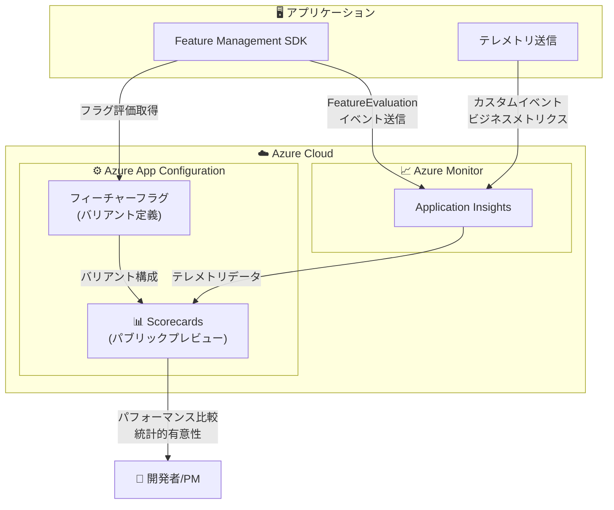

# Azure App Configuration: Scorecards によるフィーチャーロールアウト評価機能のパブリックプレビュー

**リリース日**: 2026-05-19

**サービス**: Azure App Configuration

**機能**: Scorecards (スコアカード) - フィーチャーフラグバリアントのパフォーマンス評価

**ステータス**: In preview

[このアップデートのインフォグラフィックを見る](https://takech9203.github.io/azure-news-summary/20260519-app-configuration-scorecards.html)

## 概要

Azure App Configuration に Scorecards (スコアカード) 機能がパブリックプレビューとして追加された。Scorecards は、フィーチャーフラグのバリアントが本番環境でどのように機能しているかをテレメトリに基づいて可視化するダッシュボードであり、ロールアウト後に測定可能な変化を手動でメトリクスを分析することなく特定できるようにする。

この機能は、Azure App Configuration の既存の Experimentation (実験) 機能およびテレメトリ機能の上に構築されている。従来、フィーチャーフラグのバリアント間のパフォーマンス比較を行うには、Application Insights で Kusto クエリを手動で記述する必要があったが、Scorecards を使用することでコードを書かずに視覚的にロールアウトの効果を確認できるようになる。

Scorecards は、A/B テストや段階的ロールアウトにおいて、各バリアントのビジネスメトリクスへの影響を統計的に評価し、データに基づいた意思決定を支援するものである。

**アップデート前の課題**

- フィーチャーフラグのバリアント間のパフォーマンス比較には Application Insights で手動の Kusto クエリが必要だった
- ロールアウト後のメトリクス変化を体系的に追跡する仕組みがなかった
- A/B テストの結果を確認するために開発者がデータ分析のスキルを必要とした
- フィーチャーロールアウトの成功・失敗の判断が属人的だった

**アップデート後の改善**

- テレメトリ駆動のダッシュボードでバリアントのパフォーマンスを自動可視化
- 手動のメトリクス分析なしでロールアウトの効果を定量的に評価可能
- 統計的有意性に基づいた結果表示により、データに基づく意思決定を支援
- Azure Portal 上で直感的にフィーチャーロールアウトの成果を確認できる

## アーキテクチャ図

アプリケーションが Feature Management SDK を通じてフィーチャーフラグのバリアントを取得し、評価イベントとビジネスメトリクスを Application Insights に送信する。Scorecards はこのテレメトリデータとフィーチャーフラグのバリアント構成を組み合わせて、各バリアントのパフォーマンスを可視化する。

## サービスアップデートの詳細

### 主要機能

1. **テレメトリ駆動のパフォーマンス可視化**
   - フィーチャーフラグの各バリアントがビジネスメトリクスに与える影響を自動的に集計・表示
   - Application Insights から収集されたテレメトリデータに基づく定量的な評価

2. **ロールアウト効果の自動検出**
   - フィーチャーフラグの有効化前後で測定可能な変化を自動的に特定
   - 手動でのメトリクス分析が不要

3. **統計的有意性の評価**
   - 各バリアント間の差異が統計的に有意かどうかを判定
   - サンプルサイズに基づいた信頼性の表示

4. **Experimentation 機能との統合**
   - 既存の A/B テスト・実験フレームワークの結果を Scorecards で集約表示
   - コントロール (ベースライン) バリアントと比較バリアントの影響分析

## 技術仕様

| 項目 | 詳細 |
|------|------|
| ステータス | パブリックプレビュー |
| 前提機能 | フィーチャーフラグのテレメトリ有効化 |
| テレメトリバックエンド | Application Insights |
| 対応 SDK | .NET, Java Spring, Python, JavaScript |
| バリアント割り当て | パーセンタイルベース、ユーザー/グループオーバーライド |
| 統計手法 | サンプルサイズに基づく統計的有意性判定 |

## 設定方法

### 前提条件

1. Azure App Configuration ストアが作成済みであること
2. Application Insights リソースが App Configuration ストアに接続済みであること
3. フィーチャーフラグにバリアントが設定済みであること
4. フィーチャーフラグのテレメトリが有効化されていること

### Azure Portal

1. Azure Portal で App Configuration ストアを開く
2. **Telemetry** セクションの **Application Insights (preview)** ブレードで Application Insights を接続する
3. **Feature manager** ブレードでフィーチャーフラグを編集し、**Telemetry** タブで「Enable Telemetry」にチェックを入れる
4. アプリケーション側で Feature Management SDK を使用してテレメトリイベントを送信するよう実装する
5. Scorecards ブレードでフィーチャーロールアウトの結果を確認する

### テレメトリ有効化 (アプリケーション側)

アプリケーション側でテレメトリを送信するには、各プラットフォームの Feature Management SDK を利用する。対応プラットフォーム:

- ASP.NET Core
- Python
- JavaScript

## メリット

### ビジネス面

- フィーチャーロールアウトの成功・失敗をデータに基づいて迅速に判断でき、意思決定の速度が向上
- 段階的ロールアウトのリスクを最小化し、問題のある機能を早期に検知できる
- A/B テストの結果を非技術者でも理解しやすい形で提示できる

### 技術面

- Application Insights の Kusto クエリを手動作成する必要がなくなり、運用コストが削減
- フィーチャーフラグのライフサイクル管理 (実験 -> 評価 -> 本番適用) がシームレスに統合
- テレメトリデータの収集からパフォーマンス可視化までのパイプラインが自動化

## デメリット・制約事項

- パブリックプレビュー段階のため、本番環境での利用には注意が必要
- Application Insights の接続が必須であり、他のテレメトリバックエンドには対応していない
- 統計的に有意な結果を得るには十分なサンプルサイズ (トラフィック量) が必要
- プレビュー期間中は機能や仕様が変更される可能性がある

## ユースケース

### ユースケース 1: EC サイトの UI 変更効果測定

**シナリオ**: EC サイトのチェックアウトボタンの色を変更した場合、コンバージョン率にどのような影響があるかを評価する

**実装例**:

フィーチャーフラグ「CheckoutButton」にバリアント A (黄色) と バリアント B (青色) を設定し、トラフィックを 50:50 で分割する。Scorecards でクリック率やコンバージョン率の差異を確認する。

**効果**: 手動分析なしで、どちらのバリアントがコンバージョン率を改善するかをデータに基づいて判断できる

### ユースケース 2: AI 機能の段階的ロールアウト防御

**シナリオ**: 新しい AI レコメンデーション機能を段階的にロールアウトする際、ガードレールメトリクスを設定してパフォーマンス劣化を検知する

**実装例**:

フィーチャーフラグに AI レコメンデーション (有効/無効) のバリアントを設定し、10% のユーザーに新機能を有効化する。Scorecards でレスポンスタイムやエラー率のガードレールメトリクスを監視する。

**効果**: パフォーマンス劣化を早期に検知し、問題発生時にはキルスイッチで即座に無効化できる

### ユースケース 3: パーソナライゼーション戦略の最適化

**シナリオ**: ユーザーへのグリーティングメッセージの種類 (なし / 短文 / 長文) がエンゲージメントに与える影響を測定する

**実装例**:

フィーチャーフラグ「Greeting」に None (50%) / Simple (25%) / Long (25%) のバリアントを設定し、各バリアントの「いいね」率を比較する。

**効果**: 最もエンゲージメントを高めるバリアントを統計的に特定し、全ユーザーへの適用を判断できる

## 料金

Azure App Configuration の料金体系に準拠する。Scorecards 機能自体の追加料金に関する情報は現時点で公開されていないため、プレビュー期間中は App Configuration ストアと Application Insights の既存料金で利用可能と想定される。

| 項目 | 料金 |
|------|------|
| App Configuration Standard | $1.20/日/ストア |
| Application Insights | データ取り込み量に基づく従量課金 |

無料枠: App Configuration Free tier (1 日あたり 1,000 リクエスト、10 MB ストレージ) が利用可能だが、テレメトリ機能は Standard tier が必要

## 関連サービス・機能

- **Azure App Configuration Feature Manager**: フィーチャーフラグの作成・管理を行う基盤機能。Scorecards はこの上に構築される
- **Azure App Configuration Experimentation**: A/B テスト・実験の設計・実行フレームワーク。Scorecards は実験結果の可視化を担う
- **Azure Monitor Application Insights**: テレメトリデータの収集・保存バックエンド。Scorecards のデータソースとなる
- **Feature Management SDK (.NET / Java / Python / JavaScript)**: アプリケーション側でフィーチャーフラグ評価とテレメトリ送信を行うクライアントライブラリ

## 参考リンク

- [インフォグラフィック](https://takech9203.github.io/azure-news-summary/20260519-app-configuration-scorecards.html)
- [公式アップデート情報](https://azure.microsoft.com/updates?id=561049)
- [Microsoft Learn - Azure App Configuration Experimentation](https://learn.microsoft.com/azure/azure-app-configuration/concept-experimentation)
- [Microsoft Learn - フィーチャーフラグのテレメトリ有効化](https://learn.microsoft.com/azure/azure-app-configuration/howto-telemetry)
- [Microsoft Learn - バリアントフィーチャーフラグの使用](https://learn.microsoft.com/azure/azure-app-configuration/howto-variant-feature-flags)
- [料金ページ](https://azure.microsoft.com/pricing/details/app-configuration/)

## まとめ

Azure App Configuration の Scorecards 機能は、フィーチャーフラグのバリアントが本番環境で実際にどのようなビジネスインパクトを生んでいるかを、テレメトリに基づいて自動的に可視化するパブリックプレビュー機能である。従来、手動の Kusto クエリやデータ分析が必要だったロールアウト評価を、Azure Portal 上の統合されたダッシュボードで直感的に行えるようになる。

推奨される次のアクション:

1. App Configuration ストアに Application Insights を接続する
2. フィーチャーフラグでテレメトリを有効化する
3. バリアントフィーチャーフラグを設定し、Scorecards でロールアウト結果を確認する
4. プレビュー段階のため、まずは非本番環境で評価することを推奨する

---

**タグ**: #AzureAppConfiguration #Scorecards #FeatureFlags #ABTesting #Experimentation #Telemetry #PublicPreview #DevTools
