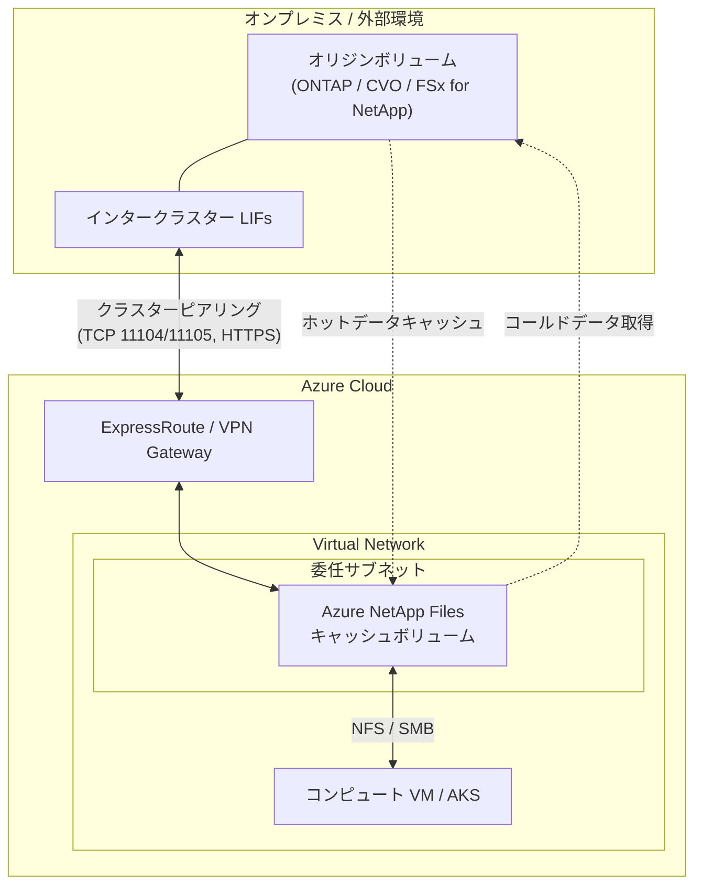

# Azure NetApp Files: キャッシュボリューム (Cache Volumes) の一般提供開始

**リリース日**: 2026-05-19

**サービス**: Azure NetApp Files

**機能**: Cache Volumes (キャッシュボリューム)

**ステータス**: Launched (GA)

[このアップデートのインフォグラフィックを見る](https://takech9203.github.io/azure-news-summary/20260519-netapp-files-cache-volumes.html)

## 概要

Azure NetApp Files のキャッシュボリューム機能が一般提供 (GA) になりました。キャッシュボリュームは、外部のオリジンボリュームのクラウドベースキャッシュであり、ボリューム上で最もアクティブにアクセスされるデータのみを保持します。これにより、データやファイルをコンピュートリソースの近くに配置し、パフォーマンスの向上とレイテンシの削減を実現します。

この機能は 2025 年 11 月にプレビューとして提供が開始され、約 6 か月の検証期間を経て GA に昇格しました。キャッシュボリュームは、オンプレミスの ONTAP、Cloud Volumes ONTAP、または Amazon FSx for NetApp の外部オリジンボリュームとピアリングされる設計になっており、ハイブリッドクラウド環境でのファイル配信を簡素化します。

キャッシュボリュームは読み取りと書き込みの両方を受け付けます。ホットデータの読み取りリクエストに対してはオリジンボリュームよりも高速に応答し、コールドデータのリクエストに対してはオリジンからデータを取得した後にキャッシュに格納し、以降のリクエストにローカルから応答します。

**アップデート前の課題**

- オンプレミスや他リージョンのオリジンボリュームへのアクセスには WAN を経由するため、レイテンシが高い
- 大容量のデータセット全体をレプリケーションする必要があり、ストレージコストと帯域コストが増大
- ExpressRoute/VPN を通じた WAN 帯域幅のコストが高い
- 地理的に分散したユーザーがリモートのファイルシステムにアクセスする際のパフォーマンス低下

**アップデート後の改善**

- ホットデータのみをキャッシュすることで、少ないストレージ容量で高速アクセスを実現
- WAN レイテンシの削減によりファイルアクセスのパフォーマンスが向上
- ExpressRoute/WAN 帯域幅コストの削減
- Write-back 機能により書き込み操作もローカルに近い速度で実行可能

## アーキテクチャ図



外部のオリジンボリューム (オンプレミス ONTAP 等) と Azure NetApp Files キャッシュボリュームが ExpressRoute/VPN を介してクラスターピアリングで接続され、コンピュートリソースはキャッシュボリュームに NFS/SMB でアクセスします。

## サービスアップデートの詳細

### 主要機能

1. **ホットデータの自動キャッシュ**
   - アクティブにアクセスされるデータのみをキャッシュに保持し、少ないストレージフットプリントで高いパフォーマンスを提供

2. **Write-back サポート**
   - 書き込みをキャッシュのローカルストレージにコミットし、オリジンへの到達を待たずにクライアントに応答。グローバル分散ファイルシステムとして、ローカルに近い速度での書き込みを実現

3. **Write-around モード**
   - オリジンがストレージへの書き込みをコミットしてからクライアントに応答するモード。データの一貫性を重視するワークロードに対応

4. **マルチプロトコル対応**
   - NFSv4、SMB、デュアルプロトコル (SMB + NFSv3) をサポート。LDAP との連携にも対応

5. **外部オリジンとのピアリング**
   - オンプレミス ONTAP、Cloud Volumes ONTAP、Amazon FSx for NetApp のオリジンボリュームと接続可能

## 技術仕様

| 項目 | 詳細 |
|------|------|
| サポートプロトコル | NFSv4、SMB、デュアルプロトコル (SMB + NFSv3) |
| オリジンソース | オンプレミス ONTAP、Cloud Volumes ONTAP、Amazon FSx for NetApp |
| 書き込みモード | Write-back (有効/無効切替可) / Write-around |
| ネットワーク要件 | ExpressRoute または VPN によるオリジンとの接続 |
| 必要ファイアウォールルール | ICMP、TCP 11104、TCP 11105、HTTPS (双方向) |
| 暗号化 | Microsoft.NetApp マネージドキー |
| API バージョン | 2026-01-01 |
| クラスターピアリングタイムアウト | ClusterPeeringOfferSent から 30 分以内にコマンド実行必須 |
| Vserver ピアリングタイムアウト | VserverPeeringOfferSent から 12 分以内にコマンド実行必須 |
| LDAP サポート | OpenLDAP 対応 |

## 設定方法

### 前提条件

1. ExpressRoute または VPN リソースの作成 (外部 ONTAP クラスターから Azure NetApp Files クラスターへのネットワーク接続)
2. ソースクラスターから Azure NetApp Files 委任サブネットへの接続確認
3. ファイアウォールルールの設定 (ICMP、TCP 11104、TCP 11105、HTTPS を双方向で許可)
4. すべてのインタークラスター (IC) LIF 間の接続確保
5. SMB プロトコルの場合: NetApp アカウントに専用 Active Directory 接続の構成

### Azure CLI

```bash
# 機能の登録
az account set --subscription <subscriptionId>
az feature register --namespace Microsoft.NetApp --name ANFCacheVolumes

# 登録状況の確認 (Registered になるまで最大 60 分)
az feature show --namespace Microsoft.NetApp --name ANFCacheVolumes
```

### REST API によるキャッシュボリューム作成

```bash
# キャッシュボリュームの作成 (PUT)
PUT https://management.azure.com/subscriptions/{subscriptionId}/resourceGroups/{resourceGroupName}/providers/Microsoft.NetApp/netAppAccounts/{accountName}/capacityPools/{poolName}/caches/{cacheName}?api-version=2026-01-01

# 状態の監視 (GET)
GET https://management.azure.com/subscriptions/{subscriptionId}/resourceGroups/{resourceGroupName}/providers/Microsoft.NetApp/netAppAccounts/{accountName}/capacityPools/{poolName}/caches/{cacheName}?api-version=2026-01-01

# ピアリングパスフレーズの取得
POST https://management.azure.com/subscriptions/{subscriptionId}/resourceGroups/{resourceGroupName}/providers/Microsoft.NetApp/netAppAccounts/{accountName}/capacityPools/{poolName}/caches/{cacheName}/listPeeringPassphrases?api-version=2026-01-01
```

### 作成フロー

1. PUT API でキャッシュボリューム作成を開始
2. cacheState が `ClusterPeeringOfferSent` になったら、`listPeeringPassphrases` を呼び出してピアリングコマンドとパスフレーズを取得
3. オリジンの ONTAP システムで `cluster peer create` コマンドを実行 (30 分以内)
4. cacheState が `VserverPeeringOfferSent` になったら、オリジンで `vserver peer accept` コマンドを実行 (12 分以内)
5. cacheState と provisioningState が `Succeeded` に遷移したらキャッシュボリュームが利用可能

## メリット

### ビジネス面

- WAN/ExpressRoute の帯域幅コスト削減
- ファイル配信の簡素化による運用効率の向上
- 完全なデータレプリケーションが不要なため、ストレージコストの最適化
- 地理的に分散したチームの生産性向上

### 技術面

- ホットデータのローカルキャッシュによるレイテンシ削減
- Write-back 機能による書き込みパフォーマンスの大幅な向上
- マルチプロトコル (NFS/SMB/デュアル) 対応で柔軟なワークロードサポート
- オンプレミスの既存 ONTAP インフラとのシームレスな統合

## デメリット・制約事項

- ExpressRoute または VPN によるオリジンとのネットワーク接続が前提条件
- クラスターピアリング設定に 30 分、Vserver ピアリングに 12 分の時間制限あり (超過するとキャッシュ作成が失敗)
- SMB プロトコルのキャッシュボリュームは共有 Active Directory では作成不可 (専用 AD 接続が必要)
- Write-back 有効時にキャッシュボリュームを削除する場合、事前に Write-back を無効化する PATCH が必要
- 現時点では REST API のみでの設定 (Azure Portal UI は今後提供予定と推測)

## ユースケース

### ユースケース 1: グローバル分散開発チームのファイルアクセス高速化

**シナリオ**: オンプレミスデータセンターにある設計データや CAD ファイルに、異なるリージョンの開発チームがアクセスする必要がある環境

**実装例**:

```bash
# オリジン (オンプレミス ONTAP) のデータに対してキャッシュボリュームを作成
# 開発チームの最寄りの Azure リージョンにキャッシュを配置
# NFS プロトコルで VM からマウント

# Azure CLI で機能登録
az feature register --namespace Microsoft.NetApp --name ANFCacheVolumes

# REST API でキャッシュボリューム作成 (NFS)
# PUT .../caches/dev-team-cache?api-version=2026-01-01
```

**効果**: 頻繁にアクセスされる設計データがローカルキャッシュから提供され、WAN 経由のアクセスと比較して大幅なレイテンシ削減とスループット向上を実現

### ユースケース 2: メディア・エンターテインメントのコンテンツ配信

**シナリオ**: 大容量のメディアファイルがオンプレミスのストレージに保存されているが、クラウド上のレンダリングやトランスコーディングワークロードからアクセスが必要

**効果**: アクティブに使用されるメディアファイルのみがキャッシュされるため、完全レプリケーションと比較してストレージフットプリントが小さく、帯域幅コストも削減

## 料金

Azure NetApp Files キャッシュボリュームの料金は、Azure NetApp Files の容量プール内のプロビジョニング容量に基づいて課金されます。詳細な料金情報は Azure NetApp Files の料金ページを参照してください。

| 項目 | 参照先 |
|------|--------|
| キャッシュボリュームの容量課金 | Azure NetApp Files 容量プールの料金体系に準拠 |
| ネットワーク接続 (ExpressRoute/VPN) | 別途 ExpressRoute/VPN Gateway の料金が発生 |

## 関連サービス・機能

- **Azure NetApp Files ボリュームレプリケーション**: キャッシュボリュームとは異なり、完全なデータコピーを別リージョンに保持する DR ソリューション
- **Azure ExpressRoute**: キャッシュボリュームとオンプレミスオリジン間の高帯域幅・低レイテンシ接続に使用
- **Azure VPN Gateway**: ExpressRoute の代替として、オリジンとの接続に使用可能
- **Cloud Volumes ONTAP**: キャッシュボリュームのオリジンソースの一つとして対応
- **Amazon FSx for NetApp ONTAP**: マルチクラウド環境でのオリジンソースとして対応

## 参考リンク

- [インフォグラフィック](https://takech9203.github.io/azure-news-summary/20260519-netapp-files-cache-volumes.html)
- [公式アップデート情報](https://azure.microsoft.com/updates?id=562259)
- [Microsoft Learn ドキュメント - キャッシュボリュームの構成](https://learn.microsoft.com/en-us/azure/azure-netapp-files/configure-cache-volumes)
- [Azure NetApp Files ドキュメント](https://learn.microsoft.com/en-us/azure/azure-netapp-files/)
- [料金ページ](https://azure.microsoft.com/pricing/details/netapp/)
- [リージョン別利用可能性](https://azure.microsoft.com/explore/global-infrastructure/products-by-region/?products=netapp)

## まとめ

Azure NetApp Files キャッシュボリュームの GA は、ハイブリッドクラウド環境でのファイルアクセスパフォーマンスの課題を解決する重要なアップデートです。オンプレミスや他クラウドに存在するオリジンボリュームのホットデータをクラウド側にキャッシュすることで、WAN レイテンシの削減、帯域幅コストの最適化、パフォーマンスの向上を同時に実現します。

Solutions Architect としては、以下のアクションを推奨します:

- ハイブリッドクラウド環境で WAN 経由のファイルアクセスにパフォーマンス課題がある場合、キャッシュボリュームの導入を検討
- Write-back モードと Write-around モードの特性を理解し、ワークロードに適したモードを選択
- ネットワーク要件 (ExpressRoute/VPN、ファイアウォールルール) を事前に確認し、導入計画を策定

---

**タグ**: #AzureNetAppFiles #Storage #CacheVolumes #HybridCloud #GA #Performance #NFS #SMB
