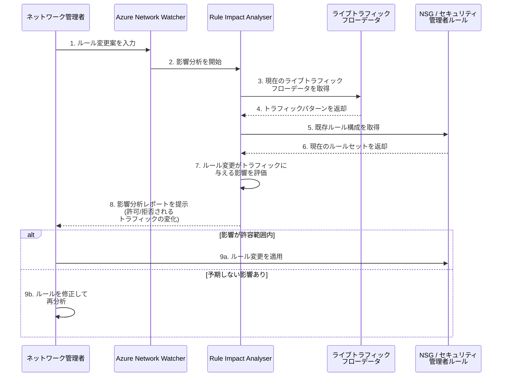

# Azure Network Watcher: ルール影響アナライザー (Rule Impact Analyser) が一般提供開始

**リリース日**: 2026-05-19

**サービス**: Azure Network Watcher

**機能**: Rule Impact Analyser (ルール影響アナライザー)

**ステータス**: Launched (GA)

[このアップデートのインフォグラフィックを見る](https://takech9203.github.io/azure-news-summary/20260519-network-watcher-rule-impact-analyser.html)

## 概要

Azure Network Watcher の **Rule Impact Analyser (ルール影響アナライザー)** が一般提供 (GA) となった。この機能は、ネットワークセキュリティグループ (NSG) またはセキュリティ管理者ルールの変更が、ライブネットワークトラフィックに与える潜在的な影響を、変更を適用する前に評価できる機能である。

本機能は 2026 年 4 月にパブリックプレビューとして Network Watcher の診断機能の一部として発表されていたものが、正式に GA となった。これにより、本番環境でのルール変更をより安全かつ情報に基づいた判断のもとで実施できるようになる。

2026 年 5 月 12 日に GA となった Azure Virtual Network Manager の Rule Impact Analyzer がセキュリティ管理者ルールのデプロイワークフローに統合された機能であるのに対し、本機能は Network Watcher の診断ツールとして、NSG ルールの変更影響分析にも対応している点が特徴である。

**アップデート前の課題**

- NSG ルールやセキュリティ管理者ルールの変更を本番環境に適用する際、実際のトラフィックへの影響を事前に把握する手段が限られていた
- ルール変更を「盲目的に」適用するしかなく、予期しない接続障害が発生するリスクがあった
- 変更後に問題が発覚した場合のロールバック作業が発生し、ダウンタイムの原因となっていた
- 大規模環境では影響範囲の手動評価に多大な工数がかかっていた

**アップデート後の改善**

- ルール変更をライブネットワークトラフィックに対してシミュレーションし、影響を事前に可視化できる
- NSG ルールとセキュリティ管理者ルールの両方の変更影響を分析できる
- 本番環境に変更を適用する前に、より安全で情報に基づいた判断が可能になる
- GA となったことで SLA の対象となり、本番ワークロードの変更管理に正式に採用できる

## アーキテクチャ図

この図は、Rule Impact Analyser を使用したルール変更のワークフローを示している。管理者がルール変更案を入力すると、Network Watcher がライブトラフィックデータと既存ルール構成に基づいて影響を評価し、変更適用前に分析結果を提示する。

## サービスアップデートの詳細

### 主要機能

1. **ライブトラフィックに基づく影響評価**
   - 実際のネットワークトラフィックフローデータを使用して、ルール変更の影響をシミュレーションする
   - 理論的な分析ではなく、実際の通信パターンに基づいた影響評価を提供する

2. **NSG ルール変更の影響分析**
   - Network Security Group のルール追加・変更・削除がネットワークトラフィックに与える影響を事前に評価できる
   - インバウンド・アウトバウンド両方向のトラフィックに対する影響を分析する

3. **セキュリティ管理者ルール変更の影響分析**
   - Azure Virtual Network Manager のセキュリティ管理者ルールの変更影響も分析対象とする
   - NSG ルールとセキュリティ管理者ルールの評価順序を考慮した包括的な分析を提供する

4. **本番環境での安全なルール変更**
   - 変更を適用する前に潜在的な問題を特定し、接続障害を未然に防止する
   - GA となったことで本番環境のワークフローに正式に組み込める

## 技術仕様

| 項目 | 詳細 |
|------|------|
| 機能名 | Rule Impact Analyser |
| 所属サービス | Azure Network Watcher |
| ステータス | 一般提供 (GA) |
| 分析対象 | NSG ルール / セキュリティ管理者ルール |
| トラフィックデータ | ライブネットワークトラフィック |
| 対応プロトコル | TCP / UDP / ICMP / Any |
| 対応方向 | Inbound / Outbound |
| 提供形態 | Network Watcher 診断ツール |

## NSG ルールとセキュリティ管理者ルールの評価順序

Rule Impact Analyser は以下の評価順序を考慮して影響をシミュレーションする。

| ルール種別 | 適用レベル | 評価順序 | アクション |
|-----------|-----------|---------|----------|
| セキュリティ管理者ルール | 仮想ネットワーク | 高優先度 (先に評価) | Allow / Deny / Always Allow |
| NSG ルール | サブネット / NIC | 低優先度 (後に評価) | Allow / Deny |

## 前提条件

1. Azure サブスクリプション
2. Azure Network Watcher がリージョンで有効化されていること
3. 分析対象の NSG またはセキュリティ管理者ルールが存在すること
4. ライブトラフィックフローのデータが取得可能な環境であること

## メリット

### ビジネス面

- ルール変更に伴う計画外ダウンタイムのリスクを大幅に低減
- 変更管理プロセスにおける事前検証のエビデンスとして活用可能
- GA となったことで SLA の対象となり、エンタープライズ環境で安心して採用できる
- セキュリティインシデントの予防による運用コストの削減

### 技術面

- ライブトラフィックに基づく実態に即した影響評価
- NSG ルールとセキュリティ管理者ルールの両方を分析対象とする包括的なカバレッジ
- Network Watcher の既存診断ツール (IP Flow Verify、NSG Diagnostics 等) と組み合わせた包括的なネットワーク診断が可能
- ルール変更のロールバック頻度の削減

## デメリット・制約事項

- セキュリティ管理者ルールはプライベートエンドポイントには適用されないため、その部分の影響分析は対象外
- 一部サービスのサブネット (Azure Application Gateway、Azure Bastion、Azure Firewall、Azure VPN Gateway 等) にはセキュリティ管理者ルールが適用されない
- ライブトラフィックデータに基づく分析であるため、分析時点で発生していないトラフィックパターン (例: 月次バッチ処理) については検知できない可能性がある
- セキュリティ管理者ルールは最終的な整合性モデル (Eventual Consistency) を使用しており、実際の適用にわずかな遅延がある

## ユースケース

### ユースケース 1: NSG ルール変更の事前検証

**シナリオ**: Web アプリケーションのフロントエンドサブネットに適用されている NSG に、特定の国からのアクセスをブロックするルールを追加する際、正規ユーザーのアクセスが遮断されないか事前に確認したい。

**効果**: Rule Impact Analyser でライブトラフィックに対するルール変更の影響をシミュレーションし、ブロック対象外のユーザーからのトラフィックが影響を受けないことを確認してから、安全にルールを適用できる。

### ユースケース 2: セキュリティ強化時の影響最小化

**シナリオ**: セキュリティ監査の結果、不要なポートを閉じる NSG ルール変更が必要となったが、依存するサービス間通信が遮断されないか検証したい。

**効果**: 現在のライブトラフィックフローを基に影響を評価し、実際に使用されている通信パスが遮断されないことを確認できる。未使用のポートのみを安全に閉じることが可能。

## 関連サービス・機能

- **Azure Virtual Network Manager - Rule Impact Analyzer**: 2026 年 5 月 12 日に GA となったセキュリティ管理者ルールのデプロイ前シミュレーション機能。Virtual Network Manager のワークフロー内で使用する
- **Network Security Group (NSG)**: サブネット・NIC レベルのセキュリティルール。本機能の主要な分析対象の一つ
- **IP Flow Verify**: Network Watcher の既存機能。特定の IP フローが許可/拒否されるかを検証する関連診断機能
- **NSG Diagnostics**: Network Watcher の既存機能。NSG ルールの評価結果を診断する機能
- **Traffic Analytics**: Network Watcher の機能。フローログを分析してネットワークアクティビティの可視化を行う

## 参考リンク

- [インフォグラフィック](https://takech9203.github.io/azure-news-summary/20260519-network-watcher-rule-impact-analyser.html)
- [公式アップデート情報](https://azure.microsoft.com/updates?id=562690)
- [Azure Network Watcher ドキュメント](https://learn.microsoft.com/azure/network-watcher/)
- [Network Security Group 概要](https://learn.microsoft.com/azure/virtual-network/network-security-groups-overview)
- [セキュリティ管理者ルールの概念](https://learn.microsoft.com/azure/virtual-network-manager/concept-security-admins)
- [Network Watcher 料金](https://azure.microsoft.com/pricing/details/network-watcher/)

## まとめ

Azure Network Watcher の Rule Impact Analyser が GA となり、NSG ルールおよびセキュリティ管理者ルールの変更がライブネットワークトラフィックに与える影響を、適用前に評価できる機能が正式にサポートされた。本機能は Network Watcher の診断ツールとして提供され、実際のトラフィックパターンに基づいた影響分析を行うことで、本番環境でのルール変更をより安全に実施できるようにする。

Solutions Architect としての推奨アクション:
- NSG ルール変更の標準プロセスに Rule Impact Analyser による事前検証を組み込む
- 2026 年 5 月 12 日に GA となった Virtual Network Manager の Rule Impact Analyzer との使い分けを理解する (NSG ルール変更の診断には本機能、セキュリティ管理者ルールのデプロイワークフローには Virtual Network Manager を使用)
- セキュリティ監査やコンプライアンス対応でのルール変更時に、影響分析結果をエビデンスとして記録するワークフローを構築する

---

**タグ**: #Azure #NetworkWatcher #NSG #SecurityAdminRules #RuleImpactAnalyser #GA #NetworkSecurity #Diagnostics #Networking
