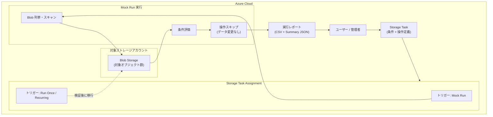

# Azure Storage Actions: Mock Runs (模擬実行) - 実行前の検証機能

**リリース日**: 2026-05-19

**サービス**: Azure Storage Actions

**機能**: Mock Runs (模擬実行)

**ステータス**: Launched (GA)

[このアップデートのインフォグラフィックを見る](https://takech9203.github.io/azure-news-summary/20260519-storage-actions-mock-runs.html)

## 概要

Azure Storage Actions に「Mock Runs (模擬実行)」機能が一般提供 (GA) として追加された。Mock Runs は、ストレージタスクの実行をフルスケールでシミュレーションし、実際のデータを一切変更せずに自動化ルールの検証を行える新機能である。

Azure Storage Actions は、Azure Blob Storage および Azure Data Lake Storage のデータ管理タスクを自動化するフルマネージドプラットフォームである。削除、アクセス層の変更、不変ポリシーの設定など、数百万のオブジェクトに対して一括操作を実行できるが、これまではタスクの条件設定が正しいかどうかを本番データで実行する前に大規模に検証する手段が限られていた。Mock Runs はこの課題を解決する。

Mock Runs を使用することで、どの Blob が条件に一致するか、どの操作が実行されるかを事前にプレビューし、本番データに影響を与える前に設定ミスを発見できる。

**アップデート前の課題**

- ストレージタスクの条件設定が正しいか検証するには、実際のデータに対してタスクを実行する必要があった
- 条件プレビュー機能は最大 5,000 Blob のサンプルに限定されており、フルスケールの検証ができなかった
- 削除や不変ポリシー設定など不可逆な操作の場合、誤設定による本番データへの影響リスクがあった
- 大規模環境でのタスク実行コストを事前に見積もる手段がなかった

**アップデート後の改善**

- フルスケール (全対象 Blob) でのシミュレーション実行が可能になった
- データを一切変更せずに、条件に一致する Blob と実行される操作を詳細レポートで確認できる
- 操作課金なしで検証できるため、コスト効率よくタスク設定を確認できる
- Mock Run から実際の実行への移行がスムーズに行える

## アーキテクチャ図



Mock Run では、ストレージタスクが通常の実行と同様に全対象 Blob をスキャン・条件評価するが、操作は実行せずレポートのみを生成する。検証完了後、同じアサインメントのトリガータイプを変更することで実際の実行に移行できる。

## サービスアップデートの詳細

### 主要機能

1. **フルスケールのシミュレーション実行**
   - アサインメントスコープ内の全 Blob を対象にスキャンし、条件を評価する
   - 条件プレビュー (最大 5,000 Blob) とは異なり、本番と同じスケールで検証可能
   - 操作は一切実行されないため、データの安全性が保証される

2. **詳細な実行レポート**
   - CSV 形式のレポートにより、条件に一致した各 Blob と実行予定の操作を確認できる
   - レポートカラム: Container、Blob、Operation to be performed、Matched condition block
   - 操作は `(mock) DeleteBlob`、`(mock) SetBlobImmutability` のように `(mock)` プレフィックスで表示される

3. **サマリー JSON による集計情報**
   - `objectsListed`: スキャンされた Blob 総数
   - `objectsToBeOperated`: 条件に一致し操作対象となる Blob 数
   - `status`: Mock Run の結果 (succeeded / failed)

4. **実行への移行 (Transition to Real Run)**
   - Mock Run 完了後、アサインメントのトリガータイプを「Run once」または「Recurring」に変更するだけで実行に移行可能
   - アサインメントの再作成が不要

## 技術仕様

| 項目 | 詳細 |
|------|------|
| トリガータイプ | `MockRun` |
| スコープ | アサインメントで指定したストレージアカウント全体またはプレフィックスフィルタで絞込 |
| 同時実行 | 1 ストレージアカウントにつき 1 つの実行 (Mock または Real) のみ |
| レポート形式 | CSV + Summary JSON |
| 最小必要ロール | Storage Blob Data Reader |
| 推奨ロール | Storage Blob Data Owner (Real Run への移行を見据える場合) |
| マネージド ID | システム割り当て / ユーザー割り当ての両方に対応 |
| 再実行 | 完了した Mock Run の再実行は不可。新規アサインメントの作成が必要 |

## 設定方法

### 前提条件

1. ストレージタスクが少なくとも 1 つの条件と 1 つの操作を定義済みであること
2. ストレージタスクのマネージド ID に対象ストレージアカウントの **Storage Blob Data Reader** 以上のロールが割り当てられていること
3. 対象ストレージアカウントのネットワーク設定で「信頼された Microsoft サービスを許可」が有効であること

### Azure Portal

1. Azure Portal でストレージタスクに移動する
2. **Storage task management** > **Assignments** を選択する
3. **+ Add assignment** をクリックする
4. **Select scope** セクションでサブスクリプション、アサインメント名、対象ストレージアカウントを指定する
5. **Role assignment** セクションでマネージド ID に割り当てるロールを選択する (最低 Storage Blob Data Reader)
6. **Filter objects** セクションでプレフィックスフィルタを設定する (または「Do not filter」を選択)
7. **Trigger details** セクションで **Mock run** を選択する
8. 開始日時とオプションの最大実行時間を設定する
9. **Report** セクションでレポートの出力先コンテナーを指定する
10. **Add** をクリックしてアサインメントを作成する
11. アサインメント一覧でチェックボックスを選択し、**Enable** をクリックして Mock Run をスケジュールする

### Azure CLI

```bash
# Mock Run のトリガー変数を作成
current_datetime=$(date +"%Y-%m-%dT%H:%M:%S")
executioncontextvariable="{target:{prefix:[mycontainer/],excludePrefix:[]},trigger:{type:'MockRun',parameters:{startOn:'"${current_datetime}"'}}}"

# ストレージタスク ID を取得
id=$(az storage-actions task show -g "<resource-group>" -n "<storage-task-name>" --query "id")

# Mock Run アサインメントを作成
az storage account task-assignment create \
   -g '<resource-group>' \
   -n '<mock-run-assignment-name>' \
   --account-name '<storage-account-name>' \
   --description 'Mock run for validation' \
   --enabled true \
   --task-id $id \
   --execution-context $executioncontextvariable \
   --report "{prefix:mock-run-reports}"
```

## メリット

### ビジネス面

- 本番データへの誤操作リスクを排除し、データガバナンスとコンプライアンスを強化できる
- 削除や不変ポリシーなど不可逆な操作の影響範囲を事前に把握できる
- 監査対応のレポートを操作前に生成し、承認プロセスに組み込める
- 実行コスト (対象オブジェクト数) を事前に見積もれる

### 技術面

- フルスケールでの条件検証により、条件プレビューでは見つけられない設定ミスを発見できる
- 操作課金なしでシミュレーションできるため、コスト効率よくテストを繰り返せる
- Mock Run から Real Run への移行がアサインメント設定の変更だけで完了する
- 本番と同一のスキャンロジックで動作するため、シミュレーション結果の信頼性が高い

## デメリット・制約事項

- 完了した Mock Run は再実行できない (新規アサインメント作成が必要)
- 1 ストレージアカウントにつき同時に 1 つの実行 (Mock/Real) しか動作しない
- Mock Run 中に Real Run が要求された場合、キューまたはスキップされる
- タスク実行インスタンス料金とオブジェクトスキャン料金は発生する (操作料金のみ無料)
- 対象ストレージアカウントと同一リージョンのストレージタスクのみ使用可能

## ユースケース

### ユースケース 1: 大規模データクリーンアップの事前検証

**シナリオ**: 数百万の Blob を保持するストレージアカウントで、作成日が 90 日を超えたログファイルを削除するタスクを設定したが、条件に予期しない Blob が含まれないか確認したい。

**効果**: Mock Run により本番環境の全 Blob を安全にスキャンし、削除対象となる Blob リストを CSV で確認できる。本番データを一切変更せずに、条件の正確性を検証した上で実行に移行できる。

### ユースケース 2: コンプライアンス対応の不変ポリシー適用前確認

**シナリオ**: 規制要件により財務データに不変ポリシーを設定する必要がある。設定後は取り消せないため、対象 Blob が正確に特定されているかを事前に確認したい。

**効果**: Mock Run レポートで `(mock) SetBlobImmutability` 操作の対象を一覧化し、意図しないファイルが含まれていないかを承認者がレビューした上で実行できる。

### ユースケース 3: コスト最適化のためのアクセス層変更の影響分析

**シナリオ**: Hot 層から Cool 層への自動移行タスクを設定する前に、対象オブジェクト数と想定コストを把握したい。

**効果**: Mock Run のサマリー JSON で `objectsToBeOperated` を確認し、操作対象のオブジェクト数から実行コストを事前に見積もれる。

## 料金

Mock Runs の料金体系は通常のタスク実行と類似しているが、操作メーターは課金されない。

| 項目 | 料金適用 |
|------|------|
| タスク実行インスタンス (1 回あたり) | 課金あり |
| オブジェクトスキャン (100 万オブジェクトあたり) | 課金あり |
| 操作実行 (100 万操作あたり) | 課金なし (常に $0) |

Blob Storage API のリスト/プロパティ読み取りコストも標準的に発生する。操作メーターが免除されるため、Mock Runs は Real Runs と比較して大幅にコストを抑えられる。

## 利用可能リージョン

Azure Storage Actions が一般提供されている全リージョンで利用可能。主要リージョンは以下の通り:

- East US / East US 2 / Central US / West US / West US 2 / West US 3
- North Europe / West Europe
- Japan East / Japan West
- Australia East / Australia Central / Australia Southeast
- Southeast Asia / East Asia
- UK South / UK West
- Canada Central / Canada East
- France Central / Germany West Central
- Brazil South
- Central India / South India
- Korea Central / Korea South
- Sweden Central / Norway East / Switzerland North
- その他多数のリージョンに対応

## 関連サービス・機能

- **Azure Blob Storage**: Mock Runs の主要な対象ストレージサービス
- **Azure Data Lake Storage**: Storage Actions の対象となるもう一つのストレージサービス
- **Azure Event Grid**: ストレージタスク実行完了イベントの通知に使用
- **Azure Monitor**: ストレージタスクのメトリクスと実行状況の監視
- **条件プレビュー**: タスク作成時に最大 5,000 Blob でのクイックテストを提供する既存機能 (Mock Runs はこれを補完する大規模検証機能)

## 参考リンク

- [インフォグラフィック](https://takech9203.github.io/azure-news-summary/20260519-storage-actions-mock-runs.html)
- [公式アップデート情報](https://azure.microsoft.com/updates?id=559494)
- [Microsoft Learn - Mock Runs for Storage Task Assignments](https://learn.microsoft.com/azure/storage-actions/storage-tasks/storage-task-mock-run)
- [Microsoft Learn - Create and Use a Mock Run](https://learn.microsoft.com/azure/storage-actions/storage-tasks/storage-task-mock-run-create)
- [Microsoft Learn - Azure Storage Actions 概要](https://learn.microsoft.com/azure/storage-actions/overview)
- [Microsoft Learn - Storage Task Assignment の作成](https://learn.microsoft.com/azure/storage-actions/storage-tasks/storage-task-assignment-create)

## まとめ

Azure Storage Actions の Mock Runs は、大規模な Blob データに対する自動化タスクの「実行前検証」を実現する重要な機能である。これまで条件プレビュー (5,000 Blob 限定) しかなかった検証手段が、本番と同一スケールでの安全なシミュレーションに拡張された。

特に削除や不変ポリシー設定といった不可逆な操作を含むタスクでは、Mock Runs による事前確認がデータ保護の観点から強く推奨される。操作料金が発生しないため、コスト面でも気軽に繰り返しテストを行える。

**推奨される次のアクション:**

1. 既存のストレージタスクに対して Mock Run アサインメントを作成し、条件設定の正確性を確認する
2. 特に不可逆な操作を含むタスクの運用フローに Mock Run を組み込む
3. Mock Run レポートを監査証跡として活用する承認プロセスを検討する

---

**タグ**: #AzureStorageActions #MockRuns #BlobStorage #DataLakeStorage #DataManagement #Automation #GA
