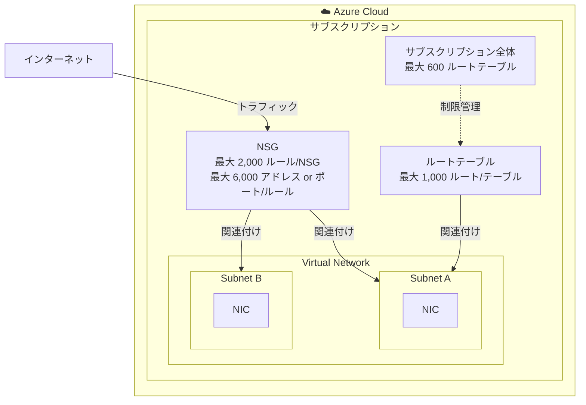

# Azure Virtual Network: NSG およびルートテーブルのデフォルト制限値の引き上げ

**リリース日**: 2026-05-19

**サービス**: Azure Virtual Network

**機能**: ネットワークセキュリティグループ (NSG) およびルートテーブルのデフォルトプラットフォーム制限値の増加

**ステータス**: Launched (GA)

[このアップデートのインフォグラフィックを見る](https://takech9203.github.io/azure-news-summary/20260519-virtual-network-nsg-route-table-limits.html)

## 概要

Azure Virtual Network において、ネットワークセキュリティグループ (NSG) およびルートテーブルに関するデフォルトプラットフォーム制限値が大幅に引き上げられた。これにより、サポートリクエストによる制限値の引き上げ申請を行うことなく、より大規模なネットワーク構成をデフォルトで展開可能になる。

新しいデフォルト制限値は以下の通りである:
- NSG あたりのセキュリティルール数: 2,000
- NSG ルールあたりのアドレスまたはポート数: 6,000
- ルートテーブルあたりのルート数: 1,000
- サブスクリプションあたりのルートテーブル数: 600

大規模なエンタープライズ環境やマイクロサービスアーキテクチャにおいて、複雑なネットワークセキュリティポリシーやルーティング構成が必要となるケースが増加しており、従来のデフォルト制限値では不十分な場面が多く発生していた。今回の引き上げにより、多くのシナリオでサポートリクエストなしに要件を満たすことが可能になる。

**アップデート前の課題**

- NSG あたりのセキュリティルールのデフォルト上限が 200 であり、大規模環境ではすぐに上限に達していた
- ルートテーブルあたりのルート数のデフォルト上限が 400、サブスクリプションあたりのルートテーブル数が 200 であり、複雑なルーティング要件に対応するにはサポートリクエストが必要だった
- 制限値の引き上げ申請には時間がかかり、環境構築のスピードに影響を与えていた

**アップデート後の改善**

- NSG あたり 2,000 セキュリティルールがデフォルトで利用可能となり、きめ細かいアクセス制御が即座に構成可能
- NSG ルールあたり 6,000 のアドレスまたはポートを指定可能となり、大規模な IP レンジやポート範囲を 1 つのルールでカバー可能
- ルートテーブルあたり 1,000 ルートがデフォルトで利用可能となり、複雑なハイブリッドネットワーク環境に対応
- サブスクリプションあたり 600 ルートテーブルが利用可能となり、マルチ VNet 環境でのルーティング管理が容易に

## アーキテクチャ図

この図は、Azure Virtual Network 内での NSG とルートテーブルの関係を示している。NSG はサブネットまたは NIC に関連付けられ、ルートテーブルはサブネットに関連付けられる。今回のアップデートにより、各リソースのデフォルト制限値が大幅に引き上げられた。

## サービスアップデートの詳細

### 主要機能

1. **NSG セキュリティルール数の引き上げ**
   - デフォルト上限が 2,000 ルール/NSG に増加
   - 従来のデフォルト (200) から 10 倍に拡大
   - きめ細かいネットワークアクセス制御が追加の申請なしに構成可能

2. **NSG ルールあたりのアドレス/ポート数の引き上げ**
   - デフォルト上限が 6,000 アドレスまたはポート/ルール に増加
   - 大規模な IP アドレスリストやポート範囲をより柔軟に指定可能

3. **ルートテーブルあたりのルート数の引き上げ**
   - デフォルト上限が 1,000 ルート/テーブル に増加
   - 従来のデフォルト (400) から 2.5 倍に拡大
   - 複雑なハイブリッドネットワーク環境でのルーティング要件に対応

4. **サブスクリプションあたりのルートテーブル数の引き上げ**
   - デフォルト上限が 600 ルートテーブル/サブスクリプション に増加
   - 従来のデフォルト (200) から 3 倍に拡大
   - マルチ VNet 環境での大規模なルーティング管理が容易に

## 技術仕様

| 項目 | 旧デフォルト制限値 | 新デフォルト制限値 | 増加倍率 |
|------|------|------|------|
| セキュリティルール/NSG | 200 | 2,000 | 10 倍 |
| アドレスまたはポート/NSG ルール | - | 6,000 | - |
| ルート/ルートテーブル | 400 | 1,000 | 2.5 倍 |
| ルートテーブル/サブスクリプション | 200 | 600 | 3 倍 |

## メリット

### ビジネス面

- **環境構築のスピード向上**: サポートリクエストによる制限値引き上げ申請が不要になるケースが増え、プロジェクトの展開スピードが向上する
- **運用負荷の軽減**: 制限値の管理やサポートチケットの追跡といった運用作業が削減される
- **大規模展開の容易化**: エンタープライズ規模のネットワーク構成をデフォルト設定のまま展開可能

### 技術面

- **きめ細かいセキュリティポリシーの実装**: 2,000 ルール/NSG により、ゼロトラストモデルに基づく詳細なアクセス制御が容易に実装可能
- **複雑なルーティングの実現**: 1,000 ルート/テーブルにより、オンプレミスとのハイブリッド接続や複数 NVA を経由する複雑なトラフィックフローに対応
- **スケーラブルなネットワーク設計**: サブスクリプション内で 600 のルートテーブルを利用可能なため、VNet ごとに最適化されたルーティングを個別に構成可能
- **ルールの統合**: 6,000 アドレス/ポートを 1 ルールに集約できるため、ルール数を節約しつつ広範なアクセス制御が可能

## デメリット・制約事項

- 制限値の引き上げはデフォルト値の変更であり、既存のサブスクリプションへの適用タイミングは段階的に行われる可能性がある
- NSG ルール数が増加しても、ルールの評価順序 (優先度) の管理が複雑になるため、適切な命名規則とドキュメント化が重要である
- 大量のルールやルートを構成した場合、ネットワークのトラブルシューティングが難しくなる可能性がある
- リソースの制限値が増えても、ネットワークパフォーマンスへの影響を考慮した設計は引き続き必要である

## ユースケース

### ユースケース 1: 大規模エンタープライズのマイクロセグメンテーション

**シナリオ**: 数百のアプリケーションが稼働するエンタープライズ環境で、ゼロトラストネットワークモデルに基づき、アプリケーション間の通信を細かく制御する。各アプリケーションに対して送信元/送信先の IP アドレスとポートを明示的に許可するルールを NSG に構成する。

**効果**: NSG あたり 2,000 ルールが利用可能なため、数百のアプリケーション間通信ルールをサポートリクエストなしに即座に構成可能。ルールあたり 6,000 アドレスにより、大規模なアプリケーショングループも 1 つのルールでカバーできる。

### ユースケース 2: ハイブリッドネットワーク環境での複雑なルーティング

**シナリオ**: オンプレミスの複数拠点と Azure を ExpressRoute および VPN Gateway で接続し、Network Virtual Appliance (NVA) 経由でトラフィックを制御するハイブリッド環境。各拠点の CIDR ブロックに対する個別のルートが必要となる。

**効果**: ルートテーブルあたり 1,000 ルートにより、数百の拠点向けルートを 1 つのテーブルで管理可能。サブスクリプションあたり 600 テーブルにより、サブネットごとに最適化されたルーティングを個別に構成できる。

### ユースケース 3: マルチテナント SaaS プラットフォーム

**シナリオ**: SaaS プロバイダーが顧客ごとに分離された VNet を持ち、各テナントのネットワークに固有のセキュリティルールとルーティングを適用する。テナント数の増加に伴いルートテーブル数が増加する。

**効果**: 600 ルートテーブル/サブスクリプションにより、より多くのテナントを単一サブスクリプション内で管理可能。サポートリクエストなしにスケールできるため、テナントのオンボーディングが高速化される。

## 料金

今回のデフォルト制限値の引き上げに伴う追加料金は発生しない。Azure Virtual Network、NSG、およびルートテーブルの利用自体は無料であり、今回の変更は既存の料金体系に影響を与えない。

ただし、Virtual Network に関連するリソース (VPN Gateway、ExpressRoute、NAT Gateway、Load Balancer など) には個別の料金が適用される。

## 利用可能リージョン

Azure Virtual Network はすべての Azure パブリックリージョンで利用可能であり、今回のデフォルト制限値の引き上げもすべてのリージョンに適用される。

## 関連サービス・機能

- **Azure Network Security Group (NSG)**: サブネットまたは NIC レベルでのネットワークトラフィックフィルタリング。今回のアップデートの直接の対象
- **Azure Route Table (UDR)**: カスタムルーティングの定義。今回のアップデートの直接の対象
- **Azure Virtual Network Manager**: 大規模な VNet 管理とセキュリティポリシーの一元管理。NSG ルールの増加と組み合わせてより効果的に活用可能
- **Azure Firewall**: マネージドファイアウォールサービス。NSG と組み合わせた多層防御アーキテクチャで利用される
- **Azure Network Watcher**: ネットワーク監視・診断ツール。NSG フローログやルートのトラブルシューティングに活用

## 参考リンク

- [インフォグラフィック](https://takech9203.github.io/azure-news-summary/20260519-virtual-network-nsg-route-table-limits.html)
- [公式アップデート情報](https://azure.microsoft.com/updates?id=562695)
- [Azure サブスクリプションとサービスの制限 - ネットワーク - Microsoft Learn](https://learn.microsoft.com/azure/azure-resource-manager/management/azure-subscription-service-limits#networking-limits)
- [Azure Virtual Network の概要 - Microsoft Learn](https://learn.microsoft.com/azure/virtual-network/virtual-networks-overview)
- [ネットワークセキュリティグループ - Microsoft Learn](https://learn.microsoft.com/azure/virtual-network/network-security-groups-overview)
- [仮想ネットワークトラフィックのルーティング - Microsoft Learn](https://learn.microsoft.com/azure/virtual-network/virtual-networks-udr-overview)

## まとめ

Azure Virtual Network の NSG およびルートテーブルに関するデフォルトプラットフォーム制限値が大幅に引き上げられた。NSG あたりのセキュリティルールは 10 倍の 2,000 に、ルートテーブルあたりのルート数は 2.5 倍の 1,000 に、サブスクリプションあたりのルートテーブル数は 3 倍の 600 にそれぞれ増加した。これにより、大規模なエンタープライズ環境やマイクロサービスアーキテクチャにおいて、サポートリクエストによる制限値引き上げ申請を行うことなく、複雑なネットワークセキュリティポリシーやルーティング構成をデフォルトで展開可能になる。追加料金は発生しないため、既存のすべてのユーザーが恩恵を受けることができる。

---

**タグ**: `Azure Virtual Network` `NSG` `Route Table` `Networking` `Limits` `GA` `Security`
