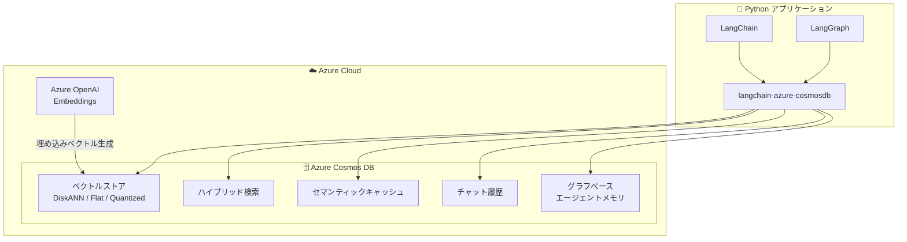

# Azure Cosmos DB: langchain-azure-cosmosdb Python パッケージの一般提供開始

**リリース日**: 2026-05-20

**サービス**: Azure Cosmos DB

**機能**: langchain-azure-cosmosdb Python パッケージ (LangChain / LangGraph 統合)

**ステータス**: Launched (GA)

[このアップデートのインフォグラフィックを見る](https://takech9203.github.io/azure-news-summary/20260520-cosmosdb-langchain-python-package.html)

## 概要

Azure Cosmos DB 向けの新しい Python パッケージ「langchain-azure-cosmosdb」が一般提供 (GA) となった。このパッケージは LangChain および LangGraph フレームワークとの統合を提供し、Azure Cosmos DB をベクトル検索・ハイブリッド検索、セマンティックキャッシュ、チャット履歴管理、グラフベースのエージェントメモリとして直接利用できるようにする。

これにより、AI アプリケーションやエージェントアプリケーションの開発者は、本番環境レベルのアプリケーションをより迅速に構築できるようになる。従来は個別のベクトルデータベースやキャッシュシステムを組み合わせる必要があった構成を、Azure Cosmos DB 単体で実現できる点が大きな特徴である。

**アップデート前の課題**

- AI エージェントのメモリシステム構築に、ベクトルデータベース・リレーショナルデータベース・インメモリキャッシュなど複数の独立したデータベースを組み合わせる必要があった
- LangChain/LangGraph から Azure Cosmos DB を利用するための統合的なパッケージが存在せず、個別にコネクタを実装する必要があった
- セマンティックキャッシュやチャット履歴管理を別途実装・運用する必要があった

**アップデート後の改善**

- 単一の Python パッケージで Azure Cosmos DB のベクトル検索、ハイブリッド検索、セマンティックキャッシュ、チャット履歴、グラフベースメモリを一元的に利用可能
- LangChain/LangGraph のエコシステムとネイティブに統合され、既存のフレームワークのワークフローにシームレスに組み込み可能
- 複数の独立したデータベースを不要にし、アーキテクチャの簡素化とデータ一貫性を実現

## アーキテクチャ図



langchain-azure-cosmosdb パッケージが LangChain/LangGraph フレームワークと Azure Cosmos DB の各機能を橋渡しする構成を示す。Azure OpenAI Embeddings でベクトルを生成し、Cosmos DB のベクトルストアに格納する。

## サービスアップデートの詳細

### 主要機能

1. **ベクトル検索・ハイブリッド検索**
   - Azure Cosmos DB for NoSQL の統合ベクトルデータベース機能を LangChain のベクトルストアインターフェースとして利用可能
   - DiskANN、quantizedFlat、flat の 3 種類のベクトルインデックスに対応
   - WHERE 句との組み合わせによるハイブリッド検索をサポート

2. **セマンティックキャッシュ**
   - LLM への問い合わせ結果をベクトル類似度に基づいてキャッシュ
   - 類似の質問に対して LLM 呼び出しを省略し、低レイテンシで応答を返却
   - Azure Cosmos DB の低レイテンシ (ミリ秒単位) とグローバル分散特性を活用

3. **チャット履歴管理**
   - LangChain のメッセージ履歴インターフェースとして Azure Cosmos DB を使用
   - 会話コンテキストの永続化と取得を実現
   - マルチセッション対応

4. **グラフベースのエージェントメモリ**
   - LangGraph のステートフルエージェントにおける永続メモリとして機能
   - エージェントの学習・記憶・推論をサポートするグラフ構造データの管理
   - マルチエージェントシステムにおける共有メモリとしても利用可能

## 技術仕様

| 項目 | 詳細 |
|------|------|
| パッケージ名 | langchain-azure-cosmosdb |
| 対応フレームワーク | LangChain, LangGraph |
| 言語 | Python |
| ベクトルインデックス種類 | flat (最大 505 次元), quantizedFlat (最大 4,096 次元), diskANN (最大 4,096 次元) |
| サポートされるデータ型 | float32, float16, int8, uint8 |
| 距離関数 | cosine, dot product, euclidean |
| 対象 API | Azure Cosmos DB for NoSQL |
| quantizedFlat/diskANN の最小ベクトル数 | 1,000 |

## メリット

### ビジネス面

- 複数のデータベースサービスを統合することで、インフラコストと運用コストを削減
- 本番環境レベルの AI アプリケーション開発のタイムトゥマーケットを短縮
- Azure Cosmos DB の 99.999% SLA をそのまま AI アプリケーションに適用可能

### 技術面

- 単一のデータストアでベクトル、メタデータ、履歴データを一元管理でき、データ一貫性を確保
- DiskANN アルゴリズムによる高精度・低レイテンシのベクトル検索
- グローバル分散と自動スケーリングにより、AI エージェントのスケーラビリティを担保
- LangChain/LangGraph のエコシステムと標準インターフェースで統合されているため、学習コストが低い
- セマンティックキャッシュにより LLM API 呼び出しコストとレイテンシを削減

## デメリット・制約事項

- quantizedFlat および diskANN インデックスは正確な量子化のために最低 1,000 ベクトルが必要 (それ未満の場合はフルスキャンが実行される)
- flat インデックスの最大次元数は 505 に制限される
- 大量のベクトル挿入 (500 万超) は短期間に行うとインデックス構築時間が延長される可能性がある
- 共有スループット (Shared Throughput) アカウントではベクトル検索がサポートされない
- コンテナでベクトルインデックスを有効化した後は無効化できない
- Python のみ対応 (他言語の SDK は現時点で未確認)

## ユースケース

### ユースケース 1: RAG (検索拡張生成) アプリケーション

**シナリオ**: 社内ドキュメントを基に質問応答する AI チャットボットの構築

**実装例**:

```python
from langchain_azure_cosmosdb import AzureCosmosDBNoSQLVectorSearch

# ベクトルストアとして Cosmos DB を利用
vector_store = AzureCosmosDBNoSQLVectorSearch(
    connection_string="<connection_string>",
    database_name="rag_db",
    container_name="documents",
    embedding=embeddings
)

# ハイブリッド検索で関連文書を取得
retriever = vector_store.as_retriever()
```

**効果**: 単一のデータストアでドキュメントとベクトルを管理し、低レイテンシで関連情報を取得

### ユースケース 2: 自律型 AI エージェント

**シナリオ**: LangGraph で構築するステートフルなカスタマーサポートエージェント

**効果**: グラフベースメモリにより、エージェントが過去のインタラクションを記憶し、コンテキストに基づいた応答を継続的に改善

### ユースケース 3: LLM レスポンスのセマンティックキャッシュ

**シナリオ**: 高トラフィックの AI アプリケーションで類似クエリへの応答をキャッシュ

**効果**: LLM API 呼び出し回数を大幅に削減し、コスト削減とレスポンス時間の改善を実現

## 料金

langchain-azure-cosmosdb パッケージ自体は OSS であり無料で利用可能。Azure Cosmos DB の利用料金が別途発生する。

Azure Cosmos DB for NoSQL の料金体系:
- **サーバーレスモード**: 実行した操作の RU (Request Unit) 数に基づく従量課金
- **プロビジョニングスループット**: 事前に RU/s を確保する固定課金
- **Reserved Capacity**: 1 年または 3 年の予約で割引適用

詳細は [Azure Cosmos DB 料金ページ](https://azure.microsoft.com/pricing/details/cosmos-db/) を参照。

## 関連サービス・機能

- **Azure OpenAI Service**: 埋め込みベクトル (Embeddings) の生成に使用。text-embedding-ada-002 や text-embedding-3-small/large などのモデルを利用
- **Azure Cosmos DB for NoSQL ベクトル検索**: 本パッケージの基盤となるベクトルデータベース機能。DiskANN ベースの高性能インデックスを提供
- **LangChain / LangGraph**: 本パッケージが統合する AI アプリケーション開発フレームワーク
- **Azure AI Foundry**: Azure 上の AI アプリケーション開発プラットフォーム。エージェント構築の基盤として Cosmos DB と連携可能

## 参考リンク

- [インフォグラフィック](https://takech9203.github.io/azure-news-summary/20260520-cosmosdb-langchain-python-package.html)
- [公式アップデート情報](https://azure.microsoft.com/updates?id=562074)
- [Microsoft Learn - Azure Cosmos DB ベクトルデータベース](https://learn.microsoft.com/en-us/azure/cosmos-db/vector-database)
- [Microsoft Learn - Azure Cosmos DB ベクトル検索](https://learn.microsoft.com/en-us/azure/cosmos-db/vector-search)
- [Microsoft Learn - Azure Cosmos DB AI エージェント](https://learn.microsoft.com/en-us/azure/cosmos-db/ai-agents)
- [料金ページ](https://azure.microsoft.com/pricing/details/cosmos-db/)

## まとめ

langchain-azure-cosmosdb パッケージの GA により、Azure Cosmos DB が LangChain/LangGraph エコシステムにおけるファーストクラスのバックエンドとなった。Solutions Architect にとって重要なポイントは、従来複数の独立したデータベース (ベクトル DB、キャッシュ、オペレーショナル DB) を組み合わせていた AI エージェントのメモリシステムを、Azure Cosmos DB 単体で統合できるようになった点である。

推奨される次のアクション:
- 既存の AI アプリケーションで個別のベクトルデータベースを使用している場合、Azure Cosmos DB への統合を検討する
- LangChain/LangGraph を使用した新規 AI エージェント開発では、本パッケージの採用を検討する
- セマンティックキャッシュの導入により LLM API コストの最適化を図る

---

**タグ**: #Azure #CosmosDB #LangChain #LangGraph #VectorSearch #AI #Python #SemanticCache
