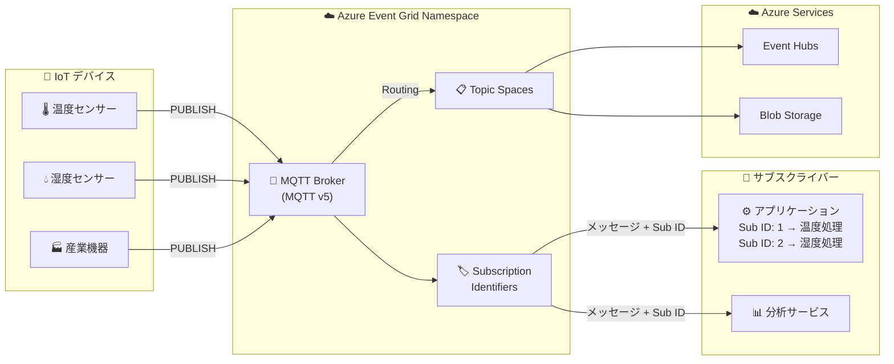

# Azure Event Grid: MQTT 機能拡張と Subscription Identifiers

**リリース日**: 2026-05-20

**サービス**: Azure Event Grid

**機能**: MQTT 機能拡張 (2026 年 4 月リリース) および Subscription Identifiers

**ステータス**: Launched (GA) / In preview

[このアップデートのインフォグラフィックを見る](https://takech9203.github.io/azure-news-summary/20260520-event-grid-mqtt-subscription-identifiers.html)

## 概要

Azure Event Grid Namespaces の MQTT ブローカー機能に関する 2 つのアップデートが発表された。1 つ目は、2026 年 4 月の MQTT 機能拡張の一般提供 (GA) であり、MQTT V5 標準に基づくリアルタイムソリューションの構築を支援する機能強化が含まれる。2 つ目は、MQTT 5 の Subscription Identifiers 機能のパブリックプレビューである。

これらのアップデートにより、IoT デバイスのレスポンシブなエクスペリエンスの提供、バックエンド統合の簡素化、成長する IoT エコシステムのサポートが容易になる。特に Subscription Identifiers は、複数のサブスクリプションを管理するクライアントがメッセージのルーティングを効率化するための重要な機能である。

**アップデート前の課題**

- MQTT クライアントが複数のサブスクリプションを持つ場合、受信メッセージがどのサブスクリプションに対応するかを特定するために、クライアント側で複雑なトピック文字列マッチングロジックが必要だった
- クライアント側の処理が複雑化し、特にオーバーラップするトピックフィルターを使用する高度な MQTT シナリオでの開発コストが高かった
- IoT エコシステムの拡大に伴い、デバイスのスケーラビリティとバックエンド統合の簡素化が求められていた

**アップデート後の改善**

- Subscription Identifiers により、各サブスクリプションに一意の数値 ID を割り当て、ブローカーがメッセージ配信時にその ID を含めることで、クライアント側でのメッセージ識別が即座に可能になった
- クライアント側の複雑なトピックマッチングロジックが不要になり、処理の簡素化と高速化が実現
- MQTT V5 標準に基づく機能拡張により、スケーラブルな IoT ソリューションの構築が容易になった

## アーキテクチャ図

IoT デバイスが MQTT ブローカーにメッセージを発行し、Subscription Identifiers によりサブスクライバーが各メッセージの対応するサブスクリプションを即座に識別できる。また、メッセージはルーティング機能を通じて Azure サービスに転送可能。

## サービスアップデートの詳細

### 主要機能

1. **Subscription Identifiers (プレビュー)**
   - MQTT 5 クライアントが各サブスクリプションに一意の数値 ID を割り当て可能
   - ブローカーがメッセージ配信時にマッチしたサブスクリプションの ID を含める
   - 複数またはオーバーラップするトピックフィルターを使用する場合に特に有効
   - クライアント側での複雑なトピックマッチングロジックが不要になる

2. **MQTT 機能拡張 (2026 年 4 月 GA)**
   - MQTT V5 標準に基づくスケーラブルなリアルタイムソリューション構築の支援
   - レスポンシブなデバイスエクスペリエンスの提供
   - バックエンド統合の簡素化
   - 成長する IoT エコシステムのサポート

3. **Shared Subscriptions**
   - 複数のクライアントが単一のサブスクリプションからグループとしてメッセージを消費
   - ブローカーがメッセージをロードバランスで分配
   - 水平スケーラブルなコンシューマーアプリケーションの構築を支援

4. **MQTT Retain**
   - ブローカーがトピック上の最後のメッセージを保存し、新規サブスクライバーに自動配信
   - デバイスが次の更新を待たずに最新の既知状態を即座に取得可能

## 技術仕様

| 項目 | 詳細 |
|------|------|
| サポートプロトコル | MQTT v3.1.1, MQTT v5, WebSocket 対応 |
| 接続ポート | TCP 8883 (MQTT), TCP 443 (WebSocket) |
| TLS 要件 | TLS 1.2 または TLS 1.3 必須 |
| QoS レベル | QoS 0 (at-most-once), QoS 1 (at-least-once) |
| 最大パケットサイズ | 512 KiB |
| トピックエイリアス上限 | 10 |
| Keep Alive 最大値 | 1,160 秒 |
| セッション有効期限 | 最大 8 時間 (設定可能) |
| セッションキュー上限 | 100 メッセージまたは 1 MB |
| Subscription Identifiers | MQTT 5 のみ対応 (プレビュー) |
| 認証方式 | X.509 証明書, Microsoft Entra ID, OAuth 2.0 JWT, カスタム Webhook |

## メリット

### ビジネス面

- IoT ソリューションの開発コスト削減: クライアント側のメッセージ処理ロジックの簡素化により開発工数を短縮
- スケーラブルな IoT エコシステム: 数百万のデバイス接続をサポートし、ビジネスの成長に対応
- リアルタイムデータ活用: レスポンシブなデバイスエクスペリエンスにより顧客満足度向上
- 自動車・モビリティ・製造業向けの参照アーキテクチャによる迅速な導入

### 技術面

- Subscription Identifiers により、クライアント側のトピックマッチングロジックが不要になり処理が高速化
- Shared Subscriptions によるロードバランスで、バックエンド処理のスケールアウトが容易
- MQTT V5 標準準拠により、既存の MQTT クライアントライブラリとの互換性を確保
- Azure IoT Operations (Edge) との統合により、クラウドとエッジのシームレスな接続を実現
- Microsoft Fabric eventstreams へのルーティングによりリアルタイム分析が可能

## デメリット・制約事項

- QoS 2 は未サポート (QoS 0 と QoS 1 のみ)
- Subscription Identifiers は MQTT 5 のみ対応 (MQTT v3.1.1 では使用不可)
- Subscription Identifiers は現在プレビュー段階であり、本番環境での利用は慎重な検討が必要
- 最大パケットサイズが 512 KiB に制限されている
- トピックエイリアスは最大 10 個まで
- CONNECT, SUBSCRIBE, DISCONNECT, PUBACK, AUTH パケットのユーザープロパティはサポートされない
- Keep Alive の最大値は 1,160 秒

## ユースケース

### ユースケース 1: スマートホームモニタリング

**シナリオ**: 1 つのクライアントアプリケーションが異なる種類のセンサーデータを監視する場合

- Subscription ID 1: `home/livingroom/temperature` (温度データ)
- Subscription ID 2: `home/+/humidity` (湿度データ)

ブローカーがメッセージ配信時に Subscription ID を含めるため、クライアントはトピック文字列を解析せずに ID ベースでメッセージを適切なハンドラーにルーティングできる。

**効果**: クライアント側の処理ロジックがシンプルになり、メンテナンス性が向上

### ユースケース 2: 産業 IoT のテレメトリ処理

**シナリオ**: 製造ラインの複数の機器からテレメトリデータを収集し、Shared Subscriptions で複数のバックエンドワーカーに分散処理する

**効果**: 水平スケーリングによる高スループットの実現と、障害時の可用性確保

### ユースケース 3: コネクテッドカーのリアルタイム通信

**シナリオ**: 車両フリートからのリアルタイムテレメトリ収集と、バックエンドからのコマンド配信を MQTT v5 の Request-Response パターンで実現

**効果**: 双方向通信による車両制御とデータ収集の統合

## 料金

Azure Event Grid MQTT ブローカーの料金詳細は [Azure Event Grid 料金ページ](https://azure.microsoft.com/pricing/details/event-grid/) を参照。

## 関連サービス・機能

- **Azure IoT Operations**: Edge MQTT ブローカーとの統合により、エッジからクラウドへのシームレスな MQTT 通信を実現
- **Azure Event Hubs**: MQTT メッセージのルーティング先としてストリーム処理に活用
- **Azure Stream Analytics**: Event Hubs 経由で IoT テレメトリのリアルタイム分析を実行
- **Microsoft Fabric eventstreams**: MQTT メッセージを直接ルーティングしてリアルタイム分析・可視化
- **Azure Functions / Logic Apps**: HTTP Publish 機能により MQTT 非対応のサービスからもメッセージ発行が可能

## 参考リンク

- [インフォグラフィック](https://takech9203.github.io/azure-news-summary/20260520-event-grid-mqtt-subscription-identifiers.html)
- [公式アップデート情報 (MQTT GA)](https://azure.microsoft.com/updates?id=562240)
- [公式アップデート情報 (Subscription Identifiers)](https://azure.microsoft.com/updates?id=562970)
- [Microsoft Learn - MQTT Broker 概要](https://learn.microsoft.com/azure/event-grid/mqtt-overview)
- [Microsoft Learn - MQTT サポート機能](https://learn.microsoft.com/azure/event-grid/mqtt-support)
- [Microsoft Learn - MQTT Publish and Subscribe](https://learn.microsoft.com/azure/event-grid/mqtt-publish-and-subscribe-portal)
- [料金ページ](https://azure.microsoft.com/pricing/details/event-grid/)
- [コードサンプル (GitHub)](https://github.com/Azure-Samples/MqttApplicationSamples)

## まとめ

Azure Event Grid MQTT ブローカーの 2026 年 4 月リリースおよび Subscription Identifiers のプレビューは、IoT ソリューションの構築を大幅に簡素化するアップデートである。特に Subscription Identifiers は、複数のサブスクリプションを管理する MQTT 5 クライアントにとって、メッセージ処理の効率化に直結する重要な機能である。

Solutions Architect として推奨されるアクション:
- MQTT 5 を使用している既存の IoT アーキテクチャで Subscription Identifiers のプレビュー評価を検討する
- Shared Subscriptions と組み合わせたスケーラブルなメッセージ処理パターンの設計を検討する
- GA 機能については本番環境への適用を、プレビュー機能については検証環境でのテストを開始する

---

**タグ**: #Azure #EventGrid #MQTT #IoT #Messaging #SubscriptionIdentifiers
