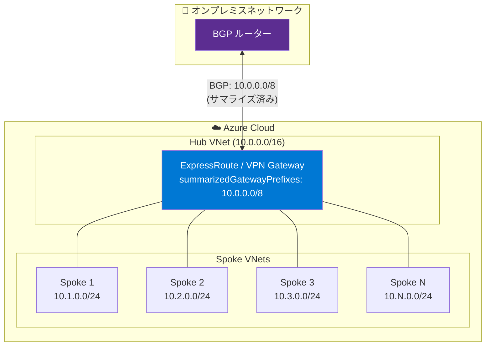

# Azure Virtual Network: Summarized Advertised Gateway Prefixes for Route Advertisement

**リリース日**: 2026-05-20

**サービス**: Azure Virtual Network / Azure ExpressRoute / VPN Gateway

**機能**: Summarized Advertised Gateway Prefixes for Route Advertisement

**ステータス**: In preview

[このアップデートのインフォグラフィックを見る](https://takech9203.github.io/azure-news-summary/20260520-gateway-summarized-route-prefixes.html)

## 概要

Azure Virtual Network の `summarizedGatewayPrefixes` プロパティを使用して、Azure ゲートウェイ (ExpressRoute Gateway および VPN Gateway) がオンプレミスネットワークに対してアドバタイズするルートを集約 (サマライズ) できる機能がパブリックプレビューとして提供開始された。

従来、Azure ゲートウェイはハブ仮想ネットワークのアドレス空間およびピアリングされたすべてのスポーク仮想ネットワークのアドレス空間を個別にオンプレミスへアドバタイズしていた。この機能により、管理者は集約された CIDR プレフィックスを定義し、個別のプレフィックスの代わりにサマライズされたプレフィックスのみをアドバタイズすることが可能になる。

**アップデート前の課題**

- ハブ&スポーク構成で多数のスポーク VNet がある場合、すべての個別プレフィックスがオンプレミスにアドバタイズされ、オンプレミスルーターのルーティングテーブルが肥大化していた
- ExpressRoute のアドバタイズプレフィックス上限 (IPv4: 1,000、IPv6: 100) に近づく・超過するリスクがあった
- プレフィックス数が上限を超えると BGP セッションがドロップされ、接続断が発生していた
- オンプレミス側のルーターでのルート管理が複雑化していた

**アップデート後の改善**

- サマライズされたプレフィックス (例: /16) を定義することで、多数の小さなプレフィックス (例: 複数の /24) の代わりに 1 つの集約ルートのみをアドバタイズ可能に
- ExpressRoute のプレフィックス上限への到達リスクを大幅に低減
- オンプレミスルーターのルーティングテーブルサイズを削減し、ルーティング効率を向上
- ゲートウェイが存在しない仮想ネットワークにも事前にプロパティを設定可能 (ゲートウェイ作成後に有効化)

## アーキテクチャ図

従来はスポーク VNet ごとに個別のプレフィックス (/24 x N) がアドバタイズされていたが、`summarizedGatewayPrefixes` を設定することで、1 つの集約プレフィックス (10.0.0.0/8) のみがオンプレミスにアドバタイズされる。

## サービスアップデートの詳細

### 主要機能

1. **サマライズされたプレフィックスの定義**
   - 仮想ネットワークの `summarizedGatewayPrefixes` プロパティに集約 CIDR プレフィックスのリストを設定
   - 設定されたプレフィックスがゲートウェイからオンプレミスへアドバタイズされる

2. **スポーク VNet アドレス空間の自動抑制**
   - ピアリングされたスポーク VNet のアドレス空間がサマライズプレフィックスにカバーされている場合、個別のスポークアドレス空間のアドバタイズが自動的に抑制される

3. **ExpressRoute Gateway と VPN Gateway の両方に対応**
   - 同一のプロパティ設定で ExpressRoute Gateway と VPN Gateway の両方のアドバタイズ動作を制御可能

4. **事前設定サポート**
   - ゲートウェイサブネットやゲートウェイが存在しない仮想ネットワークにもプロパティを設定可能 (ゲートウェイ作成後に有効化)

## 技術仕様

| 項目 | 詳細 |
|------|------|
| プロパティ名 | `summarizedGatewayPrefixes` |
| 設定対象リソース | 仮想ネットワーク (ハブ VNet) |
| 対応ゲートウェイ | ExpressRoute Gateway、VPN Gateway |
| プレフィックス形式 | CIDR 表記 (例: 10.0.0.0/8) |
| Azure Route Server 必要性 | 不要 |
| ExpressRoute IPv4 プレフィックス上限 | 1,000 (Premium: 10,000) |
| ExpressRoute IPv6 プレフィックス上限 | 100 |

## 設定方法

### 前提条件

1. Azure 仮想ネットワーク (ハブ) が存在すること
2. ExpressRoute Gateway または VPN Gateway (設定自体はゲートウェイ不在でも可能だが、効果はゲートウェイ作成後)

### 動作の詳細

1. `summarizedGatewayPrefixes` を設定すると、ゲートウェイはハブ VNet のアドレス空間の代わりにサマライズプレフィックスをアドバタイズする
2. サマライズプレフィックスにはゲートウェイ仮想ネットワークのアドレス空間を含めること
3. スポーク VNet のアドレス空間がサマライズプレフィックスにカバーされている場合、スポークのアドレス空間はアドバタイズされない
4. サマライズプレフィックスのリスト内でプレフィックスが重複しないようにすること

## メリット

### ビジネス面

- ネットワーク管理の運用コスト削減: オンプレミスルーターの設定変更頻度が低下
- スケーラビリティの向上: スポーク VNet の追加時にオンプレミス側の変更が不要
- 接続安定性の向上: BGP セッションドロップのリスクを回避

### 技術面

- オンプレミスルーターのルーティングテーブルサイズ削減によるルーティングパフォーマンス向上
- ExpressRoute のアドバタイズプレフィックス上限 (1,000 IPv4) への到達を防止
- ハブ&スポーク設計の大規模展開が容易に
- BGP コンバージェンス時間の短縮

## デメリット・制約事項

- サマライズプレフィックスのリスト内でプレフィックスの重複は不可
- スポーク VNet のプロパティに設定しても無視される (ハブ VNet のみ有効)
- サマライズプレフィックスを適切に設計しないと、オンプレミスから Azure への到達性に影響が出る可能性がある
- パブリックプレビューのため、本番環境での利用は慎重に評価すること
- プレフィックスの集約はルーティングの粒度を下げるため、特定のスポーク VNet への細かいルーティング制御がオンプレミス側で困難になる可能性がある

## ユースケース

### ユースケース 1: 大規模ハブ&スポーク環境

**シナリオ**: 100 以上のスポーク VNet を持つエンタープライズ環境で、各スポークが /24 のアドレス空間を使用。ExpressRoute 経由でオンプレミスに接続。

**効果**: 100+ の個別 /24 プレフィックスの代わりに、1 つの /16 または /8 のサマライズプレフィックスをアドバタイズ。オンプレミスルーターのルーティングテーブルを大幅に削減し、ExpressRoute のプレフィックス上限に余裕を確保。

### ユースケース 2: マルチリージョン展開

**シナリオ**: 複数の Azure リージョンにハブ VNet を展開し、各リージョンに多数のスポーク VNet が存在。オンプレミスの BGP ルーターが受信できるプレフィックス数に制限がある。

**効果**: 各リージョンのハブにサマライズプレフィックスを設定し、リージョン単位で集約されたルート情報をオンプレミスにアドバタイズ。

### ユースケース 3: ExpressRoute Premium なしでのスケーリング

**シナリオ**: ExpressRoute Standard (1,000 プレフィックス上限) を使用しているが、スポーク VNet の増加によりプレフィックス上限に近づいている。Premium アドオンへのアップグレードコストを避けたい。

**効果**: サマライズプレフィックスを活用してアドバタイズ数を削減し、Standard SKU のまま運用を継続。

## 料金

この機能自体に追加料金は発生しない (Azure Virtual Network のプロパティ設定)。ただし、ExpressRoute Gateway および VPN Gateway の既存の料金体系が適用される。

- [ExpressRoute 料金](https://azure.microsoft.com/pricing/details/expressroute/)
- [VPN Gateway 料金](https://azure.microsoft.com/pricing/details/vpn-gateway/)

## 関連サービス・機能

- **Azure ExpressRoute**: プライベートピアリングでのルートアドバタイズメントの制御対象
- **Azure VPN Gateway**: BGP 経由でのルートアドバタイズメントの制御対象
- **Azure Virtual Network**: `summarizedGatewayPrefixes` プロパティの設定対象リソース
- **Azure Route Server**: 本機能では不要だが、NVA との BGP ルート交換に使用される関連サービス
- **Virtual Network Peering**: スポーク VNet のアドレス空間がサマライズ対象として評価される
- **BGP Communities**: ExpressRoute でのルートタグ付けと組み合わせて使用可能

## 参考リンク

- [インフォグラフィック](https://takech9203.github.io/azure-news-summary/20260520-gateway-summarized-route-prefixes.html)
- [公式アップデート情報](https://azure.microsoft.com/updates?id=562813)
- [Microsoft Learn - Advertised gateway prefixes overview](https://learn.microsoft.com/azure/virtual-network/advertised-gateway-prefixes-overview)
- [Microsoft Learn - ExpressRoute virtual network gateways](https://learn.microsoft.com/azure/expressroute/expressroute-about-virtual-network-gateways)
- [Microsoft Learn - Azure virtual network traffic routing](https://learn.microsoft.com/azure/virtual-network/virtual-networks-udr-overview)
- [Microsoft Learn - About BGP with VPN Gateway](https://learn.microsoft.com/azure/vpn-gateway/vpn-gateway-bgp-overview)
- [Microsoft Learn - ExpressRoute routing requirements](https://learn.microsoft.com/azure/expressroute/expressroute-routing)

## まとめ

Summarized Advertised Gateway Prefixes は、大規模なハブ&スポーク環境における BGP ルートアドバタイズメントの課題を解決する重要な機能である。`summarizedGatewayPrefixes` プロパティにより、Azure ゲートウェイがオンプレミスに対してアドバタイズするプレフィックスを集約し、ルーティングテーブルの肥大化や ExpressRoute プレフィックス上限への到達を防止できる。

Solutions Architect としての推奨アクション:
- 現在のハブ&スポーク環境でアドバタイズされているプレフィックス数を確認する
- ExpressRoute のプレフィックス上限 (1,000) に近づいている場合は、本機能の評価を開始する
- IP アドレス設計がサマライズに適した CIDR ブロックで構成されているか確認する
- パブリックプレビュー段階のため、非本番環境での検証を推奨

---

**タグ**: #Azure #ExpressRoute #VPNGateway #Networking #RouteAdvertisement #BGP #HubAndSpoke #VirtualNetwork
