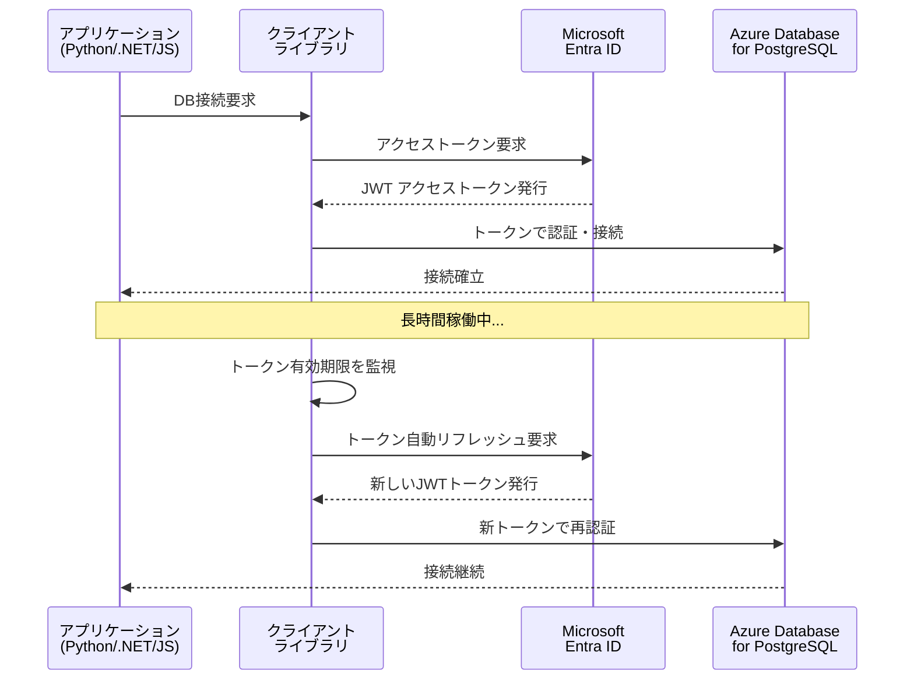

# Azure Database for PostgreSQL: Microsoft Entra ID トークンリフレッシュサポート (Python, .NET, JavaScript)

**リリース日**: 2026-05-20

**サービス**: Azure Database for PostgreSQL

**機能**: Microsoft Entra ID token refresh support for Python, .NET, and JavaScript

**ステータス**: In preview

[このアップデートのインフォグラフィックを見る](https://takech9203.github.io/azure-news-summary/20260520-postgresql-entra-id-token-refresh.html)

## 概要

Azure Database for PostgreSQL において、Python、.NET、JavaScript のクライアントライブラリで Microsoft Entra ID トークンの自動リフレッシュがサポートされるようになった。これにより、アプリケーション側でトークンの有効期限管理を手動で実装する必要がなくなり、認証処理が大幅に簡素化される。

従来、Microsoft Entra ID を使用した Azure Database for PostgreSQL への接続では、アクセストークンの有効期限 (ユーザートークンは最大 1 時間、マネージド ID トークンは最大 24 時間) を開発者が自ら管理し、期限切れ前にトークンを再取得するロジックを実装する必要があった。本アップデートにより、クライアントライブラリがトークンのライフサイクルを自動的に管理し、透過的にリフレッシュを行う。

**アップデート前の課題**

- アプリケーション開発者がトークンの有効期限を手動で追跡し、期限切れ前にリフレッシュするロジックを実装する必要があった
- トークン期限切れによる接続エラーが長時間稼働するアプリケーションで発生するリスクがあった
- 各プログラミング言語で個別にトークンリフレッシュのボイラープレートコードを記述する必要があった
- トークン管理の実装ミスによるセキュリティリスクや可用性の低下が起こりうる状態だった

**アップデート後の改善**

- Python、.NET、JavaScript のクライアントライブラリがトークンリフレッシュを自動的に処理
- 長時間稼働するアプリケーションでもトークン期限切れによる接続断が発生しない
- 開発者はビジネスロジックに集中でき、認証周りのコード量が削減される
- トークン管理のベストプラクティスがライブラリレベルで実装される

## アーキテクチャ図



アプリケーションが接続を確立した後、クライアントライブラリがバックグラウンドでトークンの有効期限を監視し、期限切れ前に自動的に Microsoft Entra ID から新しいトークンを取得して接続を維持する。

## サービスアップデートの詳細

### 主要機能

1. **自動トークンリフレッシュ**
   - クライアントライブラリがトークンの有効期限を監視し、期限切れ前に自動的にリフレッシュを実行
   - アプリケーションコードの変更を最小限に抑えながら、シームレスなトークン更新を実現

2. **マルチ言語サポート**
   - Python、.NET、JavaScript の 3 つの主要言語でサポート
   - 各言語のエコシステムに合わせたネイティブな実装

3. **Microsoft Entra ID との統合**
   - マネージド ID、サービスプリンシパル、ユーザー認証など、既存の Microsoft Entra ID 認証方式と互換
   - Azure Identity ライブラリ (DefaultAzureCredential) との連携

## 技術仕様

| 項目 | 詳細 |
|------|------|
| 対象サービス | Azure Database for PostgreSQL Flexible Server |
| サポート言語 | Python, .NET, JavaScript |
| ステータス | パブリックプレビュー |
| ユーザートークン有効期限 | 最大 1 時間 |
| マネージド ID トークン有効期限 | 最大 24 時間 |
| 認証プロトコル | OAuth 2.0 / JWT |
| トークンリソース URI | `https://ossrdbms-aad.database.windows.net/.default` |

## 設定方法

### 前提条件

1. Azure Database for PostgreSQL Flexible Server インスタンスで Microsoft Entra 認証が有効化されていること
2. Microsoft Entra 管理者が構成されていること
3. 対象のマネージド ID またはサービスプリンシパルがデータベースロールとして作成されていること

### データベースロールの作成

```sql
-- Microsoft Entra プリンシパルのデータベースロールを作成
SELECT * FROM pgaadauth_create_principal('<identity_name>', false, false);
```

### .NET での接続例

```csharp
using Azure.Identity;
using Npgsql;

var tokenCredential = new DefaultAzureCredential();
var accessToken = tokenCredential.GetToken(
    new Azure.Core.TokenRequestContext(new[] { "https://ossrdbms-aad.database.windows.net/.default" })
);

var connectionString = $"Host={host};Database={database};Username={user};Password={accessToken.Token};SSL Mode=Require;Trust Server Certificate=true";

using var connection = new NpgsqlConnection(connectionString);
connection.Open();
```

## メリット

### ビジネス面

- 開発コストの削減: トークン管理のボイラープレートコードが不要になり、開発・保守工数を削減
- 可用性の向上: トークン期限切れによるサービス中断リスクの排除
- セキュリティ強化: パスワードレス認証の採用促進により、資格情報漏洩リスクを低減

### 技術面

- コードの簡素化: トークンリフレッシュロジックをライブラリに委譲することでアプリケーションコードがシンプルに
- 長時間接続の安定化: バッチ処理やバックグラウンドサービスなど長時間稼働するワークロードでの信頼性向上
- マルチ言語対応: Python、.NET、JavaScript の主要言語で統一的なエクスペリエンスを提供

## デメリット・制約事項

- 現時点ではパブリックプレビューであり、本番環境での使用は SLA の適用対象外
- サポート対象言語は Python、.NET、JavaScript の 3 言語に限定 (Java、Go などは未対応)
- Microsoft Entra 認証自体の制限として、Microsoft Entra ID からプリンシパルを削除した場合、トークンの有効期限 (最大 60 分) が切れるまではアクセスが継続する
- Flexible Server のみが対象 (Single Server は非対応)

## ユースケース

### ユースケース 1: 長時間稼働するバックグラウンドサービス

**シナリオ**: データ集計や ETL 処理など、数時間以上稼働し続けるバックグラウンドワーカーが PostgreSQL に接続する場合

**効果**: トークンの有効期限 (1 時間) を超える処理でも、自動リフレッシュにより接続が維持され、処理の中断やリトライロジックの実装が不要になる

### ユースケース 2: マイクロサービスアーキテクチャ

**シナリオ**: 複数のマイクロサービスがそれぞれマネージド ID を使用して PostgreSQL に接続する環境

**効果**: 各サービスで個別にトークン管理コードを実装する必要がなくなり、統一されたセキュアな認証パターンを容易に展開可能

### ユースケース 3: サーバーレスアプリケーション

**シナリオ**: Azure Functions や App Service で動作するアプリケーションがマネージド ID 経由で PostgreSQL にアクセスする場合

**効果**: コールドスタート後のトークン取得とウォームインスタンスでのトークンリフレッシュが自動化され、接続の信頼性が向上

## 料金

トークンリフレッシュ機能自体に追加料金は発生しない。Azure Database for PostgreSQL Flexible Server および Microsoft Entra ID の既存の料金体系に従う。

詳細な料金情報は [Azure Database for PostgreSQL 料金ページ](https://azure.microsoft.com/pricing/details/postgresql/flexible-server/) を参照。

## 関連サービス・機能

- **Microsoft Entra ID**: トークン発行・リフレッシュを担当する ID プロバイダー
- **Azure Identity ライブラリ**: DefaultAzureCredential を提供し、マネージド ID やサービスプリンシパルでのトークン取得を簡素化
- **Azure Database for PostgreSQL Flexible Server**: 対象のデータベースサービス、PGAadAuth 拡張機能でトークン認証を実現
- **マネージド ID**: VM やApp Service などの Azure リソースに割り当てる ID。パスワードレスでトークン取得が可能

## 参考リンク

- [インフォグラフィック](https://takech9203.github.io/azure-news-summary/20260520-postgresql-entra-id-token-refresh.html)
- [公式アップデート情報](https://azure.microsoft.com/updates?id=562079)
- [Microsoft Entra 認証の概要 - Microsoft Learn](https://learn.microsoft.com/azure/postgresql/security/security-entra-concepts)
- [マネージド ID で接続する - Microsoft Learn](https://learn.microsoft.com/azure/postgresql/security/security-connect-with-managed-identity)
- [料金ページ](https://azure.microsoft.com/pricing/details/postgresql/flexible-server/)

## まとめ

本アップデートは、Azure Database for PostgreSQL の Microsoft Entra ID 認証における開発者エクスペリエンスを大幅に改善するものである。Python、.NET、JavaScript のクライアントライブラリでトークンの自動リフレッシュがサポートされたことで、長時間稼働するアプリケーションの接続安定性が向上し、パスワードレス認証の採用がさらに容易になった。

Solutions Architect としての推奨アクション:
- パスワードベースの認証を使用しているワークロードについて、Microsoft Entra ID 認証への移行を検討する
- 長時間稼働するバッチ処理やバックグラウンドサービスで、トークンリフレッシュ機能の活用を検討する
- プレビュー段階のため、開発・テスト環境で機能を検証し、GA 後の本番適用に備える

---

**タグ**: #Azure #PostgreSQL #MicrosoftEntraID #Authentication #TokenRefresh #Python #DotNet #JavaScript #Security #Database #InPreview
