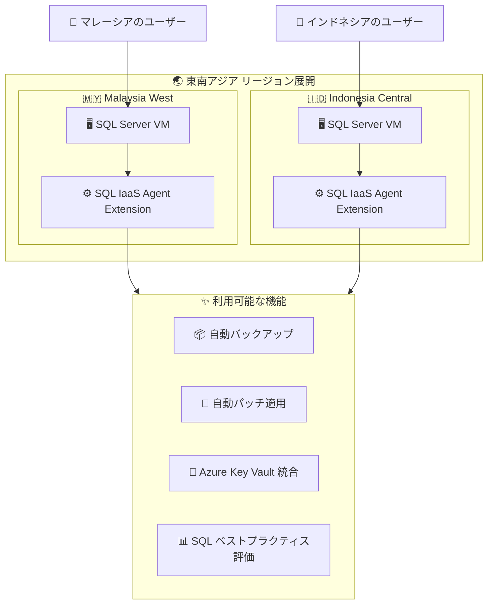

# SQL Server on Azure Virtual Machines: Malaysia West / Indonesia Central リージョン展開

**リリース日**: 2026-05-20

**サービス**: SQL Server on Azure Virtual Machines

**機能**: Malaysia West および Indonesia Central リージョンでの一般提供 (GA)

**ステータス**: Launched (GA)

[このアップデートのインフォグラフィックを見る](https://takech9203.github.io/azure-news-summary/20260520-sql-server-vms-malaysia-indonesia.html)

## 概要

SQL Server on Azure Virtual Machines が、Malaysia West および Indonesia Central の 2 つの Azure リージョンで一般提供 (GA) を開始した。このリージョン展開により、東南アジア地域のユーザーに対して、より低レイテンシーで SQL Server ワークロードをデプロイ・管理できるようになる。

SQL Server on Azure VMs は、オンプレミスのハードウェアを管理することなく、クラウド上で完全版の SQL Server を利用できるサービスである。Azure Marketplace から SQL Server イメージを選択するか、独自のライセンスを持ち込む (Azure Hybrid Benefit) ことで、柔軟なデプロイが可能となる。

今回の展開により、マレーシアおよびインドネシアのデータレジデンシー要件を満たしながら、SQL Server ワークロードを運用できるようになった。

**アップデート前の課題**

- 東南アジア地域 (特にマレーシアとインドネシア) のユーザーは、地理的に遠いリージョンに SQL Server VM をデプロイする必要があった
- マレーシアやインドネシアのデータレジデンシー要件を満たすことが困難だった
- 遠方リージョンへの接続によるレイテンシーの増大

**アップデート後の改善**

- Malaysia West および Indonesia Central リージョンで SQL Server on Azure VMs を直接デプロイ可能になった
- 各国のデータレジデンシー要件への対応が容易になった
- エンドユーザーに近い場所でのデータ処理が可能になり、レイテンシーが改善

## アーキテクチャ図



Malaysia West と Indonesia Central の両リージョンで、SQL IaaS Agent Extension を含む全機能が利用可能であることを示す図。

## サービスアップデートの詳細

### 主要機能

SQL Server on Azure VMs の全機能が両リージョンで利用可能となる。SQL IaaS Agent Extension に登録することで、以下の機能が有効になる:

1. **Azure Portal 管理**
   - SQL Server VM の一元管理
   - SQL 固有の機能の有効化・無効化

2. **自動バックアップ**
   - すべてのデータベースに対するバックアップスケジューリングの自動化

3. **自動パッチ適用**
   - Azure Update Manager を通じた Windows および SQL Server セキュリティ更新の自動インストール
   - メンテナンスウィンドウの設定が可能

4. **Azure Key Vault 統合**
   - SQL Server VM 上での Azure Key Vault の自動インストールおよび構成

5. **SQL ベストプラクティス評価**
   - 構成のベストプラクティスに基づく SQL Server VM のヘルスチェック

6. **Microsoft Entra 認証**
   - Microsoft Entra ID を使用した認証によるセキュリティ強化

7. **拡張セキュリティ更新 (ESU)**
   - SQL Server のライフサイクルサポート終了後、最大 3 年間のセキュリティ更新の自動受信

## 技術仕様

| 項目 | 詳細 |
|------|------|
| サポート対象 SQL Server バージョン | SQL Server 2016, 2017, 2019, 2022, 2025 |
| サポート対象 OS | Windows Server 2016, 2019, 2022, 2025 / Linux |
| 新規リージョン | Malaysia West, Indonesia Central |
| ライセンスモデル | 従量課金制 (Pay-as-you-go) / Azure Hybrid Benefit (BYOL) |
| 管理拡張機能 | SQL IaaS Agent Extension (無料) |
| 高可用性 | Always On 可用性グループ、フェールオーバークラスターインスタンス |

## 設定方法

### 前提条件

1. Azure サブスクリプション
2. Malaysia West または Indonesia Central リージョンへのアクセス権

### Azure Portal

1. [Azure SQL ハブ](https://aka.ms/azuresqlhub) にアクセス
2. **SQL Server** の配下で **SQL Server on Azure VMs** を選択
3. **+ Create** を選択して **SQL Server on Azure Virtual Machines** ページを開く
4. リージョンとして **Malaysia West** または **Indonesia Central** を選択
5. 希望する SQL Server バージョンとエディションのイメージを選択
6. VM サイズ、ネットワーク設定、SQL Server 設定を構成
7. **Review + create** で確認後、**Create** でデプロイ

### Azure PowerShell

```powershell
# 利用可能なイメージを確認
$Location = "malaysiawest"  # または "indonesiacentral"
Get-AzVMImageOffer -Location $Location -Publisher 'MicrosoftSQLServer'
```

## メリット

### ビジネス面

- **データレジデンシー対応**: マレーシアおよびインドネシアの規制要件 (データの国内保管義務) に対応可能
- **レイテンシー改善**: エンドユーザーに近いリージョンでの運用により、アプリケーションの応答性が向上
- **事業継続性**: 東南アジア地域内での災害復旧戦略の選択肢が拡大
- **コスト最適化**: Azure Hybrid Benefit を活用し、既存の SQL Server ライセンスを使用可能

### 技術面

- **完全な SQL Server 互換性**: オンプレミスと同一の SQL Server エンジンをクラウドで実行
- **自動管理機能**: SQL IaaS Agent Extension による自動バックアップ・パッチ適用
- **柔軟な VM サイズ選択**: ワークロードに応じた適切なコンピュートリソースの選択
- **高可用性構成**: Always On 可用性グループやフェールオーバークラスターインスタンスのサポート

## デメリット・制約事項

- IaaS モデルのため、OS レベルの管理 (パッチ適用、セキュリティ設定) は利用者の責任範囲
- 新規リージョンのため、初期段階では一部の VM シリーズが利用できない可能性がある
- PaaS サービス (Azure SQL Database, SQL Managed Instance) と比較して管理オーバーヘッドが大きい

## ユースケース

### ユースケース 1: マレーシアの金融機関向けデータベース移行

**シナリオ**: マレーシアの金融機関が、データ主権要件を満たすためにオンプレミスの SQL Server を Azure に移行する必要がある。

**効果**: Malaysia West リージョンにデプロイすることで、マレーシア国内にデータを保管しながら、Azure のスケーラビリティと管理機能を活用できる。

### ユースケース 2: インドネシアの EC サイト向けバックエンド

**シナリオ**: インドネシア国内の EC サイトが、ユーザー体験向上のためにデータベースのレイテンシーを削減したい。

**効果**: Indonesia Central リージョンにデプロイすることで、インドネシア国内のユーザーへの応答時間を大幅に短縮できる。

### ユースケース 3: 東南アジア DR 構成

**シナリオ**: 東南アジアで事業展開する企業が、リージョン間の災害復旧構成を構築したい。

**効果**: Malaysia West と Indonesia Central を DR ペアとして活用し、Always On 可用性グループでリージョン間レプリケーションを構成できる。

## 料金

SQL Server on Azure VMs の料金は以下の要素で構成される:

- **コンピュート**: VM のサイズに基づく時間課金
- **SQL Server ライセンス**: 従量課金制または Azure Hybrid Benefit (BYOL)
- **ストレージ**: マネージドディスクの使用量に基づく課金

ライセンスモデル:

| ライセンスオプション | 概要 |
|---------------------|------|
| 従量課金制 (Pay-as-you-go) | SQL Server ライセンスを含む VM イメージを使用。時間単位で課金 |
| Azure Hybrid Benefit (BYOL) | 既存の SQL Server ライセンスを持ち込み、コンピュートコストのみ支払い |

詳細な料金情報: [SQL Server on Azure VMs 料金ガイダンス](https://learn.microsoft.com/azure/azure-sql/virtual-machines/windows/pricing-guidance)

## 利用可能リージョン

今回追加されたリージョン:

- **Malaysia West** (マレーシア西部)
- **Indonesia Central** (インドネシア中部)

既存の東南アジアリージョン (Southeast Asia / Singapore など) に加え、上記 2 リージョンで利用可能になった。

## 関連サービス・機能

- **Azure SQL Database**: フルマネージドの PaaS データベースサービス (管理不要だが、カスタマイズ性は限定的)
- **Azure SQL Managed Instance**: SQL Server との高い互換性を持つ PaaS サービス
- **Azure Virtual Machines**: SQL Server VM の基盤となるコンピュートサービス
- **Azure Key Vault**: SQL Server VM との統合でシークレット管理を実現
- **Azure Monitor**: SQL Server VM のパフォーマンス監視
- **Azure Backup**: SQL Server データベースのバックアップ管理

## 参考リンク

- [インフォグラフィック](https://takech9203.github.io/azure-news-summary/20260520-sql-server-vms-malaysia-indonesia.html)
- [公式アップデート情報](https://azure.microsoft.com/updates?id=562094)
- [SQL Server on Azure VMs 概要 - Microsoft Learn](https://learn.microsoft.com/azure/azure-sql/virtual-machines/windows/sql-server-on-azure-vm-iaas-what-is-overview)
- [SQL Server VM クイックスタート - Azure Portal](https://learn.microsoft.com/azure/azure-sql/virtual-machines/windows/sql-vm-create-portal-quickstart)
- [SQL Server on Azure VMs 料金ガイダンス](https://learn.microsoft.com/azure/azure-sql/virtual-machines/windows/pricing-guidance)
- [Azure リージョン一覧](https://azure.microsoft.com/regions/)

## まとめ

SQL Server on Azure Virtual Machines の Malaysia West および Indonesia Central リージョンへの展開は、東南アジア地域でのデータベースワークロードの運用において重要なアップデートである。特に、マレーシアとインドネシアにおけるデータレジデンシー要件への対応が容易になり、現地ユーザーへの低レイテンシーアクセスが実現する。

Solutions Architect としての推奨アクション:
- マレーシア・インドネシアにエンドユーザーが存在するワークロードについて、リージョン移行の検討
- データレジデンシー要件がある顧客に対して、新リージョンの活用を提案
- 東南アジア地域の DR 戦略の再検討 (新リージョンを DR サイトとして活用)

---

**タグ**: #SQL-Server #Azure-VM #Malaysia-West #Indonesia-Central #GA #リージョン展開 #データレジデンシー #東南アジア #IaaS #Compute #Databases
