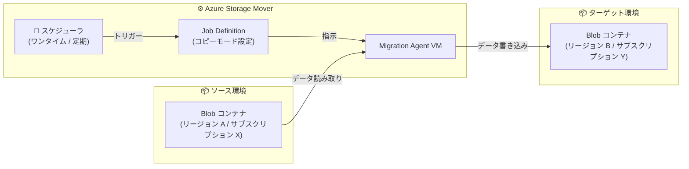

# Azure Storage Mover: Blob-to-Blob マイグレーションとジョブスケジュール機能

**リリース日**: 2026-05-20

**サービス**: Azure Storage Mover

**機能**: Blob-to-Blob マイグレーション / ワンタイム・定期スケジュール実行

**ステータス**: Launched (GA)

[このアップデートのインフォグラフィックを見る](https://takech9203.github.io/azure-news-summary/20260520-storage-mover-blob-to-blob-scheduling.html)

## 概要

Azure Storage Mover に 2 つの重要な GA 機能が同時に追加された。1 つ目は **Blob コンテナ間のデータ転送 (Blob-to-Blob マイグレーション)** で、リージョン、サブスクリプション、ストレージアカウントをまたいだ Blob データの移行をフルマネージドで実行できるようになった。2 つ目は **ジョブスケジュール機能** で、マイグレーションジョブのワンタイム実行や定期実行をスケジュールとして設定できるようになった。

これら 2 つの機能を組み合わせることで、Blob データの移行を自動化・スケジュール化し、運用負荷を大幅に削減できる。

**アップデート前の課題**

- Blob コンテナ間のデータ移行には AzCopy やカスタムスクリプトが必要で、フルマネージドなソリューションがなかった
- リージョン間・サブスクリプション間の Blob 移行では、認証や転送の管理を手動で行う必要があった
- マイグレーションジョブは手動で開始する必要があり、特定の時間帯に自動実行する仕組みがなかった
- 定期的なデータ同期には外部のスケジューラ (Azure Automation, Logic Apps 等) を組み合わせる必要があった

**アップデート後の改善**

- Azure Storage Mover 内で Blob-to-Blob の移行がネイティブにサポートされ、エージェント経由のフルマネージド転送が可能に
- 異なるリージョン、サブスクリプション、ストレージアカウント間のシームレスな Blob 移行を実現
- Flat Namespace (FNS) と Hierarchical Namespace Service (HNS / ADLS Gen2) の両方をサポート
- ジョブスケジュール機能により、特定の日時でのワンタイム実行や Daily/Weekly/Monthly の定期実行が可能に
- 外部スケジューラ不要で、Storage Mover 内でマイグレーション自動化が完結

## アーキテクチャ図



Azure Storage Mover のスケジューラがジョブ定義に基づきエージェントを起動し、ソース Blob コンテナからターゲット Blob コンテナへデータを転送する。リージョンやサブスクリプションが異なっていても同一テナント内であれば転送可能。

## サービスアップデートの詳細

### 主要機能

1. **Blob-to-Blob マイグレーション**
   - Blob コンテナをソースおよびターゲットとして設定可能
   - 同一テナント内の異なるサブスクリプション・ストレージアカウント間で転送可能
   - Flat Namespace (FNS) と Hierarchical Namespace Service (HNS) の両方をサポート
   - HNS 有効コンテナには ADLS Gen2 REST API セットが使用される

2. **ジョブスケジュール機能**
   - ワンタイム (一回限り) スケジュール: 特定の日時にジョブを自動開始
   - 定期スケジュール: Daily (毎日)、Weekly (毎週)、Monthly (毎月) から選択可能
   - 開始日時は UTC で指定し、作成日から最大 90 日先まで設定可能
   - 定期スケジュールの終了日は作成日から最大 1 年以内に設定

3. **コピーモード**
   - **Merge (マージ)**: ソースとターゲットを結合。ターゲットにのみ存在するファイルは保持される
   - **Mirror (ミラー)**: ソースの状態をターゲットに完全に反映。ソースに存在しないファイルはターゲットから削除される

## 技術仕様

| 項目 | 詳細 |
|------|------|
| サポートされるソース | Azure Blob コンテナ (FNS / HNS) |
| サポートされるターゲット | Azure Blob コンテナ (FNS / HNS) |
| テナント要件 | ソースとターゲットは同一テナント内であること |
| スケジュール種別 | No schedule / One-time / Recurring (Daily/Weekly/Monthly) |
| 開始日時の範囲 | 作成日から最大 90 日先 |
| 定期スケジュール終了日 | 作成日から最大 1 年以内 |
| 同時実行制限 | 1 エージェントあたり同時に 1 ジョブのみ実行可能 |
| ターゲット排他制御 | 1 つのターゲットコンテナに対して同時に実行できるジョブは 1 つのみ |
| API セット (HNS) | ADLS Gen2 REST API |
| コピーモード | Merge (Additive) / Mirror |

## 設定方法

### 前提条件

1. Azure Storage Mover リソースがデプロイ済みであること
2. Migration Agent VM がデプロイ・登録済みであること
3. ソースおよびターゲットのストレージアカウントにエージェントからアクセス可能であること
4. ストレージアカウントのファイアウォール設定でエージェント VM からのトラフィックが許可されていること

### Azure Portal

1. **Project Explorer** に移動し、プロジェクトを選択
2. **Create job definition** を選択
3. **Basics** タブ: ジョブ名を入力し、マイグレーションタイプとして「Azure-to-Azure」を選択、エージェントを指定
4. **Source** タブ: ソースとなる Blob コンテナのエンドポイントを選択または新規作成
5. **Target** タブ: ターゲットとなる Blob コンテナのエンドポイントを選択または新規作成
6. **Settings** タブ: コピーモード (Merge / Mirror) を選択
7. **Schedule** タブ: 「One-time」または「Recurring」を選択し、開始日時と頻度を設定
8. **Review** タブ: 設定内容を確認し「Create」を選択

### PowerShell

```powershell
# Blob コンテナのソースエンドポイントを作成
New-AzStorageMoverAzStorageContainerEndpoint `
    -ResourceGroupName $resourceGroupName `
    -StorageMoverName $storageMoverName `
    -Name "source-blob-endpoint" `
    -BlobContainerName "source-container" `
    -StorageAccountResourceId $sourceStorageAccountResourceId

# Blob コンテナのターゲットエンドポイントを作成
New-AzStorageMoverAzStorageContainerEndpoint `
    -ResourceGroupName $resourceGroupName `
    -StorageMoverName $storageMoverName `
    -Name "target-blob-endpoint" `
    -BlobContainerName "target-container" `
    -StorageAccountResourceId $targetStorageAccountResourceId

# ジョブ定義を作成
New-AzStorageMoverJobDefinition `
    -Name "blob-to-blob-migration" `
    -ProjectName $projectName `
    -ResourceGroupName $resourceGroupName `
    -StorageMoverName $storageMoverName `
    -CopyMode "Mirror" `
    -SourceName "source-blob-endpoint" `
    -TargetName "target-blob-endpoint" `
    -AgentName $agentName
```

## メリット

### ビジネス面

- マイグレーションの自動化により運用コストを削減
- スケジュール機能により業務時間外の実行が可能となり、パフォーマンスへの影響を最小化
- フルマネージドサービスのため、カスタムスクリプトの開発・保守コストが不要
- リージョン間移行により DR (ディザスタリカバリ) やデータ分散戦略の実装が容易に

### 技術面

- エージェントベースのアーキテクチャにより、大規模データの効率的な転送が可能
- Merge / Mirror の 2 つのコピーモードで柔軟なデータ同期戦略を実装可能
- FNS / HNS 両対応で ADLS Gen2 ワークロードにも対応
- Azure Monitor との統合によりメトリクスとコピーログで転送状況を可視化
- 定期スケジュールにより差分転送を自動化し、最終カットオーバー時のダウンタイムを短縮

## デメリット・制約事項

- ソースとターゲットは同一テナント内に限定される (テナント間の転送は不可)
- 1 エージェントあたり同時に 1 ジョブしか実行できないため、並列度を上げるには複数エージェントが必要
- 同一ターゲットコンテナに対して複数ジョブの同時実行は不可
- ジョブ定義作成後にソース・ターゲットの変更は不可 (新規作成が必要)
- 定期スケジュールの終了日は作成日から 1 年以内に制限
- Migration Agent VM のデプロイ・管理が必要 (完全なサーバーレスではない)
- Glacier / Glacier Deep Archive ストレージクラスの AWS S3 からの移行には事前復元が必要 (Azure Blob 間移行には直接関係なし)

## ユースケース

### ユースケース 1: リージョン間の DR レプリケーション

**シナリオ**: 本番リージョンの Blob データを定期的に DR リージョンにレプリケーションする

**実装**: Weekly の定期スケジュールで Mirror モードのジョブを設定し、毎週末の深夜に自動転送を実行。ソースに存在しなくなったファイルはターゲットからも削除されるため、常にソースの最新状態が反映される。

**効果**: GRS/GZRS に頼らない柔軟な DR 戦略を実装可能。異なるストレージアカウント構成やアクセス層を DR 側で設定できる。

### ユースケース 2: サブスクリプション統合・分割時のデータ移行

**シナリオ**: 組織再編に伴い、複数のサブスクリプションに分散した Blob データを統合先サブスクリプションに移行する

**実装**: One-time スケジュールで各ソースコンテナからターゲットコンテナへの Merge モードジョブを設定。移行完了後にソースを削除。

**効果**: 計画的な日時でワンタイム移行を自動実行し、手動操作のミスを防止。

### ユースケース 3: ADLS Gen2 データレイクの環境間データ同期

**シナリオ**: 開発環境の ADLS Gen2 コンテナに本番データのサブセットを Daily で同期する

**実装**: HNS 有効コンテナ間で Daily 定期スケジュールの Merge モードジョブを設定。サブパス指定により特定のフォルダのみを同期対象に。

**効果**: データエンジニアが常に最新の本番相当データで開発・テストを実行可能に。

## 料金

Azure Storage Mover サービス自体の使用料は現時点で **無料** である。ただし、以下のコストが別途発生する:

| コスト要因 | 説明 |
|-----------|------|
| Storage Mover サービス利用 | 無料 (将来のプレミアム機能で課金の可能性あり) |
| ターゲットストレージ利用料 | 転送先の Blob Storage 容量に応じた課金 |
| ストレージトランザクション | 消費ベース課金のストレージではトランザクション料が発生 |
| ネットワーク (エグレス) | リージョン間転送時にエグレス帯域幅の料金が発生 |
| Agent VM | Agent VM のコンピュートコスト |

## 関連サービス・機能

- **Azure Blob Storage**: マイグレーションのソースおよびターゲットとなるストレージサービス
- **Azure Data Lake Storage Gen2 (ADLS Gen2)**: HNS 有効 Blob コンテナとして Storage Mover で転送可能
- **AzCopy**: コマンドラインベースのデータ転送ツール。Storage Mover はより高レベルの管理機能を提供
- **Azure Data Factory**: パイプラインベースのデータ移動サービス。より複雑なデータ変換が必要な場合に適用
- **Azure Monitor**: Storage Mover のメトリクスとコピーログの監視に利用
- **Azure Arc (Hybrid Compute)**: Storage Mover エージェントの登録基盤として利用

## 参考リンク

- [インフォグラフィック](https://takech9203.github.io/azure-news-summary/20260520-storage-mover-blob-to-blob-scheduling.html)
- [公式アップデート情報 (Blob-to-Blob)](https://azure.microsoft.com/updates?id=562753)
- [公式アップデート情報 (スケジュール)](https://azure.microsoft.com/updates?id=562622)
- [Microsoft Learn - Azure Storage Mover ドキュメント](https://learn.microsoft.com/azure/storage-mover/)
- [Microsoft Learn - ジョブ定義の作成](https://learn.microsoft.com/azure/storage-mover/job-definition-create)
- [Microsoft Learn - 料金について](https://learn.microsoft.com/azure/storage-mover/billing)

## まとめ

Azure Storage Mover の Blob-to-Blob マイグレーションとジョブスケジュール機能の GA により、Azure 内の Blob データ移行がフルマネージドかつ自動化可能になった。リージョン間・サブスクリプション間の Blob 移行をスケジュール実行できることで、DR レプリケーション、環境統合、データ同期といったシナリオを外部ツールやスクリプトなしに実現できる。Solutions Architect としては、GRS/GZRS では対応しきれない柔軟なデータレプリケーション要件や、組織再編に伴うデータ移行計画において Storage Mover の活用を検討すべきである。サービス利用自体が無料である点もコスト面で魅力的だが、Agent VM やネットワークエグレス等の付随コストは設計時に考慮が必要。

---

**タグ**: #Azure #StorageMover #Migration #BlobStorage #DataTransfer #ADLS #Schedule #GA
