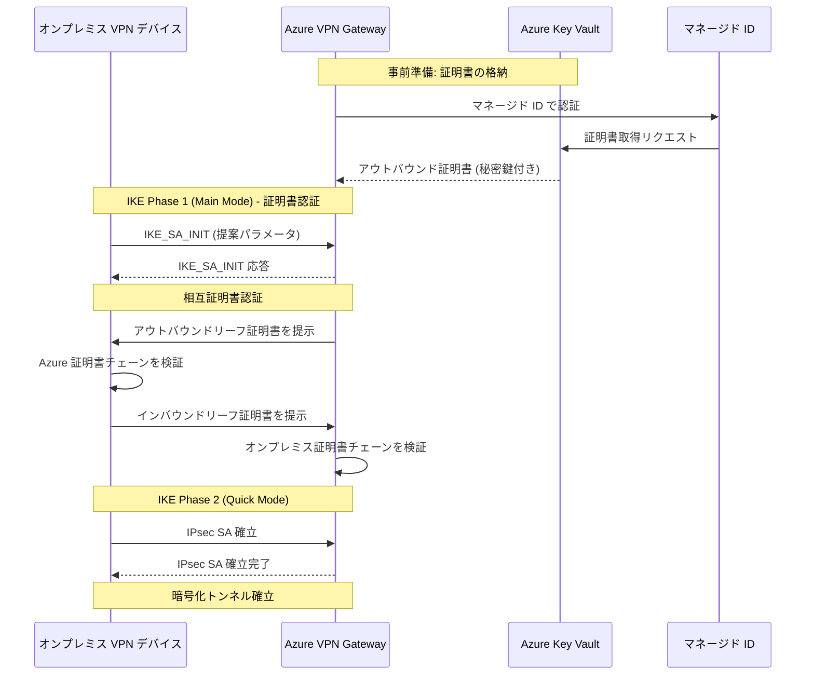

# VPN Gateway: サイト間 VPN 接続の証明書認証 (GA)

**リリース日**: 2026-05-20

**サービス**: Azure VPN Gateway

**機能**: Site-to-Site VPN connections with certificate authentication

**ステータス**: Launched (GA)

[このアップデートのインフォグラフィックを見る](https://takech9203.github.io/azure-news-summary/20260520-vpn-gateway-certificate-authentication.html)

## 概要

Azure Site-to-Site VPN において、従来の事前共有キー (PSK: Pre-Shared Key) に代わるデジタル証明書ベースの認証が一般提供 (GA) となった。この機能により、Azure VPN Gateway とオンプレミス VPN デバイス間の IKE ハンドシェイク時に、X.509 デジタル証明書を使用した非対称信頼モデルによる相互認証が可能になる。

証明書は Azure Key Vault に安全に格納され、VPN Gateway はユーザー割り当てマネージド ID を通じて証明書にアクセスする。インバウンド (オンプレミスから Azure) とアウトバウンド (Azure からオンプレミス) の双方向で証明書チェーンの検証が行われ、より強固なセキュリティを実現する。

**アップデート前の課題**

- サイト間 VPN 接続では事前共有キー (PSK) による対称鍵認証のみが利用可能だった
- PSK は両側で同一の秘密鍵を共有するため、鍵の漏洩リスクや管理の複雑さがあった
- コンプライアンス要件として証明書ベース認証を求める組織では、Azure VPN Gateway の利用が制限されていた

**アップデート後の改善**

- X.509 証明書による非対称信頼モデルでの相互認証が可能になった
- Azure Key Vault とマネージド ID を活用したセキュアな証明書管理が実現された
- Azure RBAC によるきめ細かいアクセス制御が適用可能になった
- インバウンド・アウトバウンドの証明書を異なるルート CA から発行可能になった

## アーキテクチャ図



Azure VPN Gateway は Key Vault からマネージド ID 経由で証明書を取得し、IKE ハンドシェイク時にオンプレミス VPN デバイスと相互に証明書を提示・検証してトンネルを確立する。

## サービスアップデートの詳細

### 主要機能

1. **X.509 証明書ベースの相互認証**
   - IKE ハンドシェイク時にデジタル証明書を使用した双方向認証
   - PSK の共有が不要な非対称信頼モデル
   - インバウンド/アウトバウンド証明書は異なるルート CA から発行可能

2. **Azure Key Vault 統合**
   - アウトバウンド証明書 (秘密鍵付き) を Key Vault に安全に格納
   - ユーザー割り当てマネージド ID による Key Vault へのアクセス
   - Azure RBAC による証明書アクセスの制御

3. **双方向の証明書フロー**
   - **アウトバウンドフロー**: Azure から Key Vault 経由で証明書を取得し、オンプレミスに対して Azure 側を認証
   - **インバウンドフロー**: オンプレミスデバイスが提示した証明書を、Azure 側で設定済みのルート CA/中間証明書チェーンで検証

## 技術仕様

| 項目 | 詳細 |
|------|------|
| 認証方式 | X.509 証明書ベース (非対称鍵) |
| IKE プロトコル | IKEv2 |
| 最小鍵長 | 2048 ビット |
| アウトバウンド証明書形式 | .pfx または .pem (秘密鍵付き) |
| インバウンド証明書形式 | .cer (Base-64 エンコード X.509、公開鍵のみ) |
| 証明書保管先 | Azure Key Vault |
| アクセス方式 | ユーザー割り当てマネージド ID |
| 必要な Key Vault RBAC ロール | Key Vault Secrets User + Key Vault Certificate User |
| 対応 SKU | VpnGw1 以上 (Basic SKU は非対応) |
| 対応クラウド | Azure パブリッククラウドのみ |
| アウトバウンド証明書要件 | 秘密鍵必須、サーバー/クライアント認証 EKU、サブジェクト名必須 |

## 設定方法

### 前提条件

1. VPN Gateway が作成済みであること (Basic SKU 以外)
2. ユーザー割り当てマネージド ID が作成済みであること
3. Azure Key Vault が作成済みであること (RBAC アクセスモデル推奨)
4. インバウンド/アウトバウンド証明書が生成済みであること
5. 対応するオンプレミス VPN デバイスがあること

### Azure Portal

**1. マネージド ID の作成**

Azure Portal で「マネージド ID」を検索し、ユーザー割り当てマネージド ID を作成する。

**2. VPN Gateway で Key Vault アクセスを有効化**

VPN Gateway の「設定 > 構成」ページで以下を設定:
- Key Vault アクセスの有効化: 有効
- マネージド ID: 作成したマネージド ID を選択

**3. Key Vault にアウトバウンド証明書をアップロード**

Key Vault の「証明書」ページから .pfx ファイルをインポートする。

**4. マネージド ID に Key Vault ロールを割り当て**

Key Vault の「アクセス制御 (IAM)」で以下の 2 つの RBAC ロールを割り当て:
- Key Vault Secrets User
- Key Vault Certificate User

**5. 接続の作成**

VPN Gateway の「接続」ページから新規接続を作成:
- 接続の種類: Site-to-site (IPSec)
- 認証方法: Key Vault Certificate
- アウトバウンド証明書パス: Key Vault の証明書識別子
- インバウンド証明書サブジェクト名: オンプレミス証明書の CN
- インバウンド証明書チェーン: ルート CA / 中間証明書の公開鍵データ

### 証明書の生成 (PowerShell)

```powershell
# 自己署名ルート CA 証明書の作成
$params = @{
    Type = 'Custom'
    Subject = 'CN=AzRootCA1'
    KeySpec = 'Signature'
    KeyExportPolicy = 'Exportable'
    KeyUsage = 'CertSign'
    KeyUsageProperty = 'Sign'
    KeyLength = 2048
    HashAlgorithm = 'sha256'
    NotAfter = (Get-Date).AddMonths(120)
    CertStoreLocation = 'Cert:\CurrentUser\My'
    TextExtension = @('2.5.29.19={critical}{text}ca=1&pathlength=4')
}
$cert = New-SelfSignedCertificate @params

# アウトバウンドリーフ証明書の作成
$params = @{
    Type = 'Custom'
    Subject = 'CN=az-outbound-cert1'
    KeySpec = 'Signature'
    KeyExportPolicy = 'Exportable'
    KeyLength = 2048
    HashAlgorithm = 'sha256'
    NotAfter = (Get-Date).AddMonths(120)
    CertStoreLocation = 'Cert:\CurrentUser\My'
    Signer = $cert
    TextExtension = @(
        '2.5.29.37={text}1.3.6.1.5.5.7.3.2,1.3.6.1.5.5.7.3.1')
}
New-SelfSignedCertificate @params

# インバウンドリーフ証明書の作成
$params = @{
    Type = 'Custom'
    Subject = 'CN=on-prem-s2s-1'
    KeySpec = 'Signature'
    KeyExportPolicy = 'Exportable'
    KeyLength = 2048
    HashAlgorithm = 'sha256'
    NotAfter = (Get-Date).AddMonths(120)
    CertStoreLocation = 'Cert:\CurrentUser\My'
    Signer = $cert
    TextExtension = @(
        '2.5.29.37={text}1.3.6.1.5.5.7.3.2,1.3.6.1.5.5.7.3.1')
}
New-SelfSignedCertificate @params
```

## メリット

### ビジネス面

- 証明書ベース認証を要件とするコンプライアンス規格 (PCI DSS、ISO 27001 等) への準拠が容易になる
- 共有秘密の管理負担が軽減され、運用コストの削減が期待できる
- 証明書のローテーションが Key Vault 上で一元管理可能

### 技術面

- PSK の共有が不要なため、鍵漏洩のリスクが大幅に低減される
- 非対称暗号による相互認証で、なりすまし攻撃に対する耐性が向上する
- Azure Key Vault + マネージド ID による安全な証明書ライフサイクル管理
- Azure RBAC によるきめ細かい権限制御が可能
- インバウンド/アウトバウンド証明書を異なるルート CA から発行できる柔軟性

## デメリット・制約事項

- Basic SKU VPN Gateway では利用不可 (VpnGw1 以上が必要)
- Azure パブリッククラウドのみで利用可能 (Azure Government、Azure China 等は非対応)
- Key Vault、マネージド ID の追加セットアップが必要で、PSK と比較して初期構成が複雑
- 証明書の有効期限管理が必要 (期限切れによるトンネル断を防ぐためのローテーション運用)
- オンプレミス VPN デバイスが証明書認証に対応している必要がある
- インバウンド証明書チェーンには少なくとも 2 つの証明書が必要

## ユースケース

### ユースケース 1: 金融機関のコンプライアンス対応

**シナリオ**: PCI DSS や金融規制で証明書ベース認証が求められるハイブリッドクラウド環境

**効果**: PSK では満たせなかったセキュリティ要件を充足し、Azure 上での金融ワークロード展開が可能になる

### ユースケース 2: 大規模マルチサイト接続

**シナリオ**: 多数の拠点とのサイト間 VPN 接続において、PSK の個別管理が運用負荷となっている環境

**効果**: PKI (公開鍵基盤) を活用した一元的な証明書管理により、サイト追加時の鍵管理を簡素化できる

### ユースケース 3: ゼロトラストアーキテクチャの実現

**シナリオ**: ゼロトラスト原則に基づき、すべてのネットワーク接続で強固な相互認証を要求する環境

**効果**: 証明書による暗号学的に強固な相互認証により、ネットワーク層でのゼロトラスト原則を適用できる

## 料金

VPN Gateway の証明書認証機能自体に追加料金は発生しないが、以下のリソースが別途課金対象となる:

- **VPN Gateway**: SKU に応じた時間課金 (VpnGw1AZ 以上を推奨)
- **Azure Key Vault**: 証明書の格納・操作に応じた課金
- **接続料金**: サイト間接続あたりの時間課金

詳細な料金情報: [Azure VPN Gateway の価格](https://azure.microsoft.com/pricing/details/vpn-gateway/)

## 関連サービス・機能

- **Azure Key Vault**: 証明書の安全な格納と管理に使用
- **Azure マネージド ID**: VPN Gateway から Key Vault へのセキュアなアクセスに使用
- **Azure RBAC**: Key Vault の証明書アクセス権限制御に使用
- **ExpressRoute**: より高帯域・低レイテンシの専用接続が必要な場合の代替
- **Azure Virtual WAN**: 大規模なブランチ接続を管理する場合の統合ソリューション

## 参考リンク

- [インフォグラフィック](https://takech9203.github.io/azure-news-summary/20260520-vpn-gateway-certificate-authentication.html)
- [公式アップデート情報](https://azure.microsoft.com/updates?id=562705)
- [Microsoft Learn - About site-to-site VPN connections with certificate authentication](https://learn.microsoft.com/azure/vpn-gateway/site-to-site-certificate-authentication-gateway-about)
- [Microsoft Learn - Create S2S VPN connection with certificate authentication (Portal)](https://learn.microsoft.com/azure/vpn-gateway/site-to-site-certificate-authentication-gateway-portal)
- [Microsoft Learn - About VPN devices](https://learn.microsoft.com/azure/vpn-gateway/vpn-gateway-about-vpn-devices)
- [料金ページ](https://azure.microsoft.com/pricing/details/vpn-gateway/)

## まとめ

Azure Site-to-Site VPN の証明書認証が GA となり、従来の PSK モデルに加えて X.509 証明書ベースの非対称信頼モデルが選択可能になった。Azure Key Vault とマネージド ID を活用したセキュアな証明書管理、Azure RBAC による権限制御など、エンタープライズグレードのセキュリティ要件に対応できる。

Solutions Architect としては、以下のアクションを推奨する:
- セキュリティ要件として証明書認証が求められる環境では、既存の PSK 接続からの移行を検討する
- Basic SKU を使用している場合は、VpnGw1AZ 以上へのアップグレードを計画する
- Key Vault と証明書のライフサイクル管理 (ローテーション、有効期限監視) の運用設計を行う

---

**タグ**: #Azure #VPNGateway #Security #CertificateAuthentication #Networking #SiteToSite #KeyVault #ManagedIdentity
