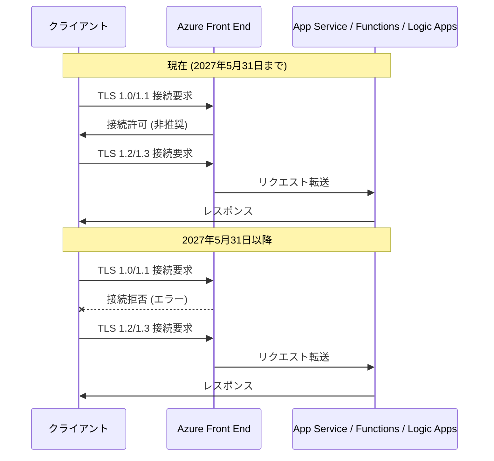

# Azure App Service / Functions / Logic Apps: TLS 1.0 および TLS 1.1 の廃止

**リリース日**: 2026-05-21

**サービス**: Azure App Service, Azure Functions, Azure Logic Apps

**機能**: TLS 1.0 および TLS 1.1 接続の廃止 (2027 年 5 月 31 日)

**ステータス**: Retirement

[このアップデートのインフォグラフィックを見る](https://takech9203.github.io/azure-news-summary/20260521-app-service-functions-tls-retirement.html)

## 概要

Azure のセキュリティ強化の一環として、Azure App Service、Azure Functions、および Azure Logic Apps において、TLS 1.0 および TLS 1.1 による接続が **2027 年 5 月 31 日** 以降受け付けられなくなることが発表された。この期日以降、レガシーな TLS バージョンを使用し続けるクライアント、アプリケーション、またはサービスは接続に失敗する。

TLS 1.0 は 1999 年、TLS 1.1 は 2006 年にリリースされたプロトコルであり、現在では既知の脆弱性 (BEAST、POODLE など) が存在し、セキュリティ上安全とはみなされていない。Microsoft Learn のドキュメントでも「legacy protocols and are no longer considered secure」と明記されており、新規 Web アプリのデフォルト最小 TLS バージョンは既に TLS 1.2 に設定されている。

影響を受けるサービスは Compute、Web、Mobile、Containers、IoT、Integration の各カテゴリにまたがる広範なものであり、App Service 上で稼働するすべてのアプリケーション、Functions のエンドポイント、Logic Apps のワークフロートリガーが対象となる。管理者は期日までに最小 TLS バージョンを 1.2 以上に設定し、すべてのクライアントが TLS 1.2 以上に対応していることを確認する必要がある。

**アップデート前の課題**

- TLS 1.0/1.1 は既知の脆弱性があり、暗号強度が不十分
- レガシークライアントとの互換性を優先し、古いプロトコルが許容されたままになっている環境が存在
- PCI DSS などのコンプライアンス基準を満たさないリスクがある
- Azure Policy で監査はできるが、強制的な廃止スケジュールが明示されていなかった

**アップデート後の改善**

- 明確な廃止期日 (2027 年 5 月 31 日) が設定され、移行計画が立てやすくなる
- TLS 1.2 以上への統一により、セキュリティベースラインが向上
- 脆弱な暗号スイートが排除され、BEAST/POODLE 等の攻撃リスクが解消
- PCI DSS、HIPAA 等のコンプライアンス要件への適合が容易に

## アーキテクチャ図



この図は、TLS バージョンネゴシエーションにおける廃止前後の動作の違いを示している。2027 年 5 月 31 日以降、TLS 1.0/1.1 での接続要求はフロントエンドレベルで拒否される。

## サービスアップデートの詳細

### 主要機能

1. **TLS 1.0/1.1 の完全廃止**
   - 2027 年 5 月 31 日をもって、App Service、Functions、Logic Apps で TLS 1.0/1.1 による受信接続が完全に拒否される
   - この変更はプラットフォームレベルで強制され、個別のアプリ設定に関わらず適用される

2. **対象サービスの範囲**
   - Azure App Service (Web Apps、API Apps、Mobile Apps)
   - Azure Functions (すべてのホスティングプラン)
   - Azure Logic Apps (Standard および Consumption)
   - 上記サービスの SCM (Kudu) エンドポイントも対象

3. **移行期間の提供**
   - 発表日 (2026 年 5 月 21 日) から廃止日 (2027 年 5 月 31 日) まで約 1 年間の移行猶予期間が設けられている
   - この期間中に既存アプリケーションの TLS 設定を更新し、クライアント側の対応を完了する必要がある

## 技術仕様

| 項目 | 詳細 |
|------|------|
| 廃止対象プロトコル | TLS 1.0, TLS 1.1 |
| 廃止日 | 2027 年 5 月 31 日 |
| 推奨最小バージョン | TLS 1.2 (デフォルト) |
| 最新対応バージョン | TLS 1.3 |
| 対象サービス | App Service, Functions, Logic Apps |
| 影響範囲 | 受信接続 (Inbound) |
| TLS 1.2 暗号スイート | プラットフォーム管理 (Minimum TLS Cipher Suite で制御可能) |
| TLS 1.3 暗号スイート | TLS_AES_256_GCM_SHA384, TLS_AES_128_GCM_SHA256 |

## 設定方法

### 前提条件

1. Azure サブスクリプションへのアクセス権 (Contributor 以上)
2. Azure CLI 最新版 (az webapp / az functionapp コマンドを使用)
3. 影響を受けるアプリケーションの一覧の把握

### 現在の TLS 設定の確認

```bash
# App Service の最小 TLS バージョンを確認
az webapp show --name <app-name> --resource-group <rg-name> --query "siteConfig.minTlsVersion" -o tsv

# Functions の最小 TLS バージョンを確認
az functionapp show --name <function-name> --resource-group <rg-name> --query "siteConfig.minTlsVersion" -o tsv
```

### Azure CLI での TLS バージョン更新

```bash
# App Service の最小 TLS バージョンを 1.2 に設定
az webapp config set --name <app-name> --resource-group <rg-name> --min-tls-version 1.2

# Functions の最小 TLS バージョンを 1.2 に設定
az functionapp config set --name <function-name> --resource-group <rg-name> --min-tls-version 1.2

# TLS 1.3 を要求する場合
az webapp config set --name <app-name> --resource-group <rg-name> --min-tls-version 1.3
```

### Azure Portal

1. Azure Portal で対象の App Service / Functions / Logic Apps リソースに移動
2. 左メニューから **[設定]** > **[TLS/SSL の設定]** (または **[構成]** > **[全般設定]**) を選択
3. **[最小受信 TLS バージョン]** を **1.2** (または **1.3**) に変更
4. **[保存]** をクリック

### Azure Policy による一括監査

```bash
# TLS 1.2 未満を使用しているアプリを検出する Azure Policy を割り当て
# Policy Definition ID: f0e6e85b-9b9f-4a4b-b67b-f730d42f1b0b
az policy assignment create \
  --name "audit-tls-version" \
  --policy "f0e6e85b-9b9f-4a4b-b67b-f730d42f1b0b" \
  --scope "/subscriptions/<subscription-id>"
```

## メリット

### ビジネス面

- PCI DSS 3.2 以降のコンプライアンス要件への自動適合
- セキュリティ監査での指摘事項の削減
- データ侵害リスクの低減による信頼性向上
- 明確な移行期限により計画的な対応が可能

### 技術面

- 既知の暗号化脆弱性 (BEAST、POODLE、Lucky13) の排除
- TLS 1.2/1.3 の強力な暗号スイートによるデータ保護の向上
- TLS 1.3 ではハンドシェイクの高速化 (1-RTT) によるレイテンシ削減
- Forward Secrecy の保証による将来的な鍵漏洩リスクの軽減
- 攻撃面の縮小によるプラットフォーム全体のセキュリティ強化

## デメリット・制約事項

- **レガシーシステムへの影響**: TLS 1.2 に対応していない古いクライアント (Windows XP、Android 4.3 以前、古い IoT デバイスなど) は接続不可となる
- **IoT デバイスの更新**: ファームウェア更新が困難な組み込みデバイスが影響を受ける可能性がある
- **サードパーティ連携の確認**: 外部システムからの Webhook やAPI 呼び出しが TLS 1.2+ に対応しているか確認が必要
- **テスト工数**: 移行前にすべてのクライアントとの接続テストが必要
- **移行期限の厳格さ**: 2027 年 5 月 31 日以降は例外なく接続が拒否される

## ユースケース

### ユースケース 1: Web アプリケーションの TLS 設定一括更新

**シナリオ**: 組織内に数十の App Service アプリがあり、一部がまだ TLS 1.0/1.1 を許容している環境での一括移行

**実装例**:

```bash
# サブスクリプション内の全 App Service の TLS バージョンを確認
az webapp list --query "[].{name:name, rg:resourceGroup, tls:siteConfig.minTlsVersion}" -o table

# TLS 1.2 未満のアプリを一括更新
for app in $(az webapp list --query "[?siteConfig.minTlsVersion!='1.2'].{name:name, rg:resourceGroup}" -o tsv); do
  name=$(echo $app | cut -f1)
  rg=$(echo $app | cut -f2)
  az webapp config set --name $name --resource-group $rg --min-tls-version 1.2
done
```

**効果**: 組織全体のセキュリティベースラインを TLS 1.2 以上に統一し、廃止日前に完全な準拠を達成

### ユースケース 2: IoT デバイスからの接続を検証

**シナリオ**: Azure Functions をバックエンドに持つ IoT ソリューションで、デバイスファームウェアの TLS 対応状況を確認

**実装例**:

```bash
# Application Insights でTLS バージョン別の接続を確認 (KQL)
# requests | summarize count() by client_TlsVersion | order by count_ desc
```

**効果**: TLS 1.0/1.1 を使用しているデバイスを特定し、ファームウェア更新計画を策定

## 料金

この変更に伴う追加料金は発生しない。TLS バージョンの設定変更は App Service、Functions、Logic Apps のすべてのプランで無料で行える。既存の料金プランに影響はなく、TLS 1.2/1.3 への移行によるコスト増加はない。

## 関連サービス・機能

- **Azure Front Door**: TLS ターミネーションを提供し、バックエンドの App Service への TLS バージョンを制御可能
- **Azure Application Gateway**: WAF と組み合わせた TLS ポリシー管理
- **Azure API Management**: API ゲートウェイレベルでの TLS バージョン制御
- **Azure Monitor / Application Insights**: TLS バージョン別の接続メトリクスの監視
- **Azure Policy**: 組織全体での TLS 最小バージョンの監査と強制
- **Azure Key Vault**: TLS/SSL 証明書の管理と自動更新

## 参考リンク

- [インフォグラフィック](https://takech9203.github.io/azure-news-summary/20260521-app-service-functions-tls-retirement.html)
- [公式アップデート情報](https://azure.microsoft.com/updates?id=557852)
- [Microsoft Learn - Azure App Service の TLS/SSL 概要](https://learn.microsoft.com/en-us/azure/app-service/overview-tls)
- [Azure Policy - App Service TLS バージョン監査](https://ms.portal.azure.com/#view/Microsoft_Azure_Policy/PolicyDetailBlade/definitionId/%2Fproviders%2FMicrosoft.Authorization%2FpolicyDefinitions%2Ff0e6e85b-9b9f-4a4b-b67b-f730d42f1b0b)

## まとめ

Azure App Service、Azure Functions、および Azure Logic Apps における TLS 1.0/1.1 の廃止は、Azure プラットフォーム全体のセキュリティ強化における重要なマイルストーンである。**廃止期日は 2027 年 5 月 31 日** であり、約 1 年間の移行猶予が設けられている。

Solutions Architect として推奨される即時アクションは以下の通り:

1. Azure Policy を使用して、TLS 1.0/1.1 を許容しているリソースを特定する
2. 最小 TLS バージョンを 1.2 以上に更新する
3. すべてのクライアント (Web ブラウザ、モバイルアプリ、IoT デバイス、サードパーティ連携) が TLS 1.2 以上に対応していることを確認する
4. Application Insights 等で TLS バージョン別のトラフィックを監視し、レガシー接続の有無を把握する

TLS 1.2 は既に新規アプリのデフォルトであるため、新しいリソースには影響はないが、既存の古い設定を持つアプリケーションについては計画的な移行が必要である。

---

**タグ**: #Azure #AppService #AzureFunctions #LogicApps #TLS #Security #Retirement #Compliance
