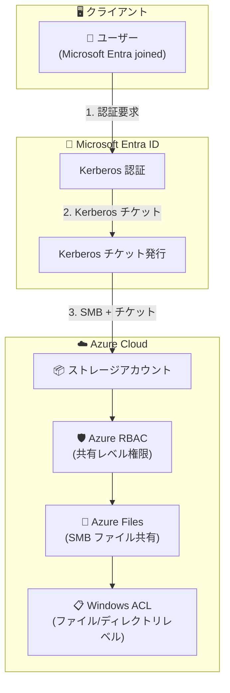

# Azure Files: Entra-only identities for SMB access

**リリース日**: 2026-05-21

**サービス**: Azure Files

**機能**: Entra-only identities for SMB access

**ステータス**: Launched (GA)

[このアップデートのインフォグラフィックを見る](https://takech9203.github.io/azure-news-summary/20260521-azure-files-entra-only-identities.html)

## 概要

Azure Files において、Microsoft Entra ID のみの ID (クラウドネイティブ ID) を使用した SMB ファイル共有へのアクセスが一般提供 (GA) となった。これにより、オンプレミスの Active Directory Domain Services (AD DS) やハイブリッド ID インフラストラクチャを必要とせず、クラウドネイティブな ID のみで Azure ファイル共有への安全な ID ベースアクセスが可能になる。

従来、Azure Files の ID ベース認証では、オンプレミス AD DS、Microsoft Entra Domain Services、またはハイブリッド ID (Microsoft Entra Connect を介してオンプレミス AD DS と同期された ID) のいずれかが必須であった。今回の GA により、Microsoft Entra ID でのみ作成・管理されるクラウドオンリー ID が、Kerberos 認証を通じて SMB ファイル共有に直接アクセスできるようになった。

この機能は Microsoft Build 2026 で発表され、クラウドファースト戦略を推進する組織やオンプレミス AD DS を持たない環境にとって重要なマイルストーンとなる。Microsoft Entra Kerberos プロトコルを活用し、業界標準の SMB プロトコルを介したセキュアなファイルアクセスを実現する。

**アップデート前の課題**

- Azure Files の ID ベース認証には、オンプレミス AD DS 環境またはハイブリッド ID インフラストラクチャが必須だった
- クラウドオンリー環境の組織は、ストレージアカウントキーに依存するか、不要なドメインコントローラーを構築する必要があった
- Microsoft Entra Connect によるオンプレミス AD との同期設定が複雑で、運用コストが高かった
- クラウドネイティブな組織にとって、ファイル共有のアクセス制御が不便であった

**アップデート後の改善**

- オンプレミス AD DS やドメインコントローラーなしで、クラウドネイティブ ID のみで SMB ファイル共有へアクセス可能
- Microsoft Entra ID で作成・管理される ID だけで ID ベースのアクセス制御が実現
- ハイブリッド ID インフラの構築・運用コストを削減
- Azure RBAC による共有レベルのアクセス制御をクラウドオンリー ID に適用可能

## アーキテクチャ図



クラウドオンリー ID を使用した Azure Files へのアクセスフロー。ユーザーは Microsoft Entra ID で Kerberos 認証を行い、発行されたチケットを使用して SMB プロトコル経由でファイル共有にアクセスする。アクセス制御は Azure RBAC (共有レベル) と Windows ACL (ファイル/ディレクトリレベル) の 2 層で構成される。

## サービスアップデートの詳細

### 主要機能

1. **クラウドオンリー ID の Kerberos 認証**
   - Microsoft Entra ID でのみ作成・管理される ID が、Kerberos プロトコルを使用して Azure Files SMB 共有にアクセス可能
   - オンプレミスのドメインコントローラーが不要

2. **Azure RBAC による共有レベル権限管理**
   - クラウドオンリー ID に対して Azure RBAC で共有レベルのアクセス許可を付与可能
   - Storage File Data SMB Share Reader / Contributor / Elevated Contributor などの組み込みロールを利用

3. **Windows ACL によるきめ細かなアクセス制御**
   - ディレクトリおよびファイルレベルの権限設定が可能
   - クラウドオンリー ID の場合は icacls コマンドで設定 (Windows File Explorer での ACL 設定は現時点では非対応)

4. **ハイブリッド ID との共存**
   - 同一ストレージアカウントでクラウドオンリー ID とハイブリッド ID の両方を認証可能
   - Microsoft Entra Kerberos を ID ソースとして使用

## 技術仕様

| 項目 | 詳細 |
|------|------|
| プロトコル | SMB (Server Message Block) |
| 認証方式 | Microsoft Entra Kerberos |
| チケット暗号化 | AES-256 |
| 対応クライアント OS (クラウドオンリー) | Windows 11 Enterprise/Pro, Windows Server 2025 |
| クライアント要件 | Microsoft Entra joined または Microsoft Entra hybrid joined |
| ID ソース制限 | ストレージアカウントあたり 1 つの ID ソースのみ |
| グループ SID 上限 | Kerberos チケットあたり最大 1,010 SID |
| NFS 対応 | 非対応 (SMB のみ) |
| MFA | ストレージアカウントアプリに対して MFA を無効化する必要あり |

## 設定方法

### 前提条件

1. Azure ストレージアカウントに他の ID ソース (AD DS, Microsoft Entra Domain Services) が設定されていないこと
2. クライアントが Microsoft Entra joined または Microsoft Entra hybrid joined であること
3. Windows 11 Enterprise/Pro または Windows Server 2025 (最新の累積更新プログラム適用済み)
4. WinHTTP Web Proxy Auto-Discovery Service (WinHttpAutoProxySvc) が実行中であること
5. IP Helper service (iphlpsvc) が実行中であること

### Azure CLI

```bash
# Microsoft Entra Kerberos 認証を有効化
az storage account update \
  --name <storageAccountName> \
  --resource-group <resourceGroupName> \
  --enable-files-aadkerb true
```

### Azure PowerShell

```powershell
# Microsoft Entra Kerberos 認証を有効化
Set-AzStorageAccount -ResourceGroupName <resourceGroupName> `
  -StorageAccountName <storageAccountName> `
  -EnableAzureActiveDirectoryKerberosForFile $true
```

### Azure Portal

1. Azure Portal にサインインし、対象のストレージアカウントを選択
2. **Data storage** > **File shares** を選択
3. **Identity-based access** の横にある構成ステータスを選択
4. **Microsoft Entra Kerberos** の下で **Set up** を選択
5. **Microsoft Entra Kerberos** チェックボックスを選択
6. **Save** を選択

### 追加設定

```powershell
# クライアント側: Kerberos チケット取得を有効化 (レジストリ)
reg add HKLM\SYSTEM\CurrentControlSet\Control\Lsa\Kerberos\Parameters /v CloudKerberosTicketRetrievalEnabled /t REG_DWORD /d 1
```

**管理者同意の付与 (必須)**:
1. Microsoft Entra ID > App registrations > All Applications
2. `[Storage Account] <storage-account-name>.file.core.windows.net` を選択
3. API permissions > Grant admin consent を実行

**クラウドオンリー ID のグループサポート有効化 (必須)**:
- アプリケーションマニフェストの Tags を更新し、クラウドグループ SID を含める設定を行う

## メリット

### ビジネス面

- オンプレミス AD DS インフラの構築・運用コストを削減
- クラウドファースト戦略の推進が容易になる
- ドメインコントローラーの管理が不要となり、IT 運用の負荷を軽減
- ハイブリッド ID インフラの複雑さを排除し、クラウドネイティブな環境でのファイル共有利用を促進

### 技術面

- Microsoft Entra Connect の同期設定が不要 (クラウドオンリー ID の場合)
- AES-256 によるセキュアな Kerberos チケット暗号化
- Azure RBAC と Windows ACL による 2 層のアクセス制御
- 業界標準の SMB プロトコルによる互換性の維持
- ストレージアカウントキーへの依存を排除し、セキュリティ向上

## デメリット・制約事項

- **クライアント OS の制限**: クラウドオンリー ID の場合、Windows 11 Enterprise/Pro または Windows Server 2025 のみ対応。Windows 10 はハイブリッド ID のみ対応
- **MFA の制限**: ストレージアカウントアプリに対して MFA を無効化する必要がある (Conditional Access Policy からの除外が必要)
- **Windows ACL 設定の制限**: クラウドオンリー ID の場合、File Explorer での ACL 設定は非対応。icacls コマンドを使用する必要がある
- **NFS 非対応**: ID ベース認証は SMB ファイル共有のみ対応。NFS ファイル共有には適用できない
- **ID ソースの排他性**: ストレージアカウントあたり 1 つの ID ソースのみ設定可能。他の ID ソースと併用不可
- **クロステナントアクセス非対応**: Microsoft Entra Kerberos は現在クロステナントアクセスをサポートしていない
- **リージョン制限**: クラウドオンリー ID の Azure RBAC サポートは一部リージョンのみで利用可能
- **外部 ID の制限**: SMB での外部 ID サポートは Azure Virtual Desktop の FSLogix シナリオに限定

## ユースケース

### ユースケース 1: クラウドネイティブ企業のファイル共有

**シナリオ**: オンプレミス AD DS を持たないクラウドネイティブなスタートアップ企業が、従業員間でセキュアにファイルを共有したい

**実装例**:

```bash
# ストレージアカウントで Entra Kerberos を有効化
az storage account update --name mystorageaccount \
  --resource-group myresourcegroup --enable-files-aadkerb true

# 共有レベルの RBAC 権限付与
az role assignment create --role "Storage File Data SMB Share Contributor" \
  --assignee user@company.onmicrosoft.com \
  --scope "/subscriptions/{sub-id}/resourceGroups/{rg}/providers/Microsoft.Storage/storageAccounts/{account}/fileServices/default/fileshares/{share}"
```

**効果**: ドメインコントローラー不要で、Microsoft Entra ID の ID のみでセキュアなファイル共有アクセスを実現

### ユースケース 2: Azure Virtual Desktop の FSLogix プロファイル

**シナリオ**: Microsoft Entra joined の VM で Azure Virtual Desktop を利用し、FSLogix ユーザープロファイルを Azure Files に保存したい

**効果**: ハイブリッド ID インフラなしで FSLogix プロファイルコンテナを Azure Files に格納可能

### ユースケース 3: オンプレミスからクラウドへの移行

**シナリオ**: オンプレミスのファイルサーバーをクラウドに移行中の組織が、段階的にクラウドオンリー ID に移行したい

**効果**: ハイブリッド ID からクラウドオンリー ID への段階的な移行パスを提供。移行中もファイルアクセスのセキュリティを維持

## 料金

Azure Files の ID ベース認証自体には追加料金は発生しない。通常の Azure Files の料金体系が適用される。

詳細な料金情報は [Azure Files 料金ページ](https://azure.microsoft.com/pricing/details/storage/files/) を参照。

## 利用可能リージョン

**ハイブリッド ID (Microsoft Entra Kerberos)**: Azure Public、Azure US Gov、Azure China 21Vianet の全リージョン

**クラウドオンリー ID の Azure RBAC サポート**: 以下のリージョンで利用可能

- Australia Central / Australia Central 2
- Brazil Southeast
- France South
- Germany North
- Norway West
- South Africa West
- Switzerland West
- UAE Central
- West India

その他のリージョンへの展開は順次進められる予定。

## 関連サービス・機能

- **Microsoft Entra ID**: ID プロバイダーとして Kerberos チケットを発行。クラウドオンリー ID の管理基盤
- **Azure Virtual Desktop**: FSLogix プロファイルコンテナのストレージバックエンドとして Azure Files と連携
- **Azure RBAC**: 共有レベルのアクセス制御を提供。Storage File Data SMB Share Reader/Contributor/Elevated Contributor ロール
- **Microsoft Intune**: クライアント側の Kerberos チケット取得設定をポリシーとして展開
- **Azure Storage**: ストレージアカウントの基盤サービス。ID ベース認証の設定対象

## 参考リンク

- [インフォグラフィック](https://takech9203.github.io/azure-news-summary/20260521-azure-files-entra-only-identities.html)
- [公式アップデート情報](https://azure.microsoft.com/updates?id=562359)
- [Azure Blog](https://azure.microsoft.com/en-us/blog/azure-files-entra-only-identities-advancing-cloud-native-identity-and-security/)
- [Microsoft Learn - Azure Files ID ベース認証の概要](https://learn.microsoft.com/en-us/azure/storage/files/storage-files-active-directory-overview)
- [Microsoft Learn - Microsoft Entra Kerberos 認証の有効化](https://learn.microsoft.com/en-us/azure/storage/files/storage-files-identity-auth-hybrid-identities-enable)
- [料金ページ](https://azure.microsoft.com/pricing/details/storage/files/)

## まとめ

Azure Files における Entra-only identities の GA は、クラウドネイティブな ID 管理を推進する組織にとって重要なアップデートである。オンプレミス AD DS やハイブリッド ID インフラを必要とせず、Microsoft Entra ID のみでセキュアな SMB ファイル共有アクセスが実現できるようになった。

Solutions Architect としての推奨アクションは以下の通り:

1. クラウドオンリー ID を使用している環境で、Azure Files の ID ベース認証の導入を検討する
2. 対応クライアント OS (Windows 11/Windows Server 2025) および対応リージョンの確認を行う
3. MFA ポリシーの除外設定やクライアント側の Kerberos チケット取得設定など、前提条件を整備する
4. 既存のストレージアカウントキーベースのアクセスからの移行計画を策定する

---

**タグ**: #AzureFiles #MicrosoftEntraID #Kerberos #SMB #CloudNativeIdentity #Security #Storage #GenerallyAvailable #MicrosoftBuild
