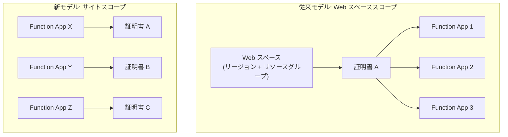

# Azure Functions: Flex Consumption プランにおける TLS/SSL 証明書サポート

**リリース日**: 2026-05-21

**サービス**: Azure Functions

**機能**: Flex Consumption プランでのサイトスコープ証明書モデル (TLS/SSL)

**ステータス**: In preview

[このアップデートのインフォグラフィックを見る](https://takech9203.github.io/azure-news-summary/20260521-functions-flex-consumption-tls-ssl.html)

## 概要

Azure Functions の Flex Consumption プランにおいて、TLS/SSL 証明書のサポートがパブリックプレビューとして提供開始された。Flex Consumption が利用可能なすべてのリージョンで利用できる。

本アップデートでは「サイトスコープ証明書モデル」が導入されている。これは、従来の他のホスティングプラン (Consumption、Premium、Dedicated) で使用されていた「Web スペーススコープ証明書モデル」とは異なり、証明書が個々のアプリケーションに紐づけられる新しいモデルである。従来のモデルでは、同じリージョンおよびリソースグループ内のアプリ間で証明書が共有されていたが、サイトスコープモデルではアプリごとに独立して証明書を管理する。

**アップデート前の課題**

- Flex Consumption プランでカスタムドメインに対する TLS/SSL 証明書を利用できなかった
- Flex Consumption プランでカスタムドメインの HTTPS 通信を設定する手段が限定されていた
- 従来の Web スペーススコープモデルでは、同じリージョン・リソースグループ内のアプリ間で証明書が共有されるため、セキュリティ分離の面で課題があった

**アップデート後の改善**

- Flex Consumption プランでカスタムドメインに対する TLS/SSL 証明書が利用可能になった
- サイトスコープモデルにより、証明書がアプリごとに独立し、セキュリティ分離が向上した
- App Service マネージド証明書、App Service 証明書、Key Vault からのインポート、PFX/CER アップロードなど複数の証明書タイプをサポート

## アーキテクチャ図



従来の Web スペーススコープモデルでは証明書がリージョン・リソースグループ単位で共有されるのに対し、新しいサイトスコープモデルでは各アプリが独自の証明書を保持し、他のアプリとは完全に分離される。

## サービスアップデートの詳細

### 主要機能

1. **サイトスコープ証明書モデル**
   - 証明書が個々の Function App に紐づけられる新しいモデル
   - 同じリージョン・リソースグループ内の他のアプリとは証明書を共有しない
   - セキュリティ分離が従来モデルより向上

2. **複数の証明書タイプのサポート**
   - App Service マネージド証明書 (無料、カスタムドメイン用に自動作成)
   - App Service 証明書 (Azure 経由で購入、インポート)
   - Key Vault からのインポート (PKCS12 証明書)
   - アップロードによるプライベート証明書 (.pfx)
   - アップロードによるパブリック証明書 (.cer)

3. **Key Vault 連携**
   - マネージド ID を使用した Key Vault 認証
   - Key Vault で証明書を更新すると、24 時間以内にプラットフォームのバックグラウンドジョブが自動同期
   - RBAC による「Key Vault Certificate User」ロールの割り当てが推奨

4. **マネージド証明書の自動更新**
   - 無料マネージド証明書はプラットフォームにより自動更新される
   - カスタムドメイン設定時にポータルから直接作成・バインド可能

## 技術仕様

| 項目 | 詳細 |
|------|------|
| プライベート証明書の上限 | アプリあたり最大 3 個 |
| パブリック証明書の上限 | アプリあたり最大 3 個 |
| 証明書形式 (プライベート) | パスワード保護された PFX ファイル (中間証明書・ルート証明書を含む) |
| 証明書形式 (パブリック) | .cer ファイル |
| ECC 証明書 | PFX としてアップロードする場合にサポート |
| E2E 暗号化 | 現時点では未サポート |
| 証明書ファイルパス (パブリック) | `/var/ssl/certs` |
| 証明書ファイルパス (プライベート) | `/var/ssl/private` |
| 証明書の命名規則 | サムプリントで命名 |
| Key Vault 同期間隔 | 24 時間以内に自動同期 |

## 設定方法

### 前提条件

1. Flex Consumption プランで実行されている Function App
2. カスタムドメインの DNS 設定が完了していること
3. Key Vault からインポートする場合は、マネージド ID が有効であること

### Azure Portal

**マネージド証明書の設定:**

1. Azure Portal で Function App に移動
2. 左メニューの **Settings** > **Custom domains** を選択
3. **Add custom domain** を選択
4. **TLS/SSL certificate** で **App Service Managed Certificate** を選択
5. **TLS/SSL type** で **SNI SSL** を選択
6. ドメイン検証を完了し **Add** を選択 (発行まで最大 10 分)

**PFX 証明書のアップロード:**

1. Azure Portal で Function App に移動
2. 左メニューの **Settings** > **Certificates** を選択
3. **Bring your own certificates (.pfx)** > **+ Add certificate** を選択
4. **Source** で **Upload certificate (.pfx)** を選択
5. PFX ファイルを選択し、パスワードを入力
6. **Certificate friendly name** を指定
7. **Validate** > **Add** を選択

**Key Vault からのインポート:**

1. Function App にマネージド ID を割り当てる
2. Key Vault に「Key Vault Certificate User」ロールを付与する
3. Azure Portal で Function App の **Settings** > **Certificates** に移動
4. **Bring your own certificates (.pfx)** > **+ Add certificate** を選択
5. **Source** で **Import from Key Vault** を選択
6. サブスクリプション、Key Vault、証明書を選択して追加

### コードからの証明書アクセス

証明書をコードから利用する場合:

1. Azure Portal で **Settings** > **Certificates** に移動
2. 対象の証明書の **...** (省略記号) を選択し、**Make accessible to app code** を選択
3. Flex Consumption は Linux 上で動作するため、ファイルパスから証明書を読み込む

## メリット

### ビジネス面

- Flex Consumption プランでもカスタムドメインと HTTPS を利用できるようになり、ブランディングやセキュリティ要件を満たしやすくなった
- 無料のマネージド証明書により、追加コストなしで HTTPS 対応が可能
- アプリごとの証明書分離により、マルチテナント環境やチーム間での独立した証明書管理が容易になった

### 技術面

- サイトスコープモデルにより、証明書の影響範囲がアプリ単位に限定され、証明書の更新や失効が他のアプリに影響しない
- Key Vault 連携による自動同期で、証明書ローテーションの運用負荷が軽減される
- ECC 証明書のサポートにより、より強力な暗号化と小さいキーサイズによるパフォーマンス向上が期待できる

## デメリット・制約事項

- プライベート証明書は最大 3 個、パブリック証明書は最大 3 個までの制限がある
- End-to-End (E2E) 暗号化は現時点で未サポート
- Azure CLI での証明書管理はまだ利用できない (Azure Portal または ARM/Bicep テンプレートを使用する必要がある)
- この機能が利用可能になる前に作成された既存の Flex Consumption アプリには、証明書のマイグレーションパスが提供されていない (新しいアプリを作成する必要がある)
- パブリックプレビュー段階であり、GA までに仕様が変更される可能性がある
- Windows 環境の証明書ストアではなく、Linux ファイルパスから証明書を読み込む必要がある

## ユースケース

### ユースケース 1: サーバーレス API のカスタムドメイン HTTPS 化

**シナリオ**: Flex Consumption プランで稼働する REST API に、自社ドメイン (例: `api.example.com`) でセキュアにアクセスさせたい。

**実装**: Azure Portal でカスタムドメインを追加し、マネージド証明書を自動生成・バインドする。無料で自動更新されるため、運用負荷が最小限。

**効果**: 追加コストなしでカスタムドメインの HTTPS 通信を実現し、ブランドの一貫性とセキュリティを両立。

### ユースケース 2: Key Vault による証明書の一元管理

**シナリオ**: 複数の Function App で異なる証明書を使用しているが、証明書のローテーションを一元管理したい。

**実装**: 各アプリの証明書を Azure Key Vault に格納し、マネージド ID を使用して各 Function App にインポート。証明書の更新は Key Vault 側で実施するだけで、24 時間以内に全アプリに自動反映される。

**効果**: 証明書管理の一元化により運用効率が向上し、証明書の期限切れリスクを低減。

### ユースケース 3: クライアント証明書認証 (mTLS)

**シナリオ**: Function App が外部サービスに接続する際に、クライアント証明書を提示する必要がある。

**実装**: PFX 証明書をアップロードし、「Make accessible to app code」を有効化。コードから `/var/ssl/private` パスの証明書ファイルを読み込んで使用する。

**効果**: サーバーレス環境でもクライアント証明書認証が実現でき、セキュアなサービス間通信が可能。

## 料金

TLS/SSL 証明書のサポート自体には追加料金は発生しない。App Service マネージド証明書は無料で提供される。Flex Consumption プラン自体の料金は従量課金モデル (実行時間ベース) に基づく。

詳細な料金情報は [Azure Functions 料金ページ](https://azure.microsoft.com/pricing/details/functions/) を参照。

## 利用可能リージョン

Flex Consumption プランが利用可能なすべてのリージョンで本機能を利用できる。利用可能なリージョンの一覧は以下のコマンドで確認可能:

```bash
az functionapp list-flexconsumption-locations --query "sort_by(@, &name)[].{Region:name}" -o table
```

## 関連サービス・機能

- **Azure Key Vault**: 証明書の一元管理と自動同期に利用。マネージド ID による認証をサポート
- **Azure App Service**: 同じ証明書基盤を共有。App Service マネージド証明書や App Service 証明書が利用可能
- **Azure DNS**: カスタムドメインの DNS 設定に利用
- **Azure Functions Flex Consumption プラン**: 本機能のベースとなるホスティングプラン。サーバーレスの従量課金、VNet 統合、高速スケールアウトを提供

## 参考リンク

- [インフォグラフィック](https://takech9203.github.io/azure-news-summary/20260521-functions-flex-consumption-tls-ssl.html)
- [公式アップデート情報](https://azure.microsoft.com/updates?id=562808)
- [Microsoft Learn - Flex Consumption プラン概要](https://learn.microsoft.com/azure/azure-functions/flex-consumption-plan)
- [Microsoft Learn - サイトスコープ証明書の設定](https://learn.microsoft.com/azure/azure-functions/flex-consumption-how-to#configure-site-scoped-certificates)
- [Microsoft Learn - Azure Functions セキュリティ](https://learn.microsoft.com/azure/azure-functions/security-concepts)
- [料金ページ](https://azure.microsoft.com/pricing/details/functions/)

## まとめ

Azure Functions Flex Consumption プランにおける TLS/SSL 証明書サポートのパブリックプレビューにより、サーバーレスアプリケーションでのカスタムドメイン HTTPS 化が実現した。新たに導入された「サイトスコープ証明書モデル」は、従来の Web スペーススコープモデルとは異なり、証明書をアプリ単位で分離管理する設計となっている。これにより、セキュリティ分離の向上と、アプリごとの独立した証明書ライフサイクル管理が可能になる。

Solutions Architect としての推奨アクションとして、Flex Consumption プランでカスタムドメインを使用している場合は本機能の検証を開始し、Key Vault との連携による証明書自動管理の構築を検討することが望ましい。ただし、アプリあたりの証明書数上限 (プライベート 3 個、パブリック 3 個) や E2E 暗号化未サポートなどの制約を考慮し、要件に適合するか事前に確認すること。

---

**タグ**: #Azure #AzureFunctions #FlexConsumption #TLS #SSL #Certificate #Security #Serverless #PublicPreview #CustomDomain
