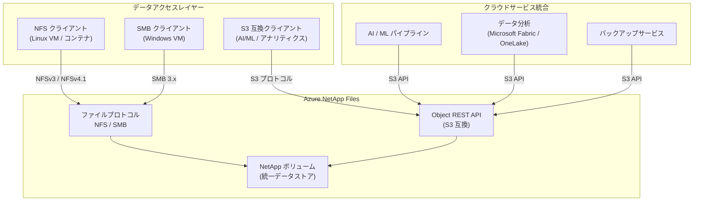

# Azure NetApp Files: Object REST API (S3 互換 REST API) の一般提供開始

**リリース日**: 2026-05-21

**サービス**: Azure NetApp Files

**機能**: Object REST API (S3 互換 REST API)

**ステータス**: Launched (GA)

[このアップデートのインフォグラフィックを見る](https://takech9203.github.io/azure-news-summary/20260521-netapp-files-object-rest-api.html)

## 概要

Azure NetApp Files の Object REST API (S3 互換 REST API) が一般提供 (GA) になりました。この機能は、従来のファイルベースストレージとモダンクラウドサービスのギャップを埋めるものであり、既存のデータを新しい方法で活用することを可能にします。Object REST API を使用することで、AI、アナリティクス、バックアップサービスなど、オブジェクトベースのアクセスを必要とするサービスと Azure NetApp Files をシームレスに統合できます。

Azure NetApp Files は従来から NFS、SMB、デュアルプロトコルをサポートしてきましたが、Object REST API の追加により、S3 プロトコルベースのオブジェクトアクセスが新たにサポートされました。これにより、既存のファイルストレージに保存されたデータに対して、ファイルプロトコルとオブジェクトプロトコルの両方からアクセスできるマルチプロトコル環境が実現します。

この機能は特に、AI/ML パイプラインやデータ分析ワークロードにおいて重要です。多くの AI フレームワークやデータ分析ツールは S3 互換の API を前提として設計されており、Object REST API によってこれらのツールから Azure NetApp Files のデータに直接アクセスできるようになります。

**アップデート前の課題**

- AI/ML フレームワークやデータ分析ツールがオブジェクトストレージ (S3 互換 API) を要求し、Azure NetApp Files のデータを直接利用できなかった
- ファイルベースストレージのデータをオブジェクトストレージに移行・コピーする必要があり、データの二重管理が発生
- バックアップサービスがオブジェクトベースのアクセスを要求する場合、別途オブジェクトストレージの構築が必要
- ファイルプロトコルとオブジェクトプロトコルで異なるストレージサービスを運用する運用負荷

**アップデート後の改善**

- 同一の Azure NetApp Files ボリュームに対して、NFS/SMB とオブジェクト REST API (S3 互換) の両方からアクセス可能
- AI、アナリティクス、バックアップサービスとの直接統合が実現
- データの移行やコピーが不要となり、ストレージコストと運用負荷を削減
- Microsoft Fabric (OneLake) との統合も Object REST API を通じて可能

## アーキテクチャ図



Azure NetApp Files のボリュームに対して、従来のファイルプロトコル (NFS/SMB) に加えて Object REST API (S3 互換) からのアクセスが可能になり、AI/ML、データ分析、バックアップなどのモダンクラウドサービスとの直接統合を実現します。

## サービスアップデートの詳細

### 主要機能

1. **S3 互換 REST API**
   - S3 プロトコルに基づくオブジェクトベースのアクセスを提供し、S3 互換ツールやサービスからの直接接続を実現

2. **マルチプロトコルアクセス**
   - 同一ボリュームに対して NFS、SMB、Object REST API からの同時アクセスが可能。既存のファイルワークロードを維持しながらオブジェクトアクセスを追加

3. **AI/ML ワークロードとの統合**
   - オブジェクトベースのアクセスを要求する AI フレームワークやデータパイプラインとのシームレスな連携

4. **データ分析サービスとの統合**
   - Microsoft Fabric (OneLake) などのデータ分析プラットフォームと Object REST API を通じて連携可能

5. **バックアップサービスとの統合**
   - オブジェクトベースのアクセスを使用するバックアップソリューションからの直接アクセスをサポート

## 技術仕様

| 項目 | 詳細 |
|------|------|
| プロトコル | S3 互換 REST API |
| 既存プロトコルとの共存 | NFS (v3, v4.1)、SMB (3.0, 3.1.1) と同時利用可能 |
| パフォーマンスティア | Elastic zone-redundant、Flexible、Standard、Premium、Ultra |
| ボリュームサイズ | 50 GiB - 100 TiB |
| 容量プールサイズ | 1 TiB - 2,048 TiB |
| データ暗号化 | プラットフォームマネージドキーまたはカスタマーマネージドキー |
| 統合先例 | AI/ML パイプライン、Microsoft Fabric (OneLake)、バックアップサービス |

## 設定方法

### 前提条件

1. Azure NetApp Files アカウントおよび容量プールの作成
2. Azure NetApp Files ボリュームの作成 (委任サブネットの構成)
3. Object REST API 機能の有効化

### 基本的な接続

```bash
# Azure NetApp Files の Object REST API エンドポイントに対して
# S3 互換クライアントから接続
# 具体的な設定手順は Microsoft Learn ドキュメントを参照
```

詳細な設定手順については、Microsoft Learn の Azure NetApp Files Object REST API ドキュメントを参照してください。

## メリット

### ビジネス面

- データの二重管理が不要になることによるストレージコストの削減
- AI/ML やデータ分析プロジェクトの迅速な立ち上げ (既存データの即座の活用)
- 単一のストレージサービスでファイルとオブジェクトの両方のニーズに対応し、運用の簡素化を実現
- モダンクラウドサービスとの統合による新しいビジネス価値の創出

### 技術面

- S3 互換エコシステムの広範なツールチェーンをそのまま利用可能
- データ移行が不要なため、整合性の問題やデータ同期の複雑さを回避
- Azure NetApp Files のエンタープライズ機能 (スナップショット、レプリケーション、暗号化) をオブジェクトアクセスデータにも適用
- 高性能なベアメタルフラッシュインフラストラクチャ上でのオブジェクトアクセスを実現

## デメリット・制約事項

- S3 API の全機能をサポートしているかどうかは公式ドキュメントでの確認が必要 (一部の S3 操作は未サポートの可能性あり)
- Azure NetApp Files 自体の前提条件 (容量プールの最小サイズ、委任サブネットの構成) が引き続き必要
- オブジェクトアクセスとファイルアクセスの同時利用時の権限管理やアクセス制御の設計が必要
- 料金体系について、オブジェクトアクセスに対する追加コストの有無は公式料金ページでの確認を推奨

## ユースケース

### ユースケース 1: AI/ML トレーニングデータの活用

**シナリオ**: NFS でマウントされた Azure NetApp Files ボリュームに蓄積された大量のトレーニングデータを、S3 互換 API を要求する AI/ML フレームワーク (PyTorch、TensorFlow のデータローダー等) から直接利用したい

**効果**: データのコピーや移行が不要で、既存のファイルベースのワークフローを維持しながら、AI/ML パイプラインからも同じデータに直接アクセス可能。ストレージコストの二重化を回避し、データの鮮度も保証

### ユースケース 2: Microsoft Fabric / OneLake との統合

**シナリオ**: Azure NetApp Files に保存されたエンタープライズデータを Microsoft Fabric のデータ分析基盤から活用したい

**効果**: Object REST API を通じて OneLake と Azure NetApp Files を接続し、既存のファイルデータをデータレイクハウスアーキテクチャに組み込むことが可能。データサイロの解消とリアルタイムに近い分析を実現

### ユースケース 3: オブジェクトベースのバックアップソリューション

**シナリオ**: S3 互換のバックアップツール (Veeam 等) を使用して、Azure NetApp Files のデータをバックアップしたい

**効果**: Object REST API により、S3 互換バックアップツールから直接 Azure NetApp Files にアクセスでき、追加のゲートウェイやデータコピーなしにバックアップワークフローを構築可能

## 料金

Azure NetApp Files の Object REST API は、Azure NetApp Files の容量プール内のプロビジョニング容量に基づいて課金されます。Object REST API へのアクセスに対する追加料金の有無については、最新の料金ページで確認してください。

| パフォーマンスティア | 概要 |
|------|------|
| Standard | コスト効率重視のワークロード向け |
| Premium | 汎用エンタープライズワークロード向け |
| Ultra | 最高パフォーマンスが必要なワークロード向け |
| Flexible | ワークロードに応じて柔軟にパフォーマンスを調整 |
| Elastic zone-redundant | ゾーン冗長性を備えた高可用性ワークロード向け |

詳細な料金情報は [Azure NetApp Files 料金ページ](https://azure.microsoft.com/pricing/details/netapp/) を参照してください。

## 関連サービス・機能

- **Azure Blob Storage**: Azure のネイティブオブジェクトストレージ。Object REST API により、Azure NetApp Files がオブジェクトアクセスの代替手段を提供
- **Microsoft Fabric (OneLake)**: Object REST API を通じて Azure NetApp Files のデータを統合可能なデータ分析プラットフォーム
- **Azure NetApp Files キャッシュボリューム**: ハイブリッド環境でのデータキャッシュ機能。Object REST API と組み合わせることで多様なアクセスパターンに対応
- **Azure NetApp Files スナップショット/バックアップ**: Object REST API でアクセスされるデータにもエンタープライズレベルのデータ保護を提供
- **Azure Machine Learning**: S3 互換データストアとして Azure NetApp Files を活用可能

## 参考リンク

- [インフォグラフィック](https://takech9203.github.io/azure-news-summary/20260521-netapp-files-object-rest-api.html)
- [公式アップデート情報](https://azure.microsoft.com/updates?id=562254)
- [Microsoft Learn ドキュメント - Object REST API](https://learn.microsoft.com/en-us/azure/azure-netapp-files/object-storage-introduction)
- [Azure NetApp Files ドキュメント](https://learn.microsoft.com/en-us/azure/azure-netapp-files/)
- [料金ページ](https://azure.microsoft.com/pricing/details/netapp/)
- [リージョン別利用可能性](https://azure.microsoft.com/explore/global-infrastructure/products-by-region/?products=netapp)

## まとめ

Azure NetApp Files Object REST API (S3 互換 REST API) の GA は、エンタープライズファイルストレージとモダンクラウドサービスの統合において重要なマイルストーンです。従来のファイルベースストレージに S3 互換のオブジェクトアクセスレイヤーを追加することで、データの移行やコピーなしに AI、アナリティクス、バックアップサービスとの連携を実現します。

Solutions Architect としては、以下のアクションを推奨します:

- AI/ML ワークロードやデータ分析パイプラインで Azure NetApp Files のデータを活用する場合、Object REST API の導入を検討
- 既存の S3 互換ツールチェーンとの互換性を確認し、移行計画を策定
- ファイルアクセスとオブジェクトアクセスの共存時のアクセス制御設計を事前に計画
- Microsoft Fabric (OneLake) との統合によるデータ分析基盤の拡充を検討

---

**タグ**: #AzureNetAppFiles #Storage #ObjectStorage #S3Compatible #REST_API #AI #Analytics #GA #MultiProtocol
