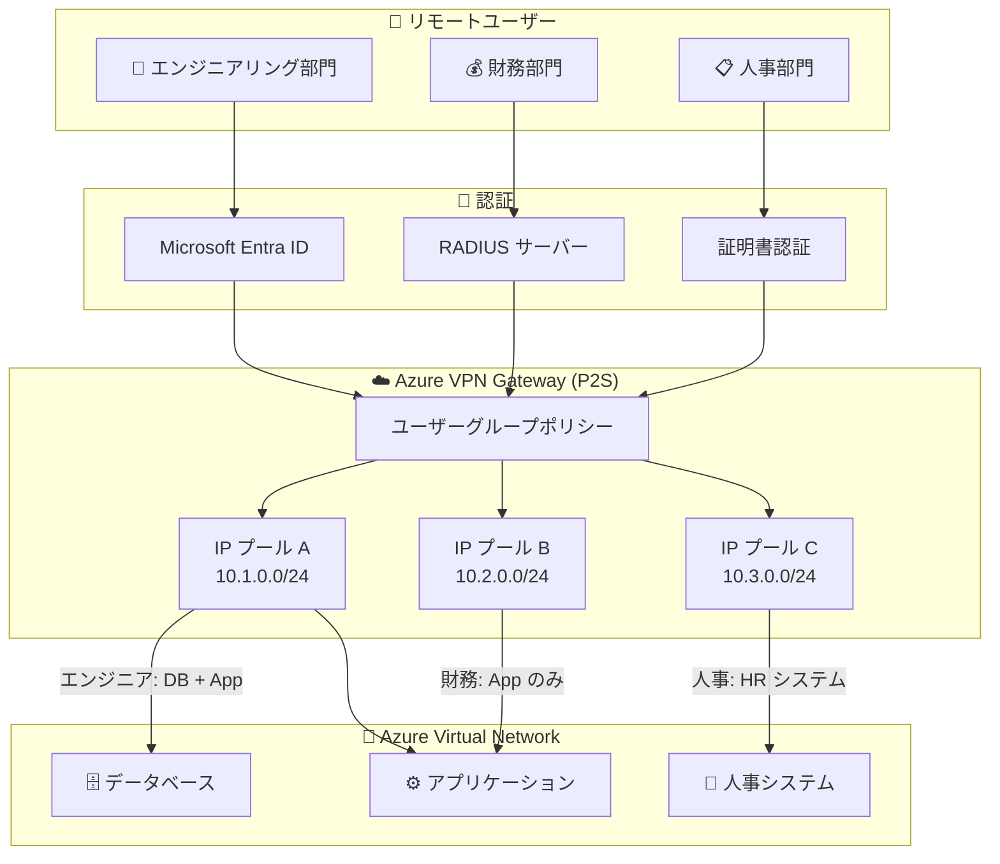

# VPN Gateway: P2S 接続のユーザーグループと IP アドレスプール (GA)

**リリース日**: 2026-05-21

**サービス**: Azure VPN Gateway

**機能**: User Groups and IP Address Pools for Point-to-Site connections

**ステータス**: Launched (GA)

[このアップデートのインフォグラフィックを見る](https://takech9203.github.io/azure-news-summary/20260521-vpn-gateway-p2s-user-groups.html)

## 概要

Azure VPN Gateway の Point-to-Site (P2S) 接続において、ユーザーグループと IP アドレスプールの機能が一般提供 (GA) となった。この機能により、リモートユーザーの認証情報 (資格情報) に基づいて、異なる IP アドレスプールを割り当てることが可能になる。

管理者はリモートユーザーを個別のグループに整理し、各グループに固有の IP アドレスプールをマッピングできる。これにより、ユーザーの所属や役割に応じたネットワークセグメンテーションが実現され、ファイアウォールルールや NSG によるきめ細かいアクセス制御が可能になる。

**アップデート前の課題**

- P2S 接続ではすべてのリモートユーザーに対して単一のアドレスプールから IP アドレスが割り当てられていた
- ユーザーの所属部門や役割に基づいたネットワークレベルのアクセス制御が困難だった
- IP アドレスベースのファイアウォールルールでユーザーグループを区別するには、別途 VPN ゲートウェイの分割が必要だった

**アップデート後の改善**

- ユーザーの認証情報に基づき、グループごとに異なる IP アドレスプールから IP アドレスが自動割り当てされる
- 単一の VPN Gateway で複数のユーザーグループに対して異なるネットワークポリシーを適用可能になった
- Microsoft Entra ID グループ、RADIUS 属性、証明書の共通名 (CN) によるグループ識別が可能

## アーキテクチャ図

ユーザーグループごとに異なる IP アドレスプールが割り当てられ、NSG やファイアウォールルールで IP アドレス範囲に基づくアクセス制御が実現される。

## サービスアップデートの詳細

### 主要機能

1. **ユーザーグループ (ポリシーグループ)**
   - ユーザーの論理的なグループ化を定義
   - 各グループに固有の IP アドレスプールをマッピング
   - デフォルトグループの指定により、どのグループにも一致しないユーザーを処理

2. **グループメンバー (ポリシーメンバー)**
   - 接続ユーザーがどのグループに属するかを判定するための条件を定義
   - 認証方式に応じて異なるメンバー識別パラメータを使用
   - 1 つのグループに複数のメンバー条件を設定可能

3. **優先度によるグループ解決**
   - 各グループに数値優先度を割り当て
   - ユーザーが複数グループの条件に一致する場合、最も低い優先度 (最高優先) のグループに割り当て
   - デフォルトグループは条件に一致しないユーザーのフォールバック先

4. **複数認証方式対応のグループポリシー**
   - Microsoft Entra ID: グループオブジェクト ID による判定
   - RADIUS: ベンダー固有属性 (VSA) MS-Azure-Policy-ID による判定
   - 証明書: 共通名 (CN) のドメイン名による判定

## 技術仕様

| 項目 | 詳細 |
|------|------|
| 最大グループ数 | 1 ゲートウェイあたり最大 90 グループ |
| 最大ポリシーメンバー数 | 1 ゲートウェイに割り当てられた全グループで合計 390 メンバー |
| 対応認証方式 | Microsoft Entra ID、RADIUS、証明書認証 |
| Microsoft Entra ID メンバータイプ | AADGroupID (グループオブジェクト ID) |
| RADIUS メンバータイプ | AzureRADIUSGroupID (VSA、6ad1bd で始まる 16 進数) |
| 証明書メンバータイプ | AzureCertificateID (CN のドメイン名) |
| 対応トンネルタイプ | OpenVPN (Entra ID)、OpenVPN + IKEv2 (証明書、RADIUS) |
| 対応 SKU | VpnGw1 以上 (Basic SKU は非対応) |
| RADIUS VSA Vendor-Type | 0x41 (integer: 65) |
| RADIUS VSA 値の形式 | 6ad1bd で始まる 16 進数オクテット文字列 |

## 設定方法

### 前提条件

1. VPN Gateway (VpnGw1 SKU 以上) が作成済みであること
2. P2S VPN 接続が構成済みであること
3. 認証方式に応じた認証基盤が構成済みであること (Microsoft Entra ID / RADIUS / PKI)

### Microsoft Entra ID 認証の場合

**1. ユーザーグループの定義**

VPN サーバー構成で、Microsoft Entra ID グループオブジェクト ID を使用してポリシーグループを作成する。

**2. デフォルトグループの指定**

1 つのグループをデフォルトとして設定する。どのグループ条件にも一致しないユーザーはこのグループに割り当てられる。

**3. IP アドレスプールの割り当て**

各グループ (またはグループの組み合わせ) に対して、重複しない IP アドレスプールを割り当てる。

**4. Azure VPN Client の構成**

ユーザーのクライアント端末に Azure VPN Client をインストールし、対応するプロファイル構成パッケージを配布する。

### RADIUS 認証の場合

**1. RADIUS サーバーで VSA を構成**

RADIUS サーバーの Access-Accept パケットに MS-Azure-Policy-ID VSA を含めるよう構成する。同じグループのユーザーには同じ VSA 値を返すようにする。

**2. VSA 値の形式**

VSA 値は `6ad1bd` で始まる 16 進数オクテット文字列とする (例: `6ad1bd98`)。

### 証明書認証の場合

ユーザー証明書の共通名 (CN) のドメイン部分でグループを識別する。CN は以下の形式のいずれかである必要がある:
- `DOMAIN\username`
- `username@domain.com`

グループメンバーにはドメイン名 (例: `engineering.contoso.com`) を指定する。

## メリット

### ビジネス面

- 部門別・役割別のネットワークセグメンテーションにより、内部セキュリティポリシーの実装が容易になる
- 単一の VPN Gateway で複数のセキュリティゾーンを管理でき、インフラストラクチャコストの最適化が可能
- コンプライアンス要件 (部門間のデータ分離) への対応が簡素化される

### 技術面

- IP アドレスベースの NSG / ファイアウォールルールと組み合わせることで、ユーザーグループ単位のアクセス制御が実現される
- 複数の VPN Gateway を部門別に分割する必要がなくなり、構成管理の複雑さが軽減される
- Microsoft Entra ID、RADIUS、証明書認証の 3 種類の認証方式に対応し、既存の認証基盤を活用できる
- 優先度によるグループ解決メカニズムにより、複数グループに属するユーザーの処理が予測可能

## デメリット・制約事項

- Basic SKU VPN Gateway では利用不可
- 1 ゲートウェイあたり最大 90 グループ、合計 390 ポリシーメンバーの上限がある
- グループ名とデフォルト設定は作成後に変更不可
- アドレスプールは同一 Virtual WAN 内の他の接続構成と重複不可
- アドレスプールは VNet アドレス空間、仮想ハブアドレス空間、オンプレミスアドレスとも重複不可
- Microsoft Entra ID 認証は OpenVPN プロトコルのみ対応 (IKEv2 非対応)
- 外部ユーザー (Microsoft Entra テナント外) はユーザータイプが "Member" である必要があり、"Guest" は正しくグループ判定されない場合がある
- 入れ子のグループ (ネストされたグループ) はサポートされない
- グループが既存の P2S VPN ゲートウェイで使用中の場合は削除不可

## ユースケース

### ユースケース 1: 部門別アクセス制御

**シナリオ**: 企業の財務部門、エンジニアリング部門、人事部門それぞれが異なるリソースへのアクセスを必要とする環境

**実装例**:
- 財務部門: IP プール 10.10.0.0/24 → NSG で財務データベースへのアクセスのみ許可
- エンジニアリング部門: IP プール 10.20.0.0/24 → NSG で開発環境へのフルアクセスを許可
- 人事部門: IP プール 10.30.0.0/24 → NSG で人事システムへのアクセスのみ許可

**効果**: 単一の VPN Gateway で部門別のマイクロセグメンテーションを実現し、最小権限の原則を適用できる

### ユースケース 2: 外部パートナーと社内ユーザーの分離

**シナリオ**: 社外のパートナー企業にも VPN アクセスを提供するが、社内リソースとは完全に分離したい

**実装例**:
- 社内ユーザー: IP プール 10.100.0.0/24 → 社内リソースへのフルアクセス
- 外部パートナー: IP プール 10.200.0.0/24 → 共有ファイルサーバーのみアクセス可能

**効果**: 外部パートナーのトラフィックを IP アドレスで容易に識別し、ファイアウォールで制限できる

### ユースケース 3: 規制環境でのデータ分離

**シナリオ**: 金融規制や医療規制で特定部門のネットワークトラフィックを他部門から分離する必要がある

**効果**: IP アドレスプールの分離とネットワークセキュリティルールの組み合わせにより、規制要件に準拠したネットワーク分離を実現できる

## 料金

ユーザーグループと IP アドレスプール機能自体に追加料金は発生しない。VPN Gateway の標準料金 (SKU に応じた時間課金および P2S 接続数に応じた課金) が適用される。

詳細な料金情報: [Azure VPN Gateway の価格](https://azure.microsoft.com/pricing/details/vpn-gateway/)

## 関連サービス・機能

- **Microsoft Entra ID**: ユーザーグループの識別に Entra ID グループオブジェクト ID を使用
- **Azure Network Security Groups (NSG)**: IP アドレスプールに基づくアクセス制御ルールの適用
- **Azure Firewall**: グループ別 IP レンジに対するファイアウォールポリシーの適用
- **Azure Virtual WAN**: Virtual WAN の P2S User VPN でも同様のユーザーグループ機能を提供
- **RADIUS サーバー**: ベンダー固有属性 (VSA) によるグループ識別に使用
- **Azure VPN Client**: P2S 接続のクライアントソフトウェア

## 参考リンク

- [インフォグラフィック](https://takech9203.github.io/azure-news-summary/20260521-vpn-gateway-p2s-user-groups.html)
- [公式アップデート情報](https://azure.microsoft.com/updates?id=564460)
- [Microsoft Learn - About Point-to-Site VPN](https://learn.microsoft.com/azure/vpn-gateway/point-to-site-about)
- [Microsoft Learn - Configure P2S VPN access based on users and groups](https://learn.microsoft.com/azure/vpn-gateway/point-to-site-entra-users-access)
- [Microsoft Learn - About user groups and IP address pools (Virtual WAN)](https://learn.microsoft.com/azure/virtual-wan/user-groups-about)
- [料金ページ](https://azure.microsoft.com/pricing/details/vpn-gateway/)

## まとめ

Azure VPN Gateway P2S 接続のユーザーグループと IP アドレスプール機能が GA となり、リモートユーザーの認証情報に基づいてグループ別に異なる IP アドレスを割り当てることが可能になった。Microsoft Entra ID、RADIUS、証明書認証の 3 種類の認証方式に対応し、既存の認証基盤を活用したネットワークセグメンテーションが実現できる。

Solutions Architect としては、以下のアクションを推奨する:
- 複数部門がリモートアクセスを利用する環境では、ユーザーグループによるネットワーク分離の導入を検討する
- NSG やファイアウォールルールと組み合わせて、IP アドレスプールベースのアクセス制御を設計する
- 既存の単一アドレスプール構成を見直し、最小権限の原則に基づくグループ設計を行う
- 1 ゲートウェイあたり 90 グループ / 390 メンバーの上限を考慮してキャパシティプランニングを行う

---

**タグ**: #Azure #VPNGateway #Networking #Security #PointToSite #UserGroups #IPAddressPools #NetworkSegmentation #ZeroTrust
