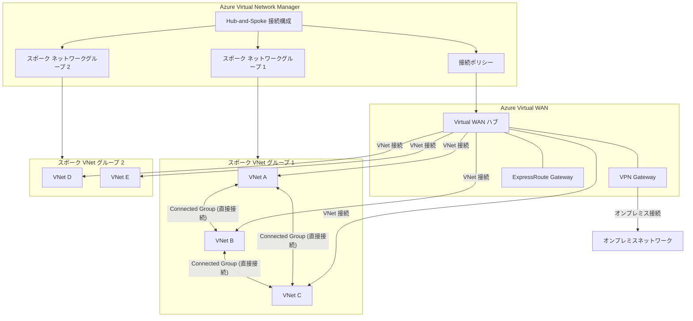

# Azure Virtual Network Manager: Virtual WAN 統合 (パブリックプレビュー)

**リリース日**: 2026-05-26

**サービス**: Azure Virtual Network Manager / Azure Virtual WAN

**機能**: Azure Virtual Network Manager と Virtual WAN の統合

**ステータス**: パブリックプレビュー

[このアップデートのインフォグラフィックを見る](https://takech9203.github.io/azure-news-summary/20260526-virtual-network-manager-virtual-wan.html)

## 概要

Azure Virtual Network Manager (AVNM) の Hub-and-Spoke 接続構成において、Azure Virtual WAN ハブをハブとして使用できるようになりました。これにより、AVNM のネットワークグループベースの一元管理機能と、Virtual WAN の高度なルーティング・接続機能を組み合わせて利用できるようになります。

Virtual WAN ハブを選択すると、AVNM はスポークネットワークグループ内の仮想ネットワークと Virtual WAN ハブ間に Virtual WAN 仮想ネットワーク接続を自動的に作成・更新します。

**アップデート前の課題**
- Azure Virtual Network Manager の Hub-and-Spoke 構成では、通常の仮想ネットワーク (VNet) のみがハブとして使用可能だった
- Virtual WAN を利用する大規模ネットワークでは、AVNM のネットワークグループによるポリシーベースの一元管理を直接活用できなかった
- Virtual WAN 環境と AVNM 環境を別々に管理する必要があり、運用の複雑さが増していた

**アップデート後の改善**
- Virtual WAN ハブを AVNM の Hub-and-Spoke 構成のハブとして直接指定可能
- ネットワークグループを活用し、Virtual WAN ハブへのスポーク VNet 接続をポリシーベースで自動管理
- 接続ポリシーの適用により、VNet 接続の設定を一貫して制御
- スポーク VNet 間の直接接続 (Connected Group) やグローバルメッシュも併用可能

## アーキテクチャ図

この図は、Azure Virtual Network Manager が Virtual WAN ハブを中心とした Hub-and-Spoke トポロジを管理する構成を示しています。AVNM の接続構成がネットワークグループとスポーク VNet を管理し、Virtual WAN ハブを介して接続を確立します。スポークネットワークグループ内で直接接続を有効にすると、Connected Group によるスポーク間の直接通信も可能です。

## サービスアップデートの詳細

### 主要機能

| 機能 | 説明 |
|------|------|
| Virtual WAN ハブの選択 | Hub-and-Spoke 接続構成でハブとして Virtual WAN ハブを指定可能 |
| 接続ポリシー | Virtual WAN 仮想ネットワーク接続に適用するポリシーを選択・作成 |
| ネットワークグループによるスポーク管理 | スポーク VNet をネットワークグループで動的に管理 |
| 直接接続 (Direct Connectivity) | 同一スポークネットワークグループ内の VNet 間で直接接続を有効化可能 |
| グローバルメッシュ | リージョン間のスポーク VNet 直接接続をサポート |
| 自動接続管理 | スポークグループへの VNet 追加・削除時に Virtual WAN 接続を自動作成・更新 |

### 動作の仕組み

- Hub-and-Spoke 接続構成で Virtual WAN ハブを選択すると、AVNM はスポークネットワークグループ内の VNet に対して Virtual WAN 仮想ネットワーク接続を作成・更新する
- 従来の VNet ハブの場合は VNet ピアリングが使用されるのに対し、Virtual WAN ハブの場合は Virtual WAN VNet 接続が使用される
- 直接接続を有効にすると、スポーク VNet 間に Connected Group が形成され、ハブを経由せずに直接通信が可能

## 設定方法

Azure ポータルでの設定手順:

1. Azure Virtual Network Manager インスタンスを作成 (または既存のものを使用)
2. ネットワークグループを作成し、スポーク VNet を追加 (静的または Azure Policy による動的メンバーシップ)
3. **接続構成** を作成し、トポロジとして「Hub-and-Spoke」を選択
4. ハブとして **Virtual WAN ハブ** を選択
5. 接続ポリシーを選択または新規作成
6. スポークネットワークグループを追加
7. 必要に応じて直接接続やグローバルメッシュを有効化
8. 構成をデプロイ (対象リージョンを指定)

## メリット

- **一元管理の統合**: Virtual WAN の高度なルーティング機能と AVNM のポリシーベース管理を組み合わせて活用
- **スケーラビリティ**: ネットワークグループと Azure Policy を活用し、大規模環境でのスポーク VNet 管理を自動化
- **運用効率の向上**: VNet の追加・削除時に Virtual WAN 接続が自動的に管理されるため、手動作業を削減
- **柔軟なトポロジ**: 直接接続やグローバルメッシュを併用することで、要件に応じたネットワークトポロジを構築可能
- **セキュリティポリシーの適用**: AVNM のセキュリティ管理ルールを Virtual WAN 環境にも適用可能

## デメリット・制約事項

- **プレビュー段階**: SLA が提供されず、本番ワークロードへの使用は推奨されない
- **リージョン制限**: 利用可能なリージョンが限定されている (下記参照)
- **機能変更の可能性**: プレビュー期間中に機能、可用性、その他の仕様が変更される可能性がある

## ユースケース

- **大規模エンタープライズネットワーク**: 複数のサブスクリプションにまたがる数百の VNet を Virtual WAN ハブ経由で接続し、AVNM のネットワークグループで組織単位ごとに管理
- **マルチリージョン展開**: Virtual WAN のグローバルトランジット機能と AVNM の一元管理を組み合わせて、リージョン間接続を効率的に運用
- **段階的移行**: 既存の Virtual WAN 環境に AVNM のポリシーベース管理を段階的に導入し、運用の自動化を推進
- **スポーク間直接通信の最適化**: レイテンシ削減のためにスポーク VNet 間の直接接続を有効にしつつ、Virtual WAN ハブ経由のオンプレミス接続も維持

## 利用可能リージョン

プレビュー段階で利用可能なリージョン:

- West Central US
- Australia Central
- Australia Southeast
- Brazil South
- Canada Central
- North Europe
- France South
- Germany Northeast
- Germany West Central
- Central India
- West India
- Japan East
- Korea Central
- Malaysia South
- Malaysia West
- Mexico Central
- Norway West
- Qatar Central
- South Africa North
- Sweden Central
- Switzerland West
- Taiwan North
- UAE Central
- East US
- West US
- West US 2

## 関連サービス・機能

| サービス/機能 | 関連性 |
|--------------|--------|
| Azure Virtual WAN | ハブとして使用される WAN サービス |
| Azure Virtual Network Manager | ネットワークの一元管理サービス |
| VNet ピアリング | 従来の Hub-and-Spoke 接続方式 (VNet ハブ使用時) |
| Connected Group | スポーク間直接接続の仕組み |
| セキュリティ管理ルール | NSG より優先されるセキュリティポリシー |
| ネットワークグループ | VNet の論理的グルーピング |
| Azure Policy | ネットワークグループの動的メンバーシップ管理 |

## 参考リンク

- [Azure Update: Azure Virtual Network Manager integration with Virtual WAN](https://azure.microsoft.com/updates?id=564478)
- [Connectivity Configurations in Azure Virtual Network Manager - Microsoft Learn](https://learn.microsoft.com/en-us/azure/virtual-network-manager/concept-connectivity-configuration)
- [What is Azure Virtual Network Manager? - Microsoft Learn](https://learn.microsoft.com/en-us/azure/virtual-network-manager/overview)
- [Common use cases for Azure Virtual Network Manager - Microsoft Learn](https://learn.microsoft.com/en-us/azure/virtual-network-manager/concept-use-cases)

## まとめ

Azure Virtual Network Manager と Virtual WAN の統合は、大規模ネットワーク管理における重要な進展です。これまで別々に管理されていた AVNM のポリシーベースのネットワーク管理機能と、Virtual WAN の高度なルーティング・グローバルトランジット機能が統合されることで、エンタープライズ環境におけるネットワーク運用の効率化が期待されます。

特に、ネットワークグループを活用した VNet の動的管理と Virtual WAN 接続の自動化の組み合わせは、数百から数千の VNet を運用する大規模環境において大きなメリットをもたらします。現時点ではパブリックプレビューであり利用可能リージョンに制限がありますが、GA に向けて対応リージョンの拡大が見込まれます。

---

**タグ**: #Azure #VirtualNetworkManager #VirtualWAN #Networking #HubAndSpoke #Preview #NetworkManagement
