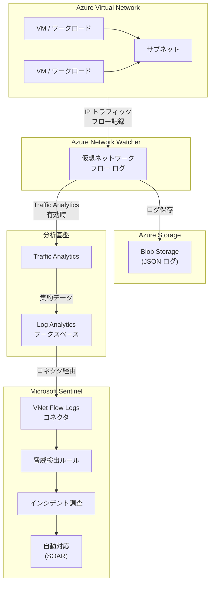

# Network Watcher / Microsoft Sentinel: 仮想ネットワーク フロー ログ コネクタの一般提供開始

**リリース日**: 2026-05-26

**サービス**: Azure Network Watcher, Microsoft Sentinel

**機能**: Virtual network flow logs connector with Microsoft Sentinel

**ステータス**: GA (一般提供)

[このアップデートのインフォグラフィックを見る](https://takech9203.github.io/azure-news-summary/20260526-vnet-flow-logs-sentinel-connector.html)

## 概要

Azure 仮想ネットワーク フロー ログと Microsoft Sentinel のコネクタが一般提供 (GA) となった。この統合により、ネットワーク トラフィック データを Sentinel ワークスペースにシームレスにエクスポートし、セキュリティ運用ワークフロー内で分析できるようになる。ネットワーク レベルの豊富なテレメトリを活用した高度な脅威検出、調査、および対応が可能となる。

仮想ネットワーク フロー ログは Azure Network Watcher の機能であり、仮想ネットワークを通過する IP トラフィックの情報をログに記録する。従来の NSG フロー ログと比較して、仮想ネットワーク全体のスコープでトラフィックを監視でき、暗号化状態の識別や Azure Virtual Network Manager セキュリティ管理ルールの評価にも対応している。

**アップデート前の課題**

- フロー ログ データをセキュリティ分析に活用するには、手動でのデータ エクスポートや複雑な連携設定が必要だった
- ネットワーク レベルのテレメトリとセキュリティ イベントの相関分析が困難
- 脅威検出においてネットワーク トラフィック パターンをリアルタイムに活用する仕組みが限定的だった
- NSG フロー ログではサブネット/NIC 単位での設定が必要で、スコープ管理が煩雑

**アップデート後の改善**

- Sentinel ワークスペースへのシームレスなデータ エクスポートが可能に
- ネットワーク トラフィック データを活用した高度な脅威検出ルールの作成が容易に
- セキュリティ インシデント調査時にネットワーク フロー情報を直接参照可能
- 仮想ネットワーク単位での一元的なフロー ログ管理と Sentinel 統合

## アーキテクチャ図



この図は、仮想ネットワーク内のトラフィックが Network Watcher によってフロー ログとして記録され、Traffic Analytics を経由して Log Analytics ワークスペースに集約された後、Sentinel コネクタを通じて脅威検出・調査・対応のワークフローに組み込まれる全体的なデータ フローを示している。

## サービスアップデートの詳細

### 主要機能

1. **シームレスなデータ エクスポート**: 仮想ネットワーク フロー ログのデータを Microsoft Sentinel ワークスペースに直接取り込み可能
2. **ネットワーク レベルのテレメトリ**: レイヤー 4 (OSI モデル) で動作し、仮想ネットワークを通過するすべての IP フローを記録
3. **セキュリティ運用統合**: Sentinel の脅威検出、調査、対応ワークフロー内でネットワーク トラフィック データを活用
4. **5 タプル情報**: 送信元/送信先 IP アドレス、送信元/送信先ポート、プロトコルの完全な情報を提供
5. **暗号化状態の識別**: 仮想ネットワーク暗号化を使用している場合のトラフィック暗号化状態を評価
6. **NSG ルールおよび Virtual Network Manager ルールの評価**: 許可/拒否されたトラフィックの識別

### NSG フロー ログとの比較

| 機能 | NSG フロー ログ | 仮想ネットワーク フロー ログ |
|------|---------------|--------------------------|
| ステートレス フローのバイト/パケット | 非対応 | 対応 |
| 仮想ネットワーク暗号化の識別 | 非対応 | 対応 |
| Azure API Management | 非対応 | 対応 |
| Azure Application Gateway | 非対応 | 対応 |
| Azure Virtual Network Manager | 非対応 | 対応 |
| ExpressRoute ゲートウェイ | 非対応 | 対応 |
| VPN ゲートウェイ | 非対応 | 対応 |
| Virtual Machine Scale Sets | 対応 | 対応 |

## 技術仕様

- **ログ収集間隔**: 1 分間隔で Azure プラットフォームにより収集
- **ログ形式**: JSON 形式
- **動作レイヤー**: OSI モデル レイヤー 4
- **フロー状態**: Begin (B)、Continuing (C)、End (E)、Deny (D)
- **記録情報**: MAC アドレス、5 タプル情報、トラフィック方向、フロー状態、暗号化状態、スループット情報 (パケット数/バイト数)
- **Traffic Analytics 処理間隔**: 1 時間ごと または 10 分ごとを選択可能
- **ストレージ要件**: Standard 汎用 v2 ストレージ アカウント (Premium は非対応)

## 設定方法

### 前提条件

1. アクティブな Azure サブスクリプション
2. Microsoft.Insights プロバイダーの登録
3. 対象の仮想ネットワーク
4. Azure Storage アカウント (仮想ネットワークと同一リージョン)
5. Log Analytics ワークスペース (Traffic Analytics 使用時)
6. Microsoft Sentinel ワークスペース

### 手順概要

#### 1. 仮想ネットワーク フロー ログの作成

**Azure Portal の場合:**
1. Azure Portal で「Network Watcher」を検索して選択
2. 「ログ」>「フロー ログ」を選択
3. 「+ 作成」をクリック
4. フロー ログの種類として「仮想ネットワーク」を選択し、対象リソースを指定
5. ストレージ アカウントを選択
6. 「Analytics」タブで Traffic Analytics を有効化し、Log Analytics ワークスペースを指定

**Azure CLI の場合:**
```bash
az network watcher flow-log create \
  --location 'eastus' \
  --resource-group 'myResourceGroup' \
  --name 'myVNetFlowLog' \
  --vnet 'myVNet' \
  --storage-account 'myStorageAccount' \
  --traffic-analytics true \
  --workspace 'myWorkspace' \
  --interval 10
```

**PowerShell の場合:**
```powershell
New-AzNetworkWatcherFlowLog -Enabled $true `
  -Name 'myVNetFlowLog' `
  -NetworkWatcherName 'NetworkWatcher_eastus' `
  -ResourceGroupName 'NetworkWatcherRG' `
  -StorageId $storageAccount.Id `
  -TargetResourceId $vnet.Id `
  -FormatVersion 2 `
  -EnableTrafficAnalytics `
  -TrafficAnalyticsWorkspaceId $workspace.ResourceId `
  -TrafficAnalyticsInterval 10
```

#### 2. Microsoft Sentinel でのコネクタ有効化

1. Microsoft Sentinel ワークスペースの「データ コネクタ」セクションに移動
2. 仮想ネットワーク フロー ログ コネクタを検索して選択
3. コネクタ ページの指示に従い接続を構成
4. Log Analytics ワークスペースとの連携を確認

## メリット

- **統合セキュリティ監視**: ネットワーク トラフィック データとセキュリティ イベントを単一のプラットフォームで相関分析できる
- **高度な脅威検出**: ネットワーク レベルの異常パターン (不審な IP からのアクセス、データ流出の兆候等) を Sentinel の分析ルールで検出可能
- **インシデント対応の迅速化**: セキュリティ インシデント調査時にネットワーク フロー情報を即座に参照でき、攻撃の範囲特定が容易に
- **コンプライアンス対応**: ネットワーク トラフィックの包括的な監査証跡を Sentinel に集約
- **仮想ネットワーク全体のスコープ**: NSG フロー ログと異なり、仮想ネットワーク単位で有効化するだけで包括的なログ取得が可能
- **SOAR 連携**: Sentinel の自動対応 (プレイブック) と組み合わせることで、ネットワーク脅威への自動対応が可能

## デメリット・制約事項

- **非対応サービス**: Azure Container Instances、Azure Container Apps、Azure Logic Apps、Azure Functions、Azure DNS Private Resolver、App Service、Azure Database for MariaDB/MySQL/PostgreSQL、Azure SQL Managed Instance、Azure NetApp Files、Microsoft Power Platform ではフロー ログを記録できない
- **ストレージ制約**: ストレージ アカウントは仮想ネットワークと同一リージョンかつ同一サブスクリプション (または同一 Microsoft Entra テナント) に配置する必要がある
- **Premium ストレージ非対応**: Standard 汎用 v2 ストレージ アカウントのみ対応
- **ログ量の増加**: 仮想ネットワーク レベルでの広範なスコープにより、NSG フロー ログと比較してログ データ量が増加する可能性がある
- **重複記録の回避**: 同一ワークロードで NSG フロー ログと仮想ネットワーク フロー ログの両方を有効にすると重複が発生するため、NSG フロー ログを無効化してから仮想ネットワーク フロー ログを有効化することが推奨される
- **ExpressRoute ゲートウェイ**: VM から ExpressRoute 回線へのアウトバウンド フローはゲートウェイ サブネットでのログ有効化では記録されない
- **Private Endpoint**: Private Endpoint 自体でのトラフィック記録は不可 (送信元 VM で記録する必要がある)
- **カスタマー マネージド キーのローテーション**: 暗号化キーの変更/ローテーション時にフロー ログが停止する (無効化→再有効化が必要)

## ユースケース

### 1. セキュリティ脅威の検出と対応
仮想ネットワーク内の不審なトラフィック パターン (大量のデータ転送、未知の IP アドレスからのアクセス、通常とは異なるポートへの通信) を Sentinel の分析ルールで自動検出し、アラートを生成してインシデント対応を開始する。

### 2. ネットワーク フォレンジック
セキュリティ侵害が発生した場合に、侵害された IP アドレスやネットワーク インターフェースからのフロー データを Sentinel 上で時系列に分析し、攻撃の経路と影響範囲を特定する。

### 3. コンプライアンス監査
ネットワーク トラフィックの完全な監査証跡を Sentinel に集約し、企業のアクセス ルールへの準拠状況を継続的に検証する。規制要件に基づくレポート生成にも活用可能。

### 4. 横移動 (Lateral Movement) の検出
攻撃者が仮想ネットワーク内で横移動する際の異常な通信パターンを、フロー ログのデータから Sentinel の機械学習ベースの分析で検出する。

### 5. データ流出 (Data Exfiltration) の検出
通常業務では見られない大量のアウトバウンド トラフィックや、未承認の外部 IP アドレスへのデータ転送を検出し、データ漏洩の早期段階で対応する。

## 料金

- **仮想ネットワーク フロー ログ**: 収集されたネットワーク フロー ログの GB あたりで課金。サブスクリプションあたり月間 5 GB の無料枠あり
- **Traffic Analytics**: GB あたりの処理料金が適用 (無料枠なし)
- **ストレージ**: ログの保存は Azure Blob Storage の料金に準拠
- **Log Analytics**: データ取り込みおよび保持に対する Azure Monitor の料金が適用
- **Microsoft Sentinel**: データ取り込みに対する Sentinel の料金が適用

詳細な料金については [Network Watcher の価格](https://azure.microsoft.com/pricing/details/network-watcher/) を参照。

## 利用可能リージョン

仮想ネットワーク フロー ログは以下の主要リージョンを含む広範なリージョンで利用可能:

- **北米/南米**: East US, East US 2, West US, West US 2, West US 3, Central US, North Central US, South Central US, West Central US, Canada Central, Canada East, Brazil South, Brazil Southeast, Chile Central, Mexico Central
- **ヨーロッパ**: North Europe, West Europe, UK South, UK West, France Central, Germany West Central, Germany North, Switzerland North, Switzerland West, Norway East, Sweden Central, Italy North, Poland Central, Spain Central, Austria East, Belgium Central, Denmark East
- **アジア太平洋**: Japan East, Japan West, East Asia, Southeast Asia, Australia East, Australia Southeast, Australia Central, Central India, South India, Korea Central, Korea South, Indonesia Central, Malaysia West, New Zealand North
- **中東/アフリカ**: UAE North, UAE Central, Israel Central, Qatar Central, South Africa North
- **Azure Government**: US Gov Arizona, US Gov Texas, US Gov Virginia

## 関連サービス・機能

- **Azure Network Watcher**: フロー ログの作成・管理を行うプラットフォーム サービス
- **Traffic Analytics**: フロー ログ データを集約・分析し、可視化する機能
- **Log Analytics ワークスペース**: Traffic Analytics のデータ保存先および Sentinel との連携基盤
- **Microsoft Sentinel**: クラウドネイティブ SIEM/SOAR ソリューション
- **Azure Virtual Network Manager**: セキュリティ管理ルールの定義・適用
- **NSG フロー ログ**: ネットワーク セキュリティ グループ単位のフロー ログ (仮想ネットワーク フロー ログへの移行が推奨)

## 参考リンク

- [Azure Update: Virtual network flow logs connector with Microsoft Sentinel](https://azure.microsoft.com/updates?id=564689)
- [Virtual network flow logs overview - Microsoft Learn](https://learn.microsoft.com/en-us/azure/network-watcher/vnet-flow-logs-overview)
- [Manage virtual network flow logs - Microsoft Learn](https://learn.microsoft.com/en-us/azure/network-watcher/vnet-flow-logs-portal)
- [Traffic Analytics overview - Microsoft Learn](https://learn.microsoft.com/en-us/azure/network-watcher/traffic-analytics)
- [Network Watcher pricing](https://azure.microsoft.com/pricing/details/network-watcher/)

## まとめ

Azure 仮想ネットワーク フロー ログと Microsoft Sentinel のコネクタが一般提供となり、ネットワーク トラフィックの可視性とセキュリティ運用の統合が大幅に強化された。従来は手動でのデータ連携や複雑な設定が必要であったネットワーク レベルのテレメトリを、Sentinel のワークスペースにシームレスに取り込むことが可能となり、高度な脅威検出・調査・対応のワークフローにネットワーク フロー データを直接活用できるようになった。

特に、仮想ネットワーク全体をスコープとするフロー ログは NSG フロー ログの制約を克服し、VPN ゲートウェイや ExpressRoute ゲートウェイを含む包括的なトラフィック監視を実現する。Sentinel との統合により、セキュリティ チームはネットワーク異常の自動検出、侵害時のフォレンジック分析、コンプライアンス監査をより効率的に実施できるようになる。

導入にあたっては、ログ量の増加に伴うコスト影響の評価、既存の NSG フロー ログとの重複回避、および非対応サービスの確認を事前に行うことが推奨される。

---

**タグ**: #Azure #NetworkWatcher #MicrosoftSentinel #VirtualNetwork #FlowLogs #Security #Networking #SIEM #ThreatDetection
