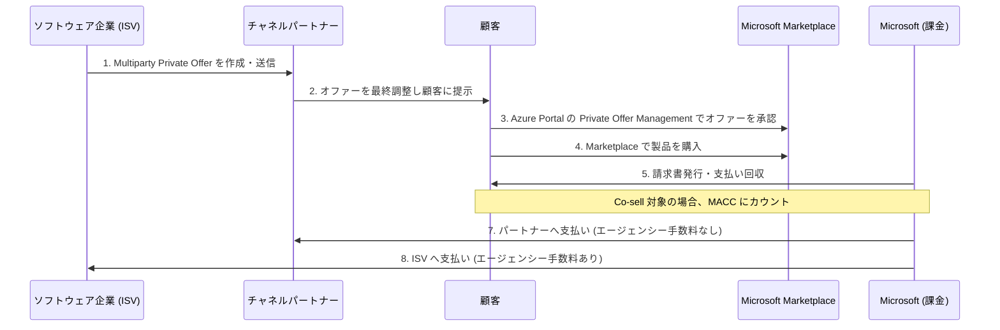

# Microsoft Marketplace: Multiparty Private Offers がヨーロッパ 30 カ国に拡大

**リリース日**: 2026-05-27
**サービス**: Microsoft Marketplace
**機能**: Multiparty Private Offers (MPO) ヨーロッパ 30 カ国対応
**ステータス**: GA (一般提供開始)

[このアップデートのインフォグラフィックを見る](https://takech9203.github.io/azure-news-summary/20260527-marketplace-multiparty-private-offers-europe.html)

## 概要

Microsoft Marketplace の Multiparty Private Offers (MPO) が、2026 年 5 月 27 日よりヨーロッパ 30 カ国で利用可能になりました。これにより、ソフトウェア企業 (ISV) とチャネルパートナーが協力して、ヨーロッパ全域の顧客にサードパーティのクラウドおよび AI ソリューションを Marketplace 経由で販売できるようになります。

Multiparty Private Offers は、50 万社以上のパートナーエコシステムを活用した協調販売を可能にする仕組みです。通常の Private Offers と同様に機能しますが、チャネルパートナーを介して顧客に販売される点が異なります。Omdia の調査によると、2030 年までに Microsoft Marketplace 上のクラウドビジネスの 60% がチャネル主導の販売に依存すると推定されています。

**アップデート前の課題**
- Multiparty Private Offers は米国およびカナダのみで利用可能だった
- ヨーロッパのパートナーや ISV は、統合性の低い代替販売チャネルを使用する必要があった
- チャネル主導の Marketplace トランザクションの地理的範囲が限定的だった

**アップデート後の改善**
- ヨーロッパ 30 カ国で顧客購入およびパートナー販売の両方がサポート
- ヨーロッパ全域のチャネルパートナーが MPO ワークフローを利用可能
- ソフトウェア企業が確立されたパートナーネットワークを通じてヨーロッパ市場に即座に展開可能

## アーキテクチャ図

## サービスアップデートの詳細

### 主要機能

#### Multiparty Private Offers の仕組み

MPO は、ISV がチャネルパートナーを通じて顧客に Marketplace オファーを販売できる仕組みです。従来の直接販売モデルとは異なり、パートナーが顧客との既存の関係を活用して販売を促進します。

#### 購入フロー

1. **ISV がオファーを作成**: ソフトウェア企業が Multiparty Private Offer を作成し、チャネルパートナーに送信
2. **パートナーがオファーを最終調整**: チャネルパートナーがオファーを確認し、顧客への提示内容を決定
3. **顧客がオファーを承認**: 顧客が Azure Portal の Private Offer Management セクションでオファーを承認
4. **顧客が製品を購入**: Marketplace を通じて各製品を購入
5. **Microsoft が課金**: 顧客の請求条件に従い、Microsoft が請求・回収を実施
6. **MACC カウント**: Co-sell 対象の場合、Azure クラウド消費コミットメント (MACC) にカウント
7. **パートナーへの支払い**: Microsoft がチャネルパートナーに支払い (エージェンシー手数料なし)
8. **ISV への支払い**: Microsoft が ISV に支払い (エージェンシー手数料が適用)

### 新たに対応したヨーロッパ 30 カ国

| 地域 | 対象国 |
|------|--------|
| 西ヨーロッパ | フランス、ドイツ、オランダ、ベルギー、ルクセンブルク、アイルランド、イギリス |
| 北ヨーロッパ | デンマーク、フィンランド、スウェーデン、ノルウェー、アイスランド |
| 南ヨーロッパ | イタリア、スペイン、ポルトガル、ギリシャ、キプロス、マルタ、スロベニア、クロアチア |
| 東ヨーロッパ | ポーランド、チェコ、ハンガリー、ルーマニア、ブルガリア、スロバキア、エストニア、ラトビア、リトアニア |
| その他 | オーストリア、リヒテンシュタイン |

### 今後の拡大予定 (2026 年 7 月 15 日)

- オーストラリア
- 日本
- 南アフリカ

## 技術仕様

| 項目 | 詳細 |
|------|------|
| 機能名 | Multiparty Private Offers (MPO) |
| ステータス | GA (一般提供) |
| 対応プラットフォーム | Microsoft Marketplace (Azure Marketplace / AppSource) |
| 管理ポータル | Partner Center (ISV/パートナー)、Azure Portal (顧客) |
| 必要なロール | Marketplace Developer / Manager / Account Owner |
| MACC 対応 | Co-sell 対象オファーの場合に適用 |
| 既存対応国 | 米国、カナダ |
| 新規対応国 | ヨーロッパ 30 カ国 (2026/5/27) |
| 今後の対応国 | オーストラリア、日本、南アフリカ (2026/7/15) |

## 設定方法

### 前提条件 (チャネルパートナー向け)

1. **Microsoft AI Cloud Partner Program** に登録済みであること
2. **Partner Center** で Microsoft Marketplace アカウントを作成済みであること
3. 対象国で Partner Center の **税務プロファイル** を完了していること
4. 対象オファーが Microsoft Marketplace に公開済みかつ **パブリックにトランザクション可能** であること
5. Partner Center で **Marketplace Developer、Manager、または Account Owner** ロールを保有していること

### 設定手順

1. Partner Center にサインイン
2. Marketplace アカウントの設定で、対象のヨーロッパ国の税務プロファイルを完了
3. ISV から送信された Multiparty Private Offer を確認
4. 顧客調整率 (customer adjustment %) を設定
5. 顧客にオファーを提示

## メリット

### ビジネス面

| 対象者 | メリット |
|--------|----------|
| チャネルパートナー | ソフトウェア企業と協力して提供可能な製品を拡大できる |
| チャネルパートナー | エージェンシー手数料が課金されない |
| チャネルパートナー | Marketplace を通じた顧客への販売プロセスが簡素化される |
| ソフトウェア企業 (ISV) | チャネルパートナーを通じて新規顧客にスケーラブルに到達できる |
| ソフトウェア企業 (ISV) | ヨーロッパ 30 市場への新規参入機会が開放される |
| 顧客 | 条件、条項、価格の交渉が可能 |
| 顧客 | Co-sell 対象の場合、購入が MACC にカウントされる |
| 顧客 | 使い慣れた Marketplace 体験での購入が可能 |

### 技術面

- Partner Center での統合管理により、複数国でのオファー管理が効率化
- Azure Portal の Private Offer Management を通じた標準化された承認フロー
- Microsoft による一元的な課金・回収により、パートナーの運用負荷を軽減

## デメリット・制約事項

- 現時点ではヨーロッパ 30 カ国と米国・カナダのみ対応 (アジア太平洋地域は 2026 年 7 月 15 日まで待つ必要がある)
- チャネルパートナーは各対象国で税務プロファイルの完了が必要
- オファーが Marketplace で公開済みかつパブリックにトランザクション可能であることが前提条件
- Microsoft AI Cloud Partner Program への登録が必須
- ISV にはエージェンシー手数料が適用される

## ユースケース

### 1. ヨーロッパの SI パートナーによるクラウドソリューション再販

ドイツを拠点とするシステムインテグレーターが、ISV のセキュリティソリューションを Marketplace 経由で自社の既存顧客に販売。パートナーは自社のマージンを設定し、Microsoft が課金処理を担当。

### 2. ISV のヨーロッパ市場参入

米国拠点の SaaS 企業が、各ヨーロッパ諸国に拠点を持つチャネルパートナーネットワークを活用し、30 カ国に同時展開。自社で各国の営業体制を構築するコストを回避。

### 3. MACC を活用した大企業向け販売

Azure の消費コミットメント (MACC) を保有するヨーロッパの大企業に対し、チャネルパートナーが Co-sell 対象の ISV ソリューションを提案。顧客は既存の MACC 枠内で購入可能。

## 料金

- MPO 機能自体に直接的な利用料金はなし (Marketplace のコマース機能として提供)
- チャネルパートナーは ISV が設定したパートナー価格に「顧客調整率 (customer adjustment %)」として自社のマークアップを設定可能
- Microsoft はソフトウェア企業 (ISV) のみにエージェンシー手数料を課金 (チャネルパートナーには課金されない)
- MACC コミットメントを持つ顧客は、Co-sell 対象の購入をコミットメントにカウント可能

## 利用可能リージョン

### 現在利用可能 (2026 年 5 月 27 日時点)

- **北米**: 米国、カナダ
- **ヨーロッパ (30 カ国)**: オーストリア、ベルギー、ブルガリア、クロアチア、キプロス、チェコ、デンマーク、エストニア、フィンランド、フランス、ドイツ、ギリシャ、ハンガリー、アイスランド、アイルランド、イタリア、ラトビア、リトアニア、リヒテンシュタイン、ルクセンブルク、マルタ、オランダ、ノルウェー、ポーランド、ポルトガル、ルーマニア、スロバキア、スロベニア、スペイン、スウェーデン、イギリス

### 2026 年 7 月 15 日から利用可能

- オーストラリア
- 日本
- 南アフリカ

## 関連サービス・機能

| サービス | 関連性 |
|----------|--------|
| Azure Marketplace | オファーが公開・トランザクションされるプラットフォーム |
| Partner Center | ISV とチャネルパートナーが MPO を設定・管理するポータル |
| Azure Portal (Private Offer Management) | 顧客がプライベートオファーを承認・購入する場所 |
| Microsoft AI Cloud Partner Program | 参加パートナーに必要な登録プログラム |
| MACC (Microsoft Azure Consumption Commitment) | Co-sell 対象購入のコミットメントカウント |

## 参考リンク

- [Azure Updates 公式ページ](https://azure.microsoft.com/updates?id=563016)
- [Microsoft Learn - チャネルパートナー向けガイド](https://learn.microsoft.com/en-us/partner-center/marketplace-offers/multiparty-private-offers-for-channel-partners)
- [Microsoft Learn - MPO 概要](https://learn.microsoft.com/en-us/partner-center/marketplace-offers/multiparty-private-offers-overview)
- [MPO ヨーロッパ拡大ブログ](https://aka.ms/MPOEEAblog)

## まとめ

Microsoft Marketplace の Multiparty Private Offers がヨーロッパ 30 カ国に拡大したことで、ISV とチャネルパートナーの協調販売がグローバル規模で本格化します。パートナーエコシステムを活用した間接販売モデルは、特にヨーロッパ市場への新規参入を目指す ISV や、製品ポートフォリオを拡大したいチャネルパートナーにとって大きな機会です。チャネルパートナーにはエージェンシー手数料が課金されず、顧客には MACC カウントのメリットがあるため、三者にとって Win-Win-Win の構造となっています。2026 年 7 月 15 日にはオーストラリア、日本、南アフリカも追加予定であり、今後さらなるグローバル展開が期待されます。

---
**タグ**: `Microsoft Marketplace` `Multiparty Private Offers` `チャネルパートナー` `ISV` `ヨーロッパ` `GA` `Partner Center` `MACC`
