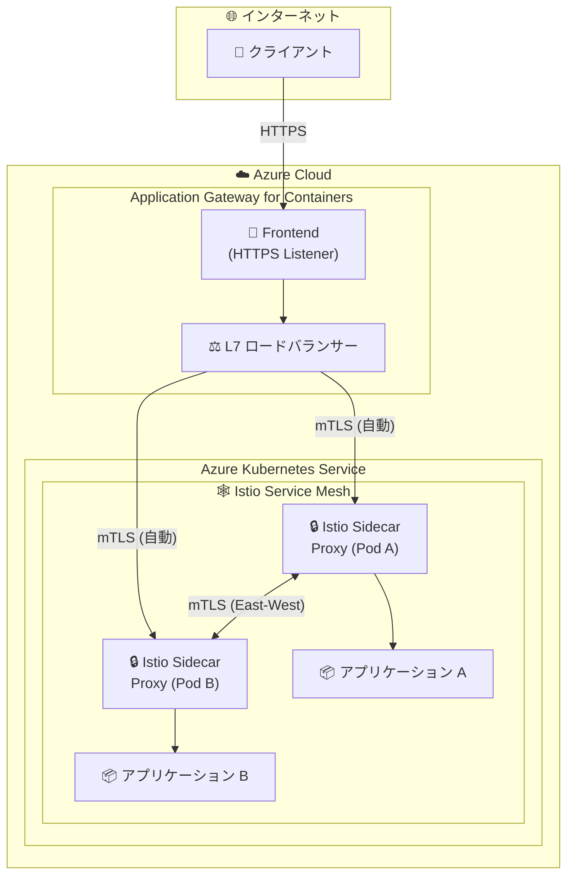

# Application Gateway for Containers: Istio サービスメッシュ統合

**リリース日**: 2026-05-28

**サービス**: Application Gateway for Containers

**機能**: Service Mesh integration with Istio

**ステータス**: Launched (GA)

[このアップデートのインフォグラフィックを見る](https://takech9203.github.io/azure-news-summary/20260528-appgw-containers-istio-service-mesh.html)

## 概要

Application Gateway for Containers のサービスメッシュ統合機能 (Istio 対応) が一般提供 (GA) となった。この機能により、Istio サービスメッシュ内で稼働するワークロードへの North-South トラフィック (外部からクラスター内部への通信) のセキュアなルーティングが大幅に簡素化される。

具体的には、Application Gateway for Containers と Istio サイドカープロキシ間の相互 TLS (mTLS) 接続が自動化される。これにより、外部トラフィックがサービスメッシュに入る際のセキュリティを、複雑な手動設定なしに確保できるようになった。

**アップデート前の課題**

- Istio サービスメッシュへの外部トラフィック (North-South) を安全にルーティングするために、mTLS 証明書の手動管理や複雑な設定が必要だった
- Application Gateway for Containers とサービスメッシュ間のセキュア通信を確立するために、証明書のローテーションや信頼チェーンの管理を個別に行う必要があった
- Ingress ポイントとサービスメッシュのセキュリティポリシーを個別に管理する必要があり、運用負荷が高かった

**アップデート後の改善**

- Application Gateway for Containers と Istio サイドカープロキシ間の mTLS 接続が自動化され、手動での証明書管理が不要になった
- North-South トラフィックのセキュアなルーティングがシンプルな設定で実現可能になった
- サービスメッシュのセキュリティポリシーと Ingress のセキュリティが統合的に管理できるようになった

## アーキテクチャ図



Application Gateway for Containers が外部トラフィックを受信し、Istio サイドカープロキシとの間で自動的に mTLS 接続を確立する。これにより、North-South トラフィック (外部からメッシュ内部) と East-West トラフィック (メッシュ内サービス間) の両方が暗号化される。

## サービスアップデートの詳細

### 主要機能

1. **自動 mTLS 接続**
   - Application Gateway for Containers と Istio サイドカープロキシ間の相互 TLS 認証が自動的に確立される
   - 証明書のプロビジョニングやローテーションが自動化される

2. **North-South トラフィックのセキュア化**
   - 外部からサービスメッシュ内のワークロードへのトラフィックが自動的に暗号化される
   - Istio の STRICT mTLS ポリシーとの互換性が確保される

3. **Gateway API サポート**
   - Kubernetes Gateway API (v1) を使用した設定が可能
   - HTTPRoute によるルーティング制御と BackendTLSPolicy によるバックエンド TLS 設定の組み合わせ

4. **ALB Controller 統合**
   - AKS クラスター内の ALB Controller がサービスメッシュ統合のライフサイクルを管理
   - BYO (Bring Your Own) デプロイと ALB マネージドデプロイの両方をサポート

## 技術仕様

| 項目 | 詳細 |
|------|------|
| 統合対象サービスメッシュ | Istio (AKS Istio アドオン) |
| 暗号化方式 | mTLS (相互 TLS) |
| API サポート | Kubernetes Gateway API v1, Ingress API |
| デプロイ戦略 | BYO デプロイ / ALB マネージドデプロイ |
| サポートプロトコル | HTTP, HTTPS, gRPC, WebSocket |
| リスナーポート | 80, 443 |
| ロードバランシング | Least Request, Round Robin, Weighted Round Robin, Ring Hash, Load Aware Routing |

## 設定方法

### 前提条件

1. AKS クラスターが稼働していること
2. ALB Controller がデプロイされていること (AKS アドオンまたは Helm)
3. Istio サービスメッシュアドオンが AKS クラスターで有効化されていること
4. Application Gateway for Containers リソースがプロビジョニングされていること

### Gateway API による設定例

```bash
# Gateway リソースの作成 (HTTPS リスナー)
kubectl apply -f - <<EOF
apiVersion: gateway.networking.k8s.io/v1
kind: Gateway
metadata:
  name: gateway-01
  namespace: test-infra
  annotations:
    alb.networking.azure.io/alb-namespace: alb-test-infra
    alb.networking.azure.io/alb-name: alb-test
spec:
  gatewayClassName: azure-alb-external
  listeners:
  - name: https-listener
    port: 443
    protocol: HTTPS
    allowedRoutes:
      namespaces:
        from: Same
    tls:
      mode: Terminate
      certificateRefs:
      - kind: Secret
        group: ""
        name: contoso.com
EOF
```

```bash
# HTTPRoute リソースの作成
kubectl apply -f - <<EOF
apiVersion: gateway.networking.k8s.io/v1
kind: HTTPRoute
metadata:
  name: https-route
  namespace: test-infra
spec:
  parentRefs:
  - name: gateway-01
  rules:
  - backendRefs:
    - name: https-app
      port: 443
EOF
```

```bash
# BackendTLSPolicy の作成 (バックエンド mTLS 設定)
kubectl apply -f - <<EOF
apiVersion: alb.networking.azure.io/v1
kind: BackendTLSPolicy
metadata:
  name: backend-tls-policy
  namespace: test-infra
spec:
  targetRef:
    group: ""
    kind: Service
    name: https-app
    namespace: test-infra
  default:
    sni: contoso.xyz
    ports:
    - port: 443
EOF
```

## メリット

### ビジネス面

- サービスメッシュ導入時の運用コスト削減 (mTLS 設定の自動化により設定工数を削減)
- セキュリティコンプライアンス要件への対応が容易に (End-to-End 暗号化の実現)
- マイクロサービスアーキテクチャへの移行加速

### 技術面

- mTLS 証明書の自動管理により、証明書の期限切れによるサービス停止リスクを排除
- Istio の STRICT mTLS モードとシームレスに連携し、ゼロトラストアーキテクチャを実現
- L7 ロードバランシング機能 (パスベースルーティング、ヘッダーリライトなど) とサービスメッシュの組み合わせが可能
- Gateway API 標準に準拠した宣言的な設定

## デメリット・制約事項

- Istio サービスメッシュアドオンは、Open Service Mesh アドオンとの併用不可
- Istio アドオンのサイドカーレス Ambient モードはまだ未対応
- Windows Server コンテナはサポート対象外
- マルチクラスターデプロイは未対応
- Gateway リソースのリスナーで使用可能なポートは 80 と 443 のみ
- Istio アドオンでの ProxyConfig、WorkloadEntry、WorkloadGroup、IstioOperator、WasmPlugin カスタムリソースは制限あり

## ユースケース

### ユースケース 1: マイクロサービスの外部公開

**シナリオ**: Istio サービスメッシュ内で稼働する複数のマイクロサービスを、外部クライアントに安全に公開する必要がある e コマースプラットフォーム。

**効果**: Application Gateway for Containers が外部トラフィックを受け付け、自動 mTLS でサービスメッシュ内のバックエンドに安全にルーティング。WAF による保護と L7 ルーティングを組み合わせて、セキュアかつ柔軟な外部公開を実現。

### ユースケース 2: ゼロトラストセキュリティの実装

**シナリオ**: 金融機関のコンプライアンス要件として、すべての通信経路で暗号化が必須。外部からのトラフィックだけでなく、クラスター内の通信もすべて mTLS で保護する必要がある。

**効果**: Application Gateway for Containers の自動 mTLS 統合により、North-South トラフィックを含むすべての通信経路でエンドツーエンドの暗号化を実現。Istio の STRICT モードと組み合わせることで、ゼロトラストアーキテクチャを構築。

### ユースケース 3: 段階的なサービスメッシュ移行

**シナリオ**: 既存のモノリシックアプリケーションを段階的にマイクロサービス化し、Istio サービスメッシュに移行中。移行期間中もセキュアな外部アクセスを維持する必要がある。

**効果**: Application Gateway for Containers を Ingress ポイントとして維持しながら、バックエンドサービスを順次サービスメッシュに移行可能。mTLS の自動化により、移行中のセキュリティ設定変更の手間を最小化。

## 料金

Application Gateway for Containers の料金は、固定料金とキャパシティユニットベースの従量課金で構成される。サービスメッシュ統合機能自体に追加料金は明示されていないが、mTLS 処理による追加のキャパシティユニット消費が発生する可能性がある。

詳細な料金情報は公式料金ページを参照:
- [Application Gateway 料金ページ](https://azure.microsoft.com/pricing/details/application-gateway/)

## 利用可能リージョン

Application Gateway for Containers は以下のリージョンで利用可能:

- Australia East
- Brazil South
- Canada Central
- Central India
- Central US
- East Asia
- East US
- East US 2
- France Central
- Germany West Central
- Korea Central
- North Central US
- North Europe
- Norway East
- South Central US
- Southeast Asia
- Switzerland North
- UAE North
- UK South
- West US
- West US 2
- West US 3
- West Europe

## 関連サービス・機能

- **Azure Kubernetes Service (AKS)**: Application Gateway for Containers のバックエンドとして動作する Kubernetes クラスター
- **Istio サービスメッシュアドオン (AKS)**: AKS でマネージドに提供される Istio サービスメッシュ。mTLS の自動化の対象
- **ALB Controller**: AKS クラスター内で動作し、Application Gateway for Containers のライフサイクルを管理するコントローラー
- **Azure Monitor / Prometheus**: サービスメッシュのオブザーバビリティ。Istio アドオンは Azure Monitor managed Prometheus と Azure Managed Grafana との統合が検証済み
- **Web Application Firewall (WAF)**: Application Gateway for Containers で利用可能な WAF 機能。サービスメッシュ統合と組み合わせて多層防御を実現

## 参考リンク

- [インフォグラフィック](https://takech9203.github.io/azure-news-summary/20260528-appgw-containers-istio-service-mesh.html)
- [公式アップデート情報](https://azure.microsoft.com/updates?id=564714)
- [Application Gateway for Containers 概要 - Microsoft Learn](https://learn.microsoft.com/azure/application-gateway/for-containers/overview)
- [End-to-end TLS 設定ガイド - Microsoft Learn](https://learn.microsoft.com/azure/application-gateway/for-containers/how-to-end-to-end-tls-gateway-api)
- [AKS Istio サービスメッシュアドオン - Microsoft Learn](https://learn.microsoft.com/azure/aks/istio-about)
- [Application Gateway 料金ページ](https://azure.microsoft.com/pricing/details/application-gateway/)

## まとめ

Application Gateway for Containers の Istio サービスメッシュ統合が GA となり、サービスメッシュ環境への外部トラフィックのセキュアなルーティングが大幅に簡素化された。最大のメリットは mTLS 接続の自動化であり、従来必要だった証明書の手動管理や複雑な設定作業が不要になる。

Solutions Architect への推奨アクション:
- Istio サービスメッシュを利用中、または導入検討中の環境では、Ingress ソリューションとして Application Gateway for Containers の採用を検討する
- 既に Application Gateway for Containers を使用している環境で Istio を導入する場合、サービスメッシュ統合機能を活用して mTLS 設定を自動化する
- ゼロトラストアーキテクチャの要件がある場合、本機能による End-to-End 暗号化の実現可能性を評価する

---

**タグ**: #Azure #ApplicationGatewayForContainers #Istio #ServiceMesh #mTLS #Networking #Security #Kubernetes #AKS #GA
