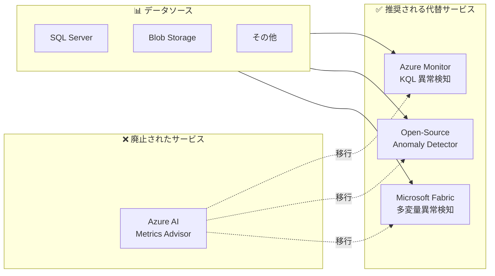

# Azure AI Metrics Advisor: サービス廃止 (2026 年 5 月 18 日付)

**リリース日**: 2026-05-29

**サービス**: Azure AI Services (Metrics Advisor)

**機能**: Metrics Advisor サービスの廃止

**ステータス**: Retirement

[このアップデートのインフォグラフィックを見る](https://takech9203.github.io/azure-news-summary/20260529-ai-metrics-advisor-retirement.html)

## 概要

Azure AI Metrics Advisor が 2026 年 5 月 18 日をもって正式に廃止された。Metrics Advisor は、時系列データの監視と異常検知を AI を活用して自動化するサービスであり、機械学習の知識がなくてもデータの取り込み、異常検知、診断が可能であった。

本サービスは段階的に廃止が進められており、2023 年 9 月 20 日以降は新規リソースの作成が不可となり、2026 年 3 月 31 日には Metrics Advisor ポータルが無効化され、最終的に 2026 年 5 月 18 日にサービスが完全に廃止された。当初の廃止予定日は 2026 年 10 月 1 日とされていたが、実際にはそれより早い 5 月 18 日に廃止が完了している。

Microsoft は代替サービスとして Azure Monitor、オープンソースの Anomaly Detector、および Microsoft Fabric の多変量異常検知機能を推奨している。

**サービス廃止前の状況**

- Metrics Advisor は時系列データの異常検知に特化した専用サービスとして提供されていた
- 多次元メトリクスの自動監視、根本原因分析、リアルタイム通知などの機能を備えていた
- SQL Server、Azure Blob Storage、MongoDB 等の多様なデータソースに接続可能であった

**廃止後の対応**

- Azure Monitor の KQL ベースの異常検知機能への移行が推奨される
- オープンソースの Anomaly Detector を利用してセルフホスト型の異常検知を構築可能
- Microsoft Fabric の多変量異常検知機能で、より高度なリアルタイム異常検知を実現可能

## アーキテクチャ図



Metrics Advisor からの移行先として 3 つの代替パスが用意されている。ユースケースに応じて適切な代替サービスを選択する。

## サービスアップデートの詳細

### 廃止タイムライン

| 日付 | イベント |
|------|---------|
| 2023 年 9 月 20 日 | 新規 Metrics Advisor リソースの作成不可 |
| 2026 年 3 月 31 日 | Metrics Advisor ポータルの無効化 |
| 2026 年 5 月 18 日 | サービスの完全廃止 |

### Metrics Advisor が提供していた主要機能

1. **時系列データの異常検知**
   - 多次元メトリクスの自動監視
   - 最適な検知モデルの自動選択 (機械学習の知識不要)
   - パラメータチューニングとインタラクティブフィードバック

2. **リアルタイム通知**
   - メール、Webhook、Teams、Azure DevOps のフックに対応
   - 柔軟なアラート設定

3. **スマート診断インサイト**
   - 特定のディメンションへの根本原因分析
   - メトリクスグラフによるクロスメトリクス分析

## 設定方法 (移行手順)

### 代替 1: Azure Monitor (KQL ベースの異常検知)

Azure Monitor の Log Analytics で KQL の機械学習オペレーターを使用して時系列分析と異常検知を行う。

**主な KQL 機能:**
- `make-series`: 時系列データの作成
- `series_decompose_anomalies()`: 異常検知スコアリング
- `diffpatterns()`: 異常の根本原因分析

**前提条件:**
- Azure Monitor の Log Analytics ワークスペース
- `Microsoft.OperationalInsights/workspaces/query/*/read` 権限

```kusto
// 時系列の作成と異常検知の例
let starttime = 21d;
let endtime = 0d;
let timeframe = 1d;
Usage
| where TimeGenerated between (startofday(ago(starttime))..startofday(ago(endtime)))
| make-series ActualUsage=sum(Quantity) default = 0 on TimeGenerated step timeframe by DataType
| extend(Anomalies, AnomalyScore, ExpectedUsage) = series_decompose_anomalies(ActualUsage)
| mv-expand ActualUsage to typeof(double), TimeGenerated to typeof(datetime), Anomalies to typeof(double)
| where Anomalies != 0
```

### 代替 2: オープンソース Anomaly Detector

GitHub で公開されている [Open-Source Anomaly Detector](https://github.com/microsoft/anomaly-detector) を利用する。Metrics Advisor と Azure Anomaly Detector のバックエンドで使用されていたものと同じ異常検知アルゴリズムが提供される。

### 代替 3: Microsoft Fabric 多変量異常検知

Microsoft Fabric の Real-Time Intelligence で多変量異常検知を実行する。

**特徴:**
- Eventhouse への高スループットデータ取り込み
- Spark エンジンによるモデルトレーニング
- KQL によるリアルタイム予測
- Graph Attention Network (GAT) ベースのアルゴリズム

**2 つのパス:**
1. **ネイティブ Eventhouse 異常検知**: 組み込みモデルによるシンプルなパス
2. **カスタム多変量検知**: ノートブックでトレーニングしたカスタムモデルによる高度なパス

## メリット (代替サービスへの移行)

### Azure Monitor への移行

- Azure のネイティブ監視サービスとの統合
- KQL による柔軟なクエリと分析
- 追加サービスの契約不要 (既存の Log Analytics ワークスペースを活用)

### Microsoft Fabric への移行

- 多変量異常検知による、変数間の相関を考慮した高度な異常検知
- リアルタイムストリーミングデータへの対応
- 統合的なデータ分析プラットフォーム上での運用

### オープンソース Anomaly Detector

- セルフホストによる完全な制御
- Metrics Advisor と同じアルゴリズムの継続利用
- クラウドサービスへの依存度の低減

## デメリット・制約事項

- Metrics Advisor のような専用 UI (ポータル) は代替サービスには存在しない
- Azure Monitor の KQL ベースの異常検知は単変量分析が中心であり、Metrics Advisor が備えていた多次元メトリクスの自動相関分析とは異なるアプローチが必要
- Microsoft Fabric の多変量異常検知は Fabric ライセンスが別途必要
- オープンソース版はセルフホストのためインフラ管理が必要

## ユースケース

### ユースケース 1: AIOps (IT 運用の異常検知)

**シナリオ**: サーバーメトリクス (CPU、メモリ、ディスク I/O) の異常を検知し、障害を早期発見する

**推奨移行先**: Azure Monitor (KQL 異常検知)

**理由**: Azure Monitor に既にメトリクスが収集されている場合、追加のデータ移動なしに異常検知を実行可能

### ユースケース 2: IoT システムの多変量監視

**シナリオ**: 複数センサーの値を相関分析し、個別には正常範囲内でも組み合わせとして異常なパターンを検知する

**推奨移行先**: Microsoft Fabric 多変量異常検知

**理由**: GAT ベースのアルゴリズムにより変数間の相関関係を学習し、多変量での異常検知が可能

### ユースケース 3: ビジネスメトリクスの監視

**シナリオ**: 売上、トランザクション数、ユーザーアクティビティなどのビジネス KPI の異常を監視する

**推奨移行先**: Azure Monitor またはオープンソース Anomaly Detector

## 関連サービス・機能

- **Azure Monitor**: Azure のネイティブ監視サービス。KQL による時系列分析と異常検知機能を提供
- **Microsoft Fabric Real-Time Intelligence**: リアルタイムデータ処理と多変量異常検知を提供する統合分析プラットフォーム
- **Azure AI Anomaly Detector**: Metrics Advisor と同様に廃止が予定されているサービス。オープンソース版への移行が推奨
- **Azure Data Explorer**: KQL ベースのデータ分析エンジン。Azure Monitor と同じ異常検知 KQL 関数を利用可能

## 参考リンク

- [インフォグラフィック](https://takech9203.github.io/azure-news-summary/20260529-ai-metrics-advisor-retirement.html)
- [公式アップデート情報](https://azure.microsoft.com/updates?id=ai-services-metrics-advisor-will-be-retired-on-1-october-2026)
- [Microsoft Learn - Metrics Advisor ドキュメント](https://learn.microsoft.com/en-us/azure/ai-services/metrics-advisor/)
- [Azure Monitor KQL 異常検知](https://learn.microsoft.com/en-us/azure/azure-monitor/logs/kql-machine-learning-azure-monitor)
- [Microsoft Fabric 多変量異常検知](https://learn.microsoft.com/en-us/fabric/real-time-intelligence/multivariate-anomaly-overview)
- [Open-Source Anomaly Detector (GitHub)](https://github.com/microsoft/anomaly-detector)

## まとめ

Azure AI Metrics Advisor は 2026 年 5 月 18 日をもって完全に廃止された。現在 Metrics Advisor を利用している場合は、早急に代替サービスへの移行が必要である。単変量の時系列異常検知には Azure Monitor の KQL 機能、多変量の相関分析が必要な場合は Microsoft Fabric、既存アルゴリズムをそのまま利用したい場合はオープンソース Anomaly Detector が推奨される。移行にあたっては、現在のユースケースと要件を整理し、最適な代替サービスを選択することが重要である。

---

**タグ**: #Azure #AI #MetricsAdvisor #Retirement #AnomalyDetection #AzureMonitor #MicrosoftFabric #Migration
