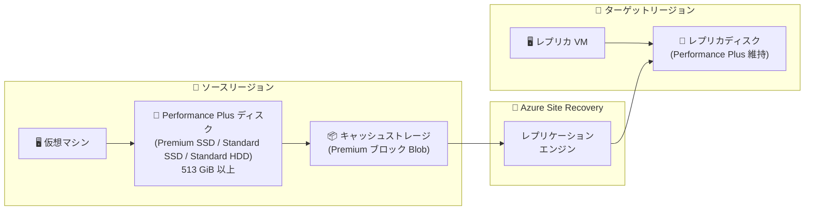

# Azure Site Recovery: Performance Plus マネージドディスクのレプリケーションサポート

**リリース日**: 2026-05-29

**サービス**: Azure Site Recovery

**機能**: Performance Plus マネージドディスクのレプリケーションサポート

**ステータス**: In preview

[このアップデートのインフォグラフィックを見る](https://takech9203.github.io/azure-news-summary/20260529-site-recovery-performance-plus-disks.html)

## 概要

Azure Site Recovery (ASR) が Performance Plus 対応マネージドディスクを使用する仮想マシンのレプリケーションをサポートした。Performance Plus は、513 GiB 以上の Premium SSD、Standard SSD、Standard HDD マネージドディスクの IOPS とスループットの上限を追加料金なしで引き上げる機能であり、データベースやトランザクション処理など高 I/O を必要とするワークロードに最適化されている。

今回のアップデートにより、Performance Plus を有効にしたディスクを使用する仮想マシンでも、Azure Site Recovery によるリージョン間の災害復旧 (DR) レプリケーションが可能になった。これまで Performance Plus ディスクは ASR でのリカバリがサポートされていなかったため、高性能ディスクを使用する本番ワークロードの DR 保護に制約があった。

**アップデート前の課題**

- Performance Plus 対応ディスクを使用する VM は Azure Site Recovery でレプリケーションできなかった
- 高 IOPS/スループットが求められるワークロード (データベース、トランザクション処理) の DR 戦略において、Performance Plus の利用を断念するか、別の DR ソリューションを検討する必要があった
- Performance Plus のパフォーマンス向上と DR 保護を両立できなかった

**アップデート後の改善**

- Performance Plus 対応の Premium SSD、Standard SSD、Standard HDD ディスクを使用する VM のレプリケーションが可能になった
- 高性能ワークロードの DR 保護と Performance Plus によるパフォーマンス向上を同時に実現できるようになった
- レプリケーション時には Premium ストレージアカウントの使用が推奨される

## アーキテクチャ図

Azure Site Recovery が Performance Plus 対応ディスクのデータをキャッシュストレージ経由でターゲットリージョンにレプリケーションし、フェイルオーバー時にディスクのパフォーマンス特性を維持する構成を示す。

## サービスアップデートの詳細

### 主要機能

1. **Performance Plus ディスクのレプリケーション対応**
   - Premium SSD、Standard SSD、Standard HDD の Performance Plus 対応ディスクを使用する VM のレプリケーションが可能
   - レプリケーション中も Performance Plus のパフォーマンス特性が維持される

2. **Premium ストレージアカウントによるレプリケーション**
   - レプリケーション時には Premium ストレージアカウントの使用が必要
   - 高チャーンサポートにより、VM あたり最大 100 MBps のデータ変更に対応

## 技術仕様

| 項目 | 詳細 |
|------|------|
| 対応ディスクタイプ | Premium SSD、Standard SSD、Standard HDD |
| 最小ディスクサイズ | 513 GiB (Performance Plus の要件) |
| レプリケーション要件 | Premium ストレージアカウントの使用 |
| VM あたりの最大チャーン | 100 MBps (高チャーンサポート利用時) |
| ディスクあたりの最大チャーン | 20 MBps (Premium SSD 512 GiB 以上、16 KB I/O) |
| Performance Plus の追加料金 | なし (ディスク自体の料金のみ) |
| ステータス | パブリックプレビュー |

## 設定方法

### 前提条件

1. 513 GiB 以上の Premium SSD、Standard SSD、または Standard HDD マネージドディスク
2. ディスク作成時に Performance Plus が有効化されていること
3. Premium ストレージアカウント (レプリケーション用)
4. Azure Site Recovery で保護対象のサブスクリプションにおけるディスク数が上限 (3,000) 以内であること

### Azure Portal

1. Azure Portal で Recovery Services コンテナーに移動
2. 対象の VM に対してレプリケーションを有効化
3. ストレージ設定で Premium ストレージアカウントを選択
4. Performance Plus ディスクを含む VM のレプリケーションが開始される

## メリット

### ビジネス面

- 高性能データベースワークロードの DR 保護が実現し、事業継続性が向上
- Performance Plus の追加料金なしでディスクパフォーマンスを向上しつつ、DR 保護も両立可能
- DR 設計のために Performance Plus の利用を断念する必要がなくなった

### 技術面

- IOPS とスループットの上限が引き上げられたディスクでも ASR によるレプリケーションが可能
- 既存の ASR ワークフローと同じ方法で管理でき、追加の学習コストが少ない
- フェイルオーバー後もディスクのパフォーマンス特性が維持される

## デメリット・制約事項

- レプリケーション時には Premium ストレージアカウントの使用が必須
- パブリックプレビュー段階であり、SLA は適用されない
- Performance Plus はディスク作成時にのみ有効化でき、既存ディスクへの後付けは不可 (スナップショットから新規ディスクを作成する回避策あり)
- VM 作成時に作成されるディスクには Performance Plus を有効にできない (個別にディスクを作成してアタッチする必要がある)

## ユースケース

### ユースケース 1: ミッションクリティカルなデータベースの DR 保護

**シナリオ**: SQL Server や Oracle Database など高 IOPS が求められるデータベースワークロードを Azure 上で運用しており、リージョン障害に備えた DR を構成する必要がある。

**効果**: Performance Plus によりディスクの IOPS/スループット上限が向上した状態で DR レプリケーションが可能になり、本番環境のパフォーマンス最適化と DR 保護を両立できる。

### ユースケース 2: トランザクション処理系アプリケーション

**シナリオ**: E コマースや金融系のトランザクション処理で高スループットのディスク I/O が必要なアプリケーションの DR 構成。

**効果**: フェイルオーバー先でも Performance Plus の拡張パフォーマンスが維持されるため、DR 発動後も本番同等のパフォーマンスでサービス継続が可能。

## 料金

Azure Site Recovery の料金は公式料金ページを参照。Performance Plus 自体にはディスクへの追加料金は発生しない。

- [Azure Site Recovery 料金ページ](https://azure.microsoft.com/pricing/details/site-recovery/)

## 利用可能リージョン

Azure Site Recovery がサポートされるすべての Azure リージョンで利用可能。任意の 2 つの Azure リージョン間でレプリケーションとリカバリが実行できる (グローバル DR 対応)。一部の制限付きリージョン (スイス西部、フランス南部など) は国内 DR 用に予約されている。

## 関連サービス・機能

- **Azure Managed Disks**: Performance Plus 機能の基盤となるディスクサービス
- **Azure Site Recovery 高チャーンサポート**: VM あたり最大 100 MBps のデータ変更率に対応するレプリケーション強化機能
- **Premium SSD v2**: ASR でサポートされる別の高性能ディスクオプション
- **Ultra Disks**: 最高性能が必要な場合の選択肢 (ASR でサポート済み)

## 参考リンク

- [インフォグラフィック](https://takech9203.github.io/azure-news-summary/20260529-site-recovery-performance-plus-disks.html)
- [公式アップデート情報](https://azure.microsoft.com/updates?id=564644)
- [Performance Plus ドキュメント - Microsoft Learn](https://learn.microsoft.com/en-us/azure/virtual-machines/disks-enable-performance)
- [Azure Site Recovery サポートマトリクス](https://learn.microsoft.com/en-us/azure/site-recovery/azure-to-azure-support-matrix)
- [料金ページ](https://azure.microsoft.com/pricing/details/site-recovery/)

## まとめ

Azure Site Recovery が Performance Plus マネージドディスクのレプリケーションをサポートしたことで、高 IOPS/高スループットが求められるワークロードの災害復旧戦略における重要な制約が解消された。データベースやトランザクション処理など I/O 集約型のアプリケーションを運用する Solutions Architect にとって、Performance Plus によるパフォーマンス最適化と ASR による DR 保護を両立できるようになった点は大きな前進である。パブリックプレビュー段階ではあるが、レプリケーション時に Premium ストレージアカウントを使用する点に注意しつつ、DR 設計への適用を検討することを推奨する。

---

**タグ**: #Azure #SiteRecovery #PerformancePlus #ManagedDisks #DisasterRecovery #DR #Preview #Storage #HighAvailability
