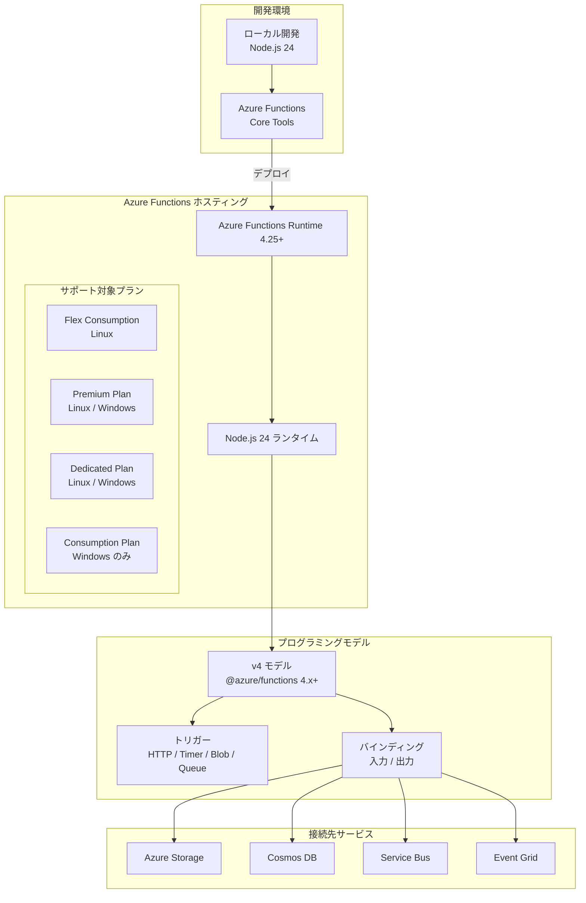

# Azure Functions: Node.js 24 サポートの一般提供開始

**リリース日**: 2026-06-01

**サービス**: Azure Functions

**機能**: Node.js 24 ランタイムサポート (GA)

**ステータス**: 一般提供開始 (GA)

[このアップデートのインフォグラフィックを見る](https://takech9203.github.io/azure-news-summary/20260601-azure-functions-nodejs-24.html)

## 概要

Azure Functions において Node.js 24 のサポートが一般提供 (GA) として開始されました。開発者は Node.js 24 を使用してローカルで関数アプリを開発し、Linux および Windows 上の対応する Azure Functions プランにデプロイできるようになります。Flex Consumption プランを含むすべてのサポート対象プランで利用可能です。

Node.js 24 は 2025年5月にリリースされた最新の LTS 候補バージョンであり、V8 エンジン v13.6、npm 11、パフォーマンス改善、新しい JavaScript API など多数の改善が含まれています。

**アップデート前の課題**
- Azure Functions で利用可能な最新の Node.js バージョンは 22 であり、Node.js 24 の新機能（Explicit Resource Management、Float16Array、RegExp.escape など）を活用できなかった
- npm 10 ベースの依存関係管理に制限されていた
- AsyncLocalStorage のパフォーマンスが最適化されていない旧実装を使用していた

**アップデート後の改善**
- V8 v13.6 エンジンによる最新の JavaScript 機能が利用可能
- npm 11 によるパッケージ管理の改善とセキュリティ強化
- AsyncContextFrame がデフォルトとなり、非同期コンテキスト追跡のパフォーマンスが向上
- Permission Model の安定化（--experimental-permission から --permission へ）
- URLPattern のグローバル利用、HTTP プロキシサポート（fetch 向け）などの新 API

## アーキテクチャ図



## サービスアップデートの詳細

### 主要機能

1. **Node.js 24 ランタイムサポート**: Azure Functions Runtime 4.25+ 上でプログラミングモデル v4 と組み合わせて利用可能
2. **マルチプラットフォーム対応**: Linux および Windows の両方でデプロイ可能
3. **Flex Consumption プラン対応**: 最新のサーバーレスホスティングプランで利用可能
4. **V8 v13.6 エンジン**: 最新の JavaScript/ECMAScript 機能を活用可能
5. **npm 11**: 改善されたパッケージ管理とセキュリティ

### Node.js 24 の主要な新機能（Azure Functions で活用可能）

| 機能 | 説明 |
|------|------|
| Explicit Resource Management | `using` / `await using` 宣言によるリソースの自動解放 |
| Float16Array | 16ビット浮動小数点数の型付き配列 |
| RegExp.escape | 正規表現特殊文字のエスケープ |
| URLPattern グローバル | URL パターンマッチングがインポート不要に |
| AsyncContextFrame デフォルト化 | 非同期コンテキスト追跡の高速化 |
| Permission Model 安定化 | `--permission` フラグによるセキュリティ強化 |
| HTTP プロキシ対応 fetch | `NODE_USE_ENV_PROXY` による環境変数プロキシ |

### 注意事項

- **Linux Consumption プランでは Node.js 22 が最後のサポートバージョン**: Node.js 24 以降のバージョンは Linux Consumption プランには追加されません。Node.js 24 を使用するには、Flex Consumption プランへの移行が必要です
- **プログラミングモデル v4 が必要**: Node.js 24 はプログラミングモデル v4（`@azure/functions` npm パッケージ 4.x+）でのみサポートされます
- **Remote Build**: 公式アップデートの説明では Remote Build に関する注意事項があります

## 技術仕様

| 項目 | 詳細 |
|------|------|
| Node.js バージョン | 24.x |
| V8 エンジン | v13.6 |
| npm バージョン | 11 |
| Azure Functions ランタイム | 4.25+ |
| プログラミングモデル | v4 (@azure/functions 4.x+) |
| サポート終了予定日 | 2028年4月30日 |
| 対応 OS | Linux, Windows |
| 対応プラン | Flex Consumption, Premium, Dedicated, Consumption (Windows) |
| NODE_MODULE_VERSION | 137 |

## 設定方法

### 前提条件

- Azure Functions Runtime 4.25 以上
- `@azure/functions` npm パッケージ 4.x 以上
- Azure Functions Core Tools（ローカル開発用）

### Azure CLI

**Linux の場合:**

```bash
az functionapp config set \
  --linux-fx-version "node|24" \
  --name "<FUNCTION_APP_NAME>" \
  --resource-group "<RESOURCE_GROUP_NAME>"
```

**Windows の場合:**

```bash
az functionapp config appsettings set \
  --settings WEBSITE_NODE_DEFAULT_VERSION=~24 \
  --name "<FUNCTION_APP_NAME>" \
  --resource-group "<RESOURCE_GROUP_NAME>"
```

### Azure Portal

1. Azure Portal で関数アプリに移動
2. **設定** > **構成** を選択
3. **関数ランタイムの設定** タブで最新のランタイムバージョンを確認
4. **全般設定** タブで **Node.js バージョン** を 24 に更新
5. **続行** をクリックし **保存** を選択

> **注意**: Linux Consumption プランでは Azure Portal から Node.js バージョンを変更できません。Azure CLI を使用してください。ただし、Node.js 24 は Linux Consumption プランではサポートされていないため、Flex Consumption プランへの移行を推奨します。

### プログラミングモデル v4 の例（TypeScript）

```typescript
import { app, HttpRequest, HttpResponseInit, InvocationContext } from "@azure/functions";

async function helloWorld(request: HttpRequest, context: InvocationContext): Promise<HttpResponseInit> {
  context.log("HTTP function triggered on Node.js 24");
  return { body: `Hello from Node.js ${process.version}!` };
}

app.http("helloWorld", {
  methods: ["GET", "POST"],
  handler: helloWorld,
});
```

## メリット

### ビジネス面

- **長期サポート**: Node.js 24 は 2028年4月30日までサポートされ、長期的な運用安定性を確保
- **開発生産性の向上**: 最新の JavaScript 機能により、コードがよりシンプルかつ表現力豊かに
- **セキュリティ強化**: npm 11 およびNode.js Permission Model の改善によるセキュリティ体制の向上
- **Flex Consumption プラン対応**: サーバーレスモデルでのコスト最適化と高スケーラビリティ

### 技術面

- **パフォーマンス向上**: AsyncContextFrame のデフォルト化により、Azure Functions の非同期処理パフォーマンスが改善
- **Explicit Resource Management**: `using` 宣言によるリソースリーク防止
- **V8 v13.6**: 最新の JIT コンパイラ最適化による実行速度の向上
- **WebAssembly Memory64**: 大規模データ処理の効率化
- **HTTP プロキシ対応 fetch**: 企業ネットワーク環境での外部 API 呼び出しが容易に

## デメリット・制約事項

- **Linux Consumption プラン非対応**: Node.js 24 は Linux Consumption プランではサポートされない。Flex Consumption プランへの移行が必要
- **プログラミングモデル v3 非対応**: v4 モデルへのアップグレードが必須
- **破壊的変更への対応**: Node.js 24 には `url.parse()` の非推奨化、`tls.createSecurePair` の削除など複数の破壊的変更が含まれる
- **NODE_MODULE_VERSION の変更**: ネイティブアドオンの再ビルドが必要になる場合がある
- **Undici 7 へのアップグレード**: HTTP クライアントの動作変更による影響の可能性

## ユースケース

1. **サーバーレス API バックエンド**: Node.js 24 の高速な非同期処理を活用した REST/GraphQL API の構築
2. **IoT データ処理**: Event Grid / IoT Hub からのイベントを Node.js 24 の改善されたストリーム処理で効率的に処理
3. **リアルタイムデータパイプライン**: Service Bus / Event Hubs と連携したイベント駆動型データ処理
4. **AI/ML 推論エンドポイント**: Float16Array を活用した軽量な推論処理
5. **マイクロサービス統合**: Flex Consumption プランの VNet 統合と組み合わせた安全なサービス間通信

## 料金

Azure Functions の料金はホスティングプランによって異なります。

| プラン | 課金モデル | 特徴 |
|--------|-----------|------|
| Flex Consumption | 実行時間 + Always Ready インスタンス | 推奨。VNet 対応、高速スケーリング |
| Consumption | 実行時間のみ | 従量課金（無料枠あり） |
| Premium | 事前ウォームインスタンス + 実行時間 | VNet 対応、コールドスタート低減 |
| Dedicated | App Service プランベース | 既存インフラとの統合 |

**Flex Consumption プランの詳細:**
- オンデマンド: 実行中の GB 秒 + 実行回数で課金（月間無料枠あり）
- Always Ready: ベースライン GB 秒 + アクティブ実行 GB 秒 + 実行回数
- インスタンスサイズ: 512 MB (0.25 コア) / 2048 MB (1 コア) / 4096 MB (2 コア)
- 最小課金実行時間: 1,000 ms

最新の料金情報は [Azure Functions 料金ページ](https://azure.microsoft.com/pricing/details/functions/) を参照してください。

## 利用可能リージョン

Node.js 24 は Azure Functions Runtime 4.25+ がサポートされるすべてのリージョンで利用可能です。ただし、Flex Consumption プランは一部のリージョンでのみ利用可能です。

Flex Consumption プランの対応リージョンの最新情報は、[公式ドキュメント](https://learn.microsoft.com/en-us/azure/azure-functions/flex-consumption-how-to#view-currently-supported-regions)を参照してください。

## 関連サービス・機能

| サービス/機能 | 関連性 |
|--------------|--------|
| Azure Functions Flex Consumption | Node.js 24 に推奨されるサーバーレスホスティングプラン |
| Azure Functions Premium Plan | VNet 統合が必要で Windows/Linux 両対応が必要な場合 |
| Azure Functions Core Tools | ローカル開発・デバッグ環境 |
| Azure DevOps / GitHub Actions | CI/CD パイプラインからのデプロイ |
| Azure Container Apps | コンテナベースの Node.js アプリケーション実行 |
| Azure Application Insights | 関数アプリのモニタリング・診断 |

## 参考リンク

- [インフォグラフィック](https://takech9203.github.io/azure-news-summary/20260601-azure-functions-nodejs-24.html)
- [公式アップデート情報](https://azure.microsoft.com/updates?id=562647)
- [Azure Functions Node.js 開発者ガイド](https://learn.microsoft.com/en-us/azure/azure-functions/functions-reference-node)
- [Azure Functions ランタイムバージョン比較](https://learn.microsoft.com/en-us/azure/azure-functions/functions-versions)
- [Flex Consumption プラン](https://learn.microsoft.com/en-us/azure/azure-functions/flex-consumption-plan)
- [Node.js 24 リリースノート](https://nodejs.org/en/blog/release/v24.0.0)
- [料金ページ](https://azure.microsoft.com/pricing/details/functions/)

## まとめ

Azure Functions における Node.js 24 の一般提供開始は、サーバーレス JavaScript/TypeScript 開発者にとって重要なアップデートです。V8 v13.6 エンジン、npm 11、Explicit Resource Management、AsyncContextFrame のデフォルト化など、パフォーマンスと開発体験の両面で大きな改善がもたらされます。

特に注目すべき点として、Node.js 24 は Linux Consumption プランではサポートされず、Flex Consumption プランへの移行が推奨されています。Flex Consumption プランは VNet 統合、per-function スケーリング、Always Ready インスタンスなどの優れた機能を提供するため、この機会に移行を検討することを推奨します。

既存の Node.js 22 アプリケーションからの移行では、Node.js 24 の破壊的変更（`url.parse()` の非推奨化、`tls.createSecurePair` の削除など）への対応が必要です。プログラミングモデル v3 を使用している場合は、先に v4 への移行が必要となります。

---

**タグ**: #AzureFunctions #Node.js #Node.js24 #Serverless #JavaScript #TypeScript #FlexConsumption #GA #Compute #IoT #OpenSource #Security #MicrosoftBuild
