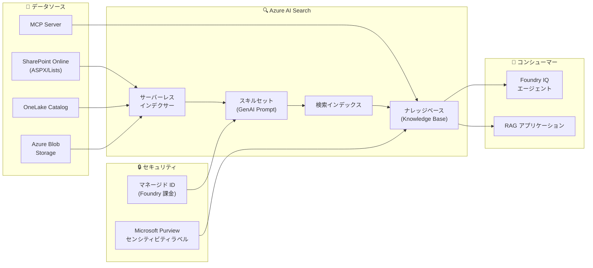

# Azure AI Search / Foundry IQ: Build 2026 - GenAI スキル・サーバーレスインデクサーとセキュリティ強化

**リリース日**: 2026-06-02

**サービス**: Azure AI Search / Microsoft Foundry IQ

**機能**: Build 2026 - GenAI スキル・サーバーレスインデクサーとセキュリティ強化

**ステータス**: Launched (GA) / In preview (mixed)

[このアップデートのインフォグラフィックを見る](https://takech9203.github.io/azure-news-summary/20260602-ai-search-build-2026-updates.html)

## 概要

Microsoft Build 2026 において、Azure AI Search と Foundry IQ に関する 12 件の大規模アップデートが発表された。GA (一般提供) が 3 件、Preview (プレビュー) が 9 件で構成され、AI Search のエージェント型検索 (Agentic Retrieval) パイプラインの強化、サーバーレス課金モデルの導入、Microsoft Purview との統合によるセキュリティ強化が主な柱となっている。

今回のアップデートは、2026-05-01-preview REST API として提供され、エンタープライズ RAG (Retrieval-Augmented Generation) パイプラインの構築と運用をより柔軟かつセキュアにすることを目的としている。特に GenAI Prompt スキルの GA 昇格とサーバーレスインデクサーの導入は、AI Search を活用したナレッジベースの構築コストと運用負荷を大幅に削減する可能性がある。

**アップデート前の課題**

- AI Search のインデクサーは専用 (Dedicated) リソースのプロビジョニングが必須で、アイドル時間もコストが発生していた
- GenAI Prompt スキルはプレビュー段階で、本番利用には慎重な検討が必要だった
- SharePoint コンテンツのインデックスは通常のドキュメントに限定され、ASPX ページやリストは対象外だった
- Purview のセンシティビティラベルと AI Search の検索結果を統合的に管理する手段がなかった
- Foundry IQ のナレッジソースとして MCP (Model Context Protocol) サーバーを直接接続する方法がなかった

**アップデート後の改善**

- サーバーレスインデクサーにより、使用した分だけの課金 (消費ベース) で、アイドル時にはゼロスケールが可能に
- GenAI Prompt スキルが GA となり、LLM を活用したインデックス時のコンテンツ生成が本番利用可能に
- SharePoint インデクサーが ASPX ページとリストをサポートし、ACL (アクセス制御リスト) も適用可能に
- Purview センシティビティラベルが検索結果に反映され、データガバナンスが強化
- MCP サーバーをナレッジソースとして接続でき、外部ツールからのデータ取得が可能に

## アーキテクチャ図

Azure AI Search がデータソースからのインジェスト (サーバーレスインデクサー + GenAI スキル) と、エージェント型検索 (ナレッジベース) の両方のレイヤーで強化され、Foundry IQ エージェントや RAG アプリケーションへグラウンディングデータを提供するパイプラインの全体像を示す。

## サービスアップデートの詳細

### GA (一般提供) - 3 件

#### 1. OneLake Catalog 統合 (Azure AI Search ナレッジソース)

OneLake ナレッジソースが一般提供となり、Microsoft Fabric の OneLake Catalog 内のデータを Azure AI Search のナレッジベースから直接検索可能になった。REST API バージョン 2026-04-01 で GA 昇格済みであり、ドキュメントレベルのアクセス許可 (`ingestionPermissionOptions`) は引き続きプレビューで提供される。

- **対象**: エンタープライズのデータレイクを RAG パイプラインに統合したいケース
- **参考**: [公式アップデート](https://azure.microsoft.com/updates?id=564407)

#### 2. GenAI Prompt スキルとチャット補完 (Azure AI Search ナレッジソース)

GenAI Prompt スキルが GA となった。このスキルは、インデックス作成パイプライン内で LLM (大規模言語モデル) に接続し、ユーザーが定義したプロンプトに基づいてコンテンツを生成する。主なユースケースは「画像の言語化 (Image Verbalization)」で、LLM を使って画像の内容を説明し、検索可能なテキストフィールドに送信する。

REST API バージョン 2026-04-01 では以下のプロパティが削除されたため、既存のスキル定義から除去が必要:
- `httpMethod`, `timeout`, `batchSize`, `degreeOfParallelism`, `httpHeaders`, `authResourceId`
- リクエストタイムアウトは 30 秒固定

さらに、チャット補完機能により、ナレッジソースの応答生成にも LLM を活用できるようになった。

- **対象**: AI エンリッチメントで LLM によるコンテンツ変換・要約を行いたいケース
- **参考**: [公式アップデート](https://azure.microsoft.com/updates?id=563247)

#### 3. Foundry 課金呼び出しのマネージド ID

Azure AI Search から Microsoft Foundry へのビリング (課金) 接続にマネージド ID (キーレス認証) が一般提供となった。これにより API キーを管理する必要がなくなり、セキュリティとガバナンスが向上する。

- **対象**: Foundry Tools (Azure OpenAI など) を利用したスキルセットの運用管理
- **参考**: [公式アップデート](https://azure.microsoft.com/updates?id=563242)

### Preview (プレビュー) - 機能強化

#### 4. サーバーレスインデクサー

Azure AI Search に新たな消費ベースの課金モデル「サーバーレス」が導入された。従来の専用 (Dedicated) ティアと並行して提供され、以下の特徴を持つ:

- **使用した分だけの課金**: コンピュートとインデックスストレージの使用量に応じた従量課金
- **ゼロスケール**: アイドル時には最小容量チャージなし
- **最小コミットメントなし**: プロビジョニング不要でスモールスタートが可能

これは、断続的なインデクシングワークロードや開発・テスト環境、あるいはバースト的なデータ取り込みが必要な場面で特に有効。

- **対象**: コストを最適化しながら AI Search を利用したいケース
- **参考**: [公式アップデート](https://azure.microsoft.com/updates?id=563531)

#### 5. MCP Server ナレッジソース (Foundry IQ)

Model Context Protocol (MCP) サーバーをナレッジソースとして接続できる新しいリモートナレッジソースタイプ。MCP 互換のツールやサービスからグラウンディングデータを取得でき、エージェント型検索の対象データを大幅に拡張する。

- **対象**: 外部ツールやカスタムデータソースをエージェントのナレッジに統合したいケース
- **参考**: [公式アップデート](https://azure.microsoft.com/updates?id=563411)

#### 6. SharePoint in Microsoft 365 インデクサーの拡張

SharePoint インデクサーに以下の機能が追加された:

- **ASPX サイトページ**のインデクシング対応 (ACL サポート付き)
- **SharePoint リスト**のインデクシング対応 (ACL サポート付き)
- 実行ごとの**インクリメンタル ACL 同期** (ユニーク権限を持つアイテム対象)
- `spg:` プレフィックスによるサイトグループ権限のサポート
- `metadata_spo_site_asset_item_id` フィールドによる SharePoint アイテム ID の取得

- **対象**: SharePoint Online のコンテンツを包括的に検索対象としたいケース
- **参考**: [公式アップデート](https://azure.microsoft.com/updates?id=563262)

#### 7. インクリメンタル SharePoint 権限同期 (AI Search / Foundry IQ)

SharePoint のドキュメントレベル権限の増分同期が可能になった。フルクロールを待たずに権限変更が検索結果に反映されるため、セキュリティ遅延が大幅に短縮される。

- **参考**: [公式アップデート](https://azure.microsoft.com/updates?id=563396)

#### 8. 画像配信 (Foundry IQ ナレッジベース)

インデックスされたナレッジソースからの取得ドキュメントに、テキストとともに画像コンテンツを含めることが可能になった。エージェント型検索の応答にマルチモーダルなコンテンツを含めることができる。

- **参考**: [公式アップデート](https://azure.microsoft.com/updates?id=563237)

#### 9. OneLake Catalog 統合 (Foundry IQ ナレッジソース)

Foundry IQ のナレッジソースとして OneLake Catalog のデータを利用可能に。Azure AI Search 側の OneLake 統合 (GA) と合わせて、Fabric エコシステムとの連携が強化された。

- **参考**: [公式アップデート](https://azure.microsoft.com/updates?id=563227)

### Preview (プレビュー) - セキュリティ / Purview 統合

#### 10. Microsoft Purview センシティビティラベル (AI Search ナレッジソース)

ナレッジベースの取得応答に `sensitivityLabelInfo` (参照ドキュメントごと) と `responseSensitivityLabelInfo` (トップレベル) フィールドが追加され、Microsoft Purview のセンシティビティラベルメタデータが検索結果に含まれるようになった。

- **対象**: データ分類とガバナンスを検索レイヤーで強制したいケース
- **参考**: [公式アップデート](https://azure.microsoft.com/updates?id=563591)

#### 11. Microsoft Purview センシティビティラベル監査 (AI Search)

AI Search でのセンシティビティラベル付きコンテンツへのアクセスを監査できるようになった。コンプライアンス要件を満たすための監査ログの提供。

- **参考**: [公式アップデート](https://azure.microsoft.com/updates?id=563267)

#### 12. Purview 管理者アクセス監査 (センシティビティラベル付きコンテンツ)

Purview 管理者がセンシティビティラベルの付いたコンテンツへのアクセスを監査する機能。不正アクセスの検知やコンプライアンスレポートに活用できる。

- **参考**: [公式アップデート](https://azure.microsoft.com/updates?id=563606)

## 技術仕様

| 項目 | 詳細 |
|------|------|
| API バージョン (Preview) | 2026-05-01-preview |
| API バージョン (GA) | 2026-04-01 |
| GenAI Prompt スキル タイムアウト | 30 秒 (固定、オーバーライド不可) |
| サーバーレスインデクサー課金 | 消費ベース (コンピュート + インデックスストレージ) |
| MCP Server ナレッジソース | リモートナレッジソースタイプ |
| Purview ラベルフィールド | `sensitivityLabelInfo`, `responseSensitivityLabelInfo` |
| SharePoint 対応コンテンツ | ドキュメント、ASPX ページ、リスト |
| ナレッジベース GPT モデル | GPT-5 ファミリー (gpt-5.4-mini 含む) 対応 |

## メリット

### ビジネス面

- **コスト最適化**: サーバーレスモデルにより、断続的なワークロードでの過剰プロビジョニングを回避
- **コンプライアンス強化**: Purview 統合によりデータガバナンスを検索レイヤーまで一貫して適用
- **Time-to-Value 短縮**: GenAI Prompt スキルの GA により、LLM ベースのエンリッチメントを本番環境に即座に導入可能
- **エコシステム拡張**: MCP サーバーサポートにより、サードパーティツールとの統合が容易に

### 技術面

- **ゼロスケール**: アイドル時のリソースコストが発生しない消費ベースアーキテクチャ
- **インクリメンタル同期**: SharePoint 権限変更のリアルタイムに近い反映
- **マルチモーダル**: ナレッジベース応答にテキストと画像の両方を含めることが可能
- **キーレス認証**: マネージド ID による Foundry 課金接続でシークレット管理が不要

## デメリット・制約事項

- サーバーレスインデクサーはプレビュー段階であり、本番利用には SLA が適用されない可能性がある
- GenAI Prompt スキルのタイムアウトは 30 秒固定で、複雑なプロンプト処理には制約となる場合がある
- 2026-05-01-preview API のプレビュー機能は、Azure コンプライアンス境界外でのデータ処理が発生する可能性がある
- センシティビティラベルの権限変更にはタイミングラグが発生する (即時反映ではない)
- CORS を有効にした場合、外部 Web ページからのサービスアクセスが可能になるセキュリティリスクがある
- ドキュメントレベルの権限 (`ingestionPermissionOptions`) は OneLake/Blob ナレッジソースでは引き続きプレビュー

## ユースケース

### ユースケース 1: エンタープライズ RAG パイプライン (コスト最適化)

**シナリオ**: 社内ドキュメント検索システムで、業務時間中のみインデクシングが必要なケース

サーバーレスインデクサーを使用することで、夜間・休日のアイドル時間にゼロスケールし、業務時間中のバースト的なドキュメント更新にのみコストが発生する。GenAI Prompt スキルで画像ドキュメントを言語化し、テキスト検索可能にする。

**効果**: 従来の Dedicated ティアと比較して、断続的ワークロードでのコストを大幅削減

### ユースケース 2: セキュアな SharePoint コンテンツ検索

**シナリオ**: 機密性の異なる SharePoint コンテンツを Purview ラベルに基づいてアクセス制御する

SharePoint インデクサーで ASPX ページとリストを含む全コンテンツをインデックスし、Purview センシティビティラベルを検索結果に反映。インクリメンタル権限同期により、権限変更が迅速に検索結果に反映される。

**効果**: データガバナンスと検索体験の両立。監査ログによるコンプライアンス証跡の確保

### ユースケース 3: MCP サーバーを活用したマルチソースエージェント

**シナリオ**: Foundry IQ エージェントが社内データベース、外部 API、ドキュメントを横断的に検索する

MCP Server ナレッジソースを使用して、カスタムの MCP 互換ツールからリアルタイムデータを取得。OneLake Catalog 統合で Fabric のデータレイク、SharePoint インデクサーで社内ドキュメントを同時に検索対象とする。

**効果**: 単一のエージェントから複数のデータソースを統合検索し、正確で引用付きの回答を生成

## 関連サービス・機能

- **Microsoft Foundry IQ**: AI Search のナレッジベースをバックエンドとして活用するエージェントサービス
- **Microsoft Purview**: センシティビティラベルとデータ分類による情報保護
- **Microsoft Fabric / OneLake**: エンタープライズデータレイクとのネイティブ統合
- **SharePoint Online**: Microsoft 365 コンテンツの検索インデクシング
- **Azure API Management**: GenAI Prompt スキルの `azure-api.net` エンドポイント経由ルーティング
- **Azure OpenAI / GPT-5**: ナレッジベースのクエリプランニングと応答生成

## 参考リンク

- [インフォグラフィック](https://takech9203.github.io/azure-news-summary/20260602-ai-search-build-2026-updates.html)
- [公式アップデート - OneLake Catalog 統合 (GA)](https://azure.microsoft.com/updates?id=564407)
- [公式アップデート - GenAI Prompt スキル (GA)](https://azure.microsoft.com/updates?id=563247)
- [公式アップデート - マネージド ID Foundry 課金 (GA)](https://azure.microsoft.com/updates?id=563242)
- [公式アップデート - サーバーレスインデクサー](https://azure.microsoft.com/updates?id=563531)
- [公式アップデート - MCP Server ナレッジソース](https://azure.microsoft.com/updates?id=563411)
- [公式アップデート - SharePoint ASPX/Lists](https://azure.microsoft.com/updates?id=563262)
- [公式アップデート - Purview センシティビティラベル](https://azure.microsoft.com/updates?id=563591)
- [公式アップデート - Purview ラベル監査](https://azure.microsoft.com/updates?id=563267)
- [公式アップデート - Purview 管理者監査](https://azure.microsoft.com/updates?id=563606)
- [公式アップデート - SharePoint 権限同期](https://azure.microsoft.com/updates?id=563396)
- [公式アップデート - 画像配信](https://azure.microsoft.com/updates?id=563237)
- [公式アップデート - OneLake Catalog (Foundry IQ)](https://azure.microsoft.com/updates?id=563227)
- [Microsoft Learn - What's New in Azure AI Search](https://learn.microsoft.com/en-us/azure/search/whats-new)
- [Microsoft Learn - AI Enrichment 概要](https://learn.microsoft.com/en-us/azure/search/cognitive-search-concept-intro)
- [Microsoft Learn - GenAI Prompt スキル](https://learn.microsoft.com/en-us/azure/search/cognitive-search-skill-genai-prompt)
- [Microsoft Learn - サーバーレス料金モデル](https://learn.microsoft.com/en-us/azure/search/search-sku-tier)
- [Microsoft Learn - MCP Server ナレッジソース](https://learn.microsoft.com/en-us/azure/search/agentic-knowledge-source-how-to-mcp-server)
- [Microsoft Learn - Purview センシティビティラベル](https://learn.microsoft.com/en-us/azure/search/search-indexer-sensitivity-labels)

## まとめ

Build 2026 における Azure AI Search / Foundry IQ のアップデートは、エンタープライズ RAG パイプラインの「コスト」「セキュリティ」「拡張性」という 3 つの柱を大幅に強化する内容となっている。

**推奨される次のアクション**:

1. **サーバーレスインデクサーの評価**: 開発・テスト環境から試用し、既存の Dedicated ティアとのコスト比較を実施する
2. **GenAI Prompt スキルの本番導入**: GA となったため、画像言語化やコンテンツ要約のユースケースで本番パイプラインへの導入を検討する
3. **Purview 統合の計画**: センシティビティラベルを活用したデータガバナンス戦略を策定し、コンプライアンス要件との整合性を確認する
4. **MCP Server 統合の検証**: 既存の外部ツールやデータソースで MCP 互換のものがあれば、ナレッジソースとしての接続を検証する
5. **SharePoint インデクサーの更新**: ASPX ページやリストを含む包括的なインデクシングの設計を見直す

---

**タグ**: #AzureAISearch #FoundryIQ #Build2026 #GenAI #Serverless #MicrosoftPurview #SharePoint #MCP #RAG #AgenticRetrieval #KnowledgeBase #OneLake
