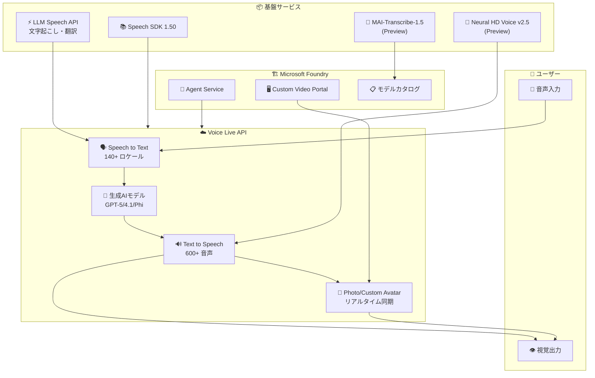

# Azure AI Speech: Build 2026 - Voice Live・LLM Speech API とアバター機能の GA

**リリース日**: 2026-06-02

**サービス**: Azure AI Speech

**機能**: Build 2026 - Voice Live・LLM Speech API とアバター機能の GA

**ステータス**: Launched (GA) / In preview (mixed)

[このアップデートのインフォグラフィックを見る](https://takech9203.github.io/azure-news-summary/20260602-ai-speech-build-2026-updates.html)

## 概要

Microsoft Build 2026 において、Azure AI Speech サービスに関する 7 つの重要なアップデートが発表された。Voice Live API の Microsoft Foundry Agent Service との統合が GA となり、LLM Speech API、Speech SDK 1.50、Photo Avatar (スタンダード・カスタム)、Custom Avatar ポータルが正式リリースされた。加えて、MAI-Transcribe-1.5 モデルと Neural HD voice HDv2.5 がプレビューとして提供開始された。

これらのアップデートにより、Azure AI Speech は音声認識・合成・翻訳の個別機能から、エンドツーエンドの音声エージェントプラットフォームへと進化した。Voice Live API は複数コンポーネントのオーケストレーションを不要にし、LLM Speech API は大規模言語モデルによる高精度な文字起こし・翻訳を実現する。Photo Avatar と Custom Avatar は、音声エージェントにフォトリアリスティックな視覚的プレゼンスを付加する。

**アップデート前の課題**

- 音声エージェントの構築には、音声認識・対話管理・音声合成の個別コンポーネントを手動でオーケストレーションする必要があった
- 文字起こしは従来の音声モデルに依存しており、文脈理解やプロンプトチューニングができなかった
- アバター機能はリアルタイム音声エージェントとの統合が限定的だった
- Speech SDK の古いバージョンでは最新の Voice Live API や LLM Speech 機能に対応できなかった

**アップデート後の改善**

- Voice Live API が Foundry Agent Service と統合され、単一インターフェースで音声エージェントを構築可能に
- LLM ベースの音声モデルにより、多言語対応・プロンプトチューニング・高精度な文字起こしが実現
- Photo Avatar が GA となり、1 枚の写真からリアルタイムアバターを生成可能に
- Speech SDK 1.50 が全ての新機能をサポートし、開発者体験を統一

## アーキテクチャ図



Voice Live API を中心に、音声入力から生成 AI 処理、音声・アバター出力までをエンドツーエンドで処理するアーキテクチャ。Microsoft Foundry Agent Service との統合により、エージェントアプリケーションからシームレスに利用可能。

## サービスアップデートの詳細

### GA リリース (5 項目)

#### 1. Voice Live と Microsoft Foundry Agent Service の統合

- **概要**: Voice Live API が Microsoft Foundry Agent Service と完全統合され、低遅延・高品質な音声対音声インタラクションを単一インターフェースで提供
- **主要機能**:
  - 音声認識・生成 AI・音声合成を統合した WebSocket ベースの API
  - GPT-5、GPT-4.1、GPT Realtime、Phi4 など複数の生成 AI モデルをサポート
  - ノイズ抑制、エコーキャンセレーション、高度な割り込み検出、発話終了検出
  - Azure OpenAI Realtime API と互換性のあるイベント設計
  - 140 以上のロケールの音声入力、150 以上のロケールの 600 以上の音声出力
  - アバター統合 (スタンダード・カスタム) による視覚的出力
  - Function calling によるツール利用・VoiceRAG パターン対応
- **フルマネージド**: モデルのデプロイ、キャパシティプランニング、スループットプロビジョニングが不要
- **公式ページ**: https://azure.microsoft.com/updates?id=563601

#### 2. LLM Speech API

- **概要**: 大規模言語モデルで拡張された音声モデルを使用し、高品質な文字起こし・翻訳を提供する API が GA
- **主要機能**:
  - `transcribe` タスク: 録音済み音声をテキストに変換
  - `translate` タスク: 録音済み音声を指定言語に翻訳 (9 言語対応: 英・独・仏・西・伊・韓・日・葡・中)
  - プロンプトチューニング: テキストプロンプトで出力スタイルをガイド可能
  - 話者分離 (Diarization) 対応
  - GPU アクセラレーションによる超高速推論
  - 多言語自動検出モード (25 言語)
- **対応形式**: WAV, MP3, OPUS/OGG, FLAC, WMA, AAC, ALAW, MULAW, AMR, WebM, SPEEX
- **制限**: 音声ファイルは 5 時間以内・500 MB 以内
- **公式ページ**: https://azure.microsoft.com/updates?id=564387

#### 3. Speech SDK 1.50

- **概要**: Azure AI Speech の最新 SDK リリース。Voice Live API や LLM Speech など Build 2026 の新機能をサポート
- **対応プラットフォーム**: 多言語 (C#, Python, Java, JavaScript, C++) およびマルチプラットフォーム対応
- **公式ページ**: https://azure.microsoft.com/updates?id=563192

#### 4. Photo Avatar (スタンダード・カスタム)

- **概要**: 1 枚の写真からフォトリアリスティックなトーキングアバターを生成する機能が GA
- **主要機能**:
  - VASA-1 モデルによるリアルな顔アニメーション
  - バッチ合成 (512x512 解像度、H264/HEVC/VP9 コーデック) とリアルタイム合成に対応
  - Voice Live API と連携したリアルタイムアバター会話
  - カスタム Photo Avatar: 独自の写真でブランド固有のアバターを作成可能
- **解像度**: 512x512 (Photo Avatar)、1920x1080 / 3840x2160 (Video Avatar)
- **公式ページ**: https://azure.microsoft.com/updates?id=563282

#### 5. Custom Avatar / Custom Video ポータル (Microsoft Foundry)

- **概要**: Microsoft Foundry 内でカスタムアバターの作成・管理を行うポータルが GA
- **主要機能**:
  - コーディング不要でカスタムアバタービデオを作成
  - Voice sync for avatar: トレーニングビデオの音声からカスタム音声を学習
  - Professional voice との組み合わせによる高度にリアルなアバター
  - 4K 解像度 (3840x2160) のカスタムビデオアバターに対応
- **公式ページ**: https://azure.microsoft.com/updates?id=563436

### プレビューリリース (2 項目)

#### 6. MAI-Transcribe-1.5 (Microsoft Foundry モデルカタログ)

- **概要**: Microsoft Foundry モデルカタログに新しいマルチモーダル文字起こしモデル MAI-Transcribe-1.5 が追加
- **特徴**: LLM ベースの高精度な文字起こし機能をモデルカタログから利用可能
- **公式ページ**: https://azure.microsoft.com/updates?id=563586

#### 7. Neural HD Voice アップデート (HDv2.5)

- **概要**: Neural HD voice の次世代バージョン HDv2.5 がプレビュー提供開始
- **特徴**: より自然で高品質な音声合成を実現する次世代ニューラル音声モデル
- **公式ページ**: https://azure.microsoft.com/updates?id=563526

## 技術仕様

| 項目 | 詳細 |
|------|------|
| Voice Live API プロトコル | WebSocket (サーバー間統合) |
| Voice Live 互換性 | Azure OpenAI Realtime API イベント互換 |
| Voice Live 対応モデル | GPT-5.x, GPT-4.1, GPT-4o, GPT Realtime, Phi4 |
| LLM Speech API バージョン | 2025-10-15 |
| LLM Speech 入力言語 | 25 言語 (自動検出対応) |
| LLM Speech 翻訳先言語 | 9 言語 (英/独/仏/西/伊/韓/日/葡/中) |
| LLM Speech 最大ファイルサイズ | 500 MB / 5 時間 |
| Photo Avatar 解像度 | 512x512 (バッチ・リアルタイム共通) |
| Video Avatar 解像度 | 1920x1080 / 3840x2160 (4K) |
| Avatar FPS | 25 fps |
| Speech SDK バージョン | 1.50 |

## 設定方法

### 前提条件

1. Azure サブスクリプション
2. Microsoft Foundry リソース (対応リージョンで作成)
3. Speech SDK 1.50 以降 (SDK 利用の場合)

### Voice Live API (WebSocket 接続)

```bash
# Voice Live API は WebSocket ベースのサーバー間接続で利用
# Azure OpenAI Realtime API と互換性のあるイベント形式を使用
# 詳細は Microsoft Learn の Voice Live How-to ガイドを参照
```

### LLM Speech API (REST)

```bash
# LLM Speech API による音声文字起こし
curl --location 'https://YourResourceName.cognitiveservices.azure.com/speechtotext/transcriptions:transcribe?api-version=2025-10-15' \
--header 'Content-Type: multipart/form-data' \
--header 'Ocp-Apim-Subscription-Key: <YourSpeechResourceKey>' \
--form 'audio=@"YourAudioFile.wav"' \
--form 'definition={
  "enhancedMode": {
    "enabled": true,
    "task": "transcribe"
  }
}'
```

### LLM Speech API (Python SDK)

```python
from azure.ai.transcription import TranscriptionClient
from azure.ai.transcription.models import (
    TranscriptionContent,
    TranscriptionOptions,
    EnhancedModeProperties,
)
from azure.core.credentials import AzureKeyCredential

client = TranscriptionClient(
    endpoint="<your-speech-endpoint>",
    credential=AzureKeyCredential("<your-api-key>")
)

with open("audio.wav", "rb") as audio_file:
    enhanced_mode = EnhancedModeProperties(
        task="transcribe",
        prompt=["Output must be in lexical format."]
    )
    options = TranscriptionOptions(enhanced_mode=enhanced_mode)
    request_content = TranscriptionContent(definition=options, audio=audio_file)
    result = client.transcribe(request_content)
    print(result.combined_phrases[0].text)
```

### Azure Portal (Microsoft Foundry)

1. [Microsoft Foundry](https://ai.azure.com) にサインイン
2. **Build** > **Models** > **AI Services** タブを選択
3. **Azure Speech - Speech to text** を選択し、LLM Speech を利用
4. Voice Live は **Azure Speech - Voice Live** モデルから利用可能
5. Avatar は **Azure Speech - Text to Speech Avatar** から利用可能

## メリット

### ビジネス面

- コンタクトセンターの自動化: Voice Live API により、インテリジェントな音声ボットを低コストで構築可能
- グローバル展開の加速: 140 以上のロケール対応と 9 言語翻訳により、多言語カスタマーサポートを実現
- ブランド差別化: カスタムアバターとカスタムボイスで独自のデジタルエクスペリエンスを提供
- 教育・研修のデジタル化: アバターを活用した対話型学習コンパニオンの構築

### 技術面

- オーケストレーション不要: Voice Live API がSTT/LLM/TTS を統合し、エンジニアリングコストを大幅削減
- 低遅延: フルマネージドインフラでエンドユーザー体感遅延を最小化
- モデル選択の柔軟性: ユースケースに応じて GPT-5、GPT-4.1、Phi4 などを選択可能
- LLM Speech のプロンプトチューニング: 出力フォーマットや用語認識をテキストプロンプトで制御
- SDK の統一: Speech SDK 1.50 で全新機能を単一ライブラリから利用可能

## デメリット・制約事項

- Voice Live API のカスタム音声・カスタムアバターは Limited Access (限定アクセス) で、利用申請が必要
- LLM Speech の翻訳タスクではワードレベルタイムスタンプと話者分離が非対応
- LLM Speech の confidence スコアは常に 0 (利用不可)
- Photo Avatar の解像度は 512x512 に制限 (Video Avatar は 1920x1080 以上)
- MAI-Transcribe-1.5 はプレビューのため、本番利用には注意が必要
- Neural HD voice HDv2.5 もプレビュー段階
- Voice Live API の一部モデル (gpt-5.5, gpt-5.4-mini, gpt-5.4-nano) は事前デプロイされておらず、Bring Your Own Model (BYOM) が必要

## ユースケース

### ユースケース 1: インテリジェントコンタクトセンター

**シナリオ**: Voice Live API を使用して、顧客からの電話問い合わせに自動応答する音声エージェントを構築する。

**実装例**:

```text
Voice Live API 構成:
- モデル: gpt-4.1 (Voice Live pro tier)
- 音声入力: Azure Speech to Text (ja-JP)
- 音声出力: カスタムボイス (ブランド固有)
- アバター: スタンダードアバター (ビデオ通話対応)
- Function calling: CRM システム連携、注文状況確認
```

**効果**: 24 時間対応の音声エージェントにより、顧客待ち時間を削減。Function calling でバックエンドシステムと連携し、リアルタイムに情報を提供。

### ユースケース 2: 多言語会議の文字起こし・翻訳

**シナリオ**: LLM Speech API を使用して、多言語が混在する会議の録音を高精度に文字起こしし、日本語に翻訳する。

**実装例**:

```bash
# 多言語会議の文字起こし (自動言語検出)
curl --location 'https://myresource.cognitiveservices.azure.com/speechtotext/transcriptions:transcribe?api-version=2025-10-15' \
--header 'Content-Type: multipart/form-data' \
--header 'Ocp-Apim-Subscription-Key: <key>' \
--form 'audio=@"meeting_recording.wav"' \
--form 'definition={
  "enhancedMode": {
    "enabled": true,
    "task": "translate",
    "targetLanguage": "ja"
  },
  "diarization": {
    "maxSpeakers": 5,
    "enabled": true
  }
}'
```

**効果**: 25 言語の自動検出と話者分離により、多国籍チームの会議録を自動生成。プロンプトチューニングで専門用語の認識精度を向上。

### ユースケース 3: 教育向けアバターチューター

**シナリオ**: Photo Avatar と Voice Live API を組み合わせて、対話型の語学学習アシスタントを構築する。

**実装例**:

```text
構成:
- Voice Live API + Photo Avatar (リアルタイム)
- モデル: gpt-4.1-mini (Voice Live basic tier、コスト効率重視)
- カスタム Photo Avatar: 講師の写真から生成
- 発音評価 (Pronunciation Assessment) 機能と連携
```

**効果**: 学習者はアバター講師とリアルタイムで会話練習が可能。低コストの basic tier で大規模展開にも対応。

## 料金

Voice Live API の料金は利用する生成 AI モデルに応じて 3 つの tier に分かれる:

| Tier | 対応モデル |
|------|-----------|
| Voice Live pro | gpt-realtime, gpt-4o, gpt-4.1, gpt-5, gpt-5-chat |
| Voice Live basic | gpt-realtime-mini, gpt-4o-mini, gpt-4.1-mini, gpt-5-mini |
| Voice Live lite | gpt-5-nano, phi4-mm-realtime, phi4-mini |

- カスタム音声・カスタムアバターを使用する場合は、モデルトレーニングとホスティングの費用が別途発生
- 詳細な料金は [Speech Services Pricing](https://azure.microsoft.com/pricing/details/cognitive-services/speech-services/) を参照

## 関連サービス・機能

- **Microsoft Foundry Agent Service**: Voice Live API と統合されたエージェント構築プラットフォーム
- **Azure OpenAI Service**: Voice Live API の生成 AI バックエンドとして GPT-5/4.1/4o を提供
- **Azure AI Foundry**: モデルカタログ、デプロイメント管理、ポータル機能を提供
- **Azure Communication Services**: Voice Live API と連携した電話/通話インテグレーション
- **Azure AI Language**: 自然言語理解・感情分析と組み合わせた高度な音声分析

## 参考リンク

- [インフォグラフィック](https://takech9203.github.io/azure-news-summary/20260602-ai-speech-build-2026-updates.html)
- [Voice Live GA - 公式アップデート](https://azure.microsoft.com/updates?id=563601)
- [LLM Speech API GA - 公式アップデート](https://azure.microsoft.com/updates?id=564387)
- [Speech SDK 1.50 - 公式アップデート](https://azure.microsoft.com/updates?id=563192)
- [Photo Avatar GA - 公式アップデート](https://azure.microsoft.com/updates?id=563282)
- [Custom Avatar Portal - 公式アップデート](https://azure.microsoft.com/updates?id=563436)
- [MAI-Transcribe-1.5 Preview - 公式アップデート](https://azure.microsoft.com/updates?id=563586)
- [Neural HD Voice HDv2.5 Preview - 公式アップデート](https://azure.microsoft.com/updates?id=563526)
- [Voice Live API ドキュメント](https://learn.microsoft.com/en-us/azure/ai-services/speech-service/voice-live)
- [LLM Speech API ドキュメント](https://learn.microsoft.com/en-us/azure/ai-services/speech-service/llm-speech)
- [Text to Speech Avatar ドキュメント](https://learn.microsoft.com/en-us/azure/ai-services/speech-service/text-to-speech-avatar/what-is-text-to-speech-avatar)
- [Azure AI Speech 概要](https://learn.microsoft.com/en-us/azure/ai-services/speech-service/overview)
- [料金ページ](https://azure.microsoft.com/pricing/details/cognitive-services/speech-services/)

## まとめ

Build 2026 での Azure AI Speech のアップデートは、音声 AI の統合プラットフォーム化という明確な方向性を示している。Voice Live API の GA により、従来は複雑なオーケストレーションが必要だった音声エージェントの構築が大幅に簡素化された。LLM Speech API は文字起こし・翻訳の精度を次のレベルに引き上げ、Photo Avatar は視覚的な対話体験を現実のものとした。

**推奨される次のアクション**:

1. Voice Live API の評価: コンタクトセンターや顧客対応の音声自動化ユースケースがある場合、Voice Live API の PoC を検討
2. LLM Speech API への移行検討: 既存の Fast Transcription を使用している場合、LLM Speech の enhanced mode による精度向上を評価
3. Speech SDK 1.50 へのアップグレード: 既存アプリケーションで Speech SDK を使用している場合、最新版への更新を計画
4. アバター機能の活用検討: 教育、カスタマーサポート、マーケティングなどでアバターによる視覚的エンゲージメントの効果を評価

---

**タグ**: #AzureAISpeech #VoiceLive #LLMSpeech #SpeechSDK #PhotoAvatar #CustomAvatar #MAITranscribe #NeuralHDVoice #Build2026 #GA #Preview
