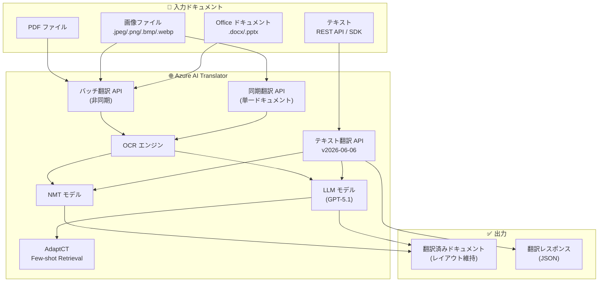

# Azure AI Translator: Build 2026 - 画像翻訳・PDF バッチ改善と新 SDK の GA

**リリース日**: 2026-06-02

**サービス**: Azure AI Translator

**機能**: Build 2026 - 画像翻訳・PDF バッチ改善と新 SDK の GA

**ステータス**: Launched (GA)

[このアップデートのインフォグラフィックを見る](https://takech9203.github.io/azure-news-summary/20260602-ai-translator-build-2026-updates.html)

## 概要

Microsoft Build 2026 にて、Azure AI Translator に 6 つの重要なアップデートが一般提供 (GA) として発表された。最大の注目点は、画像ファイルの翻訳機能がバッチ処理と同期処理の両方で利用可能になったことである。画像内のテキストを OCR で認識し、元のデザインやレイアウトを維持したまま翻訳できるようになった。

加えて、Office ドキュメント (Word、PowerPoint) に埋め込まれた画像内のテキスト翻訳、PDF バッチ翻訳の品質改善、最新テキスト翻訳 API (v2026-06-06) 対応の SDK リリース、そして Azure AI Foundry NextGen プレイグラウンドでの Adaptive Custom Translation (AdaptCT) 機能が GA となった。

これらのアップデートにより、Azure AI Translator はテキストのみならず視覚的コンテンツを含むドキュメントの多言語翻訳において、エンタープライズグレードの包括的なソリューションへと進化した。

**アップデート前の課題**

- 画像ファイル (.jpeg, .png, .bmp, .webp) の翻訳は非対応で、画像内テキストは手動で抽出・翻訳・再配置する必要があった
- Office ドキュメント内の画像に含まれるテキストは翻訳対象外で、ドキュメント全体の完全な翻訳が困難だった
- PDF バッチ翻訳の品質やレイアウト保持に課題があった
- テキスト翻訳 API v3.0 は LLM モデル選択やトーン制御に対応しておらず、SDK も古いバージョンのみだった
- カスタム翻訳モデルの構築には大量の対訳データ (最低 10,000 対) と最大 48 時間のトレーニング時間が必要だった

**アップデート後の改善**

- 画像ファイルを直接翻訳可能に (バッチ・同期の両方に対応、レイアウト維持)
- Word (.docx) と PowerPoint (.pptx) 内の画像テキストもバッチ翻訳で自動翻訳
- PDF バッチ翻訳の品質向上 (OCR 精度改善、レイアウト保持の強化)
- 新 API v2026-06-06 対応の SDK で、LLM モデル選択・トーン制御・性別指定が可能に
- AdaptCT により 5 対の対訳データから数分でカスタマイズ可能 (トレーニング不要)

## アーキテクチャ図



Azure AI Translator の新しいアーキテクチャは、画像・PDF・Office ドキュメントを OCR で処理した後、NMT または LLM モデルで翻訳を行う。AdaptCT は LLM パスで Few-shot Retrieval を利用してカスタマイズされた翻訳を提供する。

## サービスアップデートの詳細

### 主要機能

1. **画像ファイル翻訳 (バッチドキュメント翻訳)**
   - 画像ファイル (.jpeg, .png, .bmp, .webp) をバッチ翻訳 API に直接送信可能
   - 画像内のテキストを OCR で認識し、元のデザインとレイアウトを維持したまま翻訳
   - Azure Blob Storage を利用した非同期処理で大量の画像を一括翻訳

2. **画像ファイル翻訳 (同期・単一ドキュメント)**
   - 単一の画像ファイルをリアルタイムで翻訳するシンクロナス API
   - Blob Storage 不要で、リクエスト/レスポンスで完結
   - アプリケーション組み込みに適した軽量な同期処理

3. **Office ドキュメント内画像テキスト翻訳**
   - Word (.docx) と PowerPoint (.pptx) に埋め込まれた画像内テキストの翻訳
   - バッチドキュメント翻訳 API で利用可能
   - ドキュメント全体 (テキスト + 画像内テキスト) を一括で翻訳

4. **PDF バッチドキュメント翻訳の改善**
   - OCR 技術を使用したスキャン PDF のテキスト抽出精度向上
   - 元のレイアウトを保持した翻訳品質の改善
   - 大量 PDF の一括処理パフォーマンス向上

5. **テキスト翻訳 API v2026-06-06 対応 SDK**
   - C#/.NET、Python 向けの新しいクライアントライブラリ
   - 新しいリクエスト/レスポンス JSON スキーマ (inputs/value 構造)
   - NMT と LLM (GPT-5.1) のモデル選択機能
   - トーン制御 (formal, informal, neutral) と性別指定出力

6. **Adaptive Custom Translation (AdaptCT)**
   - Azure AI Foundry NextGen プレイグラウンドで GA
   - 最小 5 対の対訳文ペアから数分でデータセット作成
   - Few-shot Retrieval により推論時に類似セグメントを取得して用語・文体を適応
   - トレーニング不要、デプロイ不要で即座に反映
   - TMX/TSV 形式でデータインポート可能

## 技術仕様

| 項目 | 詳細 |
|------|------|
| 画像対応形式 | .jpeg, .png, .bmp, .webp |
| Office 対応形式 (画像翻訳) | .docx, .pptx |
| テキスト翻訳 API バージョン | 2026-06-06 (GA) |
| SDK 対応言語 | C#/.NET, Python |
| AdaptCT 最小データ要件 | 5 対の対訳文ペア |
| AdaptCT 最大データ要件 | 10,000 対の対訳文ペア |
| AdaptCT セグメント上限 | 250 文字 (ソースまたはターゲット) |
| LLM Translate 最大配列要素数 | 50 |
| LLM Translate 最大要素サイズ | 5,000 文字 |
| NMT Translate 最大配列要素数 | 1,000 |
| NMT Translate 最大要素サイズ | 50,000 文字 |
| AdaptCT データセット作成時間 | 数分 |
| 対応言語数 | 100 以上 |

## 設定方法

### 前提条件

1. アクティブな Azure サブスクリプション
2. Azure AI Translator リソース (カスタムドメインエンドポイント付き)
3. バッチ翻訳の場合: Azure Blob Storage アカウント (ソース/ターゲットコンテナー)
4. AdaptCT の場合: Microsoft Foundry リソースとプロジェクト
5. LLM 翻訳の場合: Microsoft Foundry リソース

### バッチ画像翻訳 (REST API)

```bash
# バッチ翻訳リクエスト (画像ファイルを含む)
curl -X POST "https://<your-resource-name>.cognitiveservices.azure.com/translator/document/batches" \
  -H "Ocp-Apim-Subscription-Key: <your-key>" \
  -H "Content-Type: application/json" \
  -d '{
    "inputs": [{
      "source": {
        "sourceUrl": "https://<storage-account>.blob.core.windows.net/source-container?<sas-token>"
      },
      "targets": [{
        "targetUrl": "https://<storage-account>.blob.core.windows.net/target-container?<sas-token>",
        "language": "ja"
      }]
    }]
  }'
```

### テキスト翻訳 API v2026-06-06 (LLM モデル指定)

```bash
# LLM モデルを使用した翻訳 (トーン制御付き)
curl -X POST "https://api.cognitive.microsofttranslator.com/translate?api-version=2026-06-06&to=ja" \
  -H "Ocp-Apim-Subscription-Key: <your-key>" \
  -H "Content-Type: application/json" \
  -d '{
    "inputs": [{
      "text": "Hello, how are you today?"
    }]
  }'
```

### AdaptCT データセット作成

```bash
# Adaptive ドキュメントのインポート (TMX 形式)
curl -X POST "https://<your-resource-name>.cognitiveservices.azure.com/translator/customtranslator/api/texttranslator/v1.0/documents/import?workspaceId=<workspaceId>" \
  -H "Authorization: Bearer <token>" \
  -F "DocumentDetails=[{\"DocumentName\": \"my-translations\",\"DocumentType\": \"Adaptive\",\"FileDetails\": [{\"Name\": \"data.tmx\",\"LanguageCode\": \"en\",\"OverwriteIfExists\": true}]}]" \
  -F "FILES=@path/to/data.tmx"

# Adaptive データセットの作成
curl -X POST "https://<your-resource-name>.cognitiveservices.azure.com/translator/customtranslator/api/texttranslator/v1.0/index?workspaceId=<workspaceId>" \
  -H "Content-Type: application/json" \
  -d '{
    "documentIds": ["<document-id>"],
    "IndexName": "my-adaptive-index",
    "SourceLanguage": "en",
    "TargetLanguage": "ja"
  }'
```

### Azure Portal

1. [Azure AI Foundry ポータル](https://ai.azure.com/) にアクセス
2. プロジェクトを選択し、**Build** > **Models** > **AI Services** > **Azure Translator - Text Translation** > **Adaptive LLM** を選択
3. AdaptCT プレイグラウンドで対訳データをアップロードし、即座にカスタム翻訳をテスト可能

## メリット

### ビジネス面

- 画像・PDF・Office ドキュメントを含む全社的な翻訳ワークフローの自動化が可能に
- 手動での画像テキスト翻訳作業が不要になり、ローカリゼーションコストを大幅に削減
- AdaptCT により翻訳品質のカスタマイズが数分で完了し、マーケットへの投入時間を短縮
- LLM モデルによるトーン制御で、ブランドの一貫性を維持した翻訳が可能

### 技術面

- バッチ翻訳と同期翻訳の両方で画像に対応し、アーキテクチャの柔軟性が向上
- 新 SDK (C#/.NET, Python) により開発者体験が向上し、新 API への移行が容易に
- AdaptCT の Few-shot Retrieval アプローチにより、専用モデルのトレーニング/デプロイが不要
- NMT と LLM のルーティング選択により、品質・コスト・レイテンシのバランスを最適化可能

## デメリット・制約事項

- テキスト翻訳 API v2026-06-06 は v3.0 からの破壊的変更を含むため、移行には十分なテストが必要
- LLM 翻訳のリクエスト制限 (最大 50 要素、5,000 文字/要素) は NMT より厳しい
- AdaptCT のセグメント上限は 250 文字で、長文の対訳は分割が必要
- LLM 翻訳には Microsoft Foundry リソースが必要 (追加のリソース設定)
- 画像翻訳の対応形式は 4 種類 (.jpeg, .png, .bmp, .webp) に限定
- 同期ドキュメント翻訳は現時点で画像対応しているが、Foundry ポータルのプレイグラウンドではバッチ翻訳のみ対応していない場合がある

## ユースケース

### ユースケース 1: グローバル製造業のマニュアル翻訳

**シナリオ**: 製造業の企業が、製品マニュアル (図面・写真付き PDF、Word ファイル) を 20 言語に翻訳する必要がある。画像内の警告ラベルや操作手順のテキストも翻訳対象。

**実装例**:

```bash
# マニュアル PDF と画像を含むフォルダをバッチ翻訳
# ソースコンテナに PDF、画像、Office ドキュメントをアップロード後
curl -X POST "https://my-translator.cognitiveservices.azure.com/translator/document/batches" \
  -H "Ocp-Apim-Subscription-Key: $TRANSLATOR_KEY" \
  -H "Content-Type: application/json" \
  -d '{
    "inputs": [{
      "source": {
        "sourceUrl": "https://mystorage.blob.core.windows.net/manuals-en?sv=...",
        "filter": { "suffix": ".pdf" }
      },
      "targets": [
        { "targetUrl": "https://mystorage.blob.core.windows.net/manuals-ja?sv=...", "language": "ja" },
        { "targetUrl": "https://mystorage.blob.core.windows.net/manuals-de?sv=...", "language": "de" }
      ]
    }]
  }'
```

**効果**: 画像内テキストを含む完全な多言語マニュアルを自動生成し、翻訳ワークフローの工数を 50% 以上削減。

### ユースケース 2: AdaptCT によるブランド用語統一

**シナリオ**: SaaS 企業が製品 UI の翻訳で一貫した用語とトーンを維持したい。従来の Custom Translator では 10,000 対のデータ準備とトレーニングに数日かかっていた。

**実装例**:

```bash
# 少数の用語対訳 (TSV) をインポートして AdaptCT データセット作成
# 例: "Dashboard" -> "ダッシュボード", "Workspace" -> "ワークスペース" など
# 数分でデータセット作成完了後、翻訳 API で adaptive dataset ID を指定
curl -X POST "https://api.cognitive.microsofttranslator.com/translate?api-version=2026-06-06&to=ja" \
  -H "Ocp-Apim-Subscription-Key: $TRANSLATOR_KEY" \
  -H "Content-Type: application/json" \
  -d '{
    "inputs": [{ "text": "Welcome to your Dashboard workspace" }]
  }'
```

**効果**: 最小 5 対の対訳データから数分でカスタマイズ完了。用語の一貫性を維持しつつ、更新も即時反映。

## 利用可能リージョン

Azure AI Translator のデータ処理リージョン:

| リソース作成リージョン | リクエスト処理データセンター |
|---|---|
| Global | 最寄りのデータセンター |
| Americas | East US 2, West US 2 |
| Asia Pacific | Japan East, Southeast Asia |
| Europe (スイス以外) | France Central, West Europe |
| Switzerland | Switzerland North, Switzerland West |

## 関連サービス・機能

- **Azure Blob Storage**: バッチドキュメント翻訳のソース/ターゲットコンテナとして必須
- **Azure AI Foundry**: AdaptCT のプレイグラウンドと LLM モデル管理を提供
- **Azure AI Document Intelligence**: ドキュメントの構造解析と OCR で補完的に利用可能
- **Custom Translator**: 大量データによる専用 NMT モデル構築 (AdaptCT と補完関係)
- **Azure OpenAI Service**: LLM 翻訳で使用される GPT-5.1 モデルの課金基盤

## 参考リンク

- [インフォグラフィック](https://takech9203.github.io/azure-news-summary/20260602-ai-translator-build-2026-updates.html)
- [Improved PDF batch document translation](https://azure.microsoft.com/updates?id=564422)
- [Image file translation for batch document translation](https://azure.microsoft.com/updates?id=564417)
- [Image translation inside Office documents for batch document translation](https://azure.microsoft.com/updates?id=564412)
- [Document translation for image files (synchronous)](https://azure.microsoft.com/updates?id=563341)
- [Azure AI Translator SDKs for the latest text translation API](https://azure.microsoft.com/updates?id=563326)
- [Adaptive custom translation in Azure AI Foundry NextGen](https://azure.microsoft.com/updates?id=563307)
- [Microsoft Learn - Document Translation Overview](https://learn.microsoft.com/azure/ai-services/translator/document-translation/overview)
- [Microsoft Learn - Text Translation Overview](https://learn.microsoft.com/azure/ai-services/translator/text-translation/overview)
- [Microsoft Learn - Adaptive Custom Translation](https://learn.microsoft.com/azure/ai-services/translator/foundry/adaptive-custom-translation)
- [料金ページ](https://azure.microsoft.com/pricing/details/cognitive-services/translator/)

## まとめ

Build 2026 での Azure AI Translator のアップデートは、翻訳サービスの適用範囲をテキストから画像・ビジュアルコンテンツへと大幅に拡張するものである。特に画像ファイルの直接翻訳 (バッチ/同期) と Office ドキュメント内画像テキストの翻訳は、これまで手動作業が必要だったローカリゼーションワークフローを完全に自動化する。

Solutions Architect への推奨アクション:

1. **画像翻訳の早期検証**: 自社のローカリゼーションパイプラインで画像翻訳の品質を検証し、手動プロセスの置き換えを計画する
2. **API v2026-06-06 への移行計画**: 破壊的変更を含むため、テスト環境での十分な検証後に本番移行を実施する
3. **AdaptCT の導入検討**: 従来の Custom Translator と比較し、少量データでの即時カスタマイズが適するユースケースを特定する
4. **NMT/LLM ルーティング戦略**: 高品質が求められるコンテンツには LLM、大量処理にはNMT というルーティング設計を検討する

---

**タグ**: #AzureAI #Translator #DocumentTranslation #ImageTranslation #Build2026 #AdaptCT #SDK #NMT #LLM #GA
