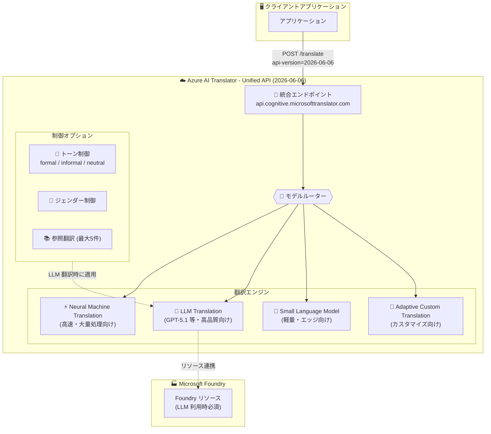

# Azure AI Translator: Unified Text Translation API GA

**リリース日**: 2026-06-02

**サービス**: Azure AI Translator

**機能**: Unified Text Translation API GA

**ステータス**: Launched (GA)

[このアップデートのインフォグラフィックを見る](https://takech9203.github.io/azure-news-summary/20260602-ai-translator-unified-api-ga.html)

## 概要

Microsoft Build 2026 にて、Azure AI Translator の統合テキスト翻訳 API (Unified Text Translation API) が一般提供 (GA) となった。新しい API バージョン `2026-06-06` として提供されるこの統合 API は、単一のエンドポイントから Neural Machine Translation (NMT)、Large Language Model (LLM) 翻訳、Small Language Model 翻訳、Adaptive Custom Translation など、複数の翻訳エンジンを統一的に利用できる。

従来の v3.0 API では NMT のみが利用可能であり、翻訳の品質やスタイルを柔軟に制御することが困難だった。新しい統合 API では、開発者が単一のエンドポイントを通じて翻訳エンジンを選択し、トーン (フォーマル/インフォーマル/ニュートラル) やジェンダー固有の出力制御を行えるようになった。

この統合により、開発者は用途に応じて最適な翻訳エンジンを選択しながら、一貫した API インターフェースで多言語翻訳ワークフローを構築できるようになった。高品質が求められるコンテンツには LLM ベースの翻訳を、大量の定型テキストには高速な NMT を使い分けることで、コストと品質のバランスを最適化できる。

**アップデート前の課題**

- v3.0 API では NMT のみが利用可能で、翻訳エンジンの選択ができなかった
- LLM を活用した高品質な翻訳を利用するには別サービスや別エンドポイントが必要だった
- 翻訳のトーン (フォーマル/カジュアル) やジェンダー表現の制御ができなかった
- カスタム翻訳モデルの構築には大量の対訳データと長時間のトレーニングが必要だった
- リクエスト/レスポンスのスキーマが古い設計のままだった

**アップデート後の改善**

- 単一エンドポイントから NMT、LLM、Small Language Model、Adaptive Custom Translation を統一的に利用可能
- API パラメータでモデル選択 (NMT または LLM) を指定でき、品質・コスト・シナリオに応じた使い分けが可能
- LLM ベース翻訳でトーン制御 (formal/informal/neutral) とジェンダー固有の出力に対応
- Adaptive Custom Translation により、最大 5 つの参照翻訳またはデータセット ID を提供するだけでスタイルや用語を制御可能
- リクエスト/レスポンスの JSON スキーマが刷新 (inputs/value 構造)

## アーキテクチャ図



統合エンドポイントがモデルルーターとして機能し、開発者が指定したモデル選択パラメータに基づいて適切な翻訳エンジンにリクエストをルーティングする。LLM ベースの翻訳には Microsoft Foundry リソースが必要。

## サービスアップデートの詳細

### 主要機能

1. **モデル選択 (NMT / LLM)**
   - 標準 NMT と LLM デプロイメント (例: GPT-5.1) を API パラメータで選択可能
   - 品質、コスト、シナリオ要件に応じた使い分けが可能
   - LLM ベース翻訳には Microsoft Foundry リソースが必要

2. **Adaptive Custom Translation**
   - 最大 5 つの参照翻訳 (reference translations) を提供してスタイルや用語を制御
   - Adaptive dataset index ID による翻訳スタイルの指定
   - 従来のカスタム翻訳のような大量トレーニングデータ不要

3. **トーン・ジェンダー制御**
   - LLM ベース翻訳でトーンバリアント (formal/informal/neutral) をサポート
   - ジェンダー固有の出力制御に対応

4. **刷新されたリクエスト/レスポンススキーマ**
   - リクエスト: `inputs` 配列で翻訳テキストを指定
   - レスポンス: `value` 配列で翻訳結果を返却
   - v3.0 とは互換性のない破壊的変更 (Breaking Changes)

## 技術仕様

| 項目 | NMT | LLM |
|------|-----|-----|
| API バージョン | 2026-06-06 | 2026-06-06 |
| 最大配列要素数 | 1,000 | 50 |
| 最大要素サイズ | 50,000 文字 | 5,000 文字 |
| トーン制御 | 非対応 | 対応 |
| ジェンダー制御 | 非対応 | 対応 |
| Adaptive Custom Translation | 非対応 | 対応 |
| 必要リソース | Translator リソース | Translator + Foundry リソース |
| 課金単位 | ソーステキスト文字数 | 入出力トークン数 |

## 設定方法

### 前提条件

1. Azure サブスクリプション
2. Azure AI Translator リソース (NMT 利用時)
3. Microsoft Foundry リソース (LLM 利用時 - 追加で必要)
4. 認証キーまたは Microsoft Entra ID 資格情報

### 新 API (2026-06-06) リクエスト例

```bash
# NMT による翻訳 (従来互換)
curl -X POST "https://api.cognitive.microsofttranslator.com/translate?api-version=2026-06-06" \
  -H "Ocp-Apim-Subscription-Key: ${TRANSLATOR_KEY}" \
  -H "Content-Type: application/json" \
  -d '{
    "inputs": [
      {
        "text": "Hello, how are you?",
        "language": "en",
        "targets": [
          { "language": "ja" }
        ]
      }
    ]
  }'
```

### レスポンス例

```json
{
  "value": [
    {
      "translations": [
        {
          "language": "ja",
          "sourceCharacters": 19,
          "text": "こんにちは、お元気ですか？"
        }
      ]
    }
  ]
}
```

## メリット

### ビジネス面

- 単一 API で複数の翻訳品質レベルを提供でき、ユースケースに応じたコスト最適化が可能
- Adaptive Custom Translation により、大規模なトレーニングデータセット不要でブランド固有の翻訳が実現
- トーン制御により、顧客向けコンテンツのローカライズ品質が向上

### 技術面

- 単一エンドポイント・統一スキーマにより API 統合の複雑さが軽減
- モデルルーティングにより、トラフィック量や品質要件に応じた柔軟なアーキテクチャ設計が可能
- グローバルエンドポイントとリージョナルエンドポイントの両方をサポートし、データレジデンシー要件に対応
- 100 以上の言語・方言をサポート

## デメリット・制約事項

- v3.0 からの移行には破壊的変更 (Breaking Changes) があり、リクエスト/レスポンスのペイロード形状の全面的な検証が必要
- LLM ベース翻訳は Microsoft Foundry リソースが別途必要 (追加コスト)
- LLM ベース翻訳の最大配列要素数は 50、最大要素サイズは 5,000 文字と NMT より制限が厳しい
- LLM 翻訳はトークンベース課金のため、大量テキスト処理時のコスト予測が必要
- 本番環境への移行前に、ペイロード形状・レスポンスパース・品質の全面検証が推奨される

## ユースケース

### ユースケース 1: ハイブリッド翻訳パイプライン

**シナリオ**: EC サイトで商品説明とマーケティングコンテンツの多言語展開を行う場合、定型的な商品スペックは NMT で高速処理し、ブランドメッセージや広告コピーは LLM + トーン制御で高品質翻訳を実施する。

**効果**: 翻訳コストを最小限に抑えながら、顧客接点の高い部分では LLM の表現力を活用し、ブランド体験の一貫性を確保できる。

### ユースケース 2: Adaptive Custom Translation による迅速なカスタマイズ

**シナリオ**: 法律事務所が契約書の翻訳において、業界固有の用語や表現スタイルを統一したい場合、参照翻訳を最大 5 件提供するだけで、大規模トレーニングなしにスタイルガイドに準拠した翻訳を実現する。

**効果**: 従来数万件の対訳データと数十時間のトレーニングが必要だったカスタマイズが、少数の参照例だけで即座に実現可能になる。

## 料金

NMT 翻訳とLLM 翻訳では課金体系が異なる。

| 翻訳エンジン | 課金方式 |
|-------------|---------|
| NMT (Neural Machine Translation) | ソーステキスト文字数に基づく課金 |
| LLM (Large Language Model) | 入出力トークン数に基づく課金 |

詳細な料金は以下を参照:
- NMT: [Azure Translator pricing](https://azure.microsoft.com/pricing/details/cognitive-services/translator-text-api/)
- LLM: [Azure OpenAI pricing](https://azure.microsoft.com/pricing/details/cognitive-services/openai-service/)

## 利用可能リージョン

統合 API はグローバルエンドポイントおよびリージョナルエンドポイントで利用可能。

| エンドポイント | 処理リージョン |
|--------------|--------------|
| グローバル (推奨): `api.cognitive.microsofttranslator.com` | 最寄りのデータセンター |
| アメリカ: `api-nam.cognitive.microsofttranslator.com` | East US 2, West US 2 |
| アジア太平洋: `api-apc.cognitive.microsofttranslator.com` | Japan East, Southeast Asia |
| ヨーロッパ: `api-eur.cognitive.microsofttranslator.com` | France Central, West Europe |
| スイス | Switzerland North, Switzerland West |

LLM 翻訳のデータ処理リージョンは、デプロイメント構成 (global / data zone / regional) に依存する。

## 関連サービス・機能

- **Microsoft Foundry**: LLM ベース翻訳の利用に必須のリソース基盤。モデルデプロイメントと管理を担当
- **Azure AI Document Translation**: ドキュメント単位のバッチ翻訳。テキスト API と補完的に利用
- **Custom Translator**: 大規模トレーニングデータによる従来型カスタム翻訳モデル。Adaptive Custom Translation はその軽量版として位置づけ
- **Azure OpenAI Service**: LLM ベース翻訳のバックエンドとして連携。トークンベース課金は Azure OpenAI の料金体系に準拠

## 参考リンク

- [インフォグラフィック](https://takech9203.github.io/azure-news-summary/20260602-ai-translator-unified-api-ga.html)
- [公式アップデート情報](https://azure.microsoft.com/updates?id=563631)
- [Microsoft Learn - Text Translation Overview](https://learn.microsoft.com/azure/ai-services/translator/text-translation/overview)
- [Microsoft Learn - REST API Guide (2026-06-06)](https://learn.microsoft.com/azure/ai-services/translator/text-translation/2026-06-06/rest-api-guide)
- [Microsoft Learn - Translate API Reference](https://learn.microsoft.com/azure/ai-services/translator/text-translation/reference/v3/translate)
- [料金ページ (NMT)](https://azure.microsoft.com/pricing/details/cognitive-services/translator-text-api/)
- [料金ページ (LLM/Azure OpenAI)](https://azure.microsoft.com/pricing/details/cognitive-services/openai-service/)

## まとめ

Azure AI Translator の統合テキスト翻訳 API (バージョン 2026-06-06) の GA は、翻訳サービスのアーキテクチャにおける重要な転換点である。単一エンドポイントから NMT、LLM、Small Language Model、Adaptive Custom Translation という複数の翻訳エンジンを統一的に利用できるようになったことで、開発者はユースケースに応じた最適な翻訳品質とコストのバランスを実現できる。

**推奨アクション:**

1. 現在 v3.0 を利用中の場合、新 API バージョンのスキーマ変更 (inputs/value) を確認し、移行計画を策定する
2. LLM ベース翻訳を試す場合は Microsoft Foundry リソースをプロビジョニングする
3. 本番移行前にペイロード形状・レスポンスパース・翻訳品質の全面的な検証を実施する
4. NMT と LLM のハイブリッドルーティング戦略を設計し、コスト最適化を図る

---

**タグ**: #AzureAITranslator #UnifiedAPI #NMT #LLM #AdaptiveCustomTranslation #Build2026 #GA #MicrosoftFoundry
