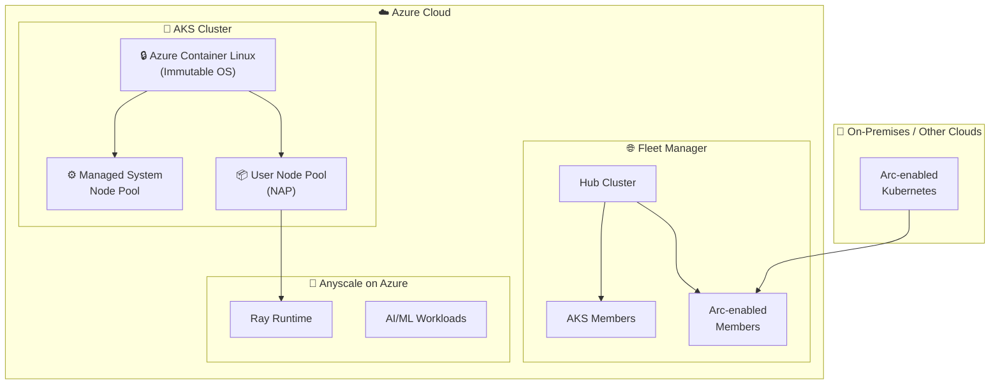

# Azure Kubernetes Service (AKS): Build 2026 - ACL GA・AKS Automatic 強化・マルチクラスタ管理

**リリース日**: 2026-06-02

**サービス**: Azure Kubernetes Service (AKS)

**機能**: Build 2026 - ACL GA・AKS Automatic 強化・マルチクラスタ管理

**ステータス**: Launched (GA) / In preview

[このアップデートのインフォグラフィックを見る](https://takech9203.github.io/azure-news-summary/20260602-aks-build-2026-updates.html)

## 概要

Microsoft Build 2026 において、Azure Kubernetes Service (AKS) に関する複数の重要なアップデートが発表された。コンテナ最適化 OS「Azure Container Linux (ACL)」の GA、AKS Automatic のマネージドシステムノードプール、Azure Kubernetes Fleet Manager の Arc 対応クラスタサポート、そして AI/ML ワークロード向けの Anyscale on Azure 統合がアナウンスされた。

これらのアップデートは、AKS のセキュリティ強化、運用自動化、マルチクラスタ管理の拡張、AI/ML ワークロードの実行基盤としての進化を示している。特に ACL の GA と AKS Automatic のマネージドシステムノードプールは、本番環境における Kubernetes 運用の大幅な簡素化を実現する。

**アップデート前の課題**

- AKS のノード OS として Ubuntu や Azure Linux を使用する場合、OS レベルのセキュリティ強化は手動設定が必要だった
- AKS Automatic でもシステムノードプールの管理・スケーリング・アップグレードはユーザーの責任範囲だった
- Azure Kubernetes Fleet Manager は AKS クラスタのみが対象で、オンプレミスや他クラウドのクラスタを統合管理できなかった
- Ray ベースの AI/ML ワークロードを AKS 上で実行するには、インフラ構築・管理の専門知識が必要だった

**アップデート後の改善**

- ACL により、カーネルレベルの不変性 (dm-verity) と SELinux によるセキュリティがデフォルトで有効化される
- AKS Automatic のマネージドシステムノードプールにより、システムコンポーネントの管理が完全に自動化され、VM コストもユーザーに課金されない
- Fleet Manager が Arc 対応クラスタをサポートし、ハイブリッド・マルチクラウド環境の統合管理が可能になった
- Anyscale on Azure により、Ray ワークロードを AKS 上でマネージドに実行可能になった

## アーキテクチャ図



この図は Build 2026 で発表された AKS 関連の 4 つのアップデートの相互関係を示している。ACL がノード OS として AKS クラスタの基盤を提供し、マネージドシステムノードプールが AKS Automatic の運用を自動化、Fleet Manager がマルチクラスタ管理を担い、Anyscale が AI/ML ワークロード実行環境を提供する。

## サービスアップデートの詳細

### 1. Azure Container Linux (ACL) - GA

Flatcar Container Linux をベースとした不変 (immutable) かつコンテナ最適化された OS で、AKS v1.34 以降で一般提供開始。

**主要機能:**

1. **カーネル強制の不変性**
   - `/usr` ディレクトリが dm-verity で保護された読み取り専用ボリュームとしてマウント
   - ブート時およびランタイム時にカーネルが署名付きルートハッシュを検証し、改ざんを検出・ブロック

2. **SELinux によるアクセス制御**
   - デフォルトで enforcing モードで動作
   - プロセスが機密システムリソースにアクセスすることを制限するポリシーを適用

3. **Trusted Launch と Secure Boot**
   - Secure Boot と vTPM を備えた Trusted Launch が必須
   - Unified Kernel Image (UKI) によりカーネル、initramfs、カーネルコマンドラインを単一の署名済みアーティファクトにバンドル

4. **最小限のアタックサーフェス**
   - コンテナ実行に必要なコンポーネントのみを搭載
   - パッケージ数・サービス数を最小限に抑え、攻撃対象を削減

5. **GPU サポート**
   - AMD64 アーキテクチャで NVIDIA GPU 対応ノードプールをサポート
   - HPC および AI/ML ワークロードに対応

6. **自動ノードイメージ更新**
   - 週次のイメージベース更新で最新のセキュリティパッチを適用
   - クラスタ全体でノード OS バージョンの一貫性を維持

### 2. AKS Automatic - マネージドシステムノードプール - GA

AKS Automatic クラスタにおいて、システムノードプールの作成・スケーリング・アップグレードを AKS が完全に管理する機能。

**主要機能:**

1. **完全自動化された運用**
   - AKS がシステムノードプールのプロビジョニング、アップグレード、スケーリングを自動実行
   - コンピュートクォータの追跡・割り当てが不要

2. **コスト効率**
   - システムノードプール上で実行される VM はユーザーサブスクリプションに課金されない
   - コスト最適化とパフォーマンス維持を両立

3. **パフォーマンス分離**
   - システムワークロードとユーザーアプリケーションを分離
   - SLA に裏付けられた安定したパフォーマンスを保証

4. **セキュリティ制限**
   - マネージドシステム名前空間のリソース変更を禁止
   - システム Pod への exec/attach/port-forward を制限
   - ユーザーワークロードのシステムノードへのスケジューリングを防止

**マネージドシステムノードプール上のコンポーネント:**

| コンポーネント | Namespace | 役割 |
|------|------|------|
| CoreDNS | kube-system | DNS 解決 |
| Metrics Server | kube-system | メトリクス収集 |
| KEDA | kube-system | イベント駆動オートスケーリング |
| VPA | kube-system | 垂直 Pod オートスケーリング |
| Workload Identity | kube-system | Entra ID 統合 |
| Eraser (Image Cleaner) | kube-system | 未使用イメージの削除 |
| Konnectivity | kube-system | API サーバー通信 |

### 3. Azure Kubernetes Fleet Manager - Arc 対応クラスタサポート - GA

Azure Kubernetes Fleet Manager が Arc 対応 Kubernetes クラスタをメンバークラスタとしてサポート。

**主要機能:**

1. **ワークロード配置 (GA)**
   - Arc 対応クラスタへのインテリジェントなリソース配置
   - クラスタラベルとプロパティに基づく配置制御

2. **マネージド名前空間 (Preview)**
   - 複数クラスタにまたがる名前空間の一元管理
   - リソースクォータ、ネットワークポリシーの統一適用

3. **マルチクラウド・ハイブリッド対応**
   - オンプレミス、他クラウドの Kubernetes クラスタを統合管理
   - Azure Arc Gateway 経由での接続

**Arc 対応クラスタの機能サポート状況:**

| 機能 | AKS | Arc 対応クラスタ |
|------|------|------|
| ワークロード配置 | GA | GA |
| マネージド名前空間 | Preview | Preview |
| Kubernetes/ノードイメージ更新 | GA | 非対応 |
| DNS ロードバランシング | GA | 非対応 |
| クロスクラスタネットワーキング | Preview | 非対応 |

### 4. Anyscale on Azure (AKS 統合) - Preview

Ray フレームワークの開発元である Anyscale 社のマネージドプラットフォームが Azure (AKS) と統合。

**主要機能:**

1. **Ray ワークロードのマネージド実行**
   - AKS 上で Ray クラスタを簡単にデプロイ・管理
   - AI/ML トレーニング、推論、データ処理の分散実行

2. **AKS ネイティブ統合**
   - AKS のノードオートプロビジョニング (NAP) との連携
   - GPU ノードプールの自動スケーリング

3. **対応ワークロード**
   - 分散 AI/ML モデルトレーニング
   - 大規模推論サービング
   - バッチデータ処理

## 技術仕様

### Azure Container Linux (ACL)

| 項目 | 詳細 |
|------|------|
| 対応 AKS バージョン | v1.34 以降 |
| アーキテクチャ | AMD64、ARM64 |
| Trusted Launch | 必須 (Secure Boot + vTPM) |
| ARM64 要件 | Cobalt ベース (v6) SKU |
| OS アップグレードチャネル | NodeImage、None のみ対応 |
| イメージ更新頻度 | 週次 |
| バージョニング形式 | 日付ベース (例: 202506.13.0) |

### AKS Automatic マネージドシステムノードプール

| 項目 | 詳細 |
|------|------|
| デフォルト有効化 | 新規 AKS Automatic クラスタで自動有効 |
| ノード OS | Azure Linux |
| スケーリング | Cluster Autoscaler による自動スケーリング |
| ノード修復 | Node Auto-repair が有効 |
| クラスタティア | Standard (最大 5,000 ノード) |
| Pod 準備 SLA | 99.9% が 5 分以内に完了 |

### Fleet Manager Arc 対応クラスタ

| 項目 | 詳細 |
|------|------|
| メモリ要件 | 最低 210 MB |
| CPU 要件 | 1 CPU コアの 2% 以上 |
| Pod 予約数 | 3 Pod (Fleet Arc エクステンション) |
| 名前空間 | fleet-system (自動作成) |
| プライベート Fleet | Azure Arc Gateway 必須 |
| 対応リージョン | Azure パブリッククラウドのみ |

## 設定方法

### ACL ノードプールの作成

#### 前提条件

1. AKS v1.34 以降のクラスタ
2. Azure CLI 最新版
3. Trusted Launch 対応の VM SKU

#### Azure CLI

```bash
# 新規クラスタを ACL で作成
az aks create \
  --resource-group myResourceGroup \
  --name myAKSCluster \
  --os-sku AzureContainerLinux \
  --node-count 3

# 既存クラスタに ACL ノードプールを追加
az aks nodepool add \
  --resource-group myResourceGroup \
  --cluster-name myAKSCluster \
  --name aclpool \
  --os-sku AzureContainerLinux \
  --node-count 3

# ノードイメージバージョンの確認
az aks nodepool list \
  --resource-group myResourceGroup \
  --cluster-name myAKSCluster \
  --query '[].{name: name, nodeImageVersion: nodeImageVersion}'
```

### AKS Automatic クラスタの作成 (マネージドシステムノードプール付き)

```bash
# AKS Automatic クラスタの作成 (マネージドシステムノードプールは自動有効化)
az aks create \
  --resource-group myResourceGroup \
  --name myAutoCluster \
  --sku automatic
```

### Fleet Manager への Arc 対応クラスタの追加

```bash
# Fleet リソースの作成
az fleet create \
  --resource-group myResourceGroup \
  --name myFleet \
  --location eastus

# Arc 対応クラスタをメンバーとして追加
az fleet member create \
  --resource-group myResourceGroup \
  --fleet-name myFleet \
  --name my-arc-member \
  --member-cluster-id /subscriptions/{sub-id}/resourceGroups/{rg}/providers/Microsoft.Kubernetes/connectedClusters/{cluster-name}
```

## メリット

### ビジネス面

- **コスト削減**: AKS Automatic のマネージドシステムノードプールにより、システムノードの VM コストが不要
- **運用工数削減**: OS セキュリティ、ノード管理、マルチクラスタ運用の自動化で運用チームの負荷軽減
- **ハイブリッド戦略**: Fleet Manager の Arc サポートにより、マルチクラウド/ハイブリッド Kubernetes 戦略を統合管理
- **AI/ML 投資の加速**: Anyscale 統合により、Ray ベースの AI/ML ワークロードの立ち上げ時間を短縮

### 技術面

- **セキュリティ強化**: ACL の不変 OS、dm-verity、SELinux によりノードレベルのセキュリティをデフォルトで確保
- **攻撃面の最小化**: コンテナ実行に不要なパッケージ・サービスを排除
- **SLA 保証**: Pod 準備 SLA (99.9%/5 分以内) による予測可能なスケーリング
- **統合管理**: Fleet Manager でクラウド、オンプレミス問わず一貫したポリシー適用

## デメリット・制約事項

### ACL の制約

- AKS v1.34 以降のみ対応
- Trusted Launch (Secure Boot + vTPM) が必須、非対応 VM では使用不可
- `SecurityPatch`・`Unmanaged` OS アップグレードチャネルは非対応 (不変 `/usr` のため)
- Artifact Streaming 非対応
- Pod Sandboxing 非対応
- Confidential VM (CVM) 非対応
- FIPS 対応ノード非対応
- Generation 1 VM 非対応
- ARM64 GPU ノードプール非対応

### AKS Automatic マネージドシステムノードプールの制約

- 既存 AKS Automatic クラスタからの移行は非対応 (再作成が必要)
- AKS 基本 SKU と Automatic SKU 間の移行は非対応
- Windows ノード非対応
- Dapr 拡張機能非対応
- Azure Machine Learning 拡張機能非対応
- Istio サービスメッシュアドオン非対応
- マネージドシステムノードプールの停止・削除は不可

### Fleet Manager Arc 対応クラスタの制約

- Kubernetes/ノードイメージの自動更新は非対応
- クロスクラスタネットワーキング非対応
- DNS ロードバランシング非対応
- マネージド名前空間 RBAC 非対応
- 非パブリックリージョンでは利用不可
- TLS 終端プロキシ非対応

## ユースケース

### ユースケース 1: セキュリティ重視のコンテナプラットフォーム

**シナリオ**: 金融機関が規制要件に準拠したコンテナ基盤を構築する場合。

**実装例**:

```bash
# ACL + AKS Automatic でセキュアなクラスタを構築
az aks create \
  --resource-group finance-prod-rg \
  --name finance-aks-prod \
  --sku automatic \
  --os-sku AzureContainerLinux \
  --location eastus
```

**効果**: dm-verity による OS イメージの完全性保証、SELinux による強制アクセス制御、不変 OS による改ざん防止がデフォルトで有効化され、追加設定なしで高いセキュリティ水準を実現。

### ユースケース 2: ハイブリッド・マルチクラウド Kubernetes 管理

**シナリオ**: 複数のクラウドとオンプレミスに分散した Kubernetes クラスタのワークロード配置を統合管理する場合。

**実装例**:

```bash
# Fleet にオンプレミスの Arc 対応クラスタを追加
az fleet member create \
  --resource-group platform-rg \
  --fleet-name global-fleet \
  --name onprem-cluster-01 \
  --member-cluster-id /subscriptions/{sub}/resourceGroups/{rg}/providers/Microsoft.Kubernetes/connectedClusters/onprem-k8s-01

# リソース配置ポリシーを作成
kubectl apply -f - <<EOF
apiVersion: placement.kubernetes-fleet.io/v1
kind: ClusterResourcePlacement
metadata:
  name: app-placement
spec:
  resourceSelectors:
    - group: ""
      kind: Namespace
      name: my-app
  policy:
    placementType: PickN
    numberOfClusters: 3
EOF
```

**効果**: Azure、AWS、オンプレミスの Kubernetes クラスタに対して、統一的なワークロード配置ポリシーを適用でき、マルチクラウド運用の複雑性を大幅に軽減。

### ユースケース 3: AI/ML 分散トレーニング

**シナリオ**: 大規模言語モデルのファインチューニングを AKS 上で分散実行する場合。

**実装例**:

```bash
# ACL + GPU ノードプールで AI/ML 基盤を構築
az aks nodepool add \
  --resource-group ai-platform-rg \
  --cluster-name ai-aks-cluster \
  --name gpupool \
  --os-sku AzureContainerLinux \
  --node-vm-size Standard_NC24ads_A100_v4 \
  --node-count 4
```

**効果**: ACL の最小限のアタックサーフェスと不変性により、GPU ノードのセキュリティを確保しつつ、Anyscale/Ray による分散トレーニングの効率的な実行環境を提供。

## 利用可能リージョン

### ACL

AKS v1.34 以降が利用可能な全リージョンで使用可能。

### AKS Automatic (マネージドシステムノードプール)

以下のリージョンで利用可能: australiaeast, austriaeast, belgiumcentral, brazilsouth, canadacentral, centralindia, centralus, chilecentral, denmarkeast, eastasia, eastus, eastus2, francecentral, germanywestcentral, indonesiacentral, israelcentral, italynorth, japaneast, japanwest, koreacentral, malaysiawest, mexicocentral, newzealandnorth, northeurope, norwayeast, polandcentral, southafricanorth, southcentralus, southeastasia, spaincentral, swedencentral, switzerlandnorth, uaenorth, uksouth, westeurope, westus2, westus3

### Fleet Manager (Arc 対応クラスタ)

Azure パブリッククラウドリージョンのみ対応。非パブリックリージョン (Azure Government 等) では利用不可。

## 関連サービス・機能

- **Azure Arc**: Arc 対応 Kubernetes クラスタの管理基盤。Fleet Manager との連携でマルチクラウド管理を実現
- **Azure Monitor (Managed Prometheus / Container Insights)**: AKS Automatic でデフォルト有効化される監視スタック
- **Azure Policy / Deployment Safeguards**: AKS Automatic で enforcement モードで適用されるポリシー制御
- **Node Auto-Provisioning (NAP)**: AKS Automatic のユーザーノードプール自動管理機能
- **Flatcar Container Linux**: ACL のベースとなるオープンソースの不変コンテナ OS
- **Ray**: Anyscale が開発するオープンソースの分散コンピューティングフレームワーク

## 参考リンク

- [インフォグラフィック](https://takech9203.github.io/azure-news-summary/20260602-aks-build-2026-updates.html)
- [Azure Container Linux (ACL) 公式アップデート](https://azure.microsoft.com/updates?id=564537)
- [AKS Automatic マネージドシステムノードプール 公式アップデート](https://azure.microsoft.com/updates?id=562919)
- [Fleet Manager for Arc-enabled clusters 公式アップデート](https://azure.microsoft.com/updates?id=562904)
- [Anyscale on Azure 公式アップデート](https://azure.microsoft.com/updates?id=562934)
- [ACL 概要ドキュメント](https://learn.microsoft.com/azure/aks/azure-container-linux-overview)
- [AKS Automatic マネージドシステムノードプール](https://learn.microsoft.com/azure/aks/automatic/aks-automatic-managed-system-node-pools-about)
- [AKS Automatic 概要](https://learn.microsoft.com/azure/aks/intro-aks-automatic)
- [Fleet Manager 概要](https://learn.microsoft.com/azure/kubernetes-fleet/overview)
- [Fleet Manager メンバークラスタタイプ](https://learn.microsoft.com/azure/kubernetes-fleet/concepts-member-cluster-types)

## まとめ

Build 2026 での AKS 関連アップデートは、Kubernetes プラットフォームのセキュリティ・運用自動化・マルチクラスタ管理・AI/ML 対応の 4 つの柱で構成されている。

**推奨アクション:**

1. **ACL への移行検討**: 現在 Ubuntu や Azure Linux を使用している AKS クラスタについて、ACL への移行を検討する。特にセキュリティ要件が厳しい環境では優先度が高い
2. **AKS Automatic の評価**: 新規クラスタ作成時は AKS Automatic (マネージドシステムノードプール付き) を第一候補とし、運用負荷とコストの削減を図る
3. **Fleet Manager の活用拡大**: ハイブリッド/マルチクラウド環境を運用している場合、Arc 対応クラスタの Fleet Manager 統合を計画する
4. **Anyscale on Azure の評価**: Ray ベースの AI/ML ワークロードを検討している場合、Preview への参加を検討する

---

**タグ**: #AKS #AzureContainerLinux #ACL #AKSAutomatic #FleetManager #Arc #Anyscale #Ray #Kubernetes #Build2026 #Security #MultiCluster
