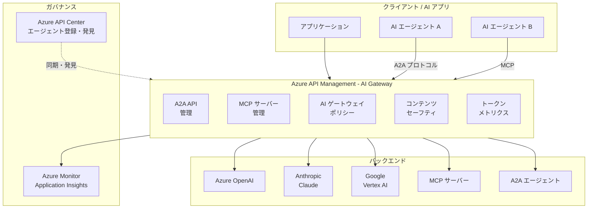

# Azure API Management: Build 2026 - AI エージェント対応の API ガバナンス

**リリース日**: 2026-06-02

**サービス**: Azure API Management / Azure API Center

**機能**: Build 2026 - AI エージェント対応の API ガバナンス

**ステータス**: Launched (GA)

[このアップデートのインフォグラフィックを見る](https://takech9203.github.io/azure-news-summary/20260602-api-management-build-2026-updates.html)

## 概要

Microsoft Build 2026 において、Azure API Management に AI エージェント時代を見据えた 8 つの主要アップデートが一般提供 (GA) として発表された。今回のアップデートは、従来の REST/SOAP API の管理に加え、Agent-to-Agent (A2A) プロトコル、Model Context Protocol (MCP)、マルチプロバイダー AI ゲートウェイといった「エージェント AI」の基盤となる機能を包括的にカバーしている。

これらの機能により、Azure API Management は単なる API ゲートウェイから「AI エージェントのガバナンスプラットフォーム」へと進化した。AI モデル、エージェント、ツール (MCP サーバー) を統一的に管理・保護・監視できる基盤として、エンタープライズにおける AI エージェントの本番運用を支援する。

**アップデート前の課題**

- AI エージェント間の通信 (A2A) を管理・監視する標準的な手段がなかった
- Anthropic や Vertex AI など非 OpenAI モデルを利用する場合、API Management の AI ゲートウェイ機能が適用できなかった
- MCP サーバーや A2A API に対するコンテンツセーフティの適用が困難だった
- ワークスペース機能が外部ゲートウェイに依存しており、導入障壁が高かった
- トークンメトリクスの対象が限定的で、全体的なトークン消費の可視化が不十分だった
- API Center でのエージェント資産の管理・発見が体系化されていなかった

**アップデート後の改善**

- A2A プロトコルに準拠したエージェント API をインポート・管理・ガバナンスできるようになった
- Anthropic Messages API および Google Vertex AI API に対して AI ゲートウェイ機能 (トークン制限、負荷分散、キャッシュ等) を適用可能になった
- MCP サーバーおよび A2A API に Azure AI Content Safety によるコンテンツ安全性制御を適用可能になった
- ワークスペースがビルトインゲートウェイをサポートし、導入が容易になった
- すべてのトークンタイプ (プロンプト、補完、合計) のメトリクスを収集・分析できるようになった
- API Center がエージェント登録、エージェント評価、Git ベース同期に対応し、エンタープライズ規模のエージェント管理が可能になった

## アーキテクチャ図



Azure API Management が AI ゲートウェイとして、クライアントアプリやエージェントからのリクエストを受け付け、複数の AI バックエンド (Azure OpenAI、Anthropic、Vertex AI) および A2A エージェント、MCP サーバーへのトラフィックを統一的に管理・制御する構成を示す。API Center がエージェント資産の発見・登録のハブとして機能する。

## サービスアップデートの詳細

### 1. A2A (Agent-to-Agent) API サポート

**概要**: [Agent2Agent (A2A) プロトコル仕様](https://a2a-protocol.org/dev/specification/) に準拠した AI エージェント API をインポート・管理できるようになった。A2A は異なる AI エージェントシステム間の通信を標準化するオープンなクライアント・サーバープロトコルである。

**主要機能**:
- エージェントカード (Agent Card) を通じたエージェント発見の仲介
- JSON-RPC ベースのランタイムオペレーションのプロキシ
- ポリシーによるガバナンスとトラフィック制御
- Application Insights を通じた OpenTelemetry GenAI セマンティック規約に準拠したトレーシング (`genai.agent.id`, `genai.agent.name`)
- サブスクリプションキー認証の適用

**対応ティア**: Developer | Basic | Basic v2 | Standard | Standard v2 | Premium | Premium v2

**制限事項**:
- JSON-RPC ベースの A2A エージェント API のみ対応
- 送信レスポンスボディのデシリアライゼーションは未サポート

### 2. Anthropic / Vertex AI 対応 AI ゲートウェイ

**概要**: AI ゲートウェイが Anthropic Messages API および Google Vertex AI API をネイティブにサポートし、従来 Azure OpenAI のみに適用されていたゲートウェイ機能をマルチプロバイダーで利用可能になった。

**対応プロバイダーと API スキーマ**:
- OpenAI Chat Completions / Responses API
- Anthropic Messages API (API Management v2 ティアで対応)
- Google Vertex AI API

**適用可能なゲートウェイ機能**:
- トークンレート制限 (`llm-token-limit` ポリシー)
- セマンティックキャッシュ
- 負荷分散 (ラウンドロビン、重み付け、優先度ベース)
- サーキットブレーカー
- トークンメトリクスの収集

**統合モデル API (プレビュー)**: 複数プロバイダーのバックエンドを単一の OpenAI 互換エンドポイントで公開し、フォーマット変換を自動処理する機能もプレビューとして利用可能。

### 3. MCP / A2A API 向けコンテンツセーフティ制御

**概要**: Azure AI Content Safety と連携し、MCP サーバーおよび A2A API を流れるコンテンツに対して安全性チェックを自動適用できるようになった。

**機能**:
- LLM プロンプトの自動モデレーション
- MCP ツール呼び出し・A2A エージェント通信のコンテンツフィルタリング
- ポリシーベースでの柔軟な適用範囲設定

### 4. ワークスペースのビルトインゲートウェイサポート

**概要**: API Management ワークスペース機能が、従来の自己ホスト型ゲートウェイに加え、ビルトインゲートウェイをサポートするようになった。

**メリット**:
- セルフホスト型ゲートウェイのインフラ管理が不要
- チームごとの API 管理の分離をより手軽に実現
- ワークスペース導入の障壁が大幅に低下

### 5. Premium v2 の複数カスタムドメインサポート

**概要**: API Management Premium v2 ティアで複数のカスタムドメインの設定が可能になった。

**ユースケース**:
- 異なるブランドやサービスラインごとのドメイン設定
- 内部向け/外部向けの異なるドメインの併用
- マルチテナントシナリオでのドメイン分離

### 6. 全トークンタイプのメトリクスサポート

**概要**: `llm-emit-token-metric` ポリシーがすべてのトークンタイプ (プロンプトトークン、補完トークン、合計トークン) のメトリクスを収集できるようになった。

**活用例**:

```xml
<llm-emit-token-metric namespace="llm-metrics">
    <dimension name="Client IP" value="@(context.Request.IpAddress)" />
    <dimension name="API ID" value="@(context.Api.Id)" />
    <dimension name="User ID" value="@(context.Request.Headers.GetValueOrDefault("x-user-id", "N/A"))" />
</llm-emit-token-metric>
```

**メリット**:
- カスタムディメンションによる柔軟なメトリクス分析
- アプリケーション別、チーム別、部署別のトークン消費追跡
- Azure Monitor での包括的なコスト可視化

### 7. API Center データプレーン MCP サーバー

**概要**: Azure API Center がデータプレーン MCP サーバーを提供し、エンタープライズ全体での API および AI 資産の発見を AI エージェントから直接実行可能にした。

**機能**:
- AI エージェントが MCP プロトコルを通じて組織の API カタログを検索
- API 定義、バージョン情報、デプロイ状況の機械可読な提供
- エージェントによる API の自律的発見と利用

### 8. API Center エージェント登録・評価・Git 同期

**概要**: Azure API Center がエージェント登録、エージェント評価 (Assessment)、および Git ベースの同期機能に対応した。

**機能**:
- AI エージェントの組織カタログへの登録・管理
- エージェントの品質・コンプライアンス評価フレームワーク
- Git リポジトリとの同期による API 定義の自動インポート・更新
- CI/CD パイプラインとの統合

## 技術仕様

| 項目 | 詳細 |
|------|------|
| A2A プロトコル | Agent2Agent オープン仕様 (JSON-RPC ベース) |
| MCP プロトコル | Model Context Protocol |
| 対応 AI プロバイダー | Azure OpenAI, Anthropic, Google Vertex AI, Amazon Bedrock |
| トークンメトリクス | プロンプト、補完、合計 (すべてのタイプ) |
| セマンティックキャッシュ | Azure Managed Redis (RediSearch 互換) |
| 負荷分散方式 | ラウンドロビン、重み付け、優先度ベース、セッション対応 |
| OpenTelemetry 属性 | `genai.agent.id`, `genai.agent.name` |
| 対応ティア (A2A) | Developer, Basic, Basic v2, Standard, Standard v2, Premium, Premium v2 |
| 対応ティア (Anthropic) | API Management v2 ティア |

## 設定方法

### 前提条件

1. Azure API Management インスタンス (v2 ティア推奨)
2. A2A エージェントの場合: JSON-RPC オペレーションとエージェントカードを持つ既存エージェント
3. AI ゲートウェイの場合: 対象 AI プロバイダーのエンドポイント

### A2A エージェント API のインポート (Azure Portal)

1. Azure Portal で API Management インスタンスに移動
2. **APIs** > **+ Add API** を選択
3. **A2A Agent** タイルを選択
4. エージェントカードの URL を入力
5. Runtime URL、Agent ID を確認・設定
6. **Create** を選択して API を作成

### AI ゲートウェイポリシーの設定例 (トークンレート制限)

```xml
<llm-token-limit counter-key="@(context.Subscription.Id)" 
    tokens-per-minute="500" 
    estimate-prompt-tokens="false" 
    remaining-tokens-variable-name="remainingTokens">
</llm-token-limit>
```

## メリット

### ビジネス面

- エンタープライズ全体で AI エージェントを統一的に管理・ガバナンスできる
- マルチプロバイダー AI 戦略を単一のゲートウェイで実現し、ベンダーロックインを回避
- エージェント間通信の可視化により、コンプライアンスおよびセキュリティ要件に対応
- API Center を通じたエージェント資産の発見・再利用により開発生産性を向上

### 技術面

- A2A プロトコルの標準化により、異種エージェントフレームワーク間の相互運用性を確保
- コンテンツセーフティをインフラレベルで適用し、個別アプリでの実装負荷を軽減
- 全トークンタイプのメトリクスにより精密なコスト管理とキャパシティプランニングが可能
- ビルトインゲートウェイによりワークスペースの導入コストを削減
- Git ベースの同期により API 定義の GitOps ワークフローを実現

## デメリット・制約事項

- A2A サポートは JSON-RPC ベースのみ (HTTP ストリーミングベースの A2A は未対応)
- Anthropic API サポートは API Management v2 ティアに限定
- A2A API の送信レスポンスボディのデシリアライゼーションは未サポート
- 統合モデル API はプレビュー段階
- セマンティックキャッシュには Azure Managed Redis (RediSearch 対応) が必要

## ユースケース

### ユースケース 1: マルチエージェント顧客対応システム

**シナリオ**: カスタマーサポート、注文処理、在庫確認の各 AI エージェントが A2A プロトコルで連携し、顧客からの問い合わせに対して協調的に対応する。

**構成**:
- フロントエージェント: 顧客対話 (Azure OpenAI)
- 注文エージェント: 注文データベース連携 (A2A)
- 在庫エージェント: 在庫管理システム連携 (A2A)
- API Management: 全エージェント間通信のガバナンス、コンテンツセーフティ、トークン管理

**効果**: エージェント間のすべての通信が API Management を経由することで、セキュリティポリシーの一元適用、障害の迅速な検出、コスト配分の正確な追跡が可能になる。

### ユースケース 2: マルチモデル AI アプリケーション

**シナリオ**: タスクの種類に応じて Azure OpenAI、Anthropic Claude、Google Gemini を使い分けるアプリケーションを、統一されたゲートウェイで管理する。

**構成**:
- テキスト生成: Azure OpenAI GPT
- コード生成: Anthropic Claude
- マルチモーダル処理: Google Vertex AI Gemini
- API Management: 統合モデル API によるルーティング、トークン制限、フェイルオーバー

**効果**: 開発者は単一のエンドポイントを通じて複数モデルにアクセスでき、運用チームはプロバイダー横断でのトークン消費を統合的に監視・制御できる。

### ユースケース 3: エージェント資産のエンタープライズカタログ

**シナリオ**: 大規模組織で複数チームが開発した AI エージェント、MCP ツール、API を API Center で一元管理し、重複開発を防止する。

**構成**:
- API Center: エージェント・ツール・API の登録と発見
- Git 同期: 各チームの API 定義リポジトリとの自動連携
- MCP サーバー: AI エージェントからのプログラマティックな資産検索
- 評価フレームワーク: エージェントの品質・セキュリティ基準への適合性チェック

**効果**: 組織内で「どのエージェントが何をできるか」が機械的に発見可能になり、エージェント間の連携促進と品質の標準化が実現する。

## 関連サービス・機能

- **Azure AI Content Safety**: MCP/A2A API のコンテンツモデレーションに使用
- **Azure Monitor / Application Insights**: トークンメトリクス、トレーシング、ログ分析の基盤
- **Azure Managed Redis**: セマンティックキャッシュのバックエンド
- **Microsoft Foundry**: AI ゲートウェイとの統合により Foundry 環境内から API ガバナンスを実施
- **Azure API Center**: API およびエージェント資産の設計時ガバナンスと発見
- **Azure OpenAI Service**: AI ゲートウェイの主要なバックエンドプロバイダー

## 参考リンク

- [インフォグラフィック](https://takech9203.github.io/azure-news-summary/20260602-api-management-build-2026-updates.html)
- [公式アップデート: A2A API サポート](https://azure.microsoft.com/updates?id=562843)
- [公式アップデート: Anthropic / Vertex AI 対応](https://azure.microsoft.com/updates?id=562858)
- [公式アップデート: コンテンツセーフティ制御](https://azure.microsoft.com/updates?id=562880)
- [公式アップデート: ワークスペース ビルトインゲートウェイ](https://azure.microsoft.com/updates?id=562848)
- [公式アップデート: 複数カスタムドメイン](https://azure.microsoft.com/updates?id=562899)
- [公式アップデート: トークンメトリクス](https://azure.microsoft.com/updates?id=562885)
- [公式アップデート: API Center MCP サーバー](https://azure.microsoft.com/updates?id=562914)
- [公式アップデート: API Center エージェント登録・評価](https://azure.microsoft.com/updates?id=562909)
- [Microsoft Learn - AI ゲートウェイ機能](https://learn.microsoft.com/azure/api-management/genai-gateway-capabilities)
- [Microsoft Learn - A2A エージェント API のインポート](https://learn.microsoft.com/azure/api-management/agent-to-agent-api)
- [Microsoft Learn - Azure API Center 概要](https://learn.microsoft.com/azure/api-center/overview)
- [A2A プロトコル仕様](https://a2a-protocol.org/dev/specification/)

## まとめ

Build 2026 における Azure API Management のアップデートは、API 管理の概念を「従来の API ゲートウェイ」から「AI エージェント時代のガバナンスプラットフォーム」へと大きく拡張するものである。特に A2A プロトコルのネイティブサポート、マルチプロバイダー AI ゲートウェイ、エージェント向けコンテンツセーフティは、エンタープライズにおける AI エージェントの本番運用に不可欠な基盤を提供する。

Solutions Architect としての推奨アクション:
1. AI エージェントを開発・運用している場合は、A2A API サポートを活用してエージェント間通信のガバナンスを確立する
2. マルチプロバイダー AI 戦略を採用している場合は、AI ゲートウェイの Anthropic/Vertex AI サポートにより統一的な管理を導入する
3. API Center のエージェント登録・MCP サーバー機能を活用して、組織内の AI 資産の発見可能性を高める
4. コンテンツセーフティ制御をインフラレベルで適用し、個別実装の負荷を軽減する

---

**タグ**: #Azure #APIManagement #A2A #MCP #AIGateway #Anthropic #VertexAI #ContentSafety #APICenter #Build2026 #エージェントAI #GA
