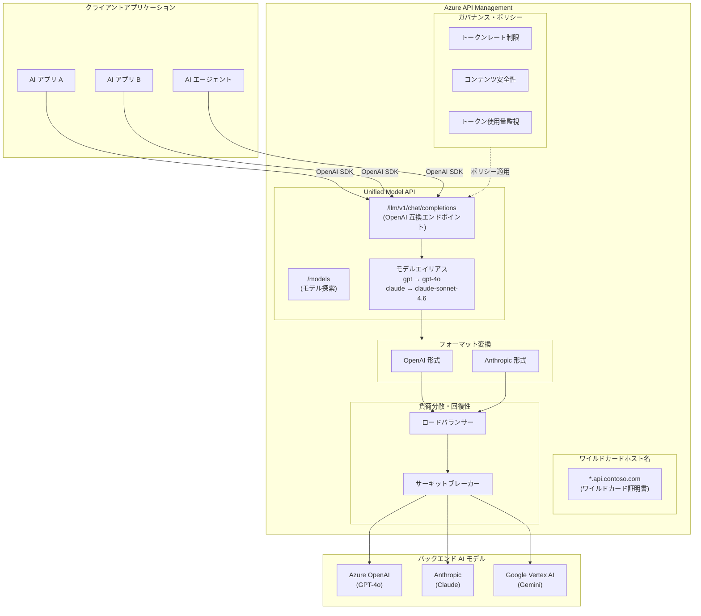

# Azure API Management: Unified Model API プレビュー & ワイルドカードホスト名 GA

**リリース日**: 2026-06-02

**サービス**: Azure API Management

**機能**: Unified Model API プレビュー & ワイルドカードホスト名 GA

**ステータス**: Unified Model API: パブリックプレビュー / ワイルドカードホスト名: GA

[このアップデートのインフォグラフィックを見る](https://takech9203.github.io/azure-news-summary/20260602-api-management-unified-model-wildcard.html)

## 概要

Microsoft Build 2026 において、Azure API Management に関する 2 つの重要なアップデートが発表された。1 つ目は、複数の LLM プロバイダーを単一の OpenAI 互換エンドポイントで統合管理する「Unified Model API」のパブリックプレビュー。2 つ目は、Premium v2 および Standard v2 ティアにおけるワイルドカードカスタムホスト名のサポートが一般提供（GA）となったことである。

Unified Model API は、AI アプリケーションが複数の LLM プロバイダー（OpenAI、Anthropic、Google Vertex AI など）を利用する際に、プロバイダーごとに異なる API フォーマットや SDK を扱う複雑さを解消する。クライアントは単一の OpenAI Chat Completions API フォーマットでリクエストを送信し、API Management がバックエンドモデルへのフォーマット変換を自動的に処理する。

ワイルドカードホスト名サポートにより、`*.api.contoso.com` のようなワイルドカードドメインを設定することで、新しいサブドメイン（payments.api.contoso.com、inventory.api.contoso.com など）を追加するたびに個別のドメイン設定や証明書管理を行う必要がなくなった。

**アップデート前の課題**

- 複数の LLM プロバイダーを利用する場合、プロバイダーごとに異なる API フォーマット、SDK、統合パターンへの対応が必要で、アプリケーションの複雑さが増大していた
- プロバイダー切り替え、フェイルオーバー、ガバナンスの実装が困難だった
- API エステートの拡大に伴い、個々のサブドメインごとにカスタムドメインと証明書を手動設定する運用負荷が増大していた
- サブドメインの追加ごとに DNS レコード作成、証明書取得・設定、API Management 構成変更が必要だった

**アップデート後の改善**

- 単一の OpenAI 互換エンドポイントから複数プロバイダーのモデルにアクセス可能になり、クライアントコードの簡素化が実現された
- モデルエイリアスによりバックエンドモデルの変更がクライアントに透過的になり、A/B テストやモデルアップグレードが容易になった
- ワイルドカード証明書 1 枚で全サブドメインをカバーでき、運用負荷が大幅に削減された
- 新しいサブドメインの追加時に API Management 側の追加設定が不要になった

## アーキテクチャ図



Unified Model API は単一の OpenAI 互換エンドポイントを通じて、複数の LLM プロバイダーへのリクエストをルーティングし、フォーマット変換を自動処理する。ワイルドカードホスト名により、ゲートウェイエンドポイントを任意のサブドメインで公開可能になる。

## サービスアップデートの詳細

### 主要機能

#### Unified Model API（パブリックプレビュー）

1. **単一エンドポイントによるマルチプロバイダーアクセス**
   - クライアントは OpenAI Chat Completions API フォーマットで統一的にリクエストを送信
   - API Management がバックエンドモデルの API フォーマット（OpenAI / Anthropic Messages API）に自動変換
   - `/llm/v1/chat/completions` エンドポイントでルーティングを集約

2. **モデルエイリアス**
   - クライアント向けのモデル名とバックエンドのモデル名を分離
   - 例: クライアントは `model="gpt"` と指定し、バックエンドでは `gpt-4o` にルーティング
   - モデルのアップグレードや A/B テストをクライアントコード変更なしで実行可能

3. **モデル探索エンドポイント**
   - `/models` エンドポイントで利用可能なモデルとエイリアスの一覧を取得
   - 開発者が利用可能なモデルをプログラム的に確認可能

4. **統合ガバナンス**
   - トークンレート制限、使用量追跡、コンテンツ安全性チェックをプロバイダー横断で一元適用
   - Azure AI Content Safety との統合による不適切コンテンツのブロック

5. **フェイルオーバーと負荷分散**
   - プロバイダー間でのフェイルオーバー構成が可能
   - ラウンドロビン、重み付け、優先度ベース、セッション対応の負荷分散

#### ワイルドカードカスタムホスト名（GA）

1. **ワイルドカードドメインのサポート**
   - `*.contoso.com` のようなワイルドカードパターンでカスタムドメインを設定可能
   - 特定のサブドメイン証明書（例: `api.contoso.com`）はワイルドカード証明書よりも優先される

2. **対応ティア**
   - Developer、Basic、Standard、Standard v2、Premium、Premium v2 の全 v2 ティアを含む幅広いティアで利用可能

3. **証明書管理の統合**
   - ワイルドカード証明書は Azure Key Vault からのインポートまたはカスタム証明書としてアップロード可能
   - Key Vault の自動更新（autorenew）設定との連携により証明書ローテーションを自動化

## 技術仕様

### Unified Model API

| 項目 | 詳細 |
|------|------|
| ステータス | パブリックプレビュー |
| 対応ティア | Developer, Basic, Basic v2, Standard, Standard v2, Premium, Premium v2 |
| クライアント向け API フォーマット | OpenAI Chat Completions API |
| サポートするバックエンド形式 | OpenAI Chat Completions API, Anthropic Messages API |
| ルーティングエンドポイント | `/llm/v1/chat/completions`（デフォルト） |
| モデル探索エンドポイント | `/models` |
| 認証方式 | API Management サブスクリプションキー、マネージド ID、カスタムヘッダー |
| バックエンド認証 | ヘッダー（API キー）またはマネージド ID |

### ワイルドカードホスト名

| 項目 | 詳細 |
|------|------|
| ステータス | 一般提供（GA） |
| 対応ティア | Developer, Basic, Standard, Standard v2, Premium, Premium v2 |
| 対応エンドポイント | Gateway |
| 証明書形式 | PFX（Triple DES 暗号化、2048 ビット以上の秘密鍵） |
| 証明書ソース | カスタム証明書アップロード、Azure Key Vault |
| DNS 構成 | CNAME レコードで API Management のデフォルトホスト名にマッピング |
| 優先順位 | 特定サブドメイン証明書 > ワイルドカード証明書 |

## 設定方法

### Unified Model API の作成

#### 前提条件

1. API Management インスタンス（対応ティア）
2. サポートされるバックエンドでのモデルデプロイメント（Azure OpenAI、Anthropic など）
3. トークン使用量追跡を行う場合は Application Insights の構成

#### Azure Portal

1. Azure Portal で API Management インスタンスに移動
2. サイドバーメニューの **APIs** > **Models** > **+ Add** > **Unified model API** を選択
3. **Configure Unified Model API** タブで表示名と API パスを設定（デフォルト: `/llm/v1`）
4. **Configure models** タブで各モデルのバックエンド設定を追加:
   - **Model**: バックエンドモデル名（例: `gpt-4o`、`claude-sonnet-4.6`）
   - **API format**: バックエンドが期待するフォーマット（OpenAI / Anthropic）
   - **URL**: バックエンドエンドポイント URL
   - **Authorization credentials**: ヘッダー認証またはマネージド ID
5. オプションでトークン消費管理、コンテンツ安全性ポリシーを構成
6. **Review + create** > **Create** で作成

#### クライアントからの呼び出し例

```python
from openai import OpenAI

client = OpenAI(
    base_url="https://<apim-instance>.azure-api.net/llm/v1",
    api_key="<api-management-subscription-key>",
)

# モデルエイリアスを指定してリクエスト
response = client.chat.completions.create(
    model="gpt",  # "claude-sonnet" や "gemini" など設定済みエイリアスも可
    messages=[{"role": "user", "content": "What can you do?"}],
)
print(response.choices[0].message.content)
```

### ワイルドカードホスト名の設定

#### 前提条件

1. API Management インスタンス（対応ティア）
2. ワイルドカード SSL/TLS 証明書（例: `*.api.contoso.com`）
3. DNS プロバイダーでの CNAME レコード設定

#### Azure Portal

1. Azure Portal で API Management インスタンスに移動
2. 左メニューの **Custom domains** を選択
3. **+Add** を選択
4. エンドポイントタイプとして **Gateway** を選択
5. **Hostname** に `*.api.contoso.com` のようなワイルドカードパターンを入力
6. 証明書として **Custom**（PFX アップロード）または **Key Vault** を選択
7. 証明書を設定して **Add** > **Save**

#### DNS 構成

```
# CNAME レコードの設定例
*.api.contoso.com  CNAME  <apim-service-name>.azure-api.net
```

## メリット

### ビジネス面

- マルチモデル AI 戦略の採用が容易になり、ベンダーロックインのリスクを軽減できる
- モデルプロバイダーの切り替えがクライアントアプリに影響なく行えるため、コスト最適化の柔軟性が向上
- ワイルドカードホスト名によりサブドメインの追加に伴う運用工数が大幅に削減され、API エステートのスケーリングが迅速化
- 統合ガバナンスによりコンプライアンス要件への対応を一元化でき、監査対応が効率化

### 技術面

- クライアントコードを OpenAI SDK に統一でき、プロバイダー固有の実装が不要になる
- モデルエイリアスによりバックエンドの変更がクライアントに対して透過的
- ワイルドカード証明書 1 枚の管理で全サブドメインをカバーでき、証明書管理の複雑さが解消
- トークンレート制限やコンテンツ安全性チェックがプロバイダー横断で一元適用され、セキュリティポスチャが向上

## デメリット・制約事項

- Unified Model API は現時点でパブリックプレビューであり、本番ワークロードでの SLA は保証されない
- Unified Model API のバックエンドフォーマットサポートは現在 OpenAI Chat Completions API と Anthropic Messages API のみ（Google Vertex AI は AI gateway としてはサポートされるが、Unified Model API のフォーマット変換対象としての詳細は未確認）
- Anthropic Messages API のサポートは v2 ティアのみ
- ワイルドカードホスト名は Workspace Gateway では未サポート
- v2 ティアでは、カスタムドメイン名が公開的に DNS 解決可能である必要がある（プライベート DNS ゾーンへの制限は不可）
- 無料マネージド証明書はワイルドカードドメインには対応していない（カスタム証明書または Key Vault 証明書が必要）
- カスタムドメインの変更適用には 15 分以上かかる場合がある

## ユースケース

### ユースケース 1: マルチモデル AI チャットボットの構築

**シナリオ**: エンタープライズ企業が、用途に応じて GPT-4o（一般的な応答）、Claude（長文分析）、Gemini（マルチモーダル）を使い分ける AI チャットボットを構築する。

**実装例**:

```python
from openai import OpenAI

client = OpenAI(
    base_url="https://myapim.azure-api.net/llm/v1",
    api_key="<subscription-key>",
)

# 用途に応じてモデルエイリアスを切り替え
def get_response(task_type: str, prompt: str):
    model_map = {
        "general": "gpt",
        "analysis": "claude-sonnet",
        "multimodal": "gemini",
    }
    return client.chat.completions.create(
        model=model_map[task_type],
        messages=[{"role": "user", "content": prompt}],
    )
```

**効果**: 単一の SDK・エンドポイントで複数プロバイダーを透過的に利用でき、プロバイダー固有の実装コードが不要になる。ガバナンスポリシーも一元管理可能。

### ユースケース 2: マルチテナント SaaS のサブドメイン管理

**シナリオ**: SaaS プロバイダーが顧客ごとにサブドメイン（customer1.api.contoso.com、customer2.api.contoso.com）を提供し、API Management で各テナントの API を公開する。

**効果**: ワイルドカード証明書 `*.api.contoso.com` を 1 回設定するだけで、新規顧客のオンボーディング時に API Management 側の追加ドメイン設定が不要になり、プロビジョニングの自動化が容易になる。

## 料金

Unified Model API およびワイルドカードホスト名は API Management の既存ティアの機能として提供され、追加のライセンス費用は発生しない。バックエンド AI モデルの利用料金は各プロバイダーの料金体系に従う。

| ティア | 月額料金（概算） |
|------|------|
| Standard v2 | 約 $291/月〜（スケールユニットに依存） |
| Premium v2 | 約 $1,022/月〜（スケールユニットに依存） |

※ AI モデルのバックエンド利用料は別途発生する。

## 利用可能リージョン

- **ワイルドカードホスト名**: API Management が利用可能な全リージョンで GA
- **Unified Model API**: プレビュー機能として順次展開中。クラシックティアでは AI Gateway Early release channel を通じて先行アクセス可能

## 関連サービス・機能

- **Azure AI Foundry（Microsoft Foundry）**: AI gateway を Foundry 環境に統合し、モデルデプロイメントのガバナンスを一元化
- **Azure AI Content Safety**: Unified Model API と組み合わせて不適切コンテンツを自動ブロック
- **Azure Key Vault**: ワイルドカード証明書の安全な保管と自動ローテーション
- **Azure API Center**: API やモデルエンドポイントの組織カタログ管理とセルフサービスアクセス
- **Azure Monitor / Application Insights**: トークン使用量の追跡と分析

## 参考リンク

- [インフォグラフィック](https://takech9203.github.io/azure-news-summary/20260602-api-management-unified-model-wildcard.html)
- [公式アップデート情報 - ワイルドカードホスト名](https://azure.microsoft.com/updates?id=562894)
- [公式アップデート情報 - Unified Model API](https://azure.microsoft.com/updates?id=562853)
- [Microsoft Learn - カスタムドメイン構成](https://learn.microsoft.com/en-us/azure/api-management/configure-custom-domain)
- [Microsoft Learn - Unified Model API](https://learn.microsoft.com/en-us/azure/api-management/unified-model-api)
- [Microsoft Learn - AI gateway capabilities](https://learn.microsoft.com/en-us/azure/api-management/genai-gateway-capabilities)

## まとめ

今回のアップデートにより、Azure API Management は AI アプリケーション開発における「マルチモデルゲートウェイ」としての位置づけを強化した。Unified Model API により、開発者は OpenAI SDK という共通インターフェースを通じて複数の LLM プロバイダーにアクセスでき、ガバナンスとフェイルオーバーを一元管理できる。また、ワイルドカードホスト名の GA により、大規模な API エステートの運用管理が効率化される。

**推奨アクション**:
- マルチモデル AI アプリケーションを構築中の場合、Unified Model API のプレビューを評価し、プロバイダー統合の簡素化を検討する
- サブドメインが多数ある環境では、ワイルドカード証明書への移行を計画し、運用負荷の削減を図る
- 本番環境への適用は Unified Model API の GA を待つことを推奨するが、開発・検証環境での早期評価を開始することが望ましい

---

**タグ**: #AzureAPIManagement #UnifiedModelAPI #AI #LLM #ワイルドカードドメイン #Build2026 #マルチモデル #APIゲートウェイ #GA #パブリックプレビュー
