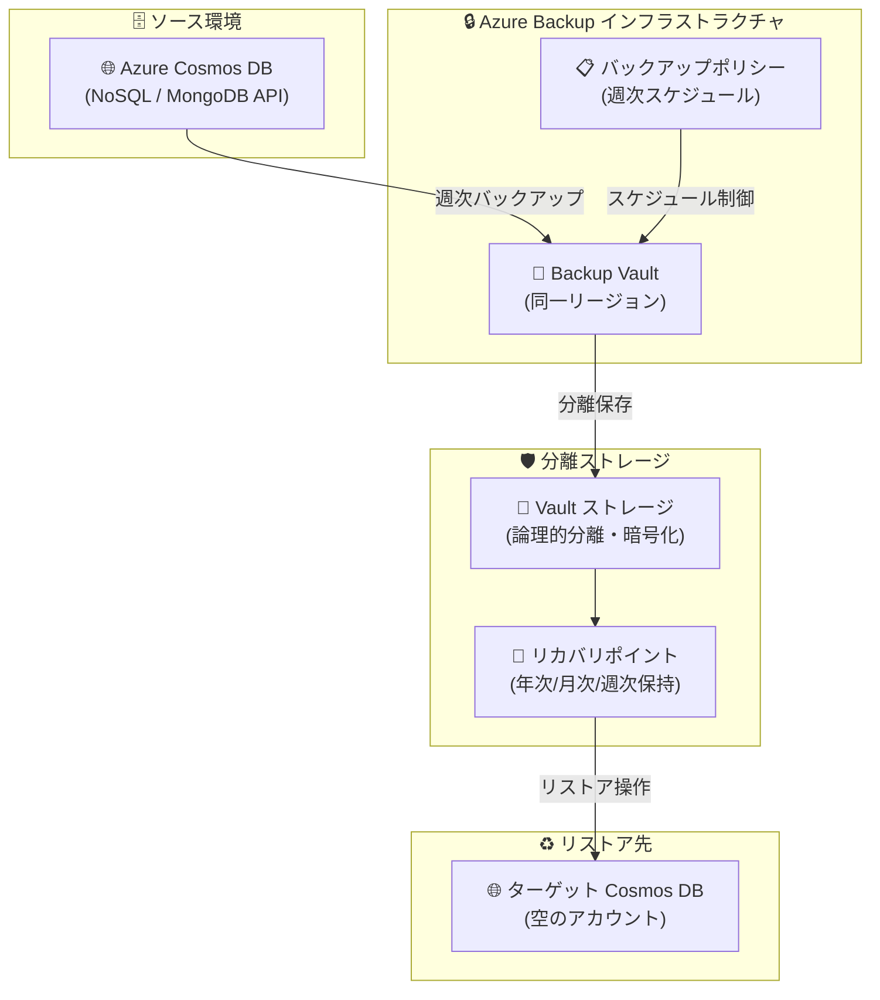

# Azure Backup for Cosmos DB: Vault バックアップ (Public Preview)

**リリース日**: 2026-06-02

**サービス**: Azure Backup / Azure Cosmos DB

**機能**: Vault バックアップ

**ステータス**: In preview

[このアップデートのインフォグラフィックを見る](https://takech9203.github.io/azure-news-summary/20260602-azure-backup-cosmosdb.html)

## 概要

Azure Backup for Cosmos DB が Public Preview として発表された。これにより、Azure Cosmos DB アカウントに対して Vault (コンテナー) ベースのバックアップを有効化し、ミッションクリティカルなデータをセキュアで分離された耐障害性の高いバックアップで保護できるようになった。

この機能は、既存の Cosmos DB 継続バックアップ (ポイントインタイムリストア) とは異なり、Azure Backup Vault にデータを保存する方式を採用している。これにより、偶発的または悪意のある削除を含むシナリオにおいても、サイバーレジリエンスとコンプライアンスの要件を満たすことが可能となる。

Microsoft Build 2026 で発表されたこの機能は、ランサムウェア攻撃やインサイダー脅威からのデータ保護を強化し、Azure Cosmos DB のデータ保護戦略に新たな選択肢を提供する。

**アップデート前の課題**

- Cosmos DB の既存の継続バックアップは同一ストレージ内に保持されるため、アカウントレベルの侵害時にバックアップも影響を受ける可能性があった
- ランサムウェアやインサイダー脅威に対する論理的分離が不足していた
- 長期保持 (30 日超) のバックアップを保持する標準的な方法がなかった
- コンプライアンス要件で求められる Vault 分離型のバックアップに対応できなかった

**アップデート後の改善**

- Azure Backup Vault にデータを分離保存し、ソースアカウントが侵害されてもバックアップは安全に保持される
- サイバーレジリエンス対応: Vault 分離によりランサムウェアや悪意のある削除からデータを保護
- 長期保持ポリシーの設定が可能 (年次、月次、週次の保持ルール)
- クロスサブスクリプションリストアに対応し、災害復旧の柔軟性が向上

## アーキテクチャ図

Azure Cosmos DB のデータが Azure Backup Vault を経由して論理的に分離されたストレージに保存される。リストア時は別の空の Cosmos DB アカウントにデータを復元する。

## サービスアップデートの詳細

### 主要機能

1. **Vault ベースのバックアップ**
   - Azure Backup Vault にデータを分離保存
   - ソース Cosmos DB アカウントとは独立した保護レイヤーを提供
   - 偶発的削除や悪意のある削除からデータを保護

2. **週次バックアップスケジュール**
   - プレビュー期間中は週次バックアップのみサポート
   - RPO (目標復旧時点) は 7 日間
   - オンデマンドバックアップでフルバックアップも実行可能

3. **柔軟な保持ポリシー**
   - 年次、月次、週次の保持ルールを設定可能
   - 優先順位: 年次 > 月次 > 週次
   - デフォルト保持期間: 1 年

4. **クロスサブスクリプションリストア**
   - 異なるサブスクリプションのターゲットアカウントへのリストアが可能
   - 災害復旧や組織変更時の柔軟性を確保

### 既存の継続バックアップとの比較

| 項目 | 継続バックアップ (PITR) | Vault バックアップ (新機能) |
|------|------------------------|---------------------------|
| バックアップ方式 | 継続的 (非同期 100 秒以内) | 週次スケジュール |
| 保存先 | 同一リージョンのストレージ | Azure Backup Vault (分離) |
| RPO | 数秒〜数分 | 7 日 |
| 保持期間 | 7 日 or 30 日 | カスタマイズ可能 (年次/月次/週次) |
| 主な用途 | 誤操作からの即座のリストア | サイバーレジリエンス・長期保持 |
| Vault 分離 | なし | あり |
| クロスサブスクリプション | なし | サポート |
| 料金モデル | ストレージ容量 + リストア時課金 | Backup Vault 料金体系 |

## 技術仕様

| 項目 | 詳細 |
|------|------|
| 対応 API | NoSQL API, MongoDB API (RU ベース) |
| バックアップ頻度 | 週次 (プレビュー期間中) |
| RPO | 7 日 |
| 最大パーティション数 | 2,500 (約 125 TB) |
| 前提条件 | 継続バックアップ (PITR) モードが有効であること |
| リストア先 | 空の単一リージョン Cosmos DB アカウント |
| クロスリージョンリストア | 非対応 |
| クロスサブスクリプションリストア | 対応 |
| 対応リージョン | すべての Azure パブリッククラウドリージョン |
| National Cloud | 非対応 |

## 設定方法

### 前提条件

1. Azure Cosmos DB アカウントが継続バックアップ (PITR) モードで構成されていること
2. Backup Vault が Cosmos DB アカウントの書き込みリージョンと同じリージョンに存在すること
3. バックアップ管理者が Cosmos DB アカウントへの書き込みアクセス権を持つこと

### Azure Portal

1. **Backup Vault の作成** (未作成の場合)
   - Cosmos DB のプライマリ書き込みリージョンと同じリージョンに Vault を作成

2. **バックアップポリシーの作成**
   - Resiliency > Manage > Protection policies に移動
   - Create policy > Create backup policy を選択
   - Datasource type に "Azure Cosmos DB (Preview)" を選択
   - バックアップスケジュール (週次) と保持ルールを設定

3. **バックアップの構成**
   - Resiliency > Overview > Configure protection に移動
   - Resource managed by: Azure、Datasource type: Azure Cosmos DB (Preview)、Solution: Azure Backup を選択
   - Backup Vault を選択し、ポリシーを割り当て
   - 対象の Cosmos DB アカウントを選択
   - 必要なロール割り当てを確認・付与
   - Configure backup を実行

### リストア手順

1. Resiliency > Overview > Recover に移動 (または Backup Vault > Restore)
2. Datasource type に "Azure Cosmos DB (Preview)" を選択
3. 保護されたアイテムを選択
4. リストアポイントを選択
5. ターゲット Cosmos DB アカウント (空のアカウント) を選択
6. バリデーション実行後、Restore を実行

## メリット

### ビジネス面

- **コンプライアンス対応**: 規制要件で求められる Vault 分離型バックアップを実現
- **サイバー保険要件の充足**: ランサムウェア対策としてのエアギャップ型バックアップ
- **長期保持**: 監査・法的要件に応じた柔軟な保持期間設定
- **災害復旧の強化**: クロスサブスクリプションリストアによる柔軟な復旧オプション

### 技術面

- **論理的分離**: ソースアカウントの侵害がバックアップに影響しない
- **既存 PITR との補完**: 短期の誤操作対応 (PITR) + 長期のサイバーレジリエンス (Vault) の二重保護
- **Azure Backup エコシステムとの統合**: 統一的な管理・監視・レポート
- **RBAC による細粒度アクセス制御**: バックアップ管理者とデータベース管理者の権限分離

## デメリット・制約事項

- **週次バックアップのみ**: プレビュー期間中は日次バックアップに非対応 (RPO 7 日)
- **クロスリージョンリストア非対応**: Vault と同一リージョン内でのみリストア可能
- **前提条件**: 継続バックアップ (PITR) モードが有効である必要がある
- **リストア先の制約**: 空の単一リージョン Cosmos DB アカウントが必要
- **階層パーティションキー非対応**: 階層パーティションキーを使用するアカウントは未対応
- **Per-Partition Automatic Failover (PPAF) 非対応**: PPAF 有効なアカウントは未対応
- **アイテムレベルのバックアップ/リストア非対応**: アカウント全体が対象
- **サーバーレスアカウントへのリストア非対応**
- **スループット制限付きアカウントへのリストア非対応**

## ユースケース

### ユースケース 1: ランサムウェア対策

**シナリオ**: 金融機関がランサムウェア攻撃により Cosmos DB アカウントのデータが暗号化・削除された場合でも、Vault に保存された分離バックアップから復旧する。

**効果**: ソースアカウントの管理者権限が奪取されても、Backup Vault のアクセス制御は独立しているため、バックアップデータは保護される。週次の復旧ポイントから最小限のデータロスで復旧可能。

### ユースケース 2: コンプライアンス・長期保持

**シナリオ**: ヘルスケア業界の規制要件により、患者データを 7 年間保持する必要がある。年次保持ルールを設定し、長期間のデータ保持を実現する。

**効果**: 既存の PITR (最大 30 日) では対応できない長期保持要件を、Vault バックアップの年次保持ルールで充足。監査時にも復旧ポイントの証跡を提示可能。

### ユースケース 3: 災害復旧 (DR)

**シナリオ**: 本番環境のサブスクリプションで障害が発生した場合、DR サブスクリプションの Cosmos DB アカウントにクロスサブスクリプションリストアを実行する。

**効果**: サブスクリプションレベルの障害が発生しても、別サブスクリプションへの復旧パスを確保。ビジネス継続性計画 (BCP) の一環として活用可能。

## 料金

プレビュー期間中の料金体系は公式に公開されていない。GA 時に Azure Backup の料金体系に準じた課金が想定される。

参考として、Azure Backup の一般的な課金モデルは以下の通り:
- 保護されたインスタンスごとの月額料金
- バックアップストレージ消費量に基づく課金
- リストア操作時の追加課金

詳細は [Azure Backup 料金ページ](https://azure.microsoft.com/pricing/details/backup/) を参照。

## 利用可能リージョン

すべての Azure パブリッククラウドリージョンで利用可能。National Cloud (Azure Government、Azure China) は現時点で非対応。

## 関連サービス・機能

- **Azure Cosmos DB 継続バックアップ (PITR)**: 既存のポイントインタイムリストア機能。Vault バックアップの前提条件であり、短期復旧に使用
- **Azure Backup Vault**: バックアップデータの保管先。他の Azure サービス (PostgreSQL、Blob Storage 等) のバックアップも統合管理
- **Azure RBAC**: バックアップ管理者とデータベース管理者の権限分離を実現
- **Azure Monitor**: バックアップジョブの監視・アラート設定
- **Microsoft Defender for Cloud**: セキュリティポスチャの評価にバックアップ構成の確認を含む

## 参考リンク

- [インフォグラフィック](https://takech9203.github.io/azure-news-summary/20260602-azure-backup-cosmosdb.html)
- [公式アップデート情報](https://azure.microsoft.com/updates?id=562769)
- [Azure Backup for Cosmos DB - 構成ガイド (Microsoft Learn)](https://learn.microsoft.com/en-us/azure/backup/backup-azure-cosmos-db)
- [Azure Backup for Cosmos DB - サポートマトリクス (Microsoft Learn)](https://learn.microsoft.com/en-us/azure/backup/backup-azure-cosmos-db-support-matrix)
- [Azure Backup for Cosmos DB - リストアガイド (Microsoft Learn)](https://learn.microsoft.com/en-us/azure/backup/backup-azure-cosmos-db-restore)
- [Cosmos DB 継続バックアップの概要 (Microsoft Learn)](https://learn.microsoft.com/en-us/azure/cosmos-db/continuous-backup-restore-introduction)
- [Azure Backup 料金ページ](https://azure.microsoft.com/pricing/details/backup/)

## まとめ

Azure Backup for Cosmos DB (Public Preview) は、Azure Cosmos DB のデータ保護に Vault 分離型のバックアップオプションを追加する重要なアップデートである。既存の継続バックアップ (PITR) が短期的な誤操作対応に最適化されているのに対し、本機能はサイバーレジリエンス・コンプライアンス・長期保持といった要件に対応する。

Solutions Architect への推奨アクション:
1. ミッションクリティカルな Cosmos DB ワークロードに対して、既存の PITR と新しい Vault バックアップの二層保護戦略を検討する
2. コンプライアンス要件 (特にランサムウェア対策・長期保持) がある顧客に対して、プレビュー段階での検証を推奨する
3. プレビューの制約事項 (週次のみ、クロスリージョン非対応) を踏まえ、GA 時の機能拡張を注視する

---

**タグ**: #Azure #Backup #CosmosDB #CyberResiliency #Build2026
