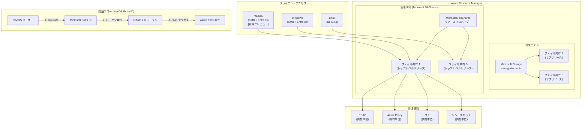

# Azure Files: ファイル共有中心管理モデル GA と macOS Entra ID 認証プレビュー

**リリース日**: 2026-06-02

**サービス**: Azure Files

**機能**: Microsoft.FileShares リソースプロバイダー、macOS Entra ID 認証

**ステータス**: Launched (GA) / In preview

[このアップデートのインフォグラフィックを見る](https://takech9203.github.io/azure-news-summary/20260602-azure-files-build-2026-updates.html)

## 概要

Microsoft Build 2026 において、Azure Files に関する 2 つの重要なアップデートが発表された。ファイル共有中心の管理モデル (Microsoft.FileShares リソースプロバイダー) の一般提供開始と、macOS からの Entra ID 認証によるセキュアなアクセスのパブリックプレビューである。

これらのアップデートは、Azure Files の管理パラダイムを根本的に変革し、クロスプラットフォーム環境でのセキュアなファイル共有を実現する。特に Microsoft.FileShares リソースプロバイダーの GA は、ファイル共有をストレージアカウントから独立したトップレベル ARM リソースとして扱えるようにする重大な変更であり、Infrastructure as Code (IaC) や RBAC の適用粒度を大幅に改善する。

**アップデート前の課題**

- ファイル共有はストレージアカウント配下のサブリソースであり、個別の ARM リソースとして管理できなかった
- ファイル共有ごとに独立した RBAC、タグ、ポリシーを適用するにはストレージアカウント単位の分割が必要だった
- macOS ユーザーは Azure Files に対して Entra ID ベースの認証を使用できず、共有キーや SAS トークンに依存していた
- クロスプラットフォーム開発チームにおいて、macOS ユーザーだけ認証方法が異なり、セキュリティポリシーの統一が困難だった

**アップデート後の改善**

- ファイル共有が Microsoft.FileShares リソースプロバイダーのトップレベル ARM リソースとなり、独立した管理が可能に
- 個々のファイル共有に対して RBAC、Azure Policy、タグ、ロックを直接適用可能
- macOS から Entra ID 認証で Azure Files にアクセス可能になり、パスワードレスかつ ID ベースの統一認証を実現
- Windows、Linux、macOS の全主要プラットフォームで Entra ID 認証が利用可能に

## アーキテクチャ図



この図は 2 つのアップデートの関係を示している。上部では従来のストレージアカウント配下のサブリソースモデルから、Microsoft.FileShares リソースプロバイダーによるトップレベルリソースモデルへの移行を表現している。下部では macOS からの Entra ID 認証フローと、クロスプラットフォームでのアクセスパターンを示している。

## サービスアップデートの詳細

### 1. ファイル共有中心管理モデル (Microsoft.FileShares) - GA

NFS 4.1 (SSD ストレージ) のファイル共有を、ストレージアカウントから独立したトップレベル Azure リソースとして作成・管理できる新しいサービス管理エクスペリエンス。

**主要機能:**

1. **トップレベル ARM リソース化**
   - ファイル共有が Microsoft.FileShares リソースプロバイダーの直下に位置するリソースとなる
   - ストレージアカウントに依存せず、独立してプロビジョニング可能
   - ARM テンプレート、Bicep、Terraform での直接的なリソース定義が可能

2. **個別の RBAC 適用**
   - ファイル共有単位できめ細かいアクセス制御を設定可能
   - 従来はストレージアカウント単位でしか RBAC を適用できなかったが、共有レベルでの権限分離が実現
   - 最小権限の原則を共有単位で適用可能

3. **Azure Policy の直接適用**
   - ファイル共有リソースに対して Azure Policy を直接割り当て可能
   - コンプライアンス要件の共有単位での監査・適用が可能

4. **独立したライフサイクル管理**
   - ファイル共有のリソースロック (削除防止/読み取り専用)
   - タグによる分類・コスト管理
   - ストレージアカウントの削除がファイル共有に影響しない独立管理

5. **対応プロトコルとストレージ**
   - GA 時点では NFS 4.1 プロトコル + SSD ストレージの組み合わせで利用可能
   - SMB プロトコルおよび HDD ストレージへの対応は今後拡大予定

### 2. macOS での Entra ID 認証によるセキュアアクセス - Public Preview

macOS クライアントから Azure Files へのアクセスに Microsoft Entra ID 認証を使用できるようにする機能。

**主要機能:**

1. **ID ベースのアクセス制御**
   - macOS ユーザーが Entra ID の資格情報で Azure Files に直接認証可能
   - 共有キーや SAS トークンの配布が不要に
   - 条件付きアクセスポリシーの適用が可能

2. **SMB プロトコルとの統合**
   - macOS 標準の SMB クライアント (Finder) から Entra ID 認証でマウント可能
   - 追加のクライアントソフトウェアのインストールが不要 (想定)

3. **クロスプラットフォーム統一認証**
   - Windows (既に GA)、Linux (既存サポート)、macOS (今回のプレビュー) で Entra ID 認証を統一
   - プラットフォームに依存しないセキュリティポリシーの適用が可能

4. **ゼロトラスト対応**
   - デバイスコンプライアンスの検証
   - 多要素認証 (MFA) の強制
   - リスクベースのアクセス制御

## 技術仕様

### Microsoft.FileShares リソースプロバイダー

| 項目 | 詳細 |
|------|------|
| リソースプロバイダー | Microsoft.FileShares |
| リソースタイプ | トップレベル ARM リソース |
| 対応プロトコル (GA) | NFS 4.1 |
| 対応ストレージタイプ (GA) | SSD (Premium) |
| ARM API バージョン | 2026-01-01 (想定) |
| IaC 対応 | ARM テンプレート、Bicep、Terraform |
| RBAC | 共有単位で適用可能 |
| Azure Policy | 共有単位で適用可能 |
| リソースロック | 対応 |
| タグ | 対応 |

### macOS Entra ID 認証

| 項目 | 詳細 |
|------|------|
| ステータス | Public Preview |
| 対応プロトコル | SMB |
| 認証方式 | Microsoft Entra ID (OAuth 2.0) |
| 対応プラットフォーム | macOS |
| 条件付きアクセス | 対応 |
| MFA | 対応 |
| デバイスコンプライアンス | 対応 (想定) |

### Before/After 比較

| 観点 | Before (従来モデル) | After (新モデル) |
|------|------|------|
| リソース階層 | ストレージアカウント > ファイル共有 (サブリソース) | Microsoft.FileShares > ファイル共有 (トップレベル) |
| RBAC 粒度 | ストレージアカウント単位 | ファイル共有単位 |
| Azure Policy | ストレージアカウントに適用 | ファイル共有に直接適用 |
| IaC 管理 | ストレージアカウントの子リソースとして定義 | 独立したリソースとして定義 |
| 削除保護 | ストレージアカウント単位のロック | ファイル共有単位のロック |
| macOS 認証 | 共有キー/SAS トークン | Entra ID (プレビュー) |
| コスト追跡 | ストレージアカウント単位 | ファイル共有単位のタグで追跡可能 |

## 設定方法

### Microsoft.FileShares リソースの作成

#### Azure CLI (想定)

```bash
# Microsoft.FileShares リソースプロバイダーの登録
az provider register --namespace Microsoft.FileShares

# NFS 4.1 ファイル共有の作成 (トップレベルリソースとして)
az fileshare create \
  --resource-group myResourceGroup \
  --name my-nfs-share \
  --protocol NFS \
  --storage-type SSD \
  --quota 1024 \
  --location eastus

# RBAC の割り当て (共有単位)
az role assignment create \
  --assignee user@contoso.com \
  --role "Storage File Data SMB Share Contributor" \
  --scope /subscriptions/{sub-id}/resourceGroups/{rg}/providers/Microsoft.FileShares/fileShares/my-nfs-share

# リソースロックの設定
az lock create \
  --name prevent-delete \
  --lock-type CanNotDelete \
  --resource-group myResourceGroup \
  --resource-name my-nfs-share \
  --resource-type Microsoft.FileShares/fileShares
```

#### Bicep (想定)

```bicep
resource nfsShare 'Microsoft.FileShares/fileShares@2026-01-01' = {
  name: 'my-nfs-share'
  location: 'eastus'
  properties: {
    protocol: 'NFS'
    storageType: 'SSD'
    quotaInGiB: 1024
  }
  tags: {
    environment: 'production'
    team: 'platform'
  }
}
```

### macOS での Entra ID 認証設定

#### 前提条件

1. macOS クライアント (対応バージョンは公式ドキュメントを参照)
2. Microsoft Entra ID テナント
3. Azure Files 共有 (SMB プロトコル)
4. ユーザーに適切な RBAC ロールが割り当て済み

#### 設定手順 (想定)

```bash
# 1. Azure Files 共有で Entra ID 認証を有効化
az storage account update \
  --resource-group myResourceGroup \
  --name mystorageaccount \
  --enable-files-entra-id true

# 2. macOS から Finder でマウント
# Finder > 移動 > サーバへ接続
# smb://<storage-account>.file.core.windows.net/<share-name>
# Entra ID の資格情報で認証
```

## メリット

### ビジネス面

- **コスト可視化の改善**: ファイル共有単位でタグを付与できるため、プロジェクト・チーム・環境ごとのコスト追跡が容易に
- **ガバナンス強化**: Azure Policy をファイル共有単位で適用でき、コンプライアンス監査の粒度が向上
- **セキュリティ投資の統一**: macOS ユーザーにも Entra ID 認証を適用することで、全プラットフォームで統一したセキュリティポリシーを実現
- **運用工数削減**: 共有キーのローテーション管理や SAS トークンの配布が不要に

### 技術面

- **IaC の簡素化**: ファイル共有が独立したリソースとなることで、Terraform/Bicep での管理が直感的に
- **最小権限の実現**: 共有単位の RBAC により、過剰な権限付与を回避
- **ゼロトラスト対応**: Entra ID の条件付きアクセスにより、デバイス状態・場所・リスクレベルに基づくアクセス制御が可能
- **NFS 4.1 の活用**: Linux/macOS ワークロードに最適化された NFS プロトコルでの高パフォーマンスアクセス

## デメリット・制約事項

### Microsoft.FileShares の制約

- GA 時点では NFS 4.1 + SSD ストレージのみ対応 (SMB や HDD は今後)
- 既存のストレージアカウント配下のファイル共有からの移行パスは公式ドキュメントで確認が必要
- 従来の Microsoft.Storage/storageAccounts/fileServices/shares との共存・移行に関する詳細は今後公開予定
- ARM テンプレートの書き換えが必要になる可能性がある

### macOS Entra ID 認証の制約

- パブリックプレビュー段階であり、本番環境での使用は推奨されない
- SLA は提供されない
- 対応する macOS バージョンに制限がある可能性
- NFS プロトコルでは Entra ID 認証は使用不可 (SMB のみ)
- オフライン環境での動作に制限がある可能性

### 一般的な制約

- NFS 4.1 は Windows クライアントからのネイティブアクセスに制限がある
- SSD ストレージは HDD に比べてコストが高い
- 新しいリソースプロバイダーへの移行に伴い、既存の監視・アラート設定の見直しが必要になる可能性

## ユースケース

### ユースケース 1: クロスプラットフォーム開発チームの統一ファイル共有

**シナリオ**: macOS、Linux、Windows が混在する開発チームが、共通のソースコードやビルドアーティファクトを Azure Files で共有する場合。

**実装例**:

```bash
# NFS 共有をトップレベルリソースとして作成 (Linux/macOS 向け)
az fileshare create \
  --resource-group dev-team-rg \
  --name build-artifacts \
  --protocol NFS \
  --storage-type SSD \
  --quota 2048 \
  --location japaneast

# チームメンバーに適切な RBAC を付与
az role assignment create \
  --assignee dev-team@contoso.com \
  --role "Storage File Data SMB Share Contributor" \
  --scope /subscriptions/{sub-id}/resourceGroups/dev-team-rg/providers/Microsoft.FileShares/fileShares/build-artifacts
```

**効果**: 全プラットフォームのユーザーが Entra ID で統一認証され、共有キーの漏洩リスクを排除。ファイル共有単位で RBAC を適用し、チーム間のデータ分離を実現。

### ユースケース 2: IaC によるファイル共有のライフサイクル管理

**シナリオ**: 大規模な Azure 環境で数百のファイル共有を Terraform で管理し、環境ごとのコンプライアンスポリシーを適用する場合。

**実装例 (Terraform 想定)**:

```hcl
resource "azurerm_file_share" "project_share" {
  for_each = var.project_shares

  name                = each.value.name
  resource_group_name = azurerm_resource_group.main.name
  location            = var.location
  protocol            = "NFS"
  storage_type        = "SSD"
  quota_in_gib        = each.value.quota

  tags = {
    project     = each.value.project
    environment = var.environment
    cost_center = each.value.cost_center
  }
}
```

**効果**: ファイル共有がトップレベルリソースとなることで、Terraform の state 管理が簡素化され、ストレージアカウントに依存しない独立したライフサイクル管理が可能。

### ユースケース 3: macOS 開発者のゼロトラストアクセス

**シナリオ**: リモートワークの macOS 開発者が、社内のファイル共有に条件付きアクセスポリシーを適用した上でアクセスする場合。

**実装例**:

条件付きアクセスポリシーの設定:
- 対象: Azure Files (SMB) へのアクセス
- 条件: デバイスが Intune 準拠、MFA 完了、国内からのアクセス
- アクション: アクセスを許可

**効果**: macOS ユーザーもゼロトラストモデルに統合され、VPN 不要で安全なファイルアクセスを実現。デバイスコンプライアンスと MFA により、不正アクセスのリスクを大幅に軽減。

## 関連サービス・機能

- **Microsoft Entra ID**: ID ベースの認証・認可基盤。条件付きアクセス、MFA、デバイスコンプライアンスを提供
- **Azure Storage (Microsoft.Storage)**: 従来のストレージアカウントベースのファイル共有管理。Microsoft.FileShares と共存
- **Azure Policy**: ファイル共有リソースに対するコンプライアンスポリシーの適用
- **Azure RBAC**: ファイル共有単位でのきめ細かいアクセス制御
- **Azure File Sync**: オンプレミスファイルサーバーと Azure Files の同期
- **Azure Managed Identity**: アプリケーションからのパスワードレス認証
- **Microsoft Intune**: macOS デバイスのコンプライアンス管理

## 参考リンク

- [インフォグラフィック](https://takech9203.github.io/azure-news-summary/20260602-azure-files-build-2026-updates.html)
- [File share centric management model (Microsoft.FileShares) 公式アップデート](https://azure.microsoft.com/updates?id=565062)
- [Secure, Modern Access to Azure Files on macOS with MS Entra ID 公式アップデート](https://azure.microsoft.com/updates?id=565073)
- [Azure Files 概要ドキュメント](https://learn.microsoft.com/azure/storage/files/storage-files-introduction)
- [Azure Files の ID ベースの認証](https://learn.microsoft.com/azure/storage/files/storage-files-active-directory-overview)
- [NFS Azure ファイル共有](https://learn.microsoft.com/azure/storage/files/files-nfs-protocol)

## まとめ

Build 2026 での Azure Files アップデートは、ストレージ管理のパラダイムシフトとクロスプラットフォームセキュリティの統一という 2 つの重要な方向性を示している。

Microsoft.FileShares リソースプロバイダーの GA により、ファイル共有がストレージアカウントに従属するサブリソースから、独立したトップレベル ARM リソースへと進化した。これにより、RBAC、Azure Policy、タグ、リソースロックを共有単位で適用でき、大規模環境でのガバナンスと IaC 管理が大幅に改善される。

macOS での Entra ID 認証のプレビュー開始により、Windows・Linux・macOS の全主要プラットフォームで ID ベースの統一認証が実現する。共有キーや SAS トークンへの依存を排除し、ゼロトラストモデルに基づくセキュアなファイルアクセスが可能になる。

**推奨アクション:**

1. **Microsoft.FileShares の評価**: NFS 4.1 + SSD を使用している既存のファイル共有について、新しいリソースプロバイダーへの移行を検討する
2. **IaC テンプレートの更新計画**: 将来の SMB/HDD 対応拡大に備え、IaC テンプレートの移行戦略を策定する
3. **macOS Entra ID 認証のテスト**: クロスプラットフォーム環境を運用している場合、プレビューへの参加を検討し、認証フローの動作を確認する
4. **セキュリティポリシーの統一**: 全プラットフォームでの Entra ID 認証統一に向けた条件付きアクセスポリシーの設計を開始する

---

**タグ**: #Azure #Files #NFS #EntraID #macOS #Build2026 #MicrosoftFileShares #ARM #IaC #ZeroTrust
