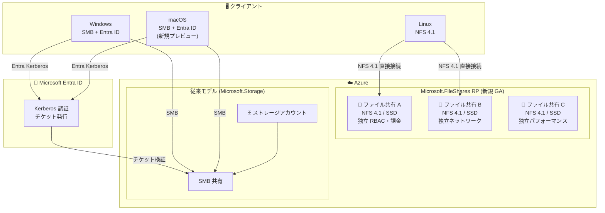

# Azure Files: FileShares リソースプロバイダー GA & macOS Entra ID 認証プレビュー

**リリース日**: 2026-06-02

**サービス**: Azure Files

**機能**: FileShares リソースプロバイダー GA & macOS Entra ID 認証プレビュー

**ステータス**: Launched (GA) / In preview

[このアップデートのインフォグラフィックを見る](https://takech9203.github.io/azure-news-summary/20260602-azure-files-fileshares-macos-entra.html)

## 概要

Microsoft Build 2026 において、Azure Files に関する 2 つの重要なアップデートが発表された。

1. **Microsoft.FileShares リソースプロバイダーの一般提供 (GA)**: ファイル共有をストレージアカウントから独立したトップレベル Azure リソースとして作成・管理できる新しい管理モデル。NFS 4.1 on SSD ストレージで利用可能。
2. **macOS からの Entra ID 認証によるアクセス (パブリックプレビュー)**: macOS ユーザーが Entra ID 資格情報を使用して Azure ファイル共有にセキュアにアクセスできる機能。ストレージアカウントキー不要、資格情報プロンプト不要、複雑な構成不要で利用可能。

これらのアップデートにより、Azure Files の管理パラダイムが根本的に変革される。Microsoft.FileShares リソースプロバイダーはファイル共有ごとに独立したパフォーマンス、セキュリティ、ネットワーク、課金を実現し、macOS Entra ID 認証はクロスプラットフォーム環境でのアイデンティティベースの統一アクセスを可能にする。

**アップデート前の課題**

- ファイル共有はストレージアカウント配下のサブリソースであり、個別のトップレベル ARM リソースとして管理できなかった
- ファイル共有ごとに独立した RBAC、ネットワーク、課金を実現するにはストレージアカウント単位での分割が必要だった
- サブスクリプションあたりのファイル共有数がストレージアカウントの制限に依存していた
- macOS ユーザーは Azure Files に対して Entra ID ベースの認証を使用できず、ストレージアカウントキーや SAS トークンに依存していた
- クロスプラットフォーム開発チームにおいて、macOS ユーザーだけ認証方法が異なりセキュリティポリシーの統一が困難だった

**アップデート後の改善**

- ファイル共有が Microsoft.FileShares リソースプロバイダー配下のトップレベル Azure リソースとなり、ストレージアカウント不要で独立管理が可能に
- 個々のファイル共有に対して専用のパフォーマンス、セキュリティ、ネットワーク、課金を設定可能
- サブスクリプションあたりリージョンごとに最大 10,000 共有をサポートし、プロビジョニングも高速化
- ARM テンプレート、Bicep、CI/CD ワークフローによるクラウドネイティブな自動化に対応
- macOS から Entra ID 認証で Azure Files にアクセス可能になり、Windows SMB 共有と同等のエクスペリエンスを実現
- オンプレミス AD インフラへの依存なしに、全デバイスで統一的なクラウドネイティブファイルアクセスモデルを展開可能

## アーキテクチャ図

上図は、新しい Microsoft.FileShares リソースプロバイダーによる独立したファイル共有管理モデル (NFS 4.1) と、macOS を含むマルチプラットフォームからの Entra ID 認証フロー (SMB) を示している。

## サービスアップデートの詳細

### 1. Microsoft.FileShares リソースプロバイダー (GA)

#### 主要機能

1. **トップレベル Azure リソースとしてのファイル共有**
   - ファイル共有がストレージアカウントから独立した ARM リソースとして扱われる
   - Azure Resource Manager の完全な管理機能 (RBAC、タグ、ポリシー、ロック) を個々の共有に直接適用可能

2. **専用のパフォーマンス・セキュリティ・ネットワーク・課金**
   - 各ファイル共有が独立したパフォーマンス設定を持ち、予測可能なパフォーマンスを実現
   - 共有単位でのネットワーク分離とセキュリティ設定
   - 粒度の細かいコスト追跡が可能

3. **大規模スケールと効率性**
   - サブスクリプションあたりリージョンごとに最大 10,000 共有をサポート
   - プロビジョニングの高速化
   - ARM テンプレート、Bicep、CI/CD ワークフローによるクラウドネイティブな自動化

4. **NFS 4.1 on SSD ストレージのサポート**
   - GA 時点では NFS 4.1 プロトコルの SSD (プレミアム) ストレージで利用可能

### 2. macOS Entra ID 認証 (パブリックプレビュー)

#### 主要機能

1. **Entra ID による macOS からの SMB アクセス**
   - ストレージアカウントキー不要
   - 資格情報プロンプト不要
   - 複雑な構成不要
   - Entra ID の資格情報で直接認証

2. **Windows SMB 共有エクスペリエンスとの完全なパリティ**
   - macOS ユーザーが Windows ユーザーと同じ ID ガバナンスの下でファイル共有にアクセス可能
   - 組織全体で一貫したクラウドネイティブなファイルアクセスモデル

3. **オンプレミス AD インフラ不要**
   - Microsoft Entra Kerberos を使用し、オンプレミスの Active Directory ドメインコントローラーへの依存を排除
   - クラウドネイティブな ID 管理のみで運用可能

## 技術仕様

### Microsoft.FileShares リソースプロバイダー

| 項目 | 詳細 |
|------|------|
| リソースプロバイダー | Microsoft.FileShares |
| ステータス | 一般提供 (GA) |
| サポートプロトコル | NFS 4.1 |
| ストレージティア | SSD (プレミアム) |
| 課金モデル | Provisioned v2 |
| 最大共有数 | 10,000 / サブスクリプション / リージョン |
| デプロイ方法 | ARM テンプレート、Bicep、CI/CD |
| プレビュー開始 | 2025 年 Q3 |
| GA | 2026-06-02 |

### macOS Entra ID 認証

| 項目 | 詳細 |
|------|------|
| ステータス | パブリックプレビュー |
| プロトコル | SMB |
| 認証方式 | Microsoft Entra Kerberos |
| ID ソース | Microsoft Entra ID |
| オンプレミス AD 依存 | 不要 |
| 対象 | macOS クライアント |

## メリット

### ビジネス面

- **コスト最適化**: ファイル共有単位での課金追跡により、部門・プロジェクト別の正確なコスト配分が可能
- **運用効率向上**: 10,000 共有/サブスクリプション/リージョンのスケールにより、大規模環境での管理が簡素化
- **セキュリティコンプライアンス**: 全プラットフォーム (Windows, Linux, macOS) で統一的な ID ベースのアクセス制御を実現
- **開発者生産性**: macOS を使用する開発者がシームレスにファイル共有にアクセスでき、クロスプラットフォーム開発の摩擦を排除

### 技術面

- **IaC との親和性**: ARM/Bicep によるファイル共有のデプロイが第一級リソースとして可能になり、GitOps ワークフローへの統合が容易
- **粒度の細かい RBAC**: 共有単位でのロールベースアクセス制御により、最小権限の原則を徹底
- **ネットワーク分離**: 共有ごとに独立したネットワーク設定が可能で、マイクロセグメンテーション戦略に対応
- **パスワードレス認証**: macOS でストレージアカウントキーや SAS トークンを排除し、Entra ID による強力な認証に統一
- **高速プロビジョニング**: ストレージアカウント作成のオーバーヘッドなしに、ファイル共有を直接プロビジョニング

## デメリット・制約事項

- **Microsoft.FileShares GA**: 現時点では NFS 4.1 on SSD ストレージのみ対応。SMB 共有や HDD ストレージへの拡張は今後の計画
- **Microsoft.FileShares GA**: Provisioned v2 課金モデルのみ対応
- **macOS Entra ID 認証**: パブリックプレビューのため SLA 対象外。本番環境での利用は評価の上で判断が必要
- **macOS Entra ID 認証**: SMB プロトコルのみ対応 (NFS は ID ベース認証非対応)
- **従来モデルとの共存**: 既存のストレージアカウントベースのファイル共有は引き続き利用可能だが、新モデルへの移行パスの詳細は今後の発表を待つ必要がある

## ユースケース

### ユースケース 1: マルチテナント SaaS アプリケーション

**シナリオ**: SaaS プロバイダーがテナントごとに独立した NFS ファイル共有を提供する場合、従来はテナントごとにストレージアカウントを作成する必要があった。

**効果**: Microsoft.FileShares により、各テナントのファイル共有をトップレベルリソースとして独立管理でき、テナントごとの RBAC・ネットワーク分離・課金追跡が容易になる。サブスクリプションあたり 10,000 共有まで拡張可能なため、ストレージアカウント数の制限を気にせず大規模展開が可能。

### ユースケース 2: クロスプラットフォーム開発チーム

**シナリオ**: Windows、macOS、Linux を混在で使用する開発チームが、共有ファイルストレージへのセキュアなアクセスを必要としている。

**効果**: macOS Entra ID 認証により、全プラットフォームで統一的な ID ベースの認証が実現。ストレージアカウントキーの配布・管理が不要になり、組織の Zero Trust セキュリティ戦略に沿ったアクセス制御を全デバイスで適用可能。

### ユースケース 3: CI/CD パイプラインでのファイル共有管理

**シナリオ**: Infrastructure as Code で環境を管理するチームが、ファイル共有のプロビジョニングを自動化したい。

**効果**: Microsoft.FileShares リソースプロバイダーにより、Bicep/ARM テンプレートでファイル共有を直接定義・デプロイ可能。ストレージアカウントという中間レイヤーが不要になり、デプロイの高速化とテンプレートの簡素化を実現。

## 料金

### Microsoft.FileShares (NFS 4.1 on SSD)

Microsoft.FileShares は Provisioned v2 課金モデルを使用する。Provisioned v2 モデルでは、ストレージ容量、IOPS、スループットを独立してプロビジョニングできる。

- **ストレージ容量**: 32 GiB ~ 256 TiB の範囲で設定可能
- **IOPS**: 独立してプロビジョニング
- **スループット**: 独立してプロビジョニング

詳細な料金は [Azure Files 料金ページ](https://azure.microsoft.com/pricing/details/storage/files/) を参照。

### macOS Entra ID 認証

macOS Entra ID 認証機能の利用に追加料金は発生しない。通常の Azure Files ストレージ料金と Microsoft Entra ID のライセンス料金が適用される。

## 関連サービス・機能

- **Microsoft Entra ID**: macOS 認証の ID プロバイダー。Kerberos チケット発行により SMB 認証を実現
- **Azure RBAC**: Microsoft.FileShares で共有単位のきめ細かなアクセス制御に使用
- **Azure Policy**: 新リソースプロバイダーのファイル共有に対するガバナンスポリシーの適用
- **Entra-only identity support (GA)**: 同じく Build 2026 で GA した、クラウドネイティブ ID のみでの SMB 認証
- **Managed identity support (GA)**: 同じく GA した、VM やアプリケーションからのキーレスアクセス
- **Azure Bicep / ARM テンプレート**: Microsoft.FileShares リソースの IaC デプロイメント

## 参考リンク

- [インフォグラフィック](https://takech9203.github.io/azure-news-summary/20260602-azure-files-fileshares-macos-entra.html)
- [公式アップデート情報: Microsoft.FileShares GA](https://azure.microsoft.com/updates?id=565062)
- [公式アップデート情報: macOS Entra ID 認証](https://azure.microsoft.com/updates?id=565073)
- [Microsoft.FileShares GA ブログ](https://aka.ms/MFS/GA)
- [macOS Entra ID 認証ブログ](https://techcommunity.microsoft.com/blog/azurestorageblog/secure-modern-access-to-azure-files-on-macos-with-ms-entra-id/4524077)
- [What's New in Azure Files](https://learn.microsoft.com/en-us/azure/storage/files/files-whats-new)
- [Azure Files identity-based authentication overview](https://learn.microsoft.com/en-us/azure/storage/files/storage-files-active-directory-overview)
- [Azure Files の概要](https://learn.microsoft.com/en-us/azure/storage/files/storage-files-introduction)
- [料金ページ](https://azure.microsoft.com/pricing/details/storage/files/)

## まとめ

Build 2026 で発表された Azure Files の 2 つのアップデートは、ファイル共有の管理と認証の両面で大きな進化をもたらす。

**Microsoft.FileShares リソースプロバイダーの GA** は、Azure Files の管理モデルを根本から変革する。ストレージアカウントの制約から解放されたトップレベルリソースとしてのファイル共有管理は、大規模環境での運用効率を大幅に向上させる。特に IaC ワークフロー、粒度の細かいコスト管理、マイクロセグメンテーションを必要とする組織にとって重要な進展である。

**macOS Entra ID 認証のプレビュー** は、クロスプラットフォーム環境における「最後のギャップ」を埋める。Windows、Linux に続き macOS でも ID ベースの統一認証が可能になったことで、組織全体での Zero Trust セキュリティポリシーの一貫した適用が現実的になった。

**推奨される次のアクション**:
- NFS 4.1 ワークロードを持つ組織は、Microsoft.FileShares リソースプロバイダーでの新規共有作成を検討する
- macOS を使用する開発チームがいる組織は、プレビュー段階で macOS Entra ID 認証を評価環境でテストする
- 既存の Bicep/ARM テンプレートに Microsoft.FileShares リソースの定義を追加し、IaC パイプラインの更新を計画する

---

**タグ**: #AzureFiles #MicrosoftFileShares #EntraID #macOS #NFS #Build2026 #GA #Preview #Storage #IdentityBasedAccess #CloudNative #IaC
