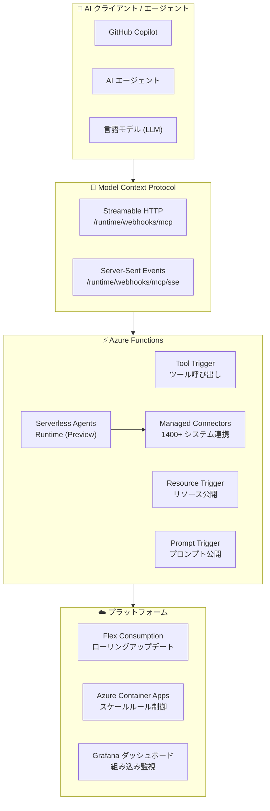

# Azure Functions: Build 2026 - MCP・エージェント対応とプラットフォーム強化

**リリース日**: 2026-06-02

**サービス**: Azure Functions

**機能**: Build 2026 - MCP・エージェント対応とプラットフォーム強化

**ステータス**: Launched (GA) / In preview (mixed)

[このアップデートのインフォグラフィックを見る](https://takech9203.github.io/azure-news-summary/20260602-azure-functions-build-2026-updates.html)

## 概要

Microsoft Build 2026 において、Azure Functions に対する大規模なアップデートが発表された。今回のアップデートは GA 4 項目、Preview 4 項目の計 8 項目で構成され、AI エージェント時代における Azure Functions の位置づけを大きく変える内容となっている。

最も注目すべきは、Azure Functions が Model Context Protocol (MCP) アプリのホスティングに正式対応した点である。MCP は言語モデルやエージェントが外部データソースやツールを効率的に発見・利用するためのクライアント・サーバープロトコルであり、Azure Functions の MCP 拡張機能によりリモート MCP サーバーを構築できるようになった。これにより、GitHub Copilot や各種 AI エージェントから Azure Functions 上のツールを直接呼び出すことが可能になる。

さらに、Serverless agents runtime (Preview) により、Azure Functions 上で AI エージェントのオーケストレーションが可能となり、Go 言語サポート (Preview)、1400 以上のシステムとの統合コネクタ (Preview)、Copilot 支援によるコーディング (Preview) など、開発者体験を大幅に向上させる機能が追加された。プラットフォーム面では、Flex Consumption プランでのローリングアップデート (GA)、Grafana ダッシュボード (GA)、Azure Container Apps 上でのスケールルールのオーバーライド (GA) が一般提供開始となった。

**アップデート前の課題**

- AI エージェントから Azure Functions のツールを利用するには独自の API 統合が必要だった
- MCP サーバーを構築するには専用のインフラストラクチャを別途用意する必要があった
- AI エージェントのワークフロー構築にサーバーレスの利点を活かしにくかった
- Flex Consumption プランでのデプロイ時にダウンタイムが発生する可能性があった
- Azure Functions のモニタリングに Grafana を使用する場合、ダッシュボードを手動で構築する必要があった
- Go 言語開発者は Azure Functions を利用できなかった

**アップデート後の改善**

- MCP バインディングにより、Azure Functions がネイティブに MCP サーバーとして機能し、AI エージェントと直接連携可能
- Tool Trigger、Resource Trigger、Prompt Trigger の 3 種類のバインディングで MCP Apps を構築可能
- Serverless agents runtime により、サーバーレスで AI エージェントを構築・実行可能
- ローリングアップデートによりゼロダウンタイムデプロイが実現
- 組み込み Grafana ダッシュボードで即座に監視を開始可能
- Go 言語が Azure Functions で利用可能に (Preview)

## アーキテクチャ図



Azure Functions が MCP プロトコルを介して AI クライアントとネイティブに連携し、エージェントランタイムと管理コネクタによりバックエンドシステムとの統合を実現するアーキテクチャ。プラットフォーム層ではゼロダウンタイムデプロイと組み込み監視が提供される。

## サービスアップデートの詳細

### GA (一般提供)

#### 1. Azure Functions での MCP Apps ホスティング

Azure Functions の MCP 拡張機能により、関数アプリをリモート MCP サーバーとして公開できるようになった。MCP (Model Context Protocol) は、言語モデルやエージェントが外部データソースやツールを効率的に発見・利用するために設計されたクライアント・サーバープロトコルである。

**主要な機能:**

| バインディング種別 | 用途 |
|---|---|
| Tool Trigger | MCP ツール呼び出しリクエストから関数を実行 |
| Resource Trigger | 関数を MCP リソースとして公開 |
| Prompt Trigger | 関数を MCP プロンプトとして公開 |

**MCP Apps 対応:** ツールがプレーンテキストではなくインタラクティブな UI を返すことが可能。Tool Trigger と Resource Trigger を組み合わせて実現する。

**サポートされるトランスポート:**

| トランスポート | エンドポイント |
|---|---|
| Streamable HTTP | `/runtime/webhooks/mcp` |
| Server-Sent Events (SSE) | `/runtime/webhooks/mcp/sse` |

**対応言語:** C# (isolated worker model)、Java、Node.js/TypeScript、Python (PowerShell は未対応)

**セキュリティ:** Azure でホスティングする場合、`mcp_extension` システムキーによる認証が必要。`x-functions-key` HTTP ヘッダーまたは `code` クエリストリングパラメータで提供する。組み込みの MCP サーバー認可による ID ベースのアクセス制御も利用可能。

#### 2. Flex Consumption でのローリングアップデート

Flex Consumption プランにおいて、ローリングアップデートによるゼロダウンタイムデプロイが一般提供開始となった。コードデプロイおよび構成変更がインスタンス全体に段階的に適用され、関数実行を中断することなくアップデートを行える。

従来の Consumption プランではデプロイスロットによるダウンタイム軽減が一般的だったが、Flex Consumption ではデプロイスロットがサポートされていないため、ローリングアップデートがゼロダウンタイムデプロイの推奨手段となる。

#### 3. Azure Functions 向け組み込み Grafana ダッシュボード

Azure Functions の監視において、組み込みの Grafana ダッシュボードが一般提供開始。手動でダッシュボードを構築することなく、Azure Functions のメトリクスを即座に可視化できる。

#### 4. Azure Container Apps 上でのスケールルールのオーバーライド

Azure Container Apps 上で動作する Azure Functions において、スケールルールのオーバーライドが一般提供開始。ワークロードの特性に応じて、デフォルトのスケーリング動作をカスタマイズできる。

### Preview (プレビュー)

#### 5. Go 言語サポート

Azure Functions で Go 言語が利用可能になった (Preview)。Go 開発者が Azure Functions のサーバーレスモデルを活用してアプリケーションを構築できる。

#### 6. Serverless Agents Runtime

Azure Functions 上で AI エージェントを構築・実行するためのランタイムがプレビュー提供開始。サーバーレスの弾力性を活かしながら、エージェントのオーケストレーションパターンを実装できる。

#### 7. 1400 以上のシステムとの統合コネクタ

Azure Functions にマネージドコネクタが組み込まれ、1400 以上の外部システムとの統合が可能になった (Preview)。Logic Apps で利用されていたコネクタエコシステムが Azure Functions でも利用可能となり、エンタープライズ統合の幅が大幅に広がる。

#### 8. Copilot 支援によるコーディングとエージェントスキル

Copilot を活用した Azure Functions のコーディング支援とエージェントスキルがプレビュー提供開始。Azure Functions の構築、デプロイ、実行をより高速に行えるようになる。

## 技術仕様

### MCP バインディング

| 項目 | 詳細 |
|------|------|
| 拡張バンドルバージョン | `[4.0.0, 5.0.0)` |
| C# パッケージ | `Microsoft.Azure.Functions.Worker.Extensions.Mcp` |
| C# Worker パッケージ | 2.1.0 以上 |
| Java ライブラリ | `azure-functions-java-library` 3.2.2 以上 |
| Node.js パッケージ | `@azure/functions` 4.9.0 以上 |
| Python パッケージ | `azure-functions` 1.24.0 以上 |
| Core Tools バージョン | 4.0.7030 以上 (ローカル実行時) |
| SSE 使用時の依存 | Azure Queue Storage (AzureWebJobsStorage) |

### Flex Consumption プラン

| 項目 | 詳細 |
|------|------|
| ゼロダウンタイムデプロイ | ローリングアップデート (GA) |
| 対応言語 | C# (.NET 8/9/10)、Java 8/11/17/21/25、Node.js 22/24、PowerShell 7.4、Python 3.10-3.13 |
| 最大スケールアウト | 1,000 インスタンス |
| インスタンスサイズ | 512 MB (0.25 cores) / 2,048 MB (1 core) / 4,096 MB (2 cores) |

## 設定方法

### MCP サーバーの構成

#### host.json の設定

```json
{
  "version": "2.0",
  "extensionBundle": {
    "id": "Microsoft.Azure.Functions.ExtensionBundle",
    "version": "[4.0.0, 5.0.0)"
  },
  "extensions": {
    "mcp": {
      "instructions": "MCP サーバーの利用方法の説明",
      "serverName": "MyMCPServer",
      "serverVersion": "1.0.0"
    }
  }
}
```

#### MCP クライアント設定 (VS Code / GitHub Copilot 用 mcp.json)

```json
{
    "inputs": [
        {
            "type": "promptString",
            "id": "functions-mcp-extension-system-key",
            "description": "Azure Functions MCP Extension System Key",
            "password": true
        },
        {
            "type": "promptString",
            "id": "functionapp-host",
            "description": "The host domain of the function app."
        }
    ],
    "servers": {
        "local-mcp-function": {
            "type": "http",
            "url": "http://localhost:7071/runtime/webhooks/mcp"
        },
        "remote-mcp-function": {
            "type": "http",
            "url": "https://${input:functionapp-host}/runtime/webhooks/mcp",
            "headers": {
                "x-functions-key": "${input:functions-mcp-extension-system-key}"
            }
        }
    }
}
```

### Azure CLI

```bash
# MCP システムキーの取得
az functionapp keys list \
  --resource-group <RESOURCE_GROUP> \
  --name <APP_NAME> \
  --query systemKeys.mcp_extension \
  --output tsv
```

## メリット

### ビジネス面

- AI エージェントとの統合により、既存の Azure Functions 資産を AI ワークフローに即座に活用可能
- 1400 以上のコネクタにより、エンタープライズシステムとの統合コストを大幅に削減
- Go 言語サポートにより、Go 開発チームもサーバーレスを採用可能に
- ゼロダウンタイムデプロイにより、本番環境の可用性を維持しながら頻繁なリリースが可能

### 技術面

- MCP バインディングにより、標準プロトコルでの AI エージェント連携が実現 (独自 API 不要)
- Streamable HTTP と SSE の両トランスポートをサポートし、様々な MCP クライアントに対応
- Tool / Resource / Prompt の 3 種類のトリガーにより、MCP の全機能を Azure Functions で表現可能
- ローリングアップデートにより、Flex Consumption での CI/CD パイプラインが安定化
- 組み込み Grafana ダッシュボードにより、監視のセットアップ時間を削減

## デメリット・制約事項

- MCP 拡張機能は PowerShell には未対応
- SSE トランスポートは非推奨化の方向 (Streamable HTTP を推奨)
- MCP サーバーの認証にはシステムキーの管理が必要 (Anonymous に設定しない限り)
- Go 言語サポートおよび Serverless Agents Runtime はプレビュー段階のため、本番利用は慎重に検討が必要
- MCP の SSE トランスポート使用時には Azure Queue Storage が必要 (AzureWebJobsStorage アカウント)
- Flex Consumption プランはデプロイスロットに非対応 (ローリングアップデートが代替)
- ローリングアップデートはまだパブリックプレビューから GA への移行期であり、ドキュメントの記述に差異がある場合がある

## ユースケース

### ユースケース 1: AI エージェントのツール基盤

**シナリオ**: 社内の業務システム (人事、経理、在庫管理) へのアクセスを AI エージェントに提供する

**実装例**:

```python
import azure.functions as func

app = func.FunctionApp()

@app.mcp_tool_trigger(name="getEmployeeInfo", description="従業員情報を取得する")
def get_employee_info(req: func.McpToolRequest) -> str:
    employee_id = req.parameters.get("employee_id")
    # 社内人事システムから情報を取得
    return f"従業員 {employee_id} の情報: ..."
```

**効果**: GitHub Copilot や社内 AI アシスタントから直接業務データにアクセスでき、開発者・業務担当者の生産性が向上

### ユースケース 2: ゼロダウンタイムでの継続的デリバリー

**シナリオ**: Flex Consumption プランで稼働する決済処理関数のアップデートを、サービス中断なく実施する

**実装例**:

```bash
# ローリングアップデートを有効化したデプロイ
func azure functionapp publish <APP_NAME> --slot-swap-strategy rolling
```

**効果**: 決済処理の可用性 99.99% を維持しながら、日次デプロイを実現

### ユースケース 3: マルチシステム連携エージェント

**シナリオ**: Serverless Agents Runtime + Managed Connectors を活用し、Salesforce・SAP・ServiceNow を横断するエージェントを構築

**効果**: 従来は Logic Apps や Power Automate で構築していた複雑な統合フローを、Azure Functions のプログラマビリティとサーバーレスの弾力性を活かして構築可能

## 関連サービス・機能

- **Azure AI Agent Service**: AI エージェントの構築・管理サービス。Azure Functions の MCP ホスティングと組み合わせてエージェントのツール基盤を構築
- **Azure Container Apps**: Azure Functions のホスティング環境の 1 つ。スケールルールのオーバーライドが今回 GA
- **Azure Logic Apps**: 1400+ コネクタの元となるマネージドコネクタエコシステムの提供元
- **Azure Managed Grafana**: 組み込み Grafana ダッシュボードの基盤サービス
- **GitHub Copilot**: MCP クライアントとして Azure Functions 上の MCP サーバーに接続可能
- **Durable Functions**: エージェントのオーケストレーションパターンとの親和性が高い。Flex Consumption でも利用可能

## 参考リンク

- [インフォグラフィック](https://takech9203.github.io/azure-news-summary/20260602-azure-functions-build-2026-updates.html)
- [MCP Apps ホスティング](https://azure.microsoft.com/updates?id=562099)
- [Flex Consumption ローリングアップデート](https://azure.microsoft.com/updates?id=562365)
- [組み込み Grafana ダッシュボード](https://azure.microsoft.com/updates?id=562492)
- [Container Apps スケールルール](https://azure.microsoft.com/updates?id=562511)
- [Go 言語サポート](https://azure.microsoft.com/updates?id=562502)
- [Serverless Agents Runtime](https://azure.microsoft.com/updates?id=562482)
- [マネージドコネクタ](https://azure.microsoft.com/updates?id=562442)
- [Copilot 支援コーディング](https://azure.microsoft.com/updates?id=562487)
- [MCP バインディング ドキュメント](https://learn.microsoft.com/azure/azure-functions/functions-bindings-mcp)
- [Flex Consumption プラン ドキュメント](https://learn.microsoft.com/azure/azure-functions/flex-consumption-plan)

## まとめ

Build 2026 における Azure Functions のアップデートは、サーバーレスコンピューティングが AI エージェント時代の中核プラットフォームへと進化していることを示している。特に MCP ホスティングの GA は、Azure Functions を「AI エージェントのツール基盤」として位置づける戦略的な一手である。

Solutions Architect として推奨されるアクションは以下の通り:

1. **即座に検討**: MCP バインディングを活用し、既存の Azure Functions を AI エージェントのツールとして公開する設計を検討する
2. **プラットフォーム強化**: Flex Consumption プランへの移行とローリングアップデートの有効化を検討する
3. **中期的に準備**: Serverless Agents Runtime と Managed Connectors の GA を見据え、エージェントアーキテクチャの設計を開始する
4. **監視改善**: 組み込み Grafana ダッシュボードを活用し、運用の可視性を向上する

---

**タグ**: #Azure #AzureFunctions #MCP #ModelContextProtocol #AIエージェント #サーバーレス #Build2026 #FlexConsumption #Go #Grafana #ContainerApps
