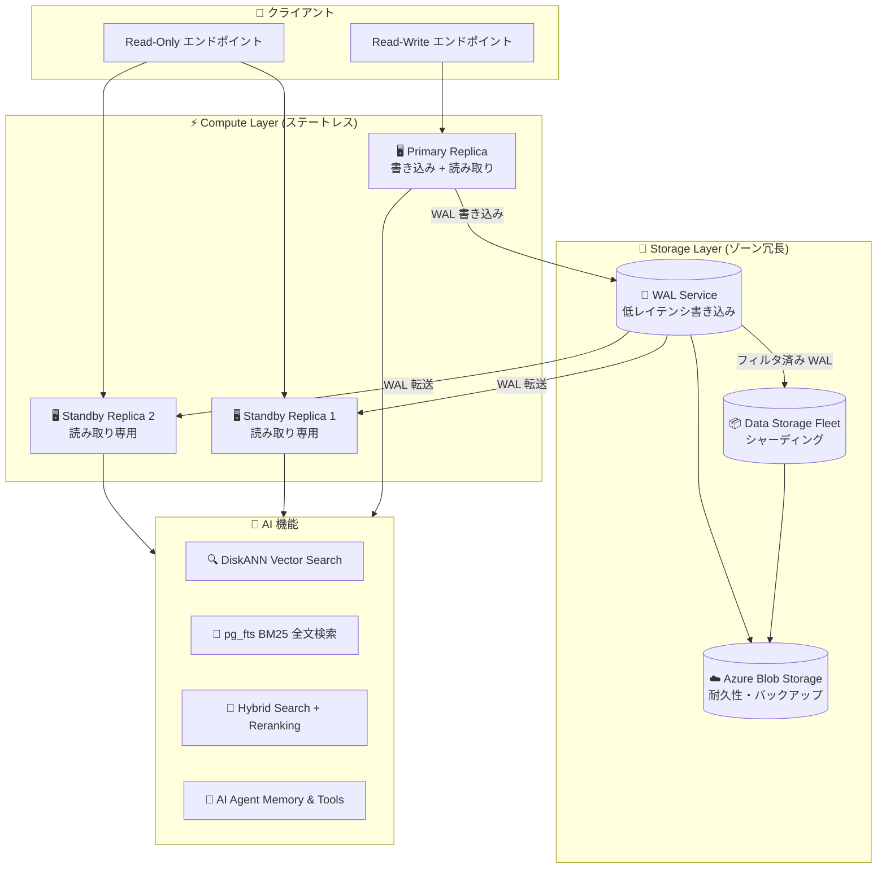

# Azure HorizonDB: 新データベースサービス Public Preview (Build 2026)

**リリース日**: 2026-06-02

**サービス**: Azure HorizonDB

**機能**: 新データベースサービス Public Preview (Build 2026)

**ステータス**: In preview (メインサービス) / Launched (Agentic Advisor Solution Accelerator)

[このアップデートのインフォグラフィックを見る](https://takech9203.github.io/azure-news-summary/20260602-azure-horizondb.html)

## 概要

Microsoft Build 2026 にて、Azure の新しいデータベースサービス「Azure HorizonDB」が Public Preview として発表された。Azure HorizonDB は、オープンソース PostgreSQL エンジンをベースとしたフルマネージドの AI 対応 Database-as-a-Service (DBaaS) であり、コンピュートとストレージを分離した「データベース・アズ・ア・ログ」アーキテクチャを採用している。ミッションクリティカルなワークロードに対して、予測可能なパフォーマンス、エンタープライズグレードのセキュリティ、高可用性、シームレスなスケーラビリティを提供する。

本サービスは、ベクトル埋め込みのネイティブサポートと Azure AI Foundry Tools との統合により、インテリジェントな AI アプリケーションの構築を強力に支援する。完全な PostgreSQL 互換性を維持しているため、既存の PostgreSQL アプリケーションは容易に移行可能である。

Build 2026 では、メインサービスの Public Preview に加え、BM25 全文検索 (pg_fts)、DiskANN ベクトル検索の高度なフィルタリング、および GA となった Agentic Advisor Solution Accelerator の計 4 つのアップデートが同時に発表された。

**アップデート前の課題**

- Azure Database for PostgreSQL Flexible Server では、コンピュートとストレージが結合しており、独立したスケーリングに制限があった
- ベクトル検索と全文検索を組み合わせたハイブリッド検索には、別途検索サービス (Azure AI Search 等) の構築・データ同期が必要だった
- AI エージェントのメモリ、ナレッジ検索、スケーラブルストレージを単一のデータベースで統合的に扱うことが難しかった
- 大規模ベクトルデータセットに対するフィルタ付き検索では、ポストフィルタリングによるリコール低下が課題だった

**アップデート後の改善**

- コンピュートとストレージの完全分離により、それぞれ独立してスケーリング可能になった
- WAL のみをストレージに書き込む「データベース・アズ・ア・ログ」設計で、書き込み増幅を削減し予測可能なレイテンシを実現
- pg_fts (BM25) と DiskANN ベクトル検索を PostgreSQL 内でネイティブに利用可能、別途検索サービスが不要に
- DiskANN の Advanced Filtering により、メタデータフィルタをインデックスウォーク内で評価し、高リコール・低レイテンシを維持
- AI エージェント構築に必要なメモリ、ナレッジ検索、ツール連携を単一データベースで提供

## アーキテクチャ図



Azure HorizonDB は、ステートレスなコンピュートレイヤーとゾーン冗長のストレージレイヤーを完全に分離し、WAL のみをコンピュートからストレージに書き込む設計を採用している。AI 機能 (DiskANN、pg_fts、ハイブリッド検索) はすべてのコンピュートレプリカからネイティブに利用可能である。

## サービスアップデートの詳細

### 1. Azure HorizonDB (Public Preview)

PostgreSQL エンジンベースのフルマネージド AI 対応データベースサービス。従来の Azure Database for PostgreSQL とは異なる新しいアーキテクチャを採用している。

**主要な差別化ポイント:**

| 特徴 | Azure HorizonDB | 従来の Azure Database for PostgreSQL |
|------|-----------------|--------------------------------------|
| アーキテクチャ | コンピュート・ストレージ分離 | 統合型 |
| ストレージ設計 | Database-as-a-Log (WAL のみ書き込み) | 従来型 (データページ書き込み) |
| レプリカ追加 | データ複製不要 (共有ストレージ) | データ複製が必要 |
| フェイルオーバー | 高速 (ログ巻き戻し不要) | ログリカバリが必要 |
| ゾーン冗長性 | ストレージレイヤーでデフォルト提供 | 構成が必要 |
| AI ネイティブ機能 | DiskANN、pg_fts、AI パイプライン統合 | pgvector のみ |

**コンピュートレプリカの特徴:**
- コアあたり 8 GB のメモリ
- ローカル NVMe SSD キャッシュ (全レプリカに搭載)
- WAL 送信、アーカイブ、ダーティページ書き込み、チェックポイント、バックアップをストレージレイヤーにオフロード
- ビジネスロジック実行により多くの CPU、ディスク、ネットワークリソースを割り当て可能

### 2. BM25 全文検索 - pg_fts (Public Preview)

`pg_fts` 拡張機能により、Elasticsearch や Azure AI Search と同等の BM25 ランキングアルゴリズムを PostgreSQL 内で直接利用可能にする。

**主要機能:**

1. **BM25 ランキング**
   - 用語頻度飽和 (キーワードスタッフィング防止)
   - ドキュメント長正規化
   - 逆文書頻度 (IDF) による重み付け

2. **高度なクエリ機能**
   - Boolean クエリ (AND / OR / NOT)
   - ファジー検索 (編集距離 0-2 のタイポ許容)
   - フレーズ近接検索 (N ポジション以内)

3. **多言語サポート**
   - 日本語 (Lindera + IPADIC 辞書)
   - 中国語 (Jieba セグメンテーション)
   - 韓国語 (Lindera + mecab-ko-dic)
   - タイ語 (ICU4X ワードセグメンテーション)

4. **パフォーマンス**
   - 100K+ 行でのマルチキーワードクエリで一桁〜低二桁ミリ秒のレイテンシ
   - LIMIT プッシュダウンによる効率的な検索
   - INSERT/UPDATE/DELETE で自動インデックス更新 (REFRESH ステップ不要)

**使用例:**

```sql
-- pg_fts 拡張の有効化
CREATE EXTENSION IF NOT EXISTS pg_fts;

-- テキストカラムに FTS インデックスを作成
CREATE INDEX idx_products_fts ON products USING fts (name, description);

-- BM25 ランキングによる全文検索
SELECT id, name, pgfts.fts_score(description) AS score
FROM products
WHERE pgfts.fts_query('wireless noise cancelling', 'idx_products_fts')
ORDER BY score DESC
LIMIT 10;
```

### 3. DiskANN ベクトル検索の Advanced Filtering (Public Preview)

Microsoft Research の DiskANN アルゴリズムに高度なフィルタリング機能を追加。メタデータ述語をインデックスウォーク内で評価し、ベクトル類似度検索とメタデータフィルタを単一 SQL クエリで実行可能にする。

**主要機能:**

1. **インデックス内フィルタリング**
   - WHERE 句の述語をインデックスグラフ走査内で評価
   - LIMIT が満たされるまで候補を取得し続ける
   - アプリケーション側のポストフィルタリングが不要

2. **高次元サポート**
   - 最大 16,000 次元のベクトルをサポート (球面量子化使用時)
   - text-embedding-3-large 等の高次元モデルに対応
   - HNSW の 2,000 次元制限を大幅に超越

3. **球面量子化 (Spherical Quantization)**
   - メモリ使用量の削減と性能向上
   - 1 ビットまたは 4 ビット量子化を選択可能
   - 100 万行超のデータセットで特に効果的

**使用例:**

```sql
-- DiskANN インデックスの作成
CREATE INDEX products_embedding_diskann_idx
    ON products USING diskann (embedding vector_cosine_ops);

-- ベクトル検索 + メタデータフィルタ (Advanced Filtering)
SELECT id, category, price
FROM products
WHERE tenant_id = 42
  AND category = 'kitchen'
  AND price BETWEEN 20 AND 200
  AND created_at > now() - INTERVAL '30 days'
ORDER BY embedding <=> :query_embedding
LIMIT 10;
```

### 4. Agentic Advisor Solution Accelerator (Generally Available)

AI エージェント構築を加速するソリューションアクセラレータが GA。Azure HorizonDB をエージェントの統合データレイヤーとして活用し、メモリ、ナレッジ検索、ツール連携を提供する。

**エージェントが HorizonDB で実現する機能:**

| 機能 | 説明 |
|------|------|
| 永続メモリ | 会話履歴、ユーザー設定、タスク状態を ACID 保証で永続化 |
| ナレッジ検索 | ベクトル検索、全文検索、グラフ検索、ハイブリッド検索 |
| マルチモーダルストレージ | JSONB、PostGIS、配列、ベクトル埋め込み、バイナリデータを単一 DB で管理 |
| ツール連携 | MCP (Model Context Protocol) サーバーとしてエージェントに接続 |

**サポートするエージェントフレームワーク:**
- LangChain / LangGraph (PostgreSQL チェックポインター)
- Microsoft Semantic Kernel (PostgreSQL コネクタ)
- Microsoft Foundry Agent Service

**サポートするプロトコル:**
- Model Context Protocol (MCP) - エージェントからツール/データへの接続
- Agent-to-Agent Protocol (A2A) - エージェント間の協調

## 技術仕様

| 項目 | 詳細 |
|------|------|
| エンジン | PostgreSQL (フル互換) |
| アーキテクチャ | コンピュート・ストレージ分離 + Database-as-a-Log |
| コンピュート | コアあたり 8 GB メモリ、ローカル NVMe SSD キャッシュ |
| ストレージ | WAL Service + Data Storage Fleet + Azure Blob Storage |
| ゾーン冗長性 | ストレージレイヤーでデフォルト提供 |
| ベクトル次元数 | 最大 16,000 次元 (DiskANN + 球面量子化) |
| ベクトル距離関数 | L2 (ユークリッド)、コサイン、内積 |
| 全文検索 | BM25 ランキング (pg_fts) |
| 多言語対応 | 英語、日本語、中国語、韓国語、タイ語 |
| レプリカ | 1 Primary + N Standby (読み取りスケールアウト) |
| バックアップ保持期間 | 7 日間 (現時点) |

## 設定方法

### 前提条件

1. Azure サブスクリプション
2. Azure CLI (最新版) または Azure Portal アクセス
3. 対象リージョンへのデプロイ権限

### クラスター作成後の AI 拡張機能セットアップ

```sql
-- ベクトル検索用拡張 (DiskANN)
CREATE EXTENSION IF NOT EXISTS pg_diskann CASCADE;

-- BM25 全文検索用拡張
CREATE EXTENSION IF NOT EXISTS pg_fts;

-- Azure AI 連携拡張
CREATE EXTENSION IF NOT EXISTS azure_ai;

-- search_path の設定
SET search_path = public, pgfts;
```

### ハイブリッド検索の実装 (BM25 + ベクトル検索)

```sql
-- Reciprocal Rank Fusion (RRF) によるハイブリッド検索
WITH bm25_results AS (
    SELECT id, ROW_NUMBER() OVER () AS bm25_rank
    FROM products
    WHERE pgfts.fts_query('wireless noise cancelling', 'idx_products_fts')
    LIMIT 20
),
vector_results AS (
    SELECT id,
           ROW_NUMBER() OVER (
               ORDER BY embedding <=> :query_embedding
           ) AS vec_rank
    FROM products
    ORDER BY embedding <=> :query_embedding
    LIMIT 20
)
SELECT COALESCE(b.id, v.id) AS id,
       (1.0 / (60 + COALESCE(b.bm25_rank, 999))) +
       (1.0 / (60 + COALESCE(v.vec_rank, 999))) AS rrf_score
FROM bm25_results b
FULL OUTER JOIN vector_results v ON b.id = v.id
ORDER BY rrf_score DESC
LIMIT 10;
```

## メリット

### ビジネス面

- 別途検索サービス (Elasticsearch、Azure AI Search 等) の構築・運用コストが不要になる
- PostgreSQL 互換のため、既存アプリケーション・人材のスキルセットを活用可能
- AI エージェントのデータレイヤーを単一サービスに統合し、運用複雑性を削減
- マルチテナント AI アプリケーションを効率的に構築可能

### 技術面

- WAL のみの書き込みにより、書き込み増幅を大幅に削減し予測可能なパフォーマンスを実現
- コンピュートのオフロード (チェックポイント、バックアップ等) により、ビジネスロジックに使えるリソースが増加
- DiskANN の Advanced Filtering で、フィルタが選択的でもリコールとレイテンシが安定
- ストレージ共有によるレプリカ追加が高速 (データコピー不要)
- 16,000 次元までのベクトルサポートで最新の高精度埋め込みモデルに対応

## デメリット・制約事項

- **Preview 段階**: 本番ワークロードでの利用には注意が必要
- **バックアップ保持期間**: 現時点で 7 日間固定 (1-35 日の設定は未対応)
- **クロスリージョンレプリカ**: 未対応 (ディザスタリカバリ用のクロスリージョンレプリケーション未サポート)
- **カスタマー管理キー (CMK)**: 未対応 (暗号化はサービス管理キーのみ)
- **メンテナンスウィンドウ**: カスタム設定不可 (システム管理ウィンドウのみ)
- **接続プーリング (PgBouncer)**: 未対応 (外部コネクションプーラーは利用可能)
- **長期保持 (LTR)**: 未対応
- **インデックスチューニング**: 未対応 (近日対応予定)
- **仮想ネットワーク注入**: 未対応 (Private Link のみサポート)
- **リージョン制限**: 現時点で 5 リージョンのみ

## ユースケース

### ユースケース 1: マルチテナント AI 検索プラットフォーム

**シナリオ**: SaaS プロバイダーが、テナントごとに隔離されたセマンティック検索機能を提供する。

**実装例**:

```sql
-- テナント分離されたベクトル + メタデータ検索
SELECT id, title, content
FROM documents
WHERE tenant_id = :current_tenant
  AND doc_type = 'knowledge_base'
  AND created_at > now() - INTERVAL '90 days'
ORDER BY embedding <=> :query_embedding
LIMIT 10;
```

**効果**: DiskANN の Advanced Filtering により、テナント ID でフィルタしてもリコールが低下しない。別途テナントごとのインデックス構築が不要。

### ユースケース 2: AI エージェントのバックエンド

**シナリオ**: カスタマーサポートエージェントが、会話履歴 (メモリ)、FAQ 検索 (ナレッジ)、注文データ (リレーショナル) を単一 DB で処理する。

**実装例**:

```sql
-- エージェントの長期メモリから関連コンテキストを検索
SELECT conversation_id, summary, key_facts
FROM agent_memory
WHERE user_id = :user_id
ORDER BY context_embedding <=> :current_query_embedding
LIMIT 5;

-- ナレッジベースからハイブリッド検索
SELECT id, content
FROM knowledge_base
WHERE pgfts.fts_query(:keywords, 'idx_kb_fts')
LIMIT 10;
```

**効果**: メモリ、ナレッジ検索、リレーショナルデータを単一 PostgreSQL データベースで統合管理。ACID 保証により一貫した状態を維持。

### ユースケース 3: 高精度レコメンデーションエンジン

**シナリオ**: E コマースサイトが、商品の高次元埋め込みと属性フィルタを組み合わせたパーソナライズドレコメンデーションを提供する。

**実装例**:

```sql
-- 高次元ベクトル + 属性フィルタによるレコメンデーション
CREATE INDEX products_emb_idx ON products
    USING diskann (embedding vector_cosine_ops)
    WITH (spherical_quantized = true, sq_bits = 4);

SELECT id, name, price, similarity
FROM products
WHERE category IN ('electronics', 'accessories')
  AND price BETWEEN :min_price AND :max_price
  AND in_stock = true
ORDER BY embedding <=> :user_preference_embedding
LIMIT 20;
```

**効果**: 球面量子化と Advanced Filtering により、数百万商品に対しても低レイテンシで高リコールなレコメンデーションを実現。

## 利用可能リージョン

| 地域 | リージョン |
|------|-----------|
| Americas | Central US, West US 2, West US 3 |
| Europe | Sweden Central |
| Asia Pacific | Australia East |

> **注意**: リージョン可用性は変更される可能性があり、今後追加予定。一部リージョンでは新規デプロイに制限がある場合がある。最新のリージョン可用性は Azure Portal で確認のこと。

## 関連サービス・機能

- **Azure Database for PostgreSQL Flexible Server**: 既存の PostgreSQL マネージドサービス。HorizonDB はアーキテクチャを刷新した新世代サービス
- **Azure Cosmos DB**: NoSQL/マルチモデルデータベース。HorizonDB は PostgreSQL 互換のリレーショナル + AI ハイブリッド
- **Azure AI Search**: 専用検索サービス。HorizonDB は pg_fts と DiskANN でデータベース内検索を実現
- **Azure AI Foundry**: AI モデル管理・デプロイ基盤。HorizonDB の azure_ai 拡張経由で連携
- **Microsoft Fabric**: 分析プラットフォーム。HorizonDB からトランザクションデータを Fabric OneLake にミラーリング可能

## 参考リンク

- [インフォグラフィック](https://takech9203.github.io/azure-news-summary/20260602-azure-horizondb.html)
- [公式アップデート情報 - Azure HorizonDB](https://azure.microsoft.com/updates?id=563087)
- [公式アップデート情報 - BM25 全文検索](https://azure.microsoft.com/updates?id=563107)
- [公式アップデート情報 - DiskANN Advanced Filtering](https://azure.microsoft.com/updates?id=563102)
- [公式アップデート情報 - Agentic Advisor GA](https://azure.microsoft.com/updates?id=563092)
- [Microsoft Learn - Azure HorizonDB ドキュメント](https://learn.microsoft.com/en-us/azure/horizondb/)
- [Microsoft Learn - DiskANN ベクトルインデックス](https://learn.microsoft.com/en-us/azure/horizondb/ai/vector-index-diskann)
- [Microsoft Learn - pg_fts 全文検索](https://learn.microsoft.com/en-us/azure/horizondb/ai/full-text-search)
- [Microsoft Learn - AI エージェント構築](https://learn.microsoft.com/en-us/azure/horizondb/ai/ai-agents)

## まとめ

Azure HorizonDB は、Microsoft Build 2026 で発表された Azure の新しいフラグシップデータベースサービスである。PostgreSQL 完全互換を維持しながら、コンピュート・ストレージ分離とデータベース・アズ・ア・ログという革新的なアーキテクチャにより、従来の Azure Database for PostgreSQL を大きく超える性能と拡張性を実現している。

特に注目すべきは、DiskANN ベクトル検索 (Advanced Filtering 付き)、BM25 全文検索 (pg_fts)、ハイブリッド検索、セマンティックリランキングといった AI ネイティブ機能がデータベース内に統合されている点である。これにより、従来は Elasticsearch や Azure AI Search などの別サービスが必要だったユースケースを、単一の PostgreSQL データベースで実現できる。

**推奨される次のアクション:**

1. サポート対象リージョンで Preview クラスターを作成し、既存の PostgreSQL ワークロードの互換性を検証する
2. AI アプリケーション (特に RAG パイプライン、エージェント) での pg_fts と DiskANN の組み合わせを評価する
3. Preview の制約事項 (CMK 未対応、クロスリージョンレプリカ未対応等) が本番要件に影響するか確認する
4. GA に向けた機能追加ロードマップを継続的にモニタリングする

---

**タグ**: #AzureHorizonDB #PostgreSQL #VectorSearch #DiskANN #BM25 #FullTextSearch #AIAgents #DatabaseAsALog #Build2026 #PublicPreview
