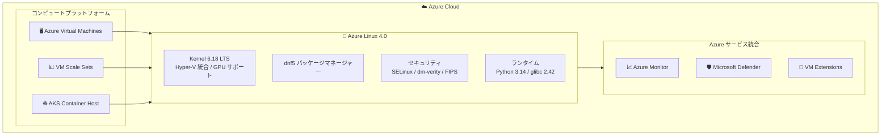

# Azure Linux: Azure Linux 4.0 Public Preview (Build 2026)

**リリース日**: 2026-06-02

**サービス**: Azure Linux

**機能**: Azure Linux 4.0 Public Preview (Build 2026)

**ステータス**: In preview

[このアップデートのインフォグラフィックを見る](https://takech9203.github.io/azure-news-summary/20260602-azure-linux-4.html)

## 概要

Microsoft Build 2026 において、Azure Linux 4.0 のパブリックプレビューが発表された。Azure Linux は Microsoft が開発・メンテナンスするオープンソース Linux ディストリビューションで、Azure 上の仮想マシン (VM)、コンテナ、Kubernetes クラスターで動作する軽量でセキュリティ強化された OS である。

Azure Linux 4.0 は、カーネル 6.18 LTS への更新、新パッケージマネージャー dnf5 の採用、glibc 2.42 や OpenSSL 3.5.4 など主要コンポーネントの大幅なバージョンアップを含むメジャーリリースとなる。従来 CBL-Mariner として知られていた Azure Linux は Fedora エコシステムをベースとし、RPM パッケージの互換性を維持しながら Azure 固有のセキュリティ・コンプライアンス・運用機能を提供する。

本プレビューでは Azure Virtual Machines (VM) および Virtual Machine Scale Sets (VMSS) での利用が可能となり、x86_64 (Gen2) および ARM64 (Gen2) アーキテクチャに対応する。なお、現時点では評価・テスト目的に限定されており、本番環境での利用は推奨されない。

**アップデート前の課題**

- Azure Linux 3.0 のカーネル (6.6 LTS) では最新のハードウェアドライバーや GPU/AI アクセラレータのサポートが限定的だった
- パッケージマネージャー tdnf は依存関係解決が遅く、メモリ使用量が多かった
- glibc や OpenSSL などのコアライブラリが旧バージョンで、最新のセキュリティアルゴリズムや性能最適化が利用できなかった
- Python 3.14 の JIT コンパイラなど最新の言語ランタイム機能が利用できなかった

**アップデート後の改善**

- カーネル 6.18 LTS により新しいハードウェアドライバー、改善された Hyper-V 統合、GPU/AI アクセラレータサポートを提供
- dnf5 パッケージマネージャーにより依存関係解決が高速化し、メモリ使用量が削減
- OpenSSL 3.5.4 でモダンな暗号アルゴリズムに対応し、古い暗号スイートを廃止
- systemd 258.4 による高速ブートシーケンスとサービス管理の改善

## アーキテクチャ図



Azure Linux 4.0 は VM、VMSS、AKS の各コンピュートプラットフォーム上で動作し、Azure Monitor や Microsoft Defender などの Azure サービスとネイティブに統合される。カーネルから上位スタックまで Microsoft が一貫して管理する。

## サービスアップデートの詳細

### 主要機能

1. **カーネル 6.18 LTS**
   - 新しいハードウェアドライバーのサポート
   - Hyper-V ゲスト統合の改善
   - GPU/AI アクセラレータサポートの強化
   - Azure 環境向けのパフォーマンスチューニング
   - カーネルロックダウンによるセキュリティ強化

2. **dnf5 パッケージマネージャー**
   - tdnf からの完全な書き換え
   - 高速な依存関係解決
   - メモリ使用量の削減
   - 既存の tdnf を参照するスクリプトやDockerfile、CI パイプラインは dnf5 または dnf への更新が必要

3. **セキュリティ強化**
   - OpenSSL 3.5.4 によるモダンな暗号アルゴリズム対応
   - dm-verity による検証済みブート
   - SELinux による強制アクセス制御
   - FIPS 140-3 認証取得に向けた作業中 (プレビュー期間中は未認証)

4. **最新のコアライブラリ**
   - glibc 2.42: 文字列操作、メモリ割り当て、スレッドハンドリングの性能向上
   - systemd 258.4: 高速ブートシーケンス、改善されたサービス管理とロギング
   - Python 3.14.3: JIT コンパイラ、新しい構文機能

5. **最小フットプリント**
   - ディスク使用量約 5 GB
   - クラウドワークロードに必要なパッケージのみ搭載
   - 攻撃面の縮小、CVE の削減、高速ブート

## 技術仕様

| 項目 | 詳細 |
|------|------|
| カーネル | 6.18 LTS (Azure 最適化済み) |
| glibc | 2.42 |
| OpenSSL | 3.5.4 |
| systemd | 258.4 |
| Python 3 | 3.14.3 |
| bash | 5.3.9 |
| binutils | 2.45.1 |
| coreutils | 9.7 |
| curl | 8.15.0 |
| util-linux | 2.41.3 |
| rpm | 6.0.1 |
| パッケージマネージャー | dnf5 |
| ディスクサイズ | 5 GB |
| FIPS 140-3 | 認証進行中 (プレビュー中は未認証) |

## 設定方法

### 前提条件

1. Azure サブスクリプション
2. Azure CLI (最新バージョン)
3. Gen2 対応の VM サイズ

### Azure CLI

```bash
# 利用可能なオファーを確認
az vm image list-offers --publisher microsoftazurelinux --location eastus

# Azure Linux 4.0 の SKU を確認
az vm image list-skus --publisher microsoftazurelinux --offer azurelinux-4 --location eastus

# 利用可能なイメージバージョンを確認
az vm image list --publisher microsoftazurelinux --offer azurelinux-4 --sku 4 --all

# Azure Linux 4.0 VM を作成 (x86_64 Gen2)
az vm create \
  --resource-group myResourceGroup \
  --name myAzureLinux4VM \
  --image microsoftazurelinux:azurelinux-4:4:latest \
  --size Standard_D4s_v5 \
  --admin-username azureuser \
  --generate-ssh-keys

# ARM64 VM を作成
az vm create \
  --resource-group myResourceGroup \
  --name myAzureLinux4ARM64VM \
  --image microsoftazurelinux:azurelinux-4:4-arm64:latest \
  --size Standard_D4ps_v5 \
  --admin-username azureuser \
  --generate-ssh-keys
```

### Azure Portal

Azure Portal で VM を作成する際、イメージ選択画面で「microsoftazurelinux」パブリッシャーから「azurelinux-4」オファーを選択して展開できる。

### 利用可能なイメージ URN

| アーキテクチャ | 世代 | URN |
|---------------|------|-----|
| x86_64 | Gen2 | `microsoftazurelinux:azurelinux-4:4:latest` |
| ARM64 | Gen2 | `microsoftazurelinux:azurelinux-4:4-arm64:latest` |
| x86_64 | Gen1 | プレビューでは利用不可 |

## メリット

### ビジネス面

- Microsoft が一貫してサポートするため、サードパーティ Linux ベンダーとの個別契約が不要
- Azure サービスとのネイティブ統合により運用負荷を軽減
- 最小フットプリントによるインフラコスト最適化の可能性
- 予測可能なライフサイクルモデルによる計画的なアップグレード

### 技術面

- カーネル 6.18 LTS による最新ハードウェア (GPU/AI アクセラレータ) のサポート
- dnf5 による高速なパッケージ管理とデプロイ
- CIS Level 1 ベンチマークへの準拠 (AKS 上で唯一の Linux ディストリビューション)
- VM、VMSS、AKS、コンテナイメージで一貫した OS 基盤

## デメリット・制約事項

- 現在パブリックプレビューのため、本番環境での利用は推奨されない
- FIPS 140-3 認証は進行中であり、FIPS 要件のあるワークロードには認証済みリリースを使用する必要がある
- Gen1 VM イメージはプレビューでは利用不可
- tdnf から dnf5 への移行に伴い、既存のスクリプトやCI パイプラインの更新が必要
- Azure シナリオ (VM/VMSS、AKS、コンテナイメージ) のみサポート対象。ベアメタル、オンプレミス、他クラウドは対象外
- カスタマイズイメージは Azure Linux プレビルドイメージ上に構築した場合のみサポート

## ユースケース

### ユースケース 1: AI/ML ワークロード向け GPU VM

**シナリオ**: GPU を活用した AI/ML 推論ワークロードを Azure Linux 4.0 上で実行し、最新のカーネルドライバーと最適化されたパフォーマンスを活用する。

**実装例**:

```bash
# NVIDIA GPU VM で Azure Linux 4.0 を使用
az vm create \
  --resource-group myAIResourceGroup \
  --name myGPUVM \
  --image microsoftazurelinux:azurelinux-4:4:latest \
  --size Standard_NC24ads_A100_v4 \
  --admin-username azureuser \
  --generate-ssh-keys
```

**効果**: カーネル 6.18 LTS の GPU/AI アクセラレータサポートにより、最新の NVIDIA ドライバーとの互換性が向上し、推論パフォーマンスの最適化が期待できる。

### ユースケース 2: ARM64 ベースのコスト効率の高いワークロード

**シナリオ**: ARM64 (Ampere/Cobalt) ベースの VM で Azure Linux 4.0 を実行し、コスト効率の高いインフラを構築する。

**実装例**:

```bash
# ARM64 VM で Azure Linux 4.0 を使用
az vm create \
  --resource-group myARMResourceGroup \
  --name myARM64VM \
  --image microsoftazurelinux:azurelinux-4:4-arm64:latest \
  --size Standard_D4ps_v5 \
  --admin-username azureuser \
  --generate-ssh-keys

# パッケージのインストール (dnf5 を使用)
ssh azureuser@<VM_IP> "sudo dnf install -y nginx"
```

**効果**: ARM64 アーキテクチャの電力効率と Azure Linux 4.0 の最小フットプリントを組み合わせ、コスト効率の高い Web サーバー基盤を実現する。

## 利用可能リージョン

Azure Linux 4.0 プレビューイメージは Azure Marketplace を通じて提供される。利用可能なリージョンの最新情報は以下のコマンドで確認可能:

```bash
az vm image list-offers --publisher microsoftazurelinux --location <region>
```

## サポートされる VM サイズ

Azure Linux 4.0 は以下を含む幅広い Azure VM サイズで動作する:

- 汎用コンピュート SKU (A, Dav#, Dv# シリーズ)
- SGX SKU (DCv2)
- メモリ最適化 (E シリーズ)
- コンピュート最適化 (F シリーズ)
- ストレージ最適化 (L シリーズ)
- ARM64 SKU (v5 Ampere / v6 Cobalt)
- GPU (NVIDIA V100, T4, NC A100 V4, NDasr A100 V4, NDm A100 V4, NCads H100 V5, ND-H100-v5, ND-H200-v5, ND GB200-v6)

## 関連サービス・機能

- **Azure Kubernetes Service (AKS)**: Azure Linux 4.0 は AKS のコンテナホストとしても利用可能。別途 Azure Container Linux (ACL) のイミュータブルバリアントも提供
- **Azure Monitor**: Azure Linux にネイティブ統合され、VM の監視とログ収集が可能
- **Microsoft Defender for Cloud**: セキュリティポスチャ管理とワークロード保護を提供
- **Azure VM Extensions**: Azure Linux 上で各種 VM 拡張機能が利用可能
- **Image Customizer**: Azure Linux プレビルドイメージをベースにカスタマイズされたイメージを自動生成するツール
- **Azure Compute Gallery**: カスタマイズしたイメージを保存し、環境全体で一貫したデプロイを実現

## 参考リンク

- [インフォグラフィック](https://takech9203.github.io/azure-news-summary/20260602-azure-linux-4.html)
- [公式アップデート情報](https://azure.microsoft.com/updates?id=564543)
- [Microsoft Learn - Azure Linux 概要](https://learn.microsoft.com/en-us/azure/azure-linux/azure-linux-overview)
- [Microsoft Learn - Azure Linux 4.0 の新機能](https://learn.microsoft.com/en-us/azure/azure-linux/whats-new-azure-linux-4)
- [Microsoft Learn - Azure Linux VM/VMSS 概要](https://learn.microsoft.com/en-us/azure/azure-linux/azure-linux-vm-vmss-overview)
- [Azure Linux GitHub リポジトリ](https://github.com/microsoft/azurelinux)
- [Azure Linux サポートオプション](https://learn.microsoft.com/en-us/azure/azure-linux/support-options)

## まとめ

Azure Linux 4.0 は、カーネル 6.18 LTS、dnf5 パッケージマネージャー、最新のコアライブラリ群を搭載した次世代のメジャーリリースである。特に GPU/AI アクセラレータサポートの強化と Hyper-V 統合の改善により、AI/ML ワークロードや高性能コンピューティングのユースケースでの利用が期待される。

Solutions Architect としての推奨アクション:
- 開発・テスト環境で Azure Linux 4.0 プレビューを評価し、既存ワークロードとの互換性を確認する
- tdnf を使用している既存スクリプトの dnf5 への移行計画を策定する
- FIPS 140-3 認証が必要なワークロードについては、認証完了まで Azure Linux 3.0 を継続利用する
- GA リリース時のスムーズな移行に備え、プレビュー期間中に検証を進める

---

**タグ**: #AzureLinux #VirtualMachines #VMSS #Linux #OpenSource #Build2026 #Preview #Kernel #Security
