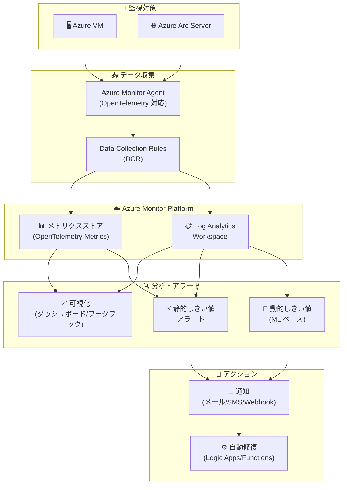

# Azure Monitor: Build 2026 - OpenTelemetry メトリクスとログアラートの動的しきい値

**リリース日**: 2026-06-02

**サービス**: Azure Monitor

**機能**: Build 2026 - OpenTelemetry メトリクスとログアラートの動的しきい値

**ステータス**: Launched (GA)

[このアップデートのインフォグラフィックを見る](https://takech9203.github.io/azure-news-summary/20260602-azure-monitor-build-2026-updates.html)

## 概要

Microsoft Build 2026 において、Azure Monitor に関する 2 つの重要なアップデートが一般提供 (GA) として発表された。1 つ目は Azure VM および Azure Arc 対応サーバーにおける OpenTelemetry メトリクス、可視化、拡張モニタリング機能であり、2 つ目はログ検索アラートにおける動的しきい値 (Dynamic Threshold) のサポートである。

これらのアップデートは、Azure Monitor の監視基盤を大幅に強化するものである。OpenTelemetry メトリクスの統合により、VM およびハイブリッド環境の観測性が業界標準のプロトコルで統一され、動的しきい値によりログベースのアラートルール設定が機械学習によって自動化される。両機能の組み合わせにより、運用チームはより正確かつ効率的な監視体制を構築できるようになる。

**アップデート前の課題**

- VM やハイブリッドサーバーのメトリクス収集がプロプライエタリな方式に依存しており、OpenTelemetry エコシステムとの互換性が限定的だった
- VM insights のパフォーマンスカウンターは事前定義された形式に限られ、カスタムメトリクスの柔軟な収集と可視化が困難だった
- ログ検索アラートでは静的なしきい値を手動で設定する必要があり、季節性やトレンドの変化に対応できずノイズアラートが発生していた
- メトリクスアラートでは動的しきい値が利用できたが、ログ検索アラートでは利用できなかったため、ログベースの監視において適切なしきい値の決定が運用者の経験に依存していた

**アップデート後の改善**

- Azure VM および Arc サーバーから OpenTelemetry 標準のメトリクスを直接収集し、Azure Monitor メトリクスとして統合的に管理できるようになった
- 新しい可視化機能により、OpenTelemetry メトリクスをダッシュボードやワークブックで柔軟に表示できるようになった
- ログ検索アラートで動的しきい値が利用可能になり、機械学習がログクエリ結果の履歴パターンを学習して最適なしきい値を自動計算する
- 動的しきい値により、季節性 (時間帯、曜日) やトレンドを考慮したアラートが設定不要で実現され、誤報の削減と真のアノマリー検出率の向上が達成された

## アーキテクチャ図



Azure VM および Arc サーバーから Azure Monitor Agent 経由で OpenTelemetry メトリクスを収集し、Log Analytics ワークスペースおよびメトリクスストアに格納する。ログ検索アラートでは機械学習ベースの動的しきい値が適用され、パターンに基づいた高精度なアラートが発行される。

## サービスアップデートの詳細

### 1. OpenTelemetry メトリクス、可視化、拡張モニタリング (Azure VM / Arc サーバー)

**ステータス**: Launched (GA)

Azure Monitor Agent が OpenTelemetry メトリクスのネイティブ収集に対応し、Azure VM および Azure Arc 対応サーバーから業界標準の OpenTelemetry 形式でメトリクスを収集・可視化できるようになった。これにより、VM insights の既存機能に加え、より柔軟なカスタムメトリクスの収集と、拡張された可視化エクスペリエンスが提供される。

**主な特徴:**

1. **OpenTelemetry メトリクスのネイティブ収集**
   - Azure Monitor Agent が OpenTelemetry プロトコルに対応
   - Data Collection Rules (DCR) による柔軟なメトリクス収集設定
   - カスタム OpenTelemetry メトリクスの収集サポート

2. **拡張された可視化**
   - OpenTelemetry メトリクスのダッシュボード統合
   - ワークブックでのカスタムビジュアライゼーション
   - VM insights との統合表示

3. **強化されたモニタリング**
   - Azure VM とハイブリッドサーバー (Azure Arc) の統一監視
   - ゲスト OS パフォーマンスデータの OpenTelemetry 形式での収集
   - 既存の VM insights パフォーマンスカウンターとの互換性維持

### 2. ログ検索アラートの動的しきい値 (Dynamic Threshold)

**ステータス**: Launched (GA)

ログ検索アラートルールにおいて、機械学習ベースの動的しきい値が一般提供された。従来メトリクスアラートでのみ利用可能だった動的しきい値が、ログクエリ結果に対しても適用可能になり、ログベースの監視における適切なしきい値設定の自動化が実現された。

**主な特徴:**

1. **機械学習によるしきい値の自動計算**
   - 10 日間の履歴データから時間帯別・日別の季節パターンを学習
   - 3 週間以上のデータが蓄積されると週次パターンも検出
   - 継続的に利用可能な全履歴データを使用して精度を向上

2. **スケーラブルなアラート設定**
   - 1 つのアラートルールで数百のメトリクスシリーズに対応
   - 複数のディメンションや複数リソース (サブスクリプション全体) をカバー
   - しきい値の手動調整が不要

3. **柔軟な感度設定**
   - 高 / 中 / 低の 3 段階のしきい値感度
   - 違反回数の設定による一時的な逸脱の除外
   - プレビューチャートによる設定前のアラート動作確認

## 技術仕様

| 項目 | 詳細 |
|------|------|
| OpenTelemetry - 対応 Agent | Azure Monitor Agent (最新バージョン) |
| OpenTelemetry - 対応 OS | Windows / Linux |
| OpenTelemetry - 対応環境 | Azure VM, Azure Virtual Machine Scale Sets, Azure Arc サーバー |
| OpenTelemetry - データ収集設定 | Data Collection Rules (DCR) |
| 動的しきい値 - 学習期間 (初期) | 最低 3 日間 + 30 サンプル |
| 動的しきい値 - 季節性検出 | 3 週間以上で週次パターン検出 |
| 動的しきい値 - 履歴データ | 10 日間の履歴からしきい値計算 |
| 動的しきい値 - 最小頻度 | 5 分 (1 分頻度は非対応) |
| 動的しきい値 - 感度レベル | 高 / 中 / 低 |
| 動的しきい値 - 複数条件 | 非対応 (単一条件のみ) |

## 設定方法

### 前提条件

1. Azure Monitor Agent がインストール済みであること (Azure VM または Arc サーバー)
2. Data Collection Rule が構成されていること
3. Log Analytics ワークスペースが作成済みであること

### Azure CLI - ログ検索アラート (動的しきい値) の作成

```bash
# ログ検索アラートルールの作成 (動的しきい値)
az monitor scheduled-query create \
  --name "dynamic-log-alert" \
  --resource-group <RESOURCE_GROUP> \
  --scopes <LOG_ANALYTICS_WORKSPACE_ID> \
  --condition "count 'Heartbeat | summarize AggregatedValue = count() by bin(TimeGenerated, 5m)' > dynamic" \
  --condition-query "Heartbeat | summarize AggregatedValue = count() by bin(TimeGenerated, 5m)" \
  --description "Dynamic threshold log search alert" \
  --severity 2 \
  --evaluation-frequency 5m \
  --window-size 5m
```

### Azure Portal - 動的しきい値の設定

1. Azure Portal で **[モニター]** > **[アラート]** > **[+ 作成]** > **[アラート ルール]** を選択
2. スコープとして Log Analytics ワークスペースを選択
3. **[条件]** タブで KQL クエリを入力
4. **[しきい値]** で **[動的]** を選択
5. **[しきい値の感度]** を **[中]** または **[低]** に設定 (ノイズ軽減のため推奨)
6. **[チェック頻度]** と **[ルックバック期間]** を設定 (頻度 <= ルックバック期間)
7. **[詳細オプション]** で違反回数と学習開始日を必要に応じて設定
8. **[プレビュー チャート]** で動的しきい値の動作を確認
9. アクショングループを設定してアラートルールを作成

### Azure Portal - OpenTelemetry メトリクス収集の設定

1. Azure Portal で対象の VM または Arc サーバーに移動
2. **[監視]** > **[データ収集ルール]** を選択
3. 新しい DCR を作成し、OpenTelemetry メトリクスのデータソースを追加
4. 送信先として Azure Monitor メトリクスまたは Log Analytics ワークスペースを指定
5. DCR を対象リソースに関連付け

## メリット

### ビジネス面

- 動的しきい値により誤報アラートが大幅に削減され、運用チームのアラート疲れを軽減し、真に対応が必要なインシデントに集中できる
- OpenTelemetry 標準への準拠により、ベンダーロックインのリスクが軽減され、マルチクラウド・ハイブリッド環境での一貫した監視戦略が実現する
- しきい値の手動調整に費やされていた運用工数が削減され、より戦略的な業務にリソースを割り当てられる
- Azure Arc 連携により、オンプレミスとクラウドの統一監視が実現し、運用の一元化が促進される

### 技術面

- 機械学習による季節性・トレンド検出で、時間帯や曜日による通常変動を考慮した高精度なアノマリー検出が可能
- OpenTelemetry プロトコル対応により、既存の OpenTelemetry SDK やライブラリとの互換性が確保される
- 1 つのアラートルールで数百のメトリクスシリーズを監視でき、アラートルール管理の複雑性が大幅に低減される
- Data Collection Rules による宣言的な設定管理で、Infrastructure as Code との親和性が高い

## デメリット・制約事項

- 動的しきい値は学習期間として最低 3 日間 + 30 サンプルが必要であり、新規リソースでは即座にアラートが発行されない
- ログ検索アラートの動的しきい値で 1 分頻度はサポートされない (最小 5 分)
- 動的しきい値は複数条件のアラートルールでは使用できない
- ゆっくりと進行する劣化 (slow degradation) の検出には向いていない
- データの振る舞いが劇的に変化した場合 (障害など)、しきい値が新しいパターンに適応するまで最大 10 日かかる場合がある
- 週次の季節性が正確に検出されるまでに 3 週間以上のデータ蓄積が必要

## ユースケース

### ユースケース 1: ハイブリッド環境の統一 OpenTelemetry 監視

**シナリオ**: エンタープライズ企業が Azure VM とオンプレミスサーバー (Azure Arc 接続) の両方で重要なビジネスアプリケーションを運行しており、統一された監視基盤を構築したい。

**実装アプローチ**:
- 全サーバーに Azure Monitor Agent をデプロイ
- Data Collection Rules で OpenTelemetry メトリクスの収集を構成
- Azure Monitor ダッシュボードで Azure VM と Arc サーバーを統合表示
- VM insights の拡張ビジュアライゼーションで全体の健全性を一元監視

**効果**: クラウドとオンプレミスの監視ツールを統一し、運用チームの監視業務を一元化。OpenTelemetry 標準により将来的なツール変更にも柔軟に対応可能。

### ユースケース 2: ログベースの異常検知アラート

**シナリオ**: SaaS プラットフォームで、アプリケーションログに記録されるエラー数が通常パターンから逸脱した場合にアラートを発行したいが、時間帯や曜日によってエラー数の正常範囲が大きく異なる。

**実装アプローチ**:

```kusto
// ログ検索クエリの例
AppExceptions
| summarize ExceptionCount = count() by bin(TimeGenerated, 5m)
```

- 上記クエリに動的しきい値を適用
- 感度を「中」に設定し、重大な逸脱のみを検出
- 違反回数を 2 回以上に設定し、一時的なスパイクを除外

**効果**: 平日日中のピーク時と夜間・休日のオフピーク時で異なる正常範囲を自動的に学習し、真のアノマリーのみを通知。静的しきい値と比較してアラートノイズを大幅に削減。

### ユースケース 3: スケーラブルなインフラ監視

**シナリオ**: 大規模な Azure 環境で数百台の VM を運用しており、各 VM に対して個別にアラートしきい値を設定・維持することが運用負荷となっている。

**実装アプローチ**:
- OpenTelemetry メトリクスで全 VM のパフォーマンスデータを統一的に収集
- サブスクリプションスコープの動的しきい値アラートルールを 1 つ作成
- Computer ディメンションで分割し、各 VM の個別パターンを自動学習

**効果**: 1 つのアラートルールで数百台の VM を監視。各 VM 固有の使用パターンが自動的に学習され、個別のしきい値設定が不要に。

## 利用可能リージョン

Azure Monitor Agent および動的しきい値は Azure Monitor がサポートするすべてのパブリックリージョンで利用可能。Azure Arc サーバーについては、Azure Arc がサポートされているリージョンで利用可能。

詳細なリージョン可用性:
- [Azure Monitor のリージョン可用性](https://azure.microsoft.com/explore/global-infrastructure/products-by-region/?products=monitor)
- [Azure Arc のリージョン可用性](https://azure.microsoft.com/explore/global-infrastructure/products-by-region/?products=azure-arc)

## 関連サービス・機能

- **Azure Monitor Agent**: OpenTelemetry メトリクスの収集を行うエージェント。VM および Arc サーバーにインストール
- **Log Analytics ワークスペース**: ログデータの格納先であり、ログ検索アラートのクエリ対象
- **VM insights**: VM の監視に特化した Azure Monitor の機能。OpenTelemetry メトリクスと統合
- **Azure Arc**: オンプレミスおよび他クラウドのサーバーを Azure 管理プレーンに接続
- **Data Collection Rules (DCR)**: Azure Monitor Agent のデータ収集を宣言的に定義
- **Azure Monitor メトリクス**: 時系列メトリクスデータの格納・クエリ基盤
- **Azure Workbooks**: カスタム可視化レポートの作成ツール
- **Action Groups**: アラート発行時のアクション (通知・自動修復) を定義

## 参考リンク

- [インフォグラフィック](https://takech9203.github.io/azure-news-summary/20260602-azure-monitor-build-2026-updates.html)
- [OpenTelemetry Metrics, Visualizations, and Enhanced Monitoring in Azure Monitor for Azure VMs and Arc Servers](https://azure.microsoft.com/updates?id=564802)
- [Dynamic threshold for Log search alerts](https://azure.microsoft.com/updates?id=561984)
- [Microsoft Learn - Monitor virtual machines with Azure Monitor](https://learn.microsoft.com/azure/azure-monitor/vm/monitor-virtual-machine)
- [Microsoft Learn - Dynamic thresholds for Log search alerts](https://learn.microsoft.com/azure/azure-monitor/alerts/alerts-dynamic-thresholds)
- [Microsoft Learn - Azure Monitor Agent overview](https://learn.microsoft.com/azure/azure-monitor/agents/azure-monitor-agent-overview)
- [Microsoft Learn - Data Collection Rules](https://learn.microsoft.com/azure/azure-monitor/essentials/data-collection-rule-overview)
- [Azure Monitor 料金](https://azure.microsoft.com/pricing/details/monitor/)

## まとめ

Build 2026 における Azure Monitor のアップデートは、監視基盤の 2 つの重要な課題を解決するものである。OpenTelemetry メトリクスの GA により、Azure VM とハイブリッドサーバーの監視が業界標準プロトコルに統一され、ベンダーニュートラルな観測性が実現した。ログ検索アラートの動的しきい値 GA により、ログベース監視における「適切なしきい値の決定」という長年の運用課題が機械学習によって自動化された。

**推奨される次のアクション:**

1. Azure VM および Arc サーバーで Azure Monitor Agent を最新バージョンに更新し、OpenTelemetry メトリクス収集を有効化する
2. 既存の静的しきい値ログ検索アラートを棚卸しし、動的しきい値への移行候補を特定する (特にトラフィックパターンに季節性があるもの)
3. 動的しきい値のプレビューチャート機能を活用し、本番適用前にアラート動作を検証する
4. ハイブリッド環境がある場合、Azure Arc 接続サーバーへの OpenTelemetry メトリクス展開を計画する

---

**タグ**: #AzureMonitor #OpenTelemetry #DynamicThreshold #LogSearchAlerts #VMMonitoring #AzureArc #MachineLearning #Observability #MicrosoftBuild2026 #DataCollectionRules
