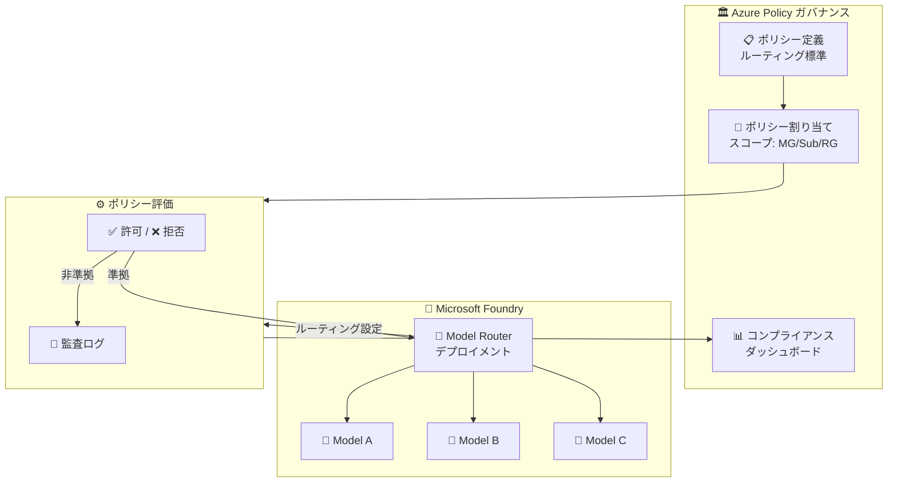

# Azure Policy / Microsoft Foundry: Model Router 向け Azure Policy ガバナンス プレビュー

**リリース日**: 2026-06-02

**サービス**: Azure Policy / Microsoft Foundry

**機能**: Model Router 向け Azure Policy ガバナンス プレビュー

**ステータス**: In preview

[このアップデートのインフォグラフィックを見る](https://takech9203.github.io/azure-news-summary/20260602-azure-policy-model-router.html)

## 概要

Microsoft Build 2026 で発表されたこのアップデートにより、Azure Policy が Microsoft Foundry Models の Model Router を使用するデプロイメントに対して、一元的なガバナンス機能を提供するようになった。

Model Router は、Microsoft Foundry のデプロイメントタイプの 1 つであり、リクエストを複数の AI モデル間でインテリジェントにルーティングする機能を提供する。今回のアップデートにより、組織は Azure Policy を使用して、Model Router によるモデル選択に対するルーティング標準を定義・強制できるようになった。これにより、モデルの選択がセキュリティ、コンプライアンス、運用要件に確実に準拠するようになる。

Azure Policy は既に Foundry Models のデプロイメントタイプ (Global Standard、Provisioned、DataZone など) の制限に対応しているが、今回の拡張により Model Router の構成に対してもポリシーベースのガバナンスが適用可能となった。

**アップデート前の課題**

- Model Router を使用するデプロイメントに対して、組織全体でルーティング標準を一元管理する仕組みがなかった
- モデル選択がセキュリティ・コンプライアンス要件に沿っているかの自動検証ができなかった
- 個々のデプロイメントに対して手動でルーティングポリシーを確認する必要があり、大規模環境での管理が困難だった

**アップデート後の改善**

- Azure Policy により Model Router のルーティング標準を組織全体で定義・強制可能になった
- モデル選択がセキュリティ・コンプライアンス・運用要件に準拠しているかを自動評価できるようになった
- 管理グループやサブスクリプション単位での一元的なガバナンスにより、大規模環境でも一貫性を維持できるようになった

## アーキテクチャ図



Azure Policy がポリシー定義に基づいて Model Router のデプロイメントを評価し、ルーティング標準に準拠しないデプロイメントを拒否または監査する。コンプライアンスダッシュボードで組織全体の準拠状況を可視化できる。

## サービスアップデートの詳細

### 主要機能

1. **Model Router 向けポリシー定義**
   - Model Router デプロイメントのルーティング構成に対してポリシールールを定義可能
   - `Microsoft.CognitiveServices/accounts/deployments` リソースタイプのプロパティに基づくポリシー条件の設定

2. **一元的なルーティング標準の強制**
   - 管理グループ、サブスクリプション、リソースグループの各スコープでポリシーを割り当て可能
   - 組織全体で一貫したモデルルーティング標準を適用

3. **コンプライアンス評価と監査**
   - デプロイメント時およびポリシー評価サイクル (24 時間) で自動的に準拠状態を評価
   - 非準拠リソースの特定とコンプライアンスダッシュボードでの可視化

4. **複数のポリシー効果のサポート**
   - `Deny`: 非準拠のデプロイメントを拒否
   - `Audit`: 非準拠のデプロイメントを監査ログに記録 (既存リソースへの影響なし)
   - `AuditIfNotExists`: 特定の構成が存在しない場合に監査

## 技術仕様

| 項目 | 詳細 |
|------|------|
| ステータス | パブリック プレビュー |
| リソースタイプ | `Microsoft.CognitiveServices/accounts/deployments` |
| ポリシーモード | `All` (全リソースタイプ評価) |
| 評価タイミング | デプロイメント作成/更新時、24 時間周期 |
| 対象サービス | Microsoft Foundry Models (Model Router デプロイメント) |
| SKU フィールド | `Microsoft.CognitiveServices/accounts/deployments/sku.name` |

## 設定方法

### 前提条件

1. Azure サブスクリプション
2. Microsoft Foundry (旧 Azure AI Foundry) リソースが利用可能
3. Azure Policy の書き込み権限 (`Microsoft.Authorization/policyAssignments/write`)
4. `Resource Policy Contributor` または `Owner` ロール

### ポリシー定義の例

以下は、特定のデプロイメントタイプを制限するポリシー定義の例である (Foundry Models 公式ドキュメントから引用):

```json
{
    "mode": "All",
    "policyRule": {
        "if": {
            "allOf": [
                {
                    "field": "type",
                    "equals": "Microsoft.CognitiveServices/accounts/deployments"
                },
                {
                    "field": "Microsoft.CognitiveServices/accounts/deployments/sku.name",
                    "equals": "GlobalStandard"
                }
            ]
        },
        "then": {
            "effect": "deny"
        }
    }
}
```

### Azure Portal

1. Azure Portal で「ポリシー」に移動
2. 「定義」からカスタムポリシー定義を作成、または組み込みポリシーを検索
3. Model Router 関連のポリシーを選択し、対象スコープに割り当て
4. パラメータ (許可するモデル、ルーティングルールなど) を設定
5. 「コンプライアンス」ダッシュボードで準拠状況を確認

## メリット

### ビジネス面

- コンプライアンス要件 (データ主権、業界規制) への準拠を組織全体で自動的に保証
- セキュリティリスクの軽減: 承認されていないモデルへのルーティングを防止
- 監査対応: ポリシー準拠状況の自動レポートにより監査負荷を軽減

### 技術面

- インフラストラクチャ・アズ・コード (IaC) との統合: ポリシー定義を ARM テンプレートや Bicep で管理可能
- スケーラブルなガバナンス: 管理グループ階層を活用した大規模環境での一元管理
- 既存の Azure Policy エコシステムとの統合: 他の Azure リソースと同じガバナンスフレームワークを使用

## デメリット・制約事項

- パブリック プレビューのため、SLA は提供されない
- プレビュー期間中はポリシー定義や動作が変更される可能性がある
- `Microsoft.MachineLearningServices.v2.Data` リソースプロバイダーモードはプレビュー中、コンプライアンスレコードの保持期間が 24 時間に制限される場合がある
- ポリシー割り当て前に存在していたデプロイメントについてはコンプライアンスレポートが即時に反映されない可能性がある

## ユースケース

### ユースケース 1: 規制産業でのモデル使用制限

**シナリオ**: 金融機関が、規制要件により特定の承認済みモデルのみを使用し、データ処理を特定のリージョンに限定する必要がある。

**効果**: Azure Policy によりグローバルデプロイメントタイプを禁止し、DataZone または Standard (リージョン) のみを許可することで、データ主権要件を自動的に強制。

### ユースケース 2: コスト管理のためのデプロイメントタイプ制限

**シナリオ**: 開発チームが Provisioned (予約容量) デプロイメントを無制限に作成し、予算超過が発生している。

**効果**: Azure Policy で Provisioned 系のデプロイメントタイプを特定のリソースグループに限定し、開発環境では Standard (従量課金) のみを許可するポリシーを適用。

### ユースケース 3: セキュリティ承認済みモデルのみへのルーティング

**シナリオ**: セキュリティチームが評価・承認したモデルのみを本番環境で使用する必要がある。

**効果**: Model Router のルーティング先を承認済みモデルのリストに限定するポリシーを定義し、未承認モデルへのルーティングを自動的に拒否。

## 料金

Azure Policy 自体は無料で利用可能。ポリシーの定義、割り当て、コンプライアンス評価に追加料金は発生しない。Model Router を含む Foundry Models のデプロイメント料金は、選択するデプロイメントタイプ (Standard: 従量課金、Provisioned: PTU 予約) に基づいて課金される。

詳細は [Azure Policy 料金ページ](https://azure.microsoft.com/pricing/details/azure-policy/) および [Foundry Models 料金ページ](https://azure.microsoft.com/pricing/details/cognitive-services/openai-service/) を参照。

## 関連サービス・機能

- **Azure Policy**: Azure リソースの組織標準への準拠を評価・強制するガバナンスサービス。本アップデートの基盤
- **Microsoft Foundry Models**: AI モデルのデプロイメントとルーティングを提供するプラットフォーム。Model Router はその機能の 1 つ
- **Azure RBAC**: Azure Policy と組み合わせて、アクセス制御とリソース構成の両面からガバナンスを実現
- **Microsoft Defender for Cloud**: セキュリティポリシーの推奨事項と Azure Policy の統合による AI ワークロードの保護
- **Azure Monitor**: ポリシー評価結果の監視とアラート設定

## 参考リンク

- [インフォグラフィック](https://takech9203.github.io/azure-news-summary/20260602-azure-policy-model-router.html)
- [公式アップデート情報](https://azure.microsoft.com/updates?id=563636)
- [Microsoft Learn - Azure Policy 概要](https://learn.microsoft.com/azure/governance/policy/overview)
- [Microsoft Learn - Foundry Models デプロイメントタイプ](https://learn.microsoft.com/azure/foundry/foundry-models/concepts/deployment-types)
- [Microsoft Learn - Azure Policy 定義構造](https://learn.microsoft.com/azure/governance/policy/concepts/definition-structure-basics)
- [Azure Policy 料金](https://azure.microsoft.com/pricing/details/azure-policy/)

## まとめ

Azure Policy の Model Router 対応は、AI ワークロードのガバナンスを既存の Azure ガバナンスフレームワークに統合する重要なアップデートである。特に規制産業やエンタープライズ環境において、AI モデルの選択とルーティングに対する組織全体の標準を自動的に強制できるようになったことは大きな進歩である。

パブリック プレビューの段階であるため、本番環境への適用前に十分な検証を行うことを推奨する。推奨される次のアクションとして、まず `audit` 効果でポリシーを割り当て、現在のデプロイメント状況を把握した上で、段階的に `deny` 効果へ移行する approach が望ましい。

---

**タグ**: #AzurePolicy #MicrosoftFoundry #ModelRouter #AIGovernance #Compliance #Preview #Build2026
