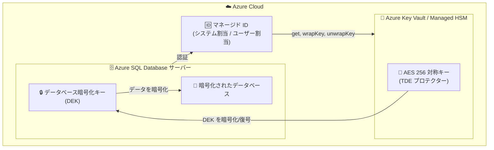

# Azure SQL Database: TDE AES 256 対称キー サポート (プレビュー)

**リリース日**: 2026-06-02

**サービス**: Azure SQL Database

**機能**: TDE AES 256 対称キー サポート (プレビュー)

**ステータス**: In preview

[このアップデートのインフォグラフィックを見る](https://takech9203.github.io/azure-news-summary/20260602-azure-sql-early-june-tde-aes256.html)

## 概要

2026 年 6 月初旬、Azure SQL Database の Transparent Data Encryption (TDE) において、カスタマー マネージド キー (CMK) として AES 256 対称キーが使用可能になった (パブリック プレビュー)。従来は RSA 非対称キーのみがサポートされていたが、今回のアップデートにより対称暗号アルゴリズムである AES キーも TDE プロテクターとして構成できるようになった。

この機能強化は、Microsoft の量子安全セキュリティ戦略の一環として位置づけられている。RSA などの公開鍵暗号アルゴリズムは将来の大規模量子コンピューティングの進展に対して脆弱になる可能性があるが、AES のような対称暗号は十分な鍵サイズを使用すれば量子耐性があると考えられている。

Build 2026 で発表されたこのアップデートにより、Azure SQL Database ユーザーは長期的な暗号耐性計画に沿ったキー管理戦略を採用できるようになる。

**アップデート前の課題**

- TDE のカスタマー マネージド キーとして使用できるのは RSA 非対称キー (2048 ビットおよび 3072 ビット) のみだった
- 量子コンピューティングの進展に対する暗号耐性の長期計画において、対称キーオプションが利用できなかった
- 暗号のアジリティ (crypto-agility) を実現するためのキータイプの選択肢が限られていた

**アップデート後の改善**

- AES 対称キー (128 ビット、192 ビット、256 ビット) を TDE プロテクターとして使用可能になった
- 量子耐性のある対称暗号アルゴリズムを選択できるようになった
- RSA キーから AES キーへ、または AES キーから RSA キーへのローテーションが可能になった

## アーキテクチャ図



Azure SQL Database サーバーがマネージド ID を使用して Azure Key Vault または Managed HSM にアクセスし、AES 256 対称キーで DEK (データベース暗号化キー) のラップ/アンラップ操作を実行する。DEK は実際のデータベースデータの暗号化に使用される。

## サービスアップデートの詳細

### 主要機能

1. **AES 対称キーによる TDE プロテクター構成**
   - Azure Key Vault Managed HSM に格納された AES キーを TDE プロテクターとして設定可能
   - サポートされるキーサイズ: 128 ビット、192 ビット、256 ビット

2. **キータイプ間のローテーション**
   - 既存の RSA 非対称キーから AES 対称キーへの切り替えが可能
   - AES 対称キーから RSA 非対称キーへの切り替えも可能
   - オンライン操作として数秒で完了

3. **量子耐性セキュリティ**
   - AES 256 は十分なキーサイズにより量子コンピューティングに対して耐性がある
   - Microsoft の量子安全セキュリティ戦略および暗号アジリティの方針に沿った機能

4. **既存の TDE 機能との互換性**
   - 自動キーローテーション機能に対応
   - バージョンレスキー識別子をサポート
   - Azure Policy による強制も適用可能

## 技術仕様

| 項目 | 詳細 |
|------|------|
| 対応キータイプ | AES (対称キー) |
| サポートされるキーサイズ | 128 ビット、192 ビット、256 ビット |
| キー格納場所 | Azure Key Vault Managed HSM |
| 対象サービス | Azure SQL Database のみ (プレビュー時点) |
| 非対称キー (従来) | RSA 2048 ビット、3072 ビット (Key Vault / Managed HSM) |
| キーローテーション | 手動および自動ローテーション対応 |
| 必要なキー権限 | get, wrapKey, unwrapKey |
| 認証方式 | マネージド ID (システム割当 / ユーザー割当) |

## 設定方法

### 前提条件

1. Azure Key Vault Managed HSM が作成済みであること
2. Managed HSM でソフト削除およびパージ保護が有効であること
3. Azure SQL Database サーバーにマネージド ID が割り当てられていること
4. マネージド ID に対して Managed HSM Crypto Service Encryption User ロールが付与されていること
5. AES キーが Managed HSM 内に作成またはインポート済みであること

### Azure CLI

```bash
# サーバーの作成 (マネージド ID 付き)
az sql server create --name <servername> --resource-group <rgname> \
  --location <location> --admin-user <user> --admin-password <password> \
  --assign-identity

# Managed HSM にキーを追加してサーバーに設定
az sql server key create --server <servername> --resource-group <rgname> \
  --kid <keyID>

# TDE プロテクターとして設定
az sql server tde-key set --server <servername> \
  --server-key-type AzureKeyVault --resource-group <rgname> --kid <keyID>

# TDE を有効化
az sql db tde set --database <dbname> --server <servername> \
  --resource-group <rgname> --status Enabled
```

### PowerShell

```powershell
# サーバーにマネージド ID を割り当て
$server = Set-AzSqlServer -ResourceGroupName <rgname> -ServerName <servername> -AssignIdentity

# Key Vault キーをサーバーに追加
Add-AzSqlServerKeyVaultKey -ResourceGroupName <rgname> -ServerName <servername> -KeyId <KeyVaultKeyId>

# TDE プロテクターとして設定
Set-AzSqlServerTransparentDataEncryptionProtector -ResourceGroupName <rgname> `
  -ServerName <servername> -Type AzureKeyVault -KeyId <KeyVaultKeyId>

# TDE を有効化
Set-AzSqlDatabaseTransparentDataEncryption -ResourceGroupName <rgname> `
  -ServerName <servername> -DatabaseName <dbname> -State "Enabled"
```

## メリット

### ビジネス面

- 量子コンピューティング時代に向けた暗号化戦略の早期準備が可能
- コンプライアンス要件で対称暗号を求められる場合への対応
- 暗号アジリティの実現により、将来の暗号基準変更への柔軟な対応が可能

### 技術面

- AES 256 は量子耐性があり、長期的なデータ保護に適している
- 既存の TDE インフラストラクチャとシームレスに統合
- キータイプ間のオンラインローテーションにより、ダウンタイムなしで暗号方式を変更可能
- 自動キーローテーション機能との組み合わせでゼロタッチ運用が可能

## デメリット・制約事項

- 現時点では Azure SQL Database のみが対象 (Azure SQL Managed Instance および Azure Synapse Analytics は未対応)
- パブリック プレビューのため SLA の対象外であり、本番環境での使用は推奨されない
- 対称キー (AES) は Azure Key Vault Managed HSM にのみ格納可能
- リージョンおよびサービス展開状況により、利用可能になるタイミングが異なる場合がある
- オンプレミス HSM からインポートしたキーについては、初回インポート後のキーライフサイクル操作は Azure Key Vault または Managed HSM 内で行う必要がある
- ローカルバックアップの維持が顧客の責任となる (復旧・再検証シナリオのため)
- Geo レプリケーション構成では、プライマリとセカンダリの両方のサーバーがキーにアクセスできる必要がある

## ユースケース

### ユースケース 1: 量子耐性暗号化への移行

**シナリオ**: 金融機関が長期的なデータ保護戦略として、量子コンピューティングの脅威に備えて RSA ベースの TDE から AES 256 ベースの TDE へ移行する。

**効果**: 将来の量子コンピューティングの進展に対して暗号化データの安全性を確保し、規制要件への先行対応が可能になる。

### ユースケース 2: 暗号アジリティの実現

**シナリオ**: 企業が暗号化方式の柔軟な切り替えを求められており、RSA と AES の間でキータイプをローテーションする運用を構築する。

**効果**: ダウンタイムなしでキータイプの変更が可能になり、暗号基準の変更に迅速に対応できる体制を構築できる。

## 料金

TDE のカスタマー マネージド キー機能自体には追加料金は発生しない。ただし、以下のコストが発生する:

- Azure Key Vault Managed HSM の利用料金
- キー操作 (wrapKey, unwrapKey) に対するトランザクション料金

詳細な料金については以下を参照:
- [Azure Key Vault の料金](https://azure.microsoft.com/pricing/details/key-vault/)
- [Azure SQL Database の料金](https://azure.microsoft.com/pricing/details/azure-sql-database/single/)

## 利用可能リージョン

パブリック プレビュー段階のため、利用可能リージョンは段階的に展開される。リージョンおよびサービス展開状況により、利用可能になるタイミングが異なる場合がある。最新のリージョン対応状況については公式ドキュメントを確認すること。

## 関連サービス・機能

- **Azure Key Vault Managed HSM**: AES 対称キーを格納するための FIPS 140-2 Level 3 準拠のマネージド HSM サービス
- **Azure Key Vault**: RSA 非対称キーの格納に使用 (FIPS 140-2 Level 2 準拠)
- **Microsoft Entra ID**: マネージド ID による認証基盤
- **Azure Monitor**: Key Vault の監査イベントログの監視・アラート
- **Azure Policy**: カスタマー マネージド TDE の強制ポリシー適用

## 参考リンク

- [インフォグラフィック](https://takech9203.github.io/azure-news-summary/20260602-azure-sql-early-june-tde-aes256.html)
- [公式アップデート情報](https://azure.microsoft.com/updates?id=563142)
- [TDE with customer-managed keys overview - Microsoft Learn](https://learn.microsoft.com/en-us/azure/azure-sql/database/transparent-data-encryption-byok-overview)
- [Enable SQL TDE with Azure Key Vault - Microsoft Learn](https://learn.microsoft.com/en-us/azure/azure-sql/database/transparent-data-encryption-byok-configure)
- [Azure Key Vault Managed HSM の料金](https://azure.microsoft.com/pricing/details/key-vault/)

## まとめ

Azure SQL Database の TDE で AES 256 対称キーがカスタマー マネージド キーとして利用可能になったことは、量子コンピューティング時代に備えた暗号化戦略の重要な一歩である。現時点ではパブリック プレビューであり Azure SQL Database のみが対象だが、Microsoft の量子安全セキュリティ戦略に沿った機能として、早期に検証環境での評価を開始することを推奨する。

**推奨される次のアクション:**
- 非本番環境で AES 256 対称キーによる TDE 構成を検証する
- 既存の暗号化戦略における量子耐性要件を評価する
- Azure Key Vault Managed HSM の導入を検討する (未導入の場合)
- GA 時点での本番環境への適用計画を策定する

---

**タグ**: #AzureSQL #TDE #暗号化 #カスタマーマネージドキー #AES256 #量子耐性 #セキュリティ #パブリックプレビュー #Build2026
