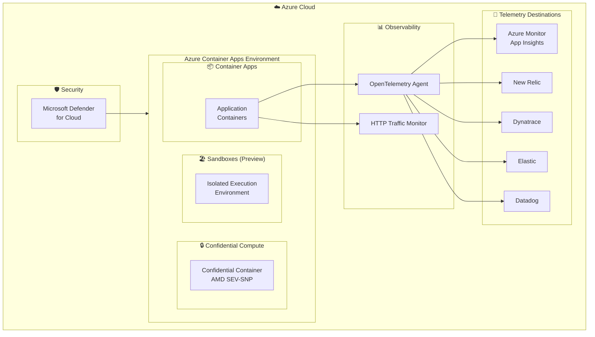

# Azure Container Apps: Build 2026 - Confidential Computing とオブザーバビリティ強化

**リリース日**: 2026-06-02

**サービス**: Azure Container Apps

**機能**: Build 2026 - Confidential Computing とオブザーバビリティ強化

**ステータス**: Launched (GA) / In preview

[このアップデートのインフォグラフィックを見る](https://takech9203.github.io/azure-news-summary/20260602-container-apps-build-2026-updates.html)

## 概要

Microsoft Build 2026 において、Azure Container Apps に関する複数の重要なアップデートが発表された。Confidential Compute サポートの GA、HTTP トラフィックモニタリング、OpenTelemetry の追加送信先サポート (New Relic、Dynatrace、Elastic) が一般提供となり、さらに Azure Container Apps Sandboxes がプレビューとして公開された。加えて、Microsoft Defender for Cloud による Container Apps のセキュリティポスチャ管理サポートも発表されている。

これらのアップデートは、コンテナアプリケーションのセキュリティ (Confidential Compute)、可観測性 (OpenTelemetry 拡張・HTTP トラフィック監視)、および開発者体験 (Sandboxes) の 3 つの軸で大幅な強化を行うものであり、エンタープライズワークロードへの Container Apps 採用を加速させる内容となっている。

**アップデート前の課題**

- コンテナ実行時のメモリ内データを暗号化で保護する手段がなく、機密性の高いワークロードでは Container Apps の採用が困難だった
- HTTP トラフィックの詳細な監視には、アプリケーション側での独自実装やサイドカーの追加が必要だった
- OpenTelemetry データの送信先が Azure Monitor Application Insights、Datadog、汎用 OTLP エンドポイントに限定されており、New Relic・Dynatrace・Elastic を使用するチームは追加の設定作業が必要だった
- AI エージェントやコード実行のための安全なサンドボックス環境を Container Apps 上で簡単に構築する方法がなかった
- Container Apps に対する統合的なセキュリティポスチャ管理がなかった

**アップデート後の改善**

- AMD SEV-SNP ベースの Confidential Compute により、実行中のコンテナのメモリが暗号化され、ハードウェアレベルで機密データが保護される
- プラットフォームレベルでの HTTP トラフィックモニタリングにより、コード変更なしでリクエスト/レスポンスの詳細な可視化が可能になった
- New Relic、Dynatrace、Elastic がファーストクラスの送信先として追加され、既存のオブザーバビリティスタックとのシームレスな統合が実現した
- Container Apps Sandboxes により、AI エージェントの安全なコード実行環境が簡単に構築可能になった
- Microsoft Defender for Cloud によるサーバーレスコンテナのポスチャ管理で、脆弱性評価と構成監査が統合的に実施可能になった

## アーキテクチャ図



Azure Container Apps Environment において、Confidential Compute、Sandboxes、拡張されたオブザーバビリティ、そして Defender for Cloud によるセキュリティポスチャ管理が統合的に提供される構成を示している。

## サービスアップデートの詳細

### 1. Confidential Compute サポート (GA)

**ステータス**: Launched (GA)

AMD SEV-SNP (Secure Encrypted Virtualization - Secure Nested Paging) テクノロジーを活用し、コンテナ実行時のメモリを暗号化する。これにより、ホスト OS やハイパーバイザーからもコンテナ内のデータにアクセスできなくなり、ハードウェアレベルでの機密性保護が実現される。

**主な特徴:**
- AMD SEV-SNP によるメモリ暗号化
- ハードウェアベースのアテステーション (リモート証明)
- 既存のコンテナイメージをそのまま利用可能 (Lift & Shift)
- 規制要件 (HIPAA、PCI DSS、GDPR) への準拠を支援

**ユースケース:**
- 金融機関における機密取引データの処理
- 医療機関における患者データの分析
- マルチテナント環境でのデータ分離
- 機密性の高い AI/ML 推論処理

### 2. HTTP トラフィックモニタリング (GA)

**ステータス**: Launched (GA)

Azure Container Apps のプラットフォームレベルで HTTP トラフィックを監視する機能が一般提供された。アプリケーションコードの変更なしに、リクエスト/レスポンスの詳細なメトリクスとログを取得できる。

**主な特徴:**
- リクエスト数、レスポンスコード、レイテンシの自動収集
- プラットフォームレベルでの計測 (SDK 不要)
- Azure Monitor メトリクスとの統合
- リビジョン別・レプリカ別のトラフィック分析

### 3. OpenTelemetry 追加送信先サポート (GA)

**ステータス**: Launched (GA)

マネージド OpenTelemetry エージェントの送信先として、New Relic、Dynatrace、Elastic が公式にサポートされた。従来は汎用 OTLP エンドポイントとして設定する必要があったが、ファーストクラスの統合により設定が簡素化される。

**既存のサポート済み送信先:**
- Azure Monitor Application Insights
- Datadog
- 汎用 OTLP エンドポイント

**新規追加送信先:**
- New Relic
- Dynatrace
- Elastic (Elasticsearch / Elastic Observability)

**送信可能なデータタイプ:**

| 送信先 | ログ | メトリクス | トレース |
|--------|------|-----------|---------|
| Azure App Insights | Yes | No | Yes |
| Datadog | Yes | Yes | Yes |
| OTLP エンドポイント | Yes | Yes | Yes |
| New Relic | Yes | Yes | Yes |
| Dynatrace | Yes | Yes | Yes |
| Elastic | Yes | Yes | Yes |

### 4. Azure Container Apps Sandboxes (Preview)

**ステータス**: In preview

AI エージェントや LLM アプリケーションが生成したコードを安全に実行するための隔離されたサンドボックス環境を提供する。コンテナレベルでの分離により、信頼されていないコードの実行によるセキュリティリスクを軽減する。

**主な特徴:**
- AI エージェントのためのセキュアなコード実行環境
- コンテナレベルの分離によるセキュリティ境界
- 短命 (Ephemeral) な実行環境
- LLM が生成したコードの安全な実行

**ユースケース:**
- AI コーディングアシスタントのコード実行
- データ分析エージェントによる動的クエリ実行
- ユーザー提供コードの安全なサンドボックス実行
- 教育プラットフォームでのコード評価

### 5. Microsoft Defender for Cloud - Container Apps サポート (GA)

**ステータス**: Launched (GA)

Microsoft Defender for Cloud のサーバーレスコンテナポスチャ管理が Azure Container Apps をサポートし、コンテナイメージの脆弱性評価、セキュリティ構成の監査、ランタイム脅威検出が統合的に提供される。

**主な機能:**
- エージェントレスの脆弱性評価 (コンテナイメージのスキャン)
- セキュリティポスチャ管理 (構成ミスの検出と修正ガイダンス)
- MITRE ATT&CK フレームワークへのマッピング
- Microsoft Defender XDR との統合によるインシデント調査

## 技術仕様

| 項目 | 詳細 |
|------|------|
| Confidential Compute - ハードウェア | AMD SEV-SNP |
| Confidential Compute - アテステーション | ハードウェアベースのリモート証明 |
| OpenTelemetry Agent - CPU | 0.5 vCPU (固定) |
| OpenTelemetry Agent - メモリ | 1.5 GB RAM (固定) |
| OpenTelemetry Agent - プロトコル | gRPC のみ |
| OpenTelemetry Agent - レプリカ | シングルレプリカ (固定) |
| Sandboxes - 分離レベル | コンテナレベル |
| Defender for Cloud - スキャン | エージェントレス、日次再スキャン |

## 設定方法

### OpenTelemetry 送信先の追加 (Azure CLI)

```bash
# New Relic への OTLP エンドポイント設定例
az containerapp env telemetry otlp add \
  --resource-group <RESOURCE_GROUP_NAME> \
  --name <ENVIRONMENT_NAME> \
  --otlp-name "newrelic" \
  --endpoint "https://otlp.nr-data.net:4317" \
  --insecure false \
  --headers "api-key=<NEW_RELIC_LICENSE_KEY>" \
  --enable-open-telemetry-traces true \
  --enable-open-telemetry-metrics true \
  --enable-open-telemetry-logs true
```

### OpenTelemetry 送信先の追加 (Bicep)

```bicep
resource environment 'Microsoft.App/managedEnvironments@2024-10-02-preview' = {
  name: environmentName
  location: location
  properties: {
    openTelemetryConfiguration: {
      destinationsConfiguration: {
        otlpConfigurations: [
          {
            name: 'newrelic'
            endpoint: 'https://otlp.nr-data.net:4317'
            insecure: false
            headers: 'api-key=<NEW_RELIC_LICENSE_KEY>'
          }
          {
            name: 'dynatrace'
            endpoint: 'https://<ENVIRONMENT_ID>.live.dynatrace.com/api/v2/otlp'
            insecure: false
            headers: 'Authorization=Api-Token <DYNATRACE_TOKEN>'
          }
        ]
      }
      tracesConfiguration: {
        destinations: ['newrelic', 'dynatrace']
      }
      logsConfiguration: {
        destinations: ['newrelic', 'dynatrace']
      }
      metricsConfiguration: {
        destinations: ['newrelic', 'dynatrace']
      }
    }
  }
}
```

## メリット

### ビジネス面

- Confidential Compute により、規制要件の厳しい業界 (金融、医療、公共) でも Container Apps の採用が可能になる
- マルチベンダーのオブザーバビリティツールとの統合により、既存投資を活かしたクラウド移行が容易になる
- Sandboxes により、AI エージェントの安全な本番運用が実現し、AI ビジネスの加速に寄与する
- Defender for Cloud 統合により、セキュリティとコンプライアンスの運用コストが削減される

### 技術面

- AMD SEV-SNP によるハードウェアレベルの分離で、ソフトウェアのみの暗号化よりも高い信頼性を提供
- マネージド OpenTelemetry エージェントにより、テレメトリ収集のインフラ管理が不要
- プラットフォームレベルの HTTP モニタリングで、アプリケーションコードへの侵入を最小化
- コンテナレベルのサンドボックス分離により、VM ベースの分離よりも軽量かつ高速なセキュリティ境界を提供

## デメリット・制約事項

- OpenTelemetry マネージドエージェントはシングルレプリカで動作し、高可用性構成は現在サポートされていない
- OpenTelemetry エージェントは gRPC プロトコルのみをサポート (HTTP/protobuf は非対応)
- OpenTelemetry の設定は環境レベルで適用され、アプリ単位でデータの送信先を分けることはできない (データタイプ単位での分割は可能)
- Application Insights エンドポイントはメトリクスの受信に対応していない
- Sandboxes はプレビュー段階であり、本番ワークロードでの使用は推奨されない
- Confidential Compute は AMD SEV-SNP 対応ハードウェアが必要なため、利用可能なリージョンが限定される可能性がある

## ユースケース

### ユースケース 1: 金融機関における機密データ処理

**シナリオ**: 銀行が顧客の取引データを分析するマイクロサービスを Container Apps 上で実行する。規制要件により、処理中のデータもハードウェアレベルで保護する必要がある。

**実装アプローチ**:
- Confidential Compute を有効化した Container Apps 環境を作成
- 取引分析サービスを Confidential Container としてデプロイ
- Defender for Cloud によるポスチャ管理でコンプライアンス状態を継続監視

**効果**: PCI DSS 要件への適合性が向上し、監査対応が簡素化される。

### ユースケース 2: AI エージェントの安全なコード実行

**シナリオ**: SaaS プラットフォームが LLM ベースのデータ分析エージェントを提供しており、ユーザーのリクエストに基づいて動的に Python コードを生成・実行する必要がある。

**実装アプローチ**:
- Container Apps Sandboxes を使用して、各コード実行リクエストに対して隔離された環境を提供
- 実行結果のみを親プロセスに返却し、サンドボックスは実行後に破棄

**効果**: 悪意のあるコード生成や意図しないシステムアクセスからプラットフォームを保護しつつ、柔軟なコード実行を提供。

### ユースケース 3: マルチツールオブザーバビリティスタック

**シナリオ**: エンタープライズ企業が部門ごとに異なるオブザーバビリティツール (開発チームは New Relic、SRE チームは Dynatrace、セキュリティチームは Elastic) を使用している。

**実装アプローチ**:

```bash
# 複数の OTLP 送信先を設定
az containerapp env telemetry otlp add \
  --resource-group myRG --name myEnv \
  --otlp-name "newrelic" \
  --endpoint "https://otlp.nr-data.net:4317" \
  --insecure false \
  --headers "api-key=<NR_KEY>" \
  --enable-open-telemetry-traces true \
  --enable-open-telemetry-metrics true

az containerapp env telemetry otlp add \
  --resource-group myRG --name myEnv \
  --otlp-name "dynatrace" \
  --endpoint "https://<ENV>.live.dynatrace.com/api/v2/otlp" \
  --insecure false \
  --headers "Authorization=Api-Token <DT_TOKEN>" \
  --enable-open-telemetry-traces true \
  --enable-open-telemetry-logs true
```

**効果**: 各チームが慣れ親しんだツールを使用しつつ、統一されたテレメトリソースから一貫性のあるデータを取得できる。

## 利用可能リージョン

各機能のリージョン可用性については、公式ドキュメントを参照:

- [Azure Container Apps のリージョン可用性](https://azure.microsoft.com/explore/global-infrastructure/products-by-region/?products=container-apps)

## 関連サービス・機能

- **Azure Monitor**: Container Apps のメトリクス、ログ、アラートの統合監視基盤
- **Azure Monitor Application Insights**: OpenTelemetry データの送信先としての分散トレーシング
- **Microsoft Defender for Cloud**: コンテナイメージの脆弱性スキャン、セキュリティポスチャ管理
- **Azure Confidential Computing**: AMD SEV-SNP を活用したハードウェアベースのセキュリティ基盤
- **Azure Key Vault**: OpenTelemetry 設定における API キーの安全な管理
- **KEDA**: Container Apps のイベント駆動オートスケーリング (OpenTelemetry メトリクスとの統合)
- **Dapr**: マイクロサービス構築フレームワーク (OpenTelemetry トレースの自動エクスポート対応)

## 参考リンク

- [インフォグラフィック](https://takech9203.github.io/azure-news-summary/20260602-container-apps-build-2026-updates.html)
- [Confidential Compute support on Azure Container Apps](https://azure.microsoft.com/updates?id=562564)
- [Monitor HTTP traffic in Azure Container Apps](https://azure.microsoft.com/updates?id=562559)
- [Additional support for OpenTelemetry destinations](https://azure.microsoft.com/updates?id=562554)
- [Azure Container Apps Sandboxes (Preview)](https://azure.microsoft.com/updates?id=561262)
- [Microsoft Defender for Cloud support for Azure Container Apps](https://azure.microsoft.com/updates?id=562569)
- [Microsoft Learn - OpenTelemetry in Container Apps](https://learn.microsoft.com/azure/container-apps/opentelemetry-agents)
- [Microsoft Learn - Container Apps Observability](https://learn.microsoft.com/azure/container-apps/observability)
- [Microsoft Learn - Defender for Containers](https://learn.microsoft.com/azure/defender-for-cloud/defender-for-containers-introduction)
- [Azure Container Apps 概要](https://learn.microsoft.com/azure/container-apps/overview)

## まとめ

Build 2026 における Azure Container Apps のアップデートは、エンタープライズ採用の 3 つの主要障壁を解消するものである。Confidential Compute の GA により規制産業への展開が可能になり、OpenTelemetry の拡張送信先サポートにより既存のオブザーバビリティ投資との整合性が確保され、Sandboxes のプレビューにより AI エージェント時代の新しいワークロードパターンへの対応が始まった。

**推奨される次のアクション:**

1. 機密データを扱うワークロードがある場合、Confidential Compute の評価を開始する
2. 現在 New Relic、Dynatrace、Elastic を使用している場合、マネージド OpenTelemetry エージェントへの移行を検討する (手動エージェント管理が不要になる)
3. AI エージェントのコード実行要件がある場合、Sandboxes のプレビューを試用する
4. Defender for Cloud を有効化し、Container Apps のセキュリティポスチャを継続的に監視する

---

**タグ**: #AzureContainerApps #ConfidentialComputing #OpenTelemetry #Observability #Security #MicrosoftBuild2026 #Sandboxes #DefenderForCloud #Serverless #Containers
