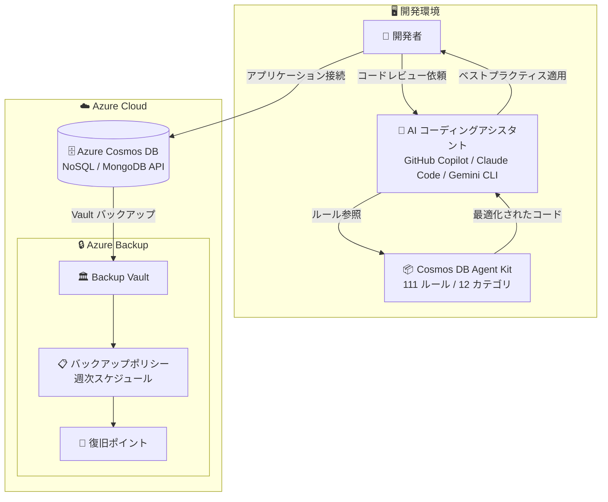

# Azure Cosmos DB: Agent Kit GA & Azure Backup プレビュー

**リリース日**: 2026-06-02

**サービス**: Azure Cosmos DB

**機能**: Agent Kit GA & Azure Backup プレビュー

**ステータス**: Launched (GA) / In preview

[このアップデートのインフォグラフィックを見る](https://takech9203.github.io/azure-news-summary/20260602-cosmosdb-agent-kit-backup.html)

## 概要

Microsoft Build 2026 において、Azure Cosmos DB に関する 2 つの重要なアップデートが発表された。1 つ目は **Azure Cosmos DB Agent Kit の一般提供 (GA)** で、AI コーディングアシスタントに対してエキスパートレベルの Cosmos DB ベストプラクティスを提供するオープンソースのスキルコレクションである。2 つ目は **Azure Backup for Cosmos DB のパブリックプレビュー** で、ミッションクリティカルなデータを安全で隔離された復元力のあるバックアップで保護する機能を提供する。

Agent Kit は、開発者がデータモデルの設計、クエリの最適化、パフォーマンスチューニングなど、Azure Cosmos DB の重要な設計判断において AI コーディングエージェントから本番品質のガイダンスを即座に受けられるようにする。一方、Azure Backup for Cosmos DB は、偶発的または悪意のあるデータ損失シナリオにおいてもサイバーレジリエンシーとコンプライアンスのニーズに対応する Vault バックアップ機能を提供する。

**アップデート前の課題**

- AI コーディングアシスタントが Cosmos DB 固有のベストプラクティス (パーティションキー設計、RU 最適化、データモデリング) を知らず、非効率なコードが生成されていた
- パーティションキー選択の誤りがプロダクション環境でのパフォーマンス問題やホットパーティションを引き起こしていた
- Cosmos DB のバックアップは連続バックアップ (PITR) のみで、Vault に隔離された長期保持バックアップが利用できなかった
- サイバー攻撃や悪意のあるデータ損失に対する追加的なデータ保護レイヤーがなかった

**アップデート後の改善**

- AI コーディングエージェントが 12 カテゴリ・111 のルールに基づいた Cosmos DB のベストプラクティスを自動的に適用
- GitHub Copilot、Claude Code、Gemini CLI など主要な AI コーディングツールからワンコマンドで導入可能
- Azure Backup Vault によるセキュアで隔離されたバックアップが Cosmos DB アカウントに対して利用可能に
- サイバーレジリエンシーとコンプライアンス要件に対応したデータ保護の強化

## アーキテクチャ図



上図は、Agent Kit による開発ワークフローの改善 (上部) と Azure Backup による Vault バックアップの構成 (下部) を示している。開発者は AI コーディングアシスタントを通じてベストプラクティスを自動適用し、本番環境のデータは Backup Vault で保護される。

## サービスアップデートの詳細

### 1. Azure Cosmos DB Agent Kit (GA)

#### 主要機能

1. **111 のキュレーションされたルール (12 カテゴリ)**
   - Data Modeling (Critical): ドキュメント構造とリレーションシップのベストプラクティス
   - Partition Key Design (Critical): 効果的なパーティションキー選択のガイドライン
   - Query Optimization (High): RU 消費を削減しパフォーマンスを改善するテクニック
   - SDK Best Practices (High): クライアント初期化、リトライロジック、エラーハンドリング
   - Design Patterns (High): LangGraph ルーティング、Change Feed マテリアライズドビュー
   - Vector Search (High): ベクトル埋め込みポリシー、インデックスタイプ、類似検索
   - Full-Text Search (High): フルテキストインデックス、BM25 ランキング、ハイブリッド検索
   - Indexing Strategies (Medium-High): ワークロードに最適なインデックスポリシー
   - Throughput & Scaling (Medium): Autoscale、プロビジョニングスループット、キャパシティプランニング
   - Global Distribution (Medium): マルチリージョン書き込みと整合性レベル選択
   - Developer Tooling (Medium): ビルド検証、バージョン管理、エミュレーター設定
   - Monitoring & Diagnostics (Low-Medium): ログ、メトリクス、トラブルシューティング

2. **ワンコマンドインストール**
   - `npx skills add AzureCosmosDB/cosmosdb-agent-kit` で即座に導入
   - コンテキストに応じて自動的にスキルがアクティベートされる
   - 手動設定不要で、Cosmos DB 関連のタスクを検出して適用

3. **マルチプラットフォーム対応**
   - GitHub Copilot (VS Code、Visual Studio、JetBrains IDE)
   - Claude Code (Anthropic のコーディングアシスタント)
   - Cursor (Claude ベースの IDE)
   - Gemini CLI (Google のコマンドライン AI アシスタント)
   - Agent Skills 互換ツール全般

4. **コードレビューと最適化**
   - SDK アンチパターンの検出 (リクエストごとの CosmosClient 生成など)
   - クエリ最適化 (SELECT * の回避、パラメータ化クエリ推奨)
   - セキュリティリスクの指摘 (SQL インジェクション防止)
   - エラーハンドリングの改善 (429 レートリミット対応)

### 2. Azure Backup for Cosmos DB (パブリックプレビュー)

#### 主要機能

1. **Vault バックアップ**
   - Azure Backup Vault にセキュアに隔離されたバックアップを保存
   - ソース Cosmos DB アカウントとは独立した保護レイヤー
   - サイバー攻撃や悪意のある削除からのデータ保護

2. **バックアップポリシー**
   - 週次バックアップ頻度をサポート (7 日間の RPO)
   - カスタマイズ可能なリテンションルール (年次、月次、週次の優先順位)
   - デフォルトリテンション期間は 1 年

3. **復元機能**
   - クロスサブスクリプション復元をサポート
   - 空の単一リージョンターゲット Cosmos DB アカウントへの復元
   - ソースと同じ API タイプのターゲットアカウントへの復元
   - オンデマンドバックアップによるフルバックアップ

4. **サイバーレジリエンシー**
   - 偶発的なデータ損失からの保護
   - 悪意のある削除・改ざんからの保護
   - コンプライアンス要件への対応

## 技術仕様

### Agent Kit

| 項目 | 詳細 |
|------|------|
| リポジトリ | [AzureCosmosDB/cosmosdb-agent-kit](https://github.com/AzureCosmosDB/cosmosdb-agent-kit) |
| フォーマット | Agent Skills (agentskills.io) |
| ルール数 | 111 ルール |
| カテゴリ数 | 12 カテゴリ |
| 前提条件 | Node.js (npm/npx) |
| インストール | `npx skills add AzureCosmosDB/cosmosdb-agent-kit` |
| ライセンス | オープンソース |

### Azure Backup for Cosmos DB

| 項目 | 詳細 |
|------|------|
| ステータス | パブリックプレビュー |
| 対応 API | NoSQL、MongoDB (RU ベース) |
| バックアップモード | 連続バックアップ (PITR) モードのアカウントのみ |
| バックアップ頻度 | 週次 |
| RPO | 7 日間 |
| 最大パーティション数 | 2,500 パーティション (約 125 TB) |
| リージョン | すべての Azure パブリッククラウドリージョン |
| クロスサブスクリプション復元 | サポート |
| クロスリージョン復元 | 非サポート |

## 設定方法

### Agent Kit のインストール

#### 前提条件

1. Node.js と npm/npx がインストールされていること
2. Agent Skills 互換の AI コーディングアシスタント (GitHub Copilot、Claude Code、Gemini CLI など)

#### インストール

```bash
# ワンコマンドでインストール
npx skills add AzureCosmosDB/cosmosdb-agent-kit
```

インストール後、Cosmos DB 関連のコードを扱う際にスキルが自動的にアクティベートされる。

### Azure Backup for Cosmos DB の設定

#### 前提条件

1. 連続バックアップ (PITR) モードが有効な Cosmos DB アカウント
2. Cosmos DB アカウントと同じリージョンに Backup Vault が存在すること
3. Cosmos DB アカウントのプライマリ書き込みリージョンと Backup Vault のリージョンが一致すること

#### Azure Portal での設定手順

1. **Resiliency** に移動し、**Overview** > **Configure protection** を選択
2. **Resource managed by** を「Azure」、**Datasource type** を「Azure Cosmos DB (Preview)」、**Solution** を「Azure Backup」に設定
3. 既存の Backup Vault を選択 (存在しない場合は新規作成)
4. バックアップポリシーを選択または新規作成 (週次スケジュール)
5. バックアップ対象の Cosmos DB アカウントを選択
6. ロールの割り当てが必要な場合は、指示に従い権限を付与
7. **Review + configure** で設定を確認し、バックアップを構成

## メリット

### ビジネス面

- **開発生産性の向上**: Agent Kit により、Cosmos DB の設計・実装において即座にエキスパートレベルのガイダンスを得られる
- **コスト最適化**: RU 消費の最適化ガイダンスにより、不要なコストを削減
- **コンプライアンス対応**: Vault バックアップによりデータ保持・監査要件に対応
- **事業継続性の強化**: サイバー攻撃シナリオでもデータ復旧が可能

### 技術面

- **ベストプラクティスの自動適用**: パーティションキー設計、クエリ最適化などの重要な設計判断を AI が支援
- **アンチパターンの検出**: SDK の誤用やセキュリティリスクを自動的に検出
- **サイバーレジリエンシー**: ソースデータとは隔離されたバックアップによる多層防御
- **柔軟なリテンション管理**: 年次・月次・週次の優先順位に基づくリテンションルール

## デメリット・制約事項

### Agent Kit

- 読み取り専用のガイダンスのみで、データベース操作は実行しない
- Node.js (npm/npx) 環境が必要
- Agent Skills フォーマットに対応した AI ツールが必要

### Azure Backup for Cosmos DB

- 連続バックアップ (PITR) モードのアカウントのみサポート
- 週次バックアップのみ (日次バックアップは非対応)
- クロスリージョン復元は非サポート
- 階層パーティションキーを使用したアカウントは非サポート
- Per-Partition Automatic Failover (PPAF) が有効なアカウントは非サポート
- アイテムレベルのバックアップ・復元は非サポート (アカウント全体のバックアップのみ)
- サーバーレスターゲットアカウントへの復元は非サポート
- スループット制限が設定されたターゲットアカウントへの復元は非サポート
- ナショナルクラウド・ソブリンリージョンは非サポート

## ユースケース

### ユースケース 1: AI アシスタントを活用した Cosmos DB アプリケーション開発

**シナリオ**: E コマースアプリケーションの商品カタログを Cosmos DB で構築する際に、Agent Kit を活用してベストプラクティスに準拠したコードを生成する。

**実装例**:

```bash
# Agent Kit をインストール
npx skills add AzureCosmosDB/cosmosdb-agent-kit

# AI アシスタントに質問
# "Review my Cosmos DB data model for performance issues"
# "Help me choose a partition key for my e-commerce orders collection"
# "Optimize this query that's consuming too many RUs"
```

**効果**: パーティションキーの選択ミスやクエリの非効率性を開発初期段階で検出し、プロダクション環境でのパフォーマンス問題を予防できる。

### ユースケース 2: ミッションクリティカルなデータの Vault バックアップ保護

**シナリオ**: 金融機関の取引データを格納する Cosmos DB アカウントに対して、サイバー攻撃やランサムウェアに備えた隔離バックアップを構成する。

**効果**: 悪意のあるデータ削除や改ざんが発生した場合でも、Vault に隔離されたバックアップから復元が可能。コンプライアンス監査に対してもデータ保持ポリシーの証跡を提供できる。

## 料金

### Agent Kit

Agent Kit はオープンソースで提供されており、インストールおよび利用は無料である。

### Azure Backup for Cosmos DB

料金の詳細はプレビュー期間中に変更される可能性がある。最新の情報は [Azure Backup 料金ページ](https://azure.microsoft.com/pricing/details/backup/) を参照。

## 利用可能リージョン

### Agent Kit

Agent Kit はローカル開発環境にインストールされるオープンソースツールであり、リージョン制限なし。

### Azure Backup for Cosmos DB

すべての Azure パブリッククラウドリージョンで利用可能。ナショナルクラウドおよびソブリンリージョンは現時点で非サポート。

## 関連サービス・機能

- **GitHub Copilot**: Agent Kit の主要な対応 AI コーディングアシスタント
- **Azure Backup**: Cosmos DB の Vault バックアップを提供する基盤サービス
- **Azure Cosmos DB 連続バックアップ (PITR)**: 既存のポイントインタイムリストア機能。Vault バックアップの前提条件
- **Azure Cosmos DB Vector Search**: Agent Kit がベストプラクティスを提供する検索機能
- **Azure Cosmos DB Change Feed**: Agent Kit の Design Patterns カテゴリでカバーされるイベント駆動パターン

## 参考リンク

- [インフォグラフィック](https://takech9203.github.io/azure-news-summary/20260602-cosmosdb-agent-kit-backup.html)
- [公式アップデート情報 - Agent Kit GA](https://azure.microsoft.com/updates?id=563022)
- [公式アップデート情報 - Azure Backup for Cosmos DB](https://azure.microsoft.com/updates?id=562769)
- [Azure Blog - Microsoft Build 2026: Building agentic apps with Microsoft Fabric and Microsoft Databases](https://azure.microsoft.com/en-us/blog/microsoft-build-2026-building-agentic-apps-with-microsoft-fabric-and-microsoft-databases/)
- [Microsoft Learn - Azure Cosmos DB Agent Kit](https://learn.microsoft.com/azure/cosmos-db/gen-ai/agent-kit)
- [Microsoft Learn - Azure Backup for Cosmos DB 設定ガイド](https://learn.microsoft.com/azure/backup/backup-azure-cosmos-db)
- [Microsoft Learn - Azure Backup for Cosmos DB サポートマトリックス](https://learn.microsoft.com/azure/backup/backup-azure-cosmos-db-support-matrix)
- [GitHub - cosmosdb-agent-kit](https://github.com/AzureCosmosDB/cosmosdb-agent-kit)
- [Azure Backup 料金ページ](https://azure.microsoft.com/pricing/details/backup/)

## まとめ

Build 2026 で発表されたこの 2 つのアップデートは、Azure Cosmos DB の「開発体験」と「データ保護」の両面を強化するものである。

**Agent Kit (GA)** は、AI コーディングアシスタントに Cosmos DB のエキスパート知識を付与することで、開発者がパーティションキー設計やクエリ最適化といった重要な設計判断で即座に高品質なガイダンスを得られるようにする。111 のルールを備えた包括的なスキルセットにより、プロダクション環境でのパフォーマンス問題やコスト超過を開発段階で予防できる。

**Azure Backup for Cosmos DB (プレビュー)** は、ミッションクリティカルなワークロードに対して Vault ベースの隔離バックアップを提供し、サイバーレジリエンシーとコンプライアンス要件に対応する。既存の PITR に加えた多層防御として位置付けられる。

**推奨アクション**:
- 開発チームへの Agent Kit の導入: `npx skills add AzureCosmosDB/cosmosdb-agent-kit`
- ミッションクリティカルな Cosmos DB アカウントに対する Vault バックアップの評価・テスト
- バックアップの制約事項 (週次 RPO、PITR モード必須) がビジネス要件に適合するか確認

---

**タグ**: #Azure #CosmosDB #AgentKit #AzureBackup #Build2026 #GA #Preview #AI #CyberResiliency
