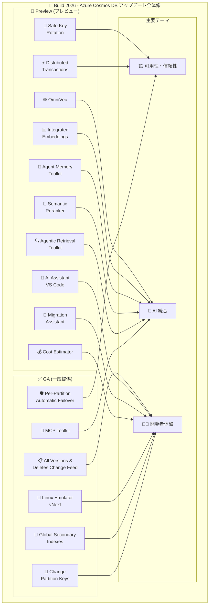

# Azure Cosmos DB: Build 2026 大型アップデート

**リリース日**: 2026-06-02

**サービス**: Azure Cosmos DB

**機能**: Build 2026 大型アップデート (16 項目)

**ステータス**: Launched (GA) / In preview (mixed)

[このアップデートのインフォグラフィックを見る](https://takech9203.github.io/azure-news-summary/20260602-cosmosdb-build-2026-updates.html)

## 概要

Microsoft Build 2026 において、Azure Cosmos DB は 16 項目にわたる大型アップデートを発表した。GA (一般提供) が 6 項目、パブリックプレビューが 10 項目という構成で、可用性・AI 統合・開発者体験の 3 つの柱を中心に大幅な機能強化が行われている。

特に注目すべきは、パーティション単位の自動フェイルオーバー (Per-Partition Automatic Failover) による可用性の向上、MCP Toolkit の GA によるAI エージェントとの統合、そしてグローバルセカンダリインデックスによるクエリパフォーマンスの改善である。AI 関連ツールキット群 (Agentic Retrieval、Agent Memory、Semantic Reranker、Integrated Embeddings) の登場により、Cosmos DB が AI アプリケーションのデータ基盤として本格的に位置づけられたことが明確になった。

**アップデート前の課題**

- 単一書き込みリージョンのアカウントでパーティション障害が発生した場合、リージョン全体のフェイルオーバーが必要だった
- AI エージェントからデータベースへの接続にはカスタム実装が必要で、標準化されたツールキットがなかった
- パーティションキーの変更にはデータのマイグレーションとダウンタイムが伴った
- ベクトル検索のための埋め込み生成には外部パイプラインの構築・運用が必要だった
- セカンダリインデックスの欠如により、パーティションキー以外のフィールドでの効率的なクエリに制約があった

**アップデート後の改善**

- パーティション単位で 3 分以内 (P99) に自動フェイルオーバーが実行され、アプリケーション変更不要で可用性が向上
- MCP Toolkit (GA) により AI エージェントから Cosmos DB への標準的な接続が実現
- オンラインコピーによりダウンタイムなしでパーティションキーを変更可能に
- Integrated Embeddings (Preview) により自動的に埋め込みの生成・維持が行われる
- グローバルセカンダリインデックスにより柔軟なクエリパターンが利用可能に

## アーキテクチャ図

Build 2026 での Cosmos DB アップデートは「可用性・信頼性」「AI 統合」「開発者体験」の 3 つの柱で構成されており、特に AI 統合領域への投資が目立つ。

## サービスアップデートの詳細

### GA (一般提供) - 6 項目

#### 1. Per-Partition Automatic Failover (パーティション単位自動フェイルオーバー)

単一書き込みリージョンのアカウントにおいて、パーティション単位で自動的にフェイルオーバーを実行する機能。影響を受けたパーティションのみがセカンダリリージョンにフェイルオーバーし、P99 で 3 分以内に書き込みが復旧する。アプリケーション側の変更は不要。

- **対象**: 単一書き込みリージョンアカウント
- **復旧時間**: P99 で 3 分以内
- **粒度**: パーティション単位 (リージョン全体ではない)
- **アプリケーション変更**: 不要

#### 2. MCP Toolkit (v1.1.2)

Ignite 2025 でプレビューとして発表された MCP (Model Context Protocol) Toolkit が GA に昇格。AI エージェントが本番データベースに接続するための標準化されたインターフェースを提供する。GA リリースでは Microsoft Foundry との統合深化、マルチプロバイダー埋め込みサポート、信頼性の改善が含まれる。

- **バージョン**: v1.1.2
- **新機能**: Microsoft Foundry 統合、マルチプロバイダー埋め込みサポート
- **目的**: AI エージェントから本番 Cosmos DB への安全な接続

#### 3. Change Partition Keys (パーティションキー変更)

Azure Cosmos DB for NoSQL API でパーティションキーの変更が GA に。オンラインコピーのサポートにより、Azure Portal からほぼゼロダウンタイムで、ソースコンテナーへの書き込みを停止することなくリパーティションが可能になった。

- **方式**: オンラインコピー (書き込み停止不要)
- **操作方法**: Azure Portal から実行可能
- **対象 API**: NoSQL API

#### 4. All Versions and Deletes Change Feed Mode

変更フィードモードが強化され、削除を含むすべてのバージョンの変更を取得可能になった。従来の変更フィードでは削除イベントを取得できなかったが、本機能によりデータの完全な変更履歴を追跡できる。

- **対象 API**: Azure Cosmos DB for NoSQL
- **取得可能な変更**: 作成、更新、削除のすべて
- **バージョン**: すべてのドキュメントバージョンを追跡可能

#### 5. Global Secondary Indexes (グローバルセカンダリインデックス)

パーティションキー以外のフィールドに対してグローバルなセカンダリインデックスを作成可能になった。これにより、パーティションをまたぐクエリのパフォーマンスが大幅に向上する。

- **効果**: パーティション横断クエリの最適化
- **柔軟性**: 任意のフィールドにインデックス作成可能

#### 6. Linux Emulator vNext

Docker イメージとして提供される新世代のエミュレーター。Linux、macOS、Windows 上で x64 および ARM64 アーキテクチャで動作する。プレビューからの改善点として、より広いAPIカバレッジ、組み込みシェル、ベクトル検索、OpenTelemetry サポートが追加されている。

- **配布形式**: Docker イメージ
- **対応 OS**: Linux / macOS / Windows
- **対応アーキテクチャ**: x64 / ARM64
- **新機能**: 組み込みシェル、ベクトル検索、OpenTelemetry サポート

### Preview (プレビュー) - 10 項目

#### 7. Distributed Transactions (分散トランザクション)

複数パーティション間でのトランザクション処理を可能にする機能。従来はパーティション内のみでトランザクションが保証されていたが、本機能によりパーティションをまたぐ ACID トランザクションが実現される。

#### 8. Agentic Retrieval Toolkit

AI エージェントが Cosmos DB からコンテキストに応じたデータ取得を行うためのツールキット。エージェントが自律的に最適なクエリ戦略を選択し、必要な情報を効率的に取得できる。

#### 9. Semantic Reranker (セマンティックリランカー)

AI モデルを使用してクエリ結果のスコアリングと並べ替えを行い、ユーザーの意図に基づく検索結果の関連性を向上させる機能。Python、.NET、Java SDK に組み込まれており、数行のコードで利用可能。

- **対応 SDK**: Python / .NET / Java
- **仕組み**: AI モデルによるクエリ結果のスコアリング・リオーダリング
- **効果**: ユーザーの意図に基づく検索精度の向上

#### 10. Agent Memory Toolkit

AI エージェントの長期記憶を Cosmos DB に永続化するためのツールキット。会話履歴やコンテキスト情報を構造化して保存・取得することで、エージェントのステートフルな動作を実現する。

#### 11. Safe Key Rotation (安全なキーローテーション)

本番環境でのキーローテーションを安全に実行するための機能。接続の中断やダウンタイムを回避しながら、認証キーのローテーションが可能になる。

#### 12. Integrated Embeddings (統合埋め込み)

データの書き込みおよび更新時に Azure Cosmos DB が自動的にベクトル埋め込みを生成・維持する機能。外部の埋め込みパイプライン構築が不要になり、障害処理、スロットリング、スケーリング、監視の運用負荷が削減される。

- **自動化範囲**: 書き込み・更新時の埋め込み自動生成
- **削減される運用**: パイプライン構築、障害処理、スロットリング対応、スケーリング、監視

#### 13. OmniVec (オープンソース埋め込みツールキット)

運用データのベクトル表現を同期的に維持するための埋め込みパイプラインプラットフォーム。Azure Cosmos DB、PostgreSQL、SQL Server をソース/デスティネーションとしてサポートし、Azure Blob Storage をデスティネーションとして利用可能。ユーザーの Azure サブスクリプション内にデプロイされ、Web UI、CLI、API でアクセス可能。

- **ライセンス**: オープンソース
- **対応ソース/デスティネーション**: Cosmos DB / PostgreSQL / SQL Server / Azure Blob Storage
- **アクセス方法**: Web UI / CLI / API
- **デプロイ**: ユーザーの Azure サブスクリプション内

#### 14. New Cost Estimator (新コスト見積もりツール)

Cosmos DB のワークロードに基づく新しいコスト見積もりツール。より正確なコスト予測を提供する。

#### 15. Relational Database to NoSQL Migration Assistant

VS Code の Azure Cosmos DB 拡張機能で利用可能なマイグレーションアシスタント。AI を活用したフェーズベースのワークフローにより、リレーショナルデータベース (SQL Server 等) から Cosmos DB NoSQL への移行を支援する。非正規化、パーティショニング、NoSQL データモデリングに関する構造化された推奨事項を提供する。

- **環境**: VS Code 拡張機能
- **対応ソース**: SQL Server 等のリレーショナルデータベース
- **支援内容**: 非正規化、パーティショニング、NoSQL データモデリングの推奨

#### 16. AI Assistant in VS Code Extension

Azure Cosmos DB の VS Code 拡張機能に AI アシスタントを統合。開発者のデータベース操作、クエリ作成、トラブルシューティングを AI が支援する。

## 技術仕様

| 項目 | 詳細 |
|------|------|
| GA 項目数 | 6 |
| Preview 項目数 | 10 |
| 対象 API | 主に NoSQL API |
| PPAF 復旧時間 | P99: 3 分以内 |
| MCP Toolkit バージョン | v1.1.2 |
| Semantic Reranker SDK | Python / .NET / Java |
| Linux Emulator アーキテクチャ | x64 / ARM64 |
| OmniVec ライセンス | オープンソース |

## メリット

### ビジネス面

- **可用性の向上**: パーティション単位の自動フェイルオーバーにより SLA 向上、ビジネス影響の最小化
- **AI アプリケーション基盤**: AI エージェント向けの統合ツールキット群により、Cosmos DB を中心とした AI アプリの迅速な構築が可能に
- **移行コスト削減**: Migration Assistant により RDBMS からの移行工数を大幅に削減
- **運用コストの可視化**: 新しい Cost Estimator による正確なコスト予測

### 技術面

- **粒度の細かい障害復旧**: リージョン全体ではなくパーティション単位でのフェイルオーバーにより、影響範囲を最小化
- **ベクトル検索の簡素化**: Integrated Embeddings により外部パイプライン不要でベクトル検索を実装可能
- **スキーマ変更の柔軟性**: パーティションキーのオンライン変更により、設計変更のリスクが軽減
- **開発環境の改善**: vNext エミュレーターのクロスプラットフォーム対応と機能拡充
- **クエリ最適化**: グローバルセカンダリインデックスによるパーティション横断クエリの効率化

## デメリット・制約事項

- Preview 項目 (10 項目) は本番環境での使用は推奨されない
- Distributed Transactions は Preview 段階であり、パフォーマンス特性の詳細は未公開
- Per-Partition Automatic Failover は単一書き込みリージョンアカウントが対象 (マルチリージョン書き込みアカウントは対象外)
- AI 関連ツールキットはエコシステムが新しく、ベストプラクティスが確立されていない段階
- Integrated Embeddings はプレビュー段階であり、対応モデルやスループットに制限がある可能性

## ユースケース

### ユースケース 1: ミッションクリティカルな E コマースアプリケーション

**シナリオ**: グローバルに展開する E コマースプラットフォームで、注文処理の可用性を最大化したい。

**活用する機能**:
- Per-Partition Automatic Failover: 障害時の自動復旧
- Global Secondary Indexes: 商品検索のパフォーマンス向上
- All Versions and Deletes Change Feed: 注文履歴の完全な追跡

**効果**: パーティション障害時でも 3 分以内に復旧し、ユーザー体験への影響を最小化。

### ユースケース 2: AI エージェント基盤の構築

**シナリオ**: カスタマーサポート AI エージェントのデータ基盤として Cosmos DB を採用し、顧客情報の検索と会話記憶を管理したい。

**活用する機能**:
- MCP Toolkit: エージェントからのデータアクセス
- Agent Memory Toolkit: 会話コンテキストの永続化
- Agentic Retrieval Toolkit: 自律的なデータ取得
- Semantic Reranker: 検索結果の関連性向上
- Integrated Embeddings: 自動ベクトル化

**効果**: 外部サービスの依存を最小化し、Cosmos DB 単体で AI エージェントのデータ基盤を完結できる。

### ユースケース 3: RDBMS からの移行プロジェクト

**シナリオ**: レガシーな SQL Server アプリケーションを NoSQL アーキテクチャに移行し、スケーラビリティを向上させたい。

**活用する機能**:
- Migration Assistant: AI 支援による移行設計
- Change Partition Keys: 移行後のパーティション戦略調整
- Cost Estimator: 移行後のコスト予測
- Linux Emulator vNext: ローカル開発環境の構築

**効果**: AI による移行設計の推奨により、非正規化やパーティショニングの判断を支援し、移行の品質とスピードを向上。

## 関連サービス・機能

- **Azure AI Foundry (旧 Azure AI Studio)**: MCP Toolkit との統合により、AI エージェントの構築基盤として連携
- **Azure OpenAI Service**: Integrated Embeddings および Semantic Reranker のバックエンドモデルとして連携
- **Azure Monitor / OpenTelemetry**: vNext エミュレーターの OpenTelemetry サポートにより、可観測性の統合
- **Visual Studio Code**: Migration Assistant および AI Assistant が VS Code 拡張機能として提供
- **Azure Blob Storage**: OmniVec のデスティネーションとして連携

## 参考リンク

- [インフォグラフィック](https://takech9203.github.io/azure-news-summary/20260602-cosmosdb-build-2026-updates.html)
- [Per-partition automatic failover](https://azure.microsoft.com/updates?id=563042)
- [MCP Toolkit for Azure Cosmos DB](https://azure.microsoft.com/updates?id=563032)
- [Change partition keys](https://azure.microsoft.com/updates?id=563017)
- [All versions and deletes change feed mode](https://azure.microsoft.com/updates?id=562971)
- [Global secondary indexes](https://azure.microsoft.com/updates?id=562799)
- [Linux emulator vNext](https://azure.microsoft.com/updates?id=562754)
- [Distributed transactions](https://azure.microsoft.com/updates?id=563047)
- [Agentic Retrieval Toolkit](https://azure.microsoft.com/updates?id=562794)
- [Semantic reranker](https://azure.microsoft.com/updates?id=562784)
- [Agent Memory Toolkit](https://azure.microsoft.com/updates?id=562779)
- [Safe key rotation](https://azure.microsoft.com/updates?id=562774)
- [Integrated embeddings](https://azure.microsoft.com/updates?id=562764)
- [OmniVec](https://azure.microsoft.com/updates?id=562759)
- [New cost estimator](https://azure.microsoft.com/updates?id=562976)
- [Migration Assistant](https://azure.microsoft.com/updates?id=563052)
- [AI Assistant VS Code](https://azure.microsoft.com/updates?id=563027)
- [Azure Cosmos DB Blog](https://devblogs.microsoft.com/cosmosdb/)

## まとめ

Build 2026 における Azure Cosmos DB のアップデートは、16 項目 (GA 6 / Preview 10) という大規模なものであり、3 つの主要テーマで構成されている。

1. **可用性・信頼性**: Per-Partition Automatic Failover の GA により、ミッションクリティカルなワークロードの耐障害性が大幅に向上。パーティション単位の細粒度フェイルオーバーは業界でも先進的なアプローチ。

2. **AI 統合**: MCP Toolkit (GA)、Agentic Retrieval、Agent Memory、Semantic Reranker、Integrated Embeddings と、AI エージェントのデータ基盤としての機能が一気に拡充。Cosmos DB を中心とした AI アプリケーション構築が現実的な選択肢に。

3. **開発者体験**: パーティションキーのオンライン変更、グローバルセカンダリインデックス、vNext エミュレーター、Migration Assistant など、日常的な開発・運用の生産性を高める機能群。

**推奨される次のアクション**:
- GA 項目 (特に Per-Partition Automatic Failover、Global Secondary Indexes) については既存ワークロードへの適用を検討
- AI エージェント基盤の構築を計画中の場合、MCP Toolkit (GA) の評価を優先的に実施
- RDBMS からの移行プロジェクトがある場合、Migration Assistant (Preview) の早期検証を推奨
- vNext Linux Emulator を使用した開発環境の標準化を検討

---

**タグ**: #Azure #CosmosDB #Build2026 #NoSQL #AI #MCP #VectorSearch #HighAvailability #Database
