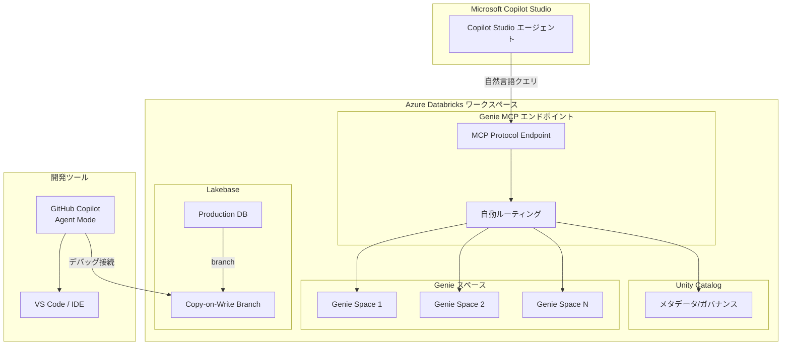

# Azure Databricks: Genie MCP 連携と Lakebase ブランチング

**リリース日**: 2026-06-02

**サービス**: Azure Databricks

**機能**: Genie MCP 連携と Lakebase ブランチング

**ステータス**: In preview

[このアップデートのインフォグラフィックを見る](https://takech9203.github.io/azure-news-summary/20260602-databricks-genie-lakebase.html)

## 概要

Microsoft Build 2026 にて、Azure Databricks に関する 2 つの先進的な機能がパブリックプレビューとして発表されました。ワークスペース全体にわたる Genie MCP エンドポイントの Microsoft Copilot Studio 連携、および Lakebase の GitHub Copilot agent mode によるブランチング機能です。

Genie MCP（Model Context Protocol）エンドポイントは、Microsoft Copilot Studio エージェントが Azure Databricks ワークスペース全体に対して自然言語でクエリを実行できる単一のエンドポイントを提供します。このエンドポイントは接続されたすべての Genie スペースと Unity Catalog 全体に自動ルーティングを行います。

Lakebase ブランチング機能では、開発者が Lakebase プロダクションデータベースの copy-on-write ブランチを単一コマンドで作成し、GitHub Copilot agent mode をブランチエンドポイントに接続して、本番データに影響を与えることなく AI アプリやエージェントのデバッグが可能になります。

**アップデート前の課題**

- Microsoft Copilot Studio エージェントから Databricks データへアクセスするには、個別の Genie スペースごとに接続を設定する必要があった
- 自然言語クエリのルーティングを手動で管理する必要があった
- AI アプリのデバッグ時に本番データベースを直接参照するリスクがあった
- プロダクションデータを使ったテストには、データベースのフルコピーが必要で時間とコストがかかっていた

**アップデート後の改善**

- 単一の MCP エンドポイントでワークスペース全体のデータにアクセス可能
- クエリの自動ルーティングにより、適切な Genie スペースやデータソースに自動的に振り分け
- copy-on-write ブランチにより、本番データに影響を与えずに実データでのデバッグが可能
- GitHub Copilot agent mode との統合により、AI 支援開発ワークフローが大幅に効率化

## アーキテクチャ図



この図は、Genie MCP エンドポイントによる Copilot Studio 連携の自動ルーティング構成と、Lakebase ブランチングによる安全な開発ワークフローを示しています。

## サービスアップデートの詳細

### 主要機能

1. **ワークスペース全体の Genie MCP エンドポイント**
   - 単一のエンドポイントでワークスペース内のすべてのデータソースにアクセス
   - Model Context Protocol (MCP) 標準に準拠
   - 自然言語クエリの自動ルーティング（Genie スペースおよび Unity Catalog 全体）
   - Microsoft Copilot Studio との直接統合

2. **Lakebase ブランチング（GitHub Copilot agent mode 対応）**
   - プロダクションデータベースの copy-on-write ブランチを単一コマンドで作成
   - GitHub Copilot agent mode をブランチエンドポイントに接続
   - 本番データに影響を与えない安全なデバッグ環境
   - AI アプリおよびエージェントの実データによるテスト

3. **自動ルーティング**
   - 自然言語クエリの内容に基づいて最適な Genie スペースを自動判定
   - Unity Catalog のメタデータを活用した精度の高いルーティング
   - 複数のデータドメインにまたがるクエリに対応

## 技術仕様

| 項目 | 詳細 |
|------|------|
| プロトコル | Model Context Protocol (MCP) |
| 連携先 | Microsoft Copilot Studio |
| ルーティング対象 | Genie スペース、Unity Catalog |
| ブランチタイプ | Copy-on-Write |
| 開発ツール連携 | GitHub Copilot agent mode |
| ステータス | パブリックプレビュー |
| 発表イベント | Microsoft Build 2026 |

## 設定方法

### 前提条件

1. Azure Databricks ワークスペース（Premium 以上）
2. Unity Catalog が有効化されていること
3. Genie スペースが設定済みであること
4. Microsoft Copilot Studio へのアクセス権（Genie MCP 用）
5. GitHub Copilot のサブスクリプション（Lakebase ブランチング用）

### Genie MCP エンドポイントの設定

```bash
# Databricks CLI を使用して MCP エンドポイントを確認
databricks workspace get-status /genie-mcp-endpoint

# Copilot Studio でのコネクタ設定時に使用するエンドポイント URL を取得
databricks serving-endpoints list --output json | jq '.[] | select(.name == "genie-mcp")'
```

### Lakebase ブランチの作成

```bash
# Lakebase プロダクションデータベースからブランチを作成
databricks lakebase branch create \
  --source-database production_db \
  --branch-name feature/debug-ai-agent \
  --copy-on-write

# ブランチエンドポイントの確認
databricks lakebase branch get-endpoint \
  --branch-name feature/debug-ai-agent
```

### Azure Portal / Databricks UI

**Genie MCP の有効化:**
1. Azure Databricks ワークスペースを開く
2. **Workspace Settings** > **Genie** に移動
3. **MCP Endpoint** を有効化
4. 接続する Genie スペースを選択
5. Microsoft Copilot Studio でコネクタとして追加

**Lakebase ブランチの作成:**
1. Databricks ワークスペースの **SQL Editor** または **Lakebase** セクションに移動
2. 対象データベースを右クリックし **Create Branch** を選択
3. ブランチ名を入力し、copy-on-write オプションを確認
4. GitHub Copilot agent mode の接続情報をコピー

## メリット

### ビジネス面

- **AI エージェントの迅速な構築**: Copilot Studio エージェントが即座にデータレイク全体のデータを活用可能
- **開発速度の向上**: ブランチング機能により、本番相当のデータで安全にテスト可能
- **データ民主化**: 非技術者も Copilot Studio を通じて自然言語でデータにアクセス
- **コスト最適化**: copy-on-write によりフルコピー不要でストレージコストを削減

### 技術面

- **MCP 標準準拠**: Model Context Protocol に準拠したオープンな連携が可能
- **自動ルーティング**: クエリの意図に基づく知的なデータソース選択
- **データの安全性**: ブランチングにより本番データへの影響をゼロに
- **統合開発体験**: GitHub Copilot agent mode との連携により、AI 支援コーディングとデータデバッグの統合

## デメリット・制約事項

- パブリックプレビュー段階のため、機能の変更や制約が今後発生する可能性がある
- Genie MCP エンドポイントの利用には Unity Catalog の有効化が前提条件
- copy-on-write ブランチのサイズや保持期間に制限がある可能性
- Microsoft Copilot Studio および GitHub Copilot の別途ライセンスが必要
- 自動ルーティングの精度はGenie スペースの設定品質に依存

## ユースケース

### ユースケース 1: 企業向け AI チャットボットの構築

**シナリオ**: 営業チームが顧客データ、売上データ、在庫データなど複数のデータドメインにまたがる質問を自然言語で行える AI チャットボットを構築したい場合。

**実装例**:
1. 各データドメインに対応する Genie スペースを作成
2. ワークスペース全体の Genie MCP エンドポイントを有効化
3. Microsoft Copilot Studio でエージェントを作成し、MCP コネクタを追加
4. 営業チームは Copilot Studio エージェントを通じて「先月の東京リージョンの売上トップ10顧客は?」のような質問が可能

**効果**: データエンジニアの介在なしに、ビジネスユーザーがリアルタイムでデータインサイトを取得可能。

### ユースケース 2: AI エージェントの安全なデバッグ

**シナリオ**: 本番データを使って AI エージェントの動作を検証したいが、誤った書き込みによるデータ破壊を避けたい場合。

**実装例**:

```bash
# 本番 DB のブランチを作成
databricks lakebase branch create \
  --source-database orders_production \
  --branch-name debug/order-agent-v2 \
  --copy-on-write

# GitHub Copilot agent mode で接続して AI エージェントをデバッグ
# ブランチ上でのすべての変更は本番に影響しない
```

**効果**: 実データでの包括的なテストが可能になり、AI エージェントの品質と信頼性を本番デプロイ前に確保。

## 利用可能リージョン

Azure Databricks が利用可能なすべてのリージョンでパブリックプレビューとして利用可能です。ただし、プレビュー期間中は一部のリージョンで段階的にロールアウトされる可能性があります。

## 関連サービス・機能

- **Microsoft Copilot Studio**: Genie MCP エンドポイントの主要な連携先。ノーコードで AI エージェントを構築
- **GitHub Copilot**: Lakebase ブランチングの開発ツール連携先。agent mode による AI 支援開発
- **Unity Catalog**: データガバナンスとメタデータ管理。MCP ルーティングの基盤
- **Azure Databricks Genie**: 自然言語によるデータクエリ機能。MCP エンドポイントの背後で動作
- **Lakebase**: Databricks のトランザクショナルデータベース。ブランチング機能の対象

## 参考リンク

- [インフォグラフィック](https://takech9203.github.io/azure-news-summary/20260602-databricks-genie-lakebase.html)
- [公式アップデート情報 - Genie MCP](https://azure.microsoft.com/updates?id=564868)
- [公式アップデート情報 - Lakebase ブランチング](https://azure.microsoft.com/updates?id=564863)
- [Azure Databricks ドキュメント](https://learn.microsoft.com/en-us/azure/databricks/)
- [Model Context Protocol (MCP) 仕様](https://modelcontextprotocol.io/)

## まとめ

Azure Databricks の Genie MCP エンドポイントと Lakebase ブランチングは、AI 時代のデータプラットフォームの在り方を示す先進的なアップデートです。

Genie MCP エンドポイントにより、Microsoft Copilot Studio エージェントが単一のエンドポイントを通じてワークスペース全体のデータに自然言語でアクセスできるようになりました。Model Context Protocol 標準に準拠することで、今後の AI エージェントエコシステムとのオープンな連携も見据えた設計となっています。

Lakebase ブランチングは、データベースの Git ライクなワークフローを実現する画期的な機能です。copy-on-write 方式により、大規模なプロダクションデータベースでも瞬時にブランチを作成でき、GitHub Copilot agent mode と組み合わせることで、AI 支援開発における「実データでの安全なテスト」という課題を解決します。

両機能とも現在パブリックプレビュー段階ですが、AI エージェント開発やデータ駆動型アプリケーション開発に取り組む組織は、早期に評価を開始することを推奨します。

---

**タグ**: #AzureDatabricks #GenieMCP #Lakebase #CopilotStudio #GitHubCopilot #MCP #AI #Preview #Analytics #MicrosoftBuild #ModelContextProtocol
