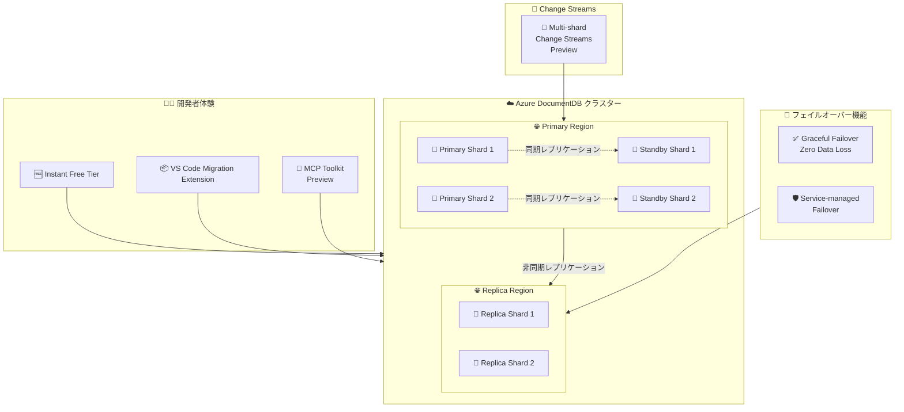

# Azure DocumentDB: Build 2026 - 無料枠・フェイルオーバー強化と MCP ツールキット

**リリース日**: 2026-06-02

**サービス**: Azure DocumentDB

**機能**: Build 2026 - 無料枠・フェイルオーバー強化と MCP ツールキット

**ステータス**: Launched (GA) / In preview

[このアップデートのインフォグラフィックを見る](https://takech9203.github.io/azure-news-summary/20260602-documentdb-build-2026-updates.html)

## 概要

Microsoft Build 2026 にて、Azure DocumentDB (MongoDB 互換のフルマネージド NoSQL データベースサービス) に関する 6 つの重要なアップデートが発表された。GA (一般提供) として 4 項目、Preview として 2 項目が含まれる。

今回のアップデートは、開発者体験の向上 (無料枠の即時プロビジョニング、VS Code 移行拡張機能)、高可用性・災害復旧の強化 (Graceful Failover によるゼロデータロス保証、サービスマネージドフェイルオーバー)、そして AI 開発支援 (MCP ツールキット) と変更データキャプチャ (マルチシャード Change Streams) の 3 つの柱で構成されている。

これらの機能追加により、Azure DocumentDB は MongoDB 互換データベースとしての開発者体験を大幅に改善しながら、エンタープライズレベルの信頼性と AI 時代の開発ワークフローへの対応を同時に実現している。

**アップデート前の課題**

- 無料枠クラスターのプロビジョニングに時間がかかり、開発者が評価を始めるまでに待機が必要だった
- MongoDB から Azure DocumentDB への移行には専用ツールの準備が必要で、VS Code 内での統合的なワークフローが欠如していた
- クロスリージョンフェイルオーバーでは強制昇格 (Forced promotion) のみで、データロスの可能性があった
- リージョン障害時のフェイルオーバーは手動操作が必須だった
- AI エージェントから DocumentDB を操作するための標準化されたインターフェースがなかった
- Change Streams がマルチシャード環境で統合的に動作しなかった

**アップデート後の改善**

- 無料枠クラスターが即座にプロビジョニングされ、数秒で開発を開始可能
- VS Code 拡張機能により MongoDB から DocumentDB への移行をエディタ内で完結
- Graceful Failover によりレプリケーション完了を待ってからフェイルオーバーし、ゼロデータロスを保証
- Service-managed failover により Azure がリージョン障害を検知して自動的にレプリカを昇格
- MCP ツールキットにより AI エージェントが DocumentDB を標準プロトコルで操作可能
- マルチシャード Change Streams によりクラスター全体の変更イベントを統合的に取得可能

## アーキテクチャ図



Azure DocumentDB の Build 2026 アップデート全体像。開発者体験の向上、高可用性機能の強化、AI 連携とストリーミング機能の追加が主要な柱となっている。

## サービスアップデートの詳細

### GA 項目

#### 1. Instant Free Tier Clusters

Azure DocumentDB の無料枠クラスターが即座にプロビジョニングされるようになった。

- **即時プロビジョニング**: クラスター作成後、数秒で利用可能な状態になる
- **32 GB ストレージ**: 学習・評価に十分なストレージ容量を提供
- **機能パリティ**: 通常の有料クラスターと同等の機能・コマンドに対応
- **管理者ユーザー名の事前割り当て**: プロビジョニング完了時に接続文字列がすぐ確認可能
- **サブスクリプションあたり 1 クラスター**: 各サブスクリプションで 1 つの無料枠クラスターを利用可能
- **ライフタイム無料**: アカウントの存続期間中、無料で利用可能

#### 2. Migration Extension in Visual Studio Code

MongoDB から Azure DocumentDB への移行を VS Code 内で完結できる拡張機能が GA となった。

- VS Code のエディタ内から移行プロセスを実行可能
- 既存の MongoDB ワークロードを Azure DocumentDB に移行するワークフローを統合
- 開発者が使い慣れたツール内で移行作業を完結

#### 3. Graceful Failover with Zero Data Loss Guarantee

計画的なリージョン切り替えをデータロスなしで実行する機能が GA となった。

- **ゼロデータロス保証**: フェイルオーバー実行前にレプリケーションの完了を待機
- **計画的切り替え**: メンテナンスやリージョン移行時に安全に書き込みロールを移動
- **グローバル接続文字列の維持**: フェイルオーバー後もアプリケーションの接続文字列は変更不要

#### 4. Service-managed Failover

Azure がリージョン障害を検知して自動的にレプリカクラスターを昇格する機能が GA となった。

- **自動障害検知**: Azure プラットフォームがプライマリリージョンの障害を自動検出
- **自動レプリカ昇格**: 手動介入なしでレプリカクラスターが読み書き可能なプライマリに昇格
- **RTO の短縮**: 人的対応を待たずに自動復旧が開始されるため復旧時間が大幅に短縮

### Preview 項目

#### 5. MCP Toolkit for Azure DocumentDB

AI エージェントが Azure DocumentDB を操作するための MCP (Model Context Protocol) ツールキットがプレビューとして提供開始。

- **標準プロトコル対応**: MCP に準拠したインターフェースで AI エージェントからの操作が可能
- **AI エージェント連携**: Claude、GitHub Copilot などの AI エージェントから DocumentDB を直接操作
- **開発ワークフローの効率化**: 自然言語でのデータベース操作、クエリ生成、スキーマ探索が可能

#### 6. Change Streams (Multi-shard)

マルチシャード環境での Change Streams がプレビューとして提供開始。

- **クラスター全体の変更追跡**: 複数シャードにまたがる変更イベントを統合的に取得
- **リアルタイムデータパイプライン**: イベント駆動アーキテクチャの実装が容易に
- **MongoDB 互換 API**: 既存の MongoDB Change Streams の知識をそのまま活用可能

## 技術仕様

| 項目 | 詳細 |
|------|------|
| サービス | Azure DocumentDB (MongoDB 互換) |
| 基盤 | PostgreSQL ベースの DocumentDB オープンソースプロジェクト |
| 互換性 | MongoDB API フル互換 |
| 無料枠ストレージ | 32 GB |
| 無料枠制限 | サブスクリプションあたり 1 クラスター |
| HA 構成 | 同期レプリケーション (インリージョン) |
| DR 構成 | 非同期レプリケーション (クロスリージョン) |
| フェイルオーバーモード | Forced / Graceful / Service-managed |
| SLA (HA 有効時) | 99.99% |
| MCP Toolkit | Preview |
| Multi-shard Change Streams | Preview |

## 設定方法

### 前提条件

1. Azure サブスクリプション
2. Azure DocumentDB クラスター (既存または新規作成)
3. クロスリージョンレプリケーションが有効化されていること (フェイルオーバー機能を利用する場合)

### Azure Portal - 無料枠クラスター作成

1. Azure Portal で「Azure DocumentDB」を検索
2. 「+ Create」をクリック
3. クラスター構成画面で「Free Tier」チェックボックスを選択
4. リージョンを選択して作成
5. 即座にプロビジョニングされ、接続文字列が「Connection string」ビューで確認可能

### Azure CLI - Graceful Failover

```bash
# クロスリージョンレプリカの状態確認
az documentdb cluster replica list --cluster-name <cluster-name> --resource-group <resource-group>

# Graceful Failover の実行 (ゼロデータロス保証)
az documentdb cluster replica promote --cluster-name <replica-cluster-name> --resource-group <resource-group> --promotion-mode graceful
```

### Bicep - 無料枠クラスター

```bash
# Bicep テンプレートによる無料枠クラスターのデプロイ
az deployment group create --resource-group <resource-group> --template-file documentdb-free-tier.bicep
```

## メリット

### ビジネス面

- 無料枠による初期コストゼロでの評価・開発が可能
- Service-managed failover により運用負荷を大幅に削減
- MCP ツールキットで AI を活用した開発生産性向上
- MongoDB 互換により既存スキルセットの活用と移行コスト削減

### 技術面

- Graceful Failover によりゼロデータロスでのリージョン切り替えが実現
- 同期レプリケーション (インリージョン) + 非同期レプリケーション (クロスリージョン) の多層 HA 構成
- マルチシャード Change Streams によりイベント駆動アーキテクチャの実装が容易
- VS Code 内での移行ワークフロー統合により DevOps プラクティスの向上

## デメリット・制約事項

- 無料枠では HA、Microsoft Entra ID、バックアップ/リストア、HNSW・DiskANN ベクトルインデックス、診断ログが非対応
- 無料枠クラスターは 60 日間の非アクティブ状態で一時停止される
- 有料枠から無料枠へのダウングレードは非対応
- Graceful Failover はレプリケーション完了を待つため、強制昇格より時間がかかる
- クロスリージョンレプリケーションは非同期のため、Forced promotion ではデータロスの可能性がある
- MCP Toolkit および Multi-shard Change Streams はまだ Preview 段階
- 無料枠は対応リージョンが限定されている

## ユースケース

### ユースケース 1: スタートアップの MVP 開発

**シナリオ**: スタートアップが MongoDB 互換のデータベースを使って新しいアプリケーションの MVP を開発する

**実装例**:

```bash
# Instant Free Tier で即座にクラスターを作成
# Azure Portal で Free Tier チェックボックスを選択するだけ

# MongoDB Shell で接続
mongosh "mongodb+srv://<username>:<password>@<cluster-name>.documentdb.azure.com"

# アプリケーション開発後、有料枠へシームレスにアップグレード
```

**効果**: コストゼロで即座に開発を開始し、プロダクトの市場投入までの時間を短縮

### ユースケース 2: グローバルアプリケーションの DR 戦略

**シナリオ**: 金融サービス企業がゼロデータロスでの災害復旧を要件とする

**実装例**:

```bash
# プライマリクラスター (East US) にレプリカ (West Europe) を追加
az documentdb cluster replica create \
  --cluster-name primary-cluster \
  --resource-group rg-finance \
  --replica-region westeurope

# Service-managed failover を有効化
az documentdb cluster update \
  --cluster-name primary-cluster \
  --resource-group rg-finance \
  --enable-service-managed-failover true

# 計画メンテナンス時は Graceful Failover で安全に切り替え
az documentdb cluster replica promote \
  --cluster-name replica-cluster \
  --resource-group rg-finance \
  --promotion-mode graceful
```

**効果**: リージョン障害時に自動復旧、計画切り替え時にゼロデータロスを保証

### ユースケース 3: AI エージェントとのデータベース連携

**シナリオ**: 開発チームが AI エージェントを使ってデータベースの探索・クエリ最適化を行う

**実装例**:

```json
{
  "mcpServers": {
    "azure-documentdb": {
      "command": "npx",
      "args": ["@azure/documentdb-mcp-server"],
      "env": {
        "DOCUMENTDB_CONNECTION_STRING": "<connection-string>"
      }
    }
  }
}
```

**効果**: AI エージェントが自然言語でスキーマ探索、クエリ生成、パフォーマンス分析を実行可能

## 利用可能リージョン

### 無料枠対応リージョン

| 地域 | リージョン |
|------|-----------|
| Americas | Brazil South, Canada Central, Central US, East US, West US, West US 2 |
| Europe | France Central, Germany North, North Europe, Norway East, Switzerland North |
| Asia Pacific | Australia Central 2, Australia East, Central India, South India, East Asia, Japan East, Japan West |

フェイルオーバー機能およびクロスリージョンレプリケーションの対応リージョンについては、公式ドキュメントを参照のこと。

## 関連サービス・機能

- **Azure Cosmos DB**: 同じく Azure のグローバル分散 NoSQL データベースだが、DocumentDB は MongoDB API に特化した別サービス
- **Azure Database Migration Service**: 大規模な移行プロジェクトでの利用。VS Code 拡張機能はより軽量な移行に適する
- **Azure Monitor**: DocumentDB クラスターの監視・診断に利用
- **GitHub Copilot / Claude**: MCP ツールキットを通じて DocumentDB と連携する AI エージェント
- **Azure Event Hubs / Azure Functions**: Change Streams と組み合わせたイベント駆動アーキテクチャの構築

## 参考リンク

- [インフォグラフィック](https://takech9203.github.io/azure-news-summary/20260602-documentdb-build-2026-updates.html)
- [Azure DocumentDB instant free tier clusters](https://azure.microsoft.com/updates?id=563082)
- [Azure DocumentDB Migration Extension in VS Code](https://azure.microsoft.com/updates?id=563072)
- [Graceful failover with zero data loss guarantee](https://azure.microsoft.com/updates?id=563062)
- [Service-managed failover in Azure DocumentDB](https://azure.microsoft.com/updates?id=563057)
- [MCP toolkit for Azure DocumentDB](https://azure.microsoft.com/updates?id=563112)
- [Change streams (multi-shard) in Azure DocumentDB](https://azure.microsoft.com/updates?id=563067)
- [Microsoft Learn - Azure DocumentDB ドキュメント](https://learn.microsoft.com/azure/documentdb/)
- [Microsoft Learn - Free Tier](https://learn.microsoft.com/azure/documentdb/free-tier)
- [Microsoft Learn - High Availability](https://learn.microsoft.com/azure/documentdb/high-availability)
- [Microsoft Learn - Cross-Region Replication](https://learn.microsoft.com/azure/documentdb/cross-region-replication)

## まとめ

Build 2026 での Azure DocumentDB アップデートは、開発者体験・信頼性・AI 連携の 3 つの観点から包括的な強化が行われた。特に注目すべきは以下の点である。

1. **即時無料枠**: 開発者が数秒で MongoDB 互換データベースを手に入れられるようになり、評価・プロトタイピングの障壁が大幅に低下
2. **ゼロデータロスフェイルオーバー**: Graceful Failover と Service-managed Failover の GA により、エンタープライズレベルの DR 要件を満たす構成が容易に
3. **MCP ツールキット**: AI エージェント時代のデータベース操作の標準化に向けた先進的な取り組み

Solutions Architect としての推奨アクションは、既存の MongoDB ワークロードの移行候補がある場合は VS Code 拡張機能での移行評価を開始すること、本番ワークロードでは Graceful Failover + Service-managed Failover の組み合わせによる DR 戦略の見直しを検討すること、そして AI エージェント活用を検討しているチームは MCP ツールキットのプレビュー評価を開始することである。

---

**タグ**: #Azure #DocumentDB #MongoDB #Build2026 #FreeTier #HighAvailability #Failover #DisasterRecovery #MCP #AIAgent #ChangeStreams #NoSQL
